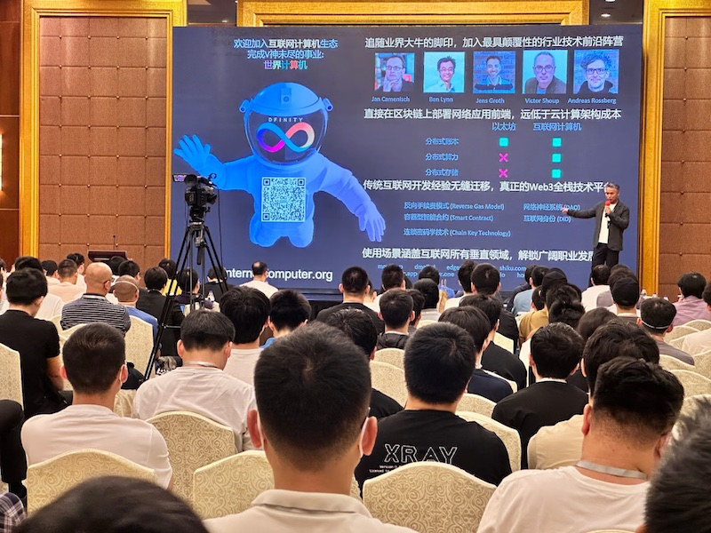
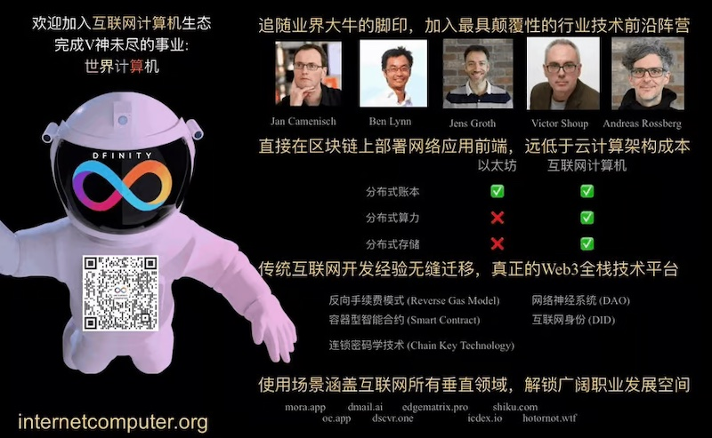
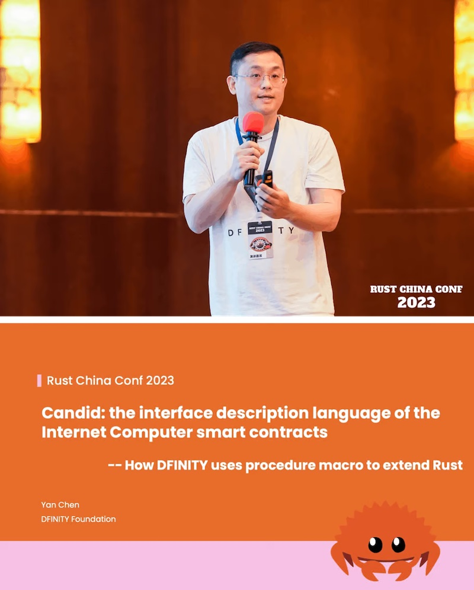
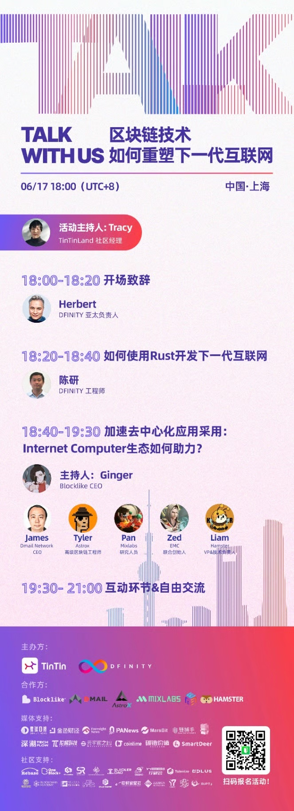
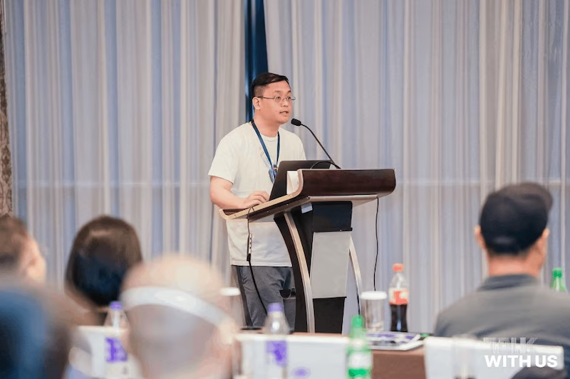
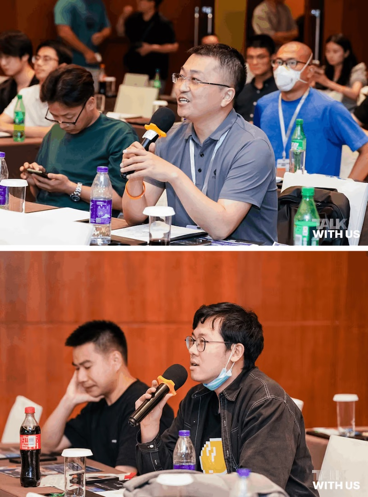

DFINITY基金会和IC社区在第三届中国Rust开发者大会期间的活动见闻。

<!--truncate-->

## Rust赞助商

6⽉17⽇⾄6⽉18⽇，第三届中国Rust开发者⼤会（Rust China Conf 2023）在上海成功举办。本次⼤会由Rust中⽂社区主办，DFINITY作为活动的钻⽯赞助商，同全球各地的开发者⼀起，通过主旨演讲、⼯作坊等诸多活动形式为⼤家献上了⼀场开发者盛宴。线下的活动形式，也拉近了我们与Rust开发者的距离。为期 2 天的 Rust 会议也为我们的⽣态项⽬⽅提供了⼀个聚会和交流的机会，包括 IC Lighthouse、EMC、Sama、Hamster、Yumi、Shiku、Mixlabs、AstroX、Bitfinity、IC1101 和 TinTin。

## 展台活动

在两天的活动中，DFINITY的展位占据了得天独厚的位置，在活动主办⽅的签到处，因此汇聚了⼤量开发者的注意。每⼀个来到现场签到参会的开发者都会在DFINITY的展位前停留。

同时我们邀请了许多⽣态系统项⽬在我们的展位上共同推⼴，包括Hamster、Shiku 和 TinTin，向开发者展现了我们多元化的⽣态系统。

并且我们为前来的Rust开发者们准备了丰厚的礼品，包括DFINITY的周边帽⼦， Motoko开发课程。我们的宣传海报上的技术⼤⽜也吸引了对许多DFINITY不太了解的传统开发者，他们也因此参与了晚间TinTin与DFINITY合作举办的Talk With Us 技术研讨会。

## IC介绍

作为钻⽯赞助商，我们有幸获得了在第⼀天⼤会主会场登场宣讲的机会。DFINITY亚太区总经理 Herbert，为到场的Rust开发者介绍了DFINITY最新的世界计算机的愿景。IC 是⼀个去中⼼化的云计算平台，利⽤颠覆性的链钥密码学技术将全世界独⽴的数据中⼼以⼦⽹的⽅式链接成⼀个可以⽆限扩容的虚拟主机。⽹络应⽤以智能合约的形式被封存在⼦⽹上的容器⾥，通过数据中⼼的服务器获得带宽，存储空间和算⼒。

随后，Herbert介绍了DFINITY强⼤的R&D团队，例如BLS签名的联合创始⼈Ben Lynn，Groth16的创始⼈Jens Groth，WASM的联合创始⼈Andreas Rossberg，也欢迎台下的众多开发者⼀同加⼊，构建强⼤的ICP⽣态。

## Candid主题演讲

在主旨演讲环节，DFINITY SDK团队的陈研专程从美国来到现场，和现场的开发者分享了互联⽹计算机智能合约的接⼝解释语⾔Candid。陈研是DFINITY智能合约语⾔Motoko Playground的开发者，他为现场的开发者深⼊浅出地讲解Candid和Rust的关系。

## Talk with Us 研讨会

在⼤会⾸⽇晚上，DFINITY的合作伙伴TinTin和DFINITY联合举办了Talk With US 开发者研讨会。当晚同⼀时间段，NEAR和Solana也举办了各⾃的研讨会，但在DFINITY的活动现场，依然座⽆虚席，50⼈的活动场地前后有近100位开发者陆续到来。

## 开场致辞

研讨会开场，DFINITY的亚太区GM Herbert照例为到场的开发者介绍了Dfinity的宏⼤愿景和现状，也分享了DFINITY主⽹上线以来⾛过的坎坷和周期。

## 如何用 Rust 开发 ICP 智能合约

随后，DFINITY SDK团队的陈研为现场的开发者现场演示了如何⽤Rust在ICP上开发智能合约，通过官⽅的合约示例，让现场的开发者体会到了全栈智能合约的魅⼒。

## 圆桌讨论

圆桌环节，有幸请到了ICP⽣态内的EMC，MixLabs，AstroX和Hamster的嘉宾。EMC的联合创始⼈Zed分享了如果通过L2将AI带到IC⽣态；MixLabs的研究员Pan分享了其关于数据主权的观点和MixLabs正在研究的可⾏⽅向； Astrox_Network 的⼯程师Tyler分享了在Chain Key加持下所实现的全链智能合约钱包；⽽Hamster的技术负责⼈Liam则向⼤家介绍了Hamster为服务开发者所设计的多种开发者⼯具。

## 观众问答

Q&A环节，台下很多默默中⼀直在关注 ICP的开发者和研究者，也提出了他们的问题。尤其是许多来⾃传统互联⽹的开发者，他们能更易于理解DFINITY所在坚持做的事业，也尖锐得指出了⼀些关键问题。也有⼀些初次接触区块链的开发者，他们也想知道如果从Web2转型进⼊Web3，Herbert都⼀⼀作出了解答。Q&A环节的现场氛围⾼涨，许多开发者都意犹未尽，在研讨会结束后，依然在会场内讨论着⾃⼰的想法。

