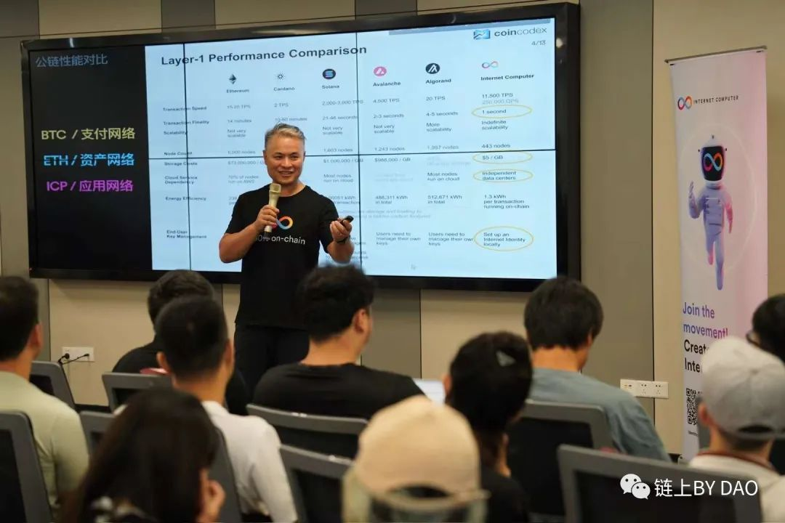
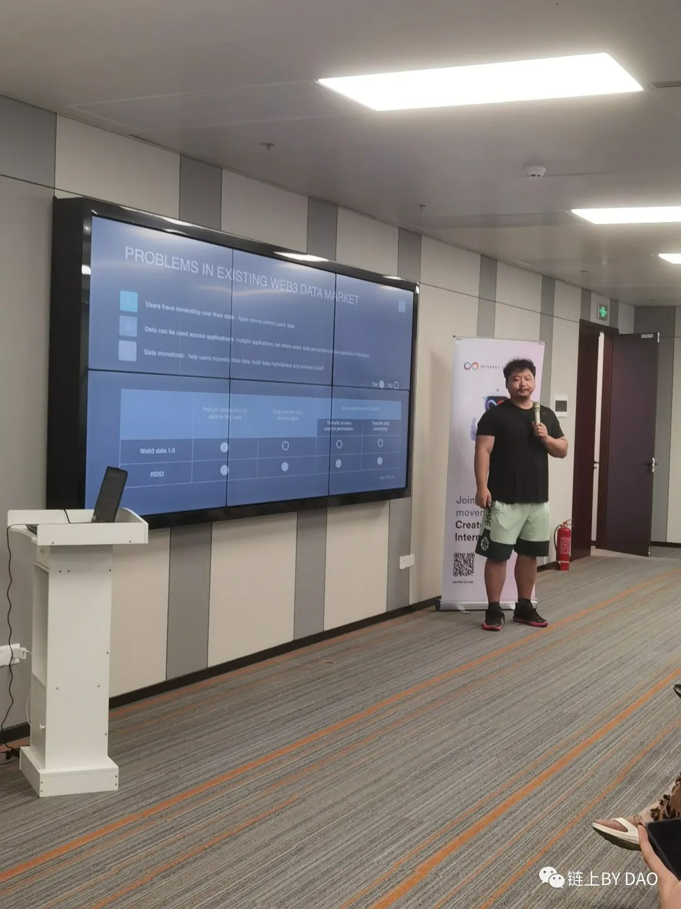
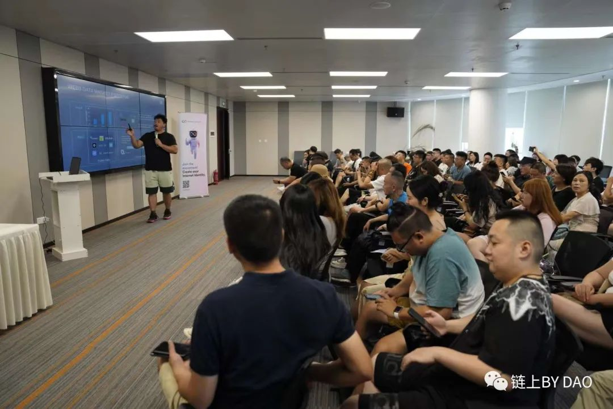
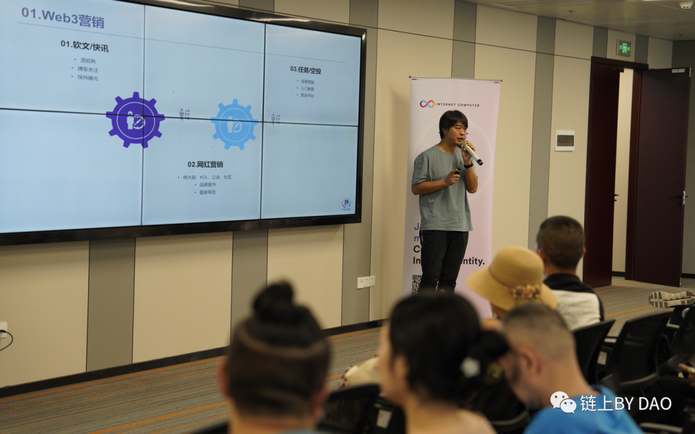

<head>
    <meta property="twitter:domain" content="ic123.xyz" />
    <meta property="twitter:url" content="https://ic123.xyz" />
    <meta name="twitter:title" content="DFINITY 联合 BY DAO 成都区块峰会" />
    <meta name="twitter:description" content="DFINITY官方团队第一次在成都跟当地社区 By DAO 一起举办 ICP 开发者活动" />
</head>

DFINITY官方团队第一次在成都跟当地社区 By DAO 一起举办 ICP 开发者活动。

<!--truncate-->

7月19日，由DFINITY与BYDAO联合在成都举办的主题为《WEB3名牌GAMEFI--ICP的生态布局》区块链论坛圆满结束，本次活动吸引了预计千万级别的观众。此次论坛旨在向更广泛的受众介绍新一代技术，以及回归区块链的本质。

活动流程：签到入场

嘉宾签到入场

座无虚位

活动正式开始

主持人大林宣布《WEB3名牌GAMEFI--ICP的生态布局》正式开始，邀请DFINITY中国区总经理Herbert进行演讲，演讲主题为《区块链技术如何塑造下一代互联网》

Herbert分享了ICP（Internet Computer Protocol）如何通过建立去中心化的全球计算网络，实现了互联网的重塑，让开发者能够无需管理传统服务器，直接在区块链上部署应用程序，促进了更多的创新和发展，为下一代互联网带来了巨大的潜力和机遇。

接下来，主持人邀请OpenOs研究人员Pan进行演讲，演讲主题为：《重新定义WEB3数据的所有权》。

Pan阐述了目前WEB2关于数据价值的情况，指出WEB2中应用程序利用基于人工智能的推荐系统来利用用户数据的价值，但用户数据被隔离在不同的公司之间，形成数据孤岛。Pan介绍了RIDO，强调它可以保障用户数据权益，并促进不同类型的用户数据组合以创造更多价值。通过完全分散的DAPP和社区/RIDO/推荐系统的联合行动来平衡。

随后，主持人邀请PortUS CEO Kevin进行演讲，演讲主题是《DeCPS：Gamefi流量之钥》。

Kevin讲解了目前WEB3主要通过软文/快讯、网红KOL、任务/空投等方式进行市场宣传与营销，但这种方式成本高，效果差，难以评估有效用户。他介绍了CPS流量合作模式，它只需向产生了实际销售的合作伙伴支付费用，有效避免了无效点击或浪费的广告费用，降低了项目方的风险，并能追踪有效客户并科学控制成本。

接着，主持人邀请Shiku Co-Founder Akira进行演讲，演讲主题为《元宇宙：想象、创建、拥有》。

Akira介绍了shiku，让每个人都可以轻松拥抱元宇宙。Shiku像精简和以太坊一样，是一个分散、开放和安全的元宇宙基础。它以web3价值观为核心，符合瑞士金融监管，允许分散治理，包括以尽可能最透明的方式进行投票和登记的标记化。任何人、任何地方都可以通过网络浏览器、PC、移动设备以及AR和VR设备访问Shiku。

最后，在主持人的邀请下CBIndex Founder CEO Ray进行演讲，演讲主题是《Gamefi领域指数构建及链上基金投资》。

Ray分享了刚获得波卡生态黑客松竞赛奖的CBIndex。CBIndex是一个去中心化的链上基金管理平台，为个人和实体管理和增长资产营造创新环境。它提供了真正民主化的生态系统，任何人都可以轻松创建、管理和集成加密指数，无论背景或专业知识如何。借助CBIndex，设置、管理和投资多样化的链上基金变得更加便捷且用户友好。

在主持人的宣布下进入到本次会议的最后环节圆桌会议，本次圆桌会议的主题是《consumer作为下个WEB3的发展趋势，哪些赛道更容易出现黑马》，本次圆桌会议针对此主题进行了精彩的分享探讨。

本次圆桌会议的嘉宾分别为：Arena Of Faith ambassador Eil、Chaintool CEO Leroy、BYDAO Co-Founder  Alan、Asg电竞俱乐部CEO Allen、及主持人Lucas。

最后，主持人宣布本次《WEB3名牌GAMEFI--ICP的生态布局》区块链论坛圆满结束，未来BYDAO将联合更多生态举办WEB3交流会，助推区块链行业发展，共同探索区块链未来的挑战与机遇。

活动结束后，嘉宾仿佛久久不愿离开，犹如留恋于这个充满新思想、创新技术和未来展望的区块链盛宴。他们眉飞色舞，情绪高昂，满怀对区块链行业的热爱和信心。

---
By DAO的原文链接如下：

https://mp.weixin.qq.com/s/pnX97C-VBtwiS_siZnPKeQ