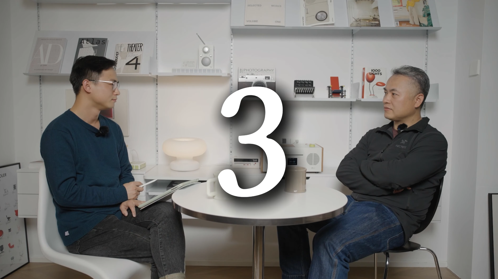

import Community from '../../docs/community.md';

杭州新崛起的新科技媒体外部山采访 Herbert Yang，讨论从 Web2 到 Web3 的职业转变

<!--truncate-->

## 宣发

日期：2023年11月29日

## 视频回放

<iframe width="560" height="315" src="https://www.youtube.com/embed/f95ZJRHcNl4?si=nK7YVs-YFFra3G4x" title="YouTube video player" frameborder="0" allow="accelerometer; autoplay; clipboard-write; encrypted-media; gyroscope; picture-in-picture; web-share" referrerpolicy="strict-origin-when-cross-origin" allowfullscreen></iframe>

<Community />