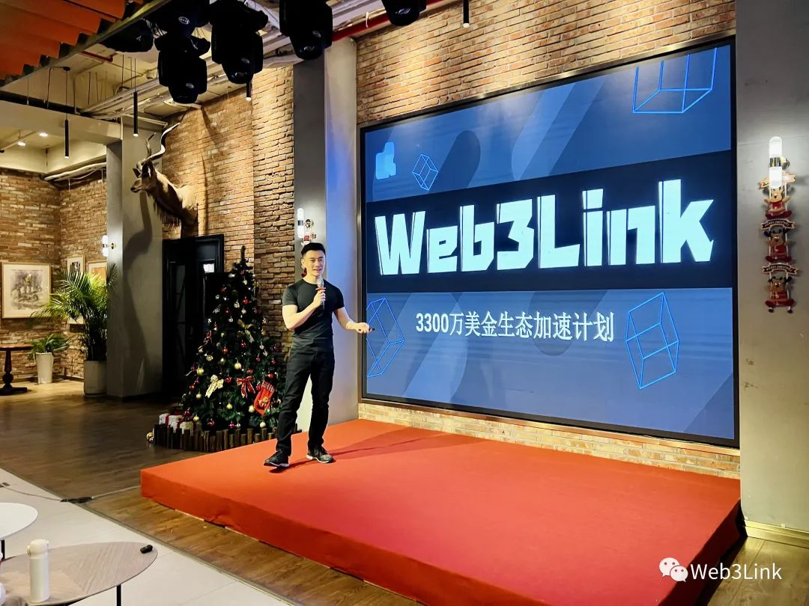
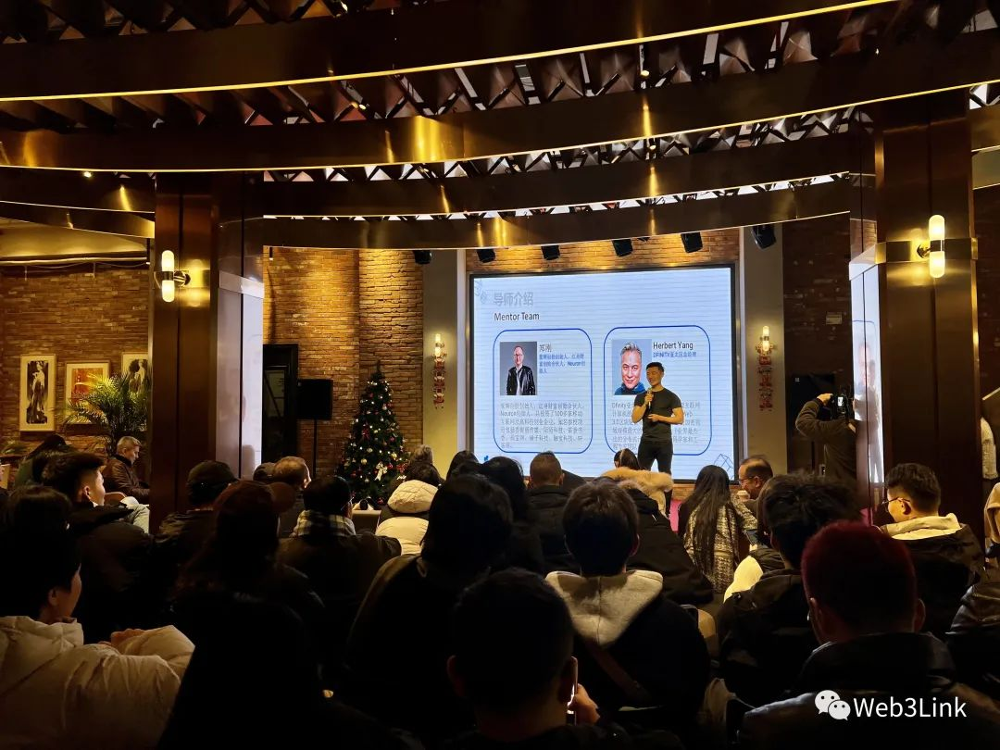
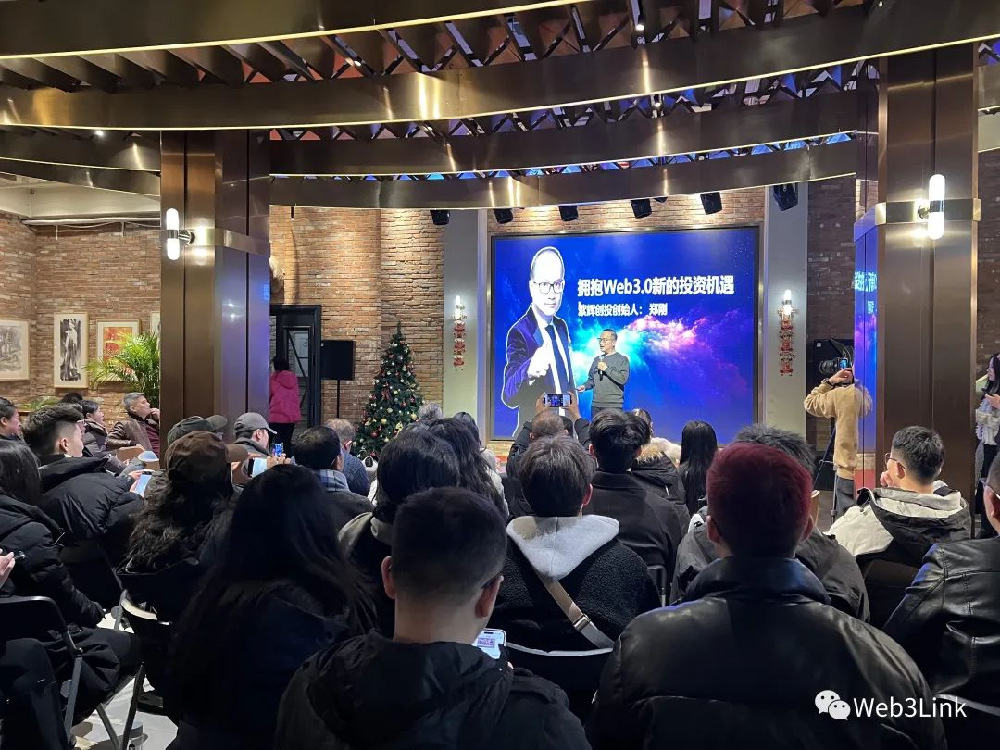
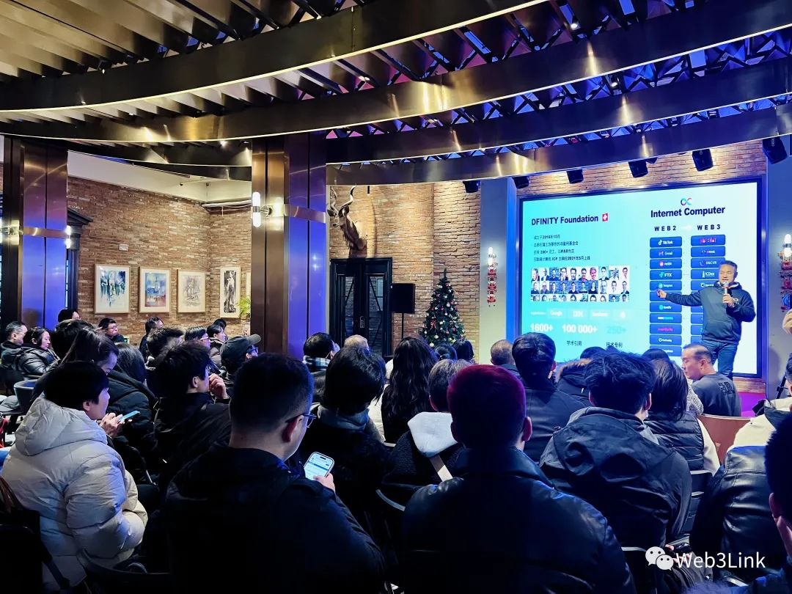
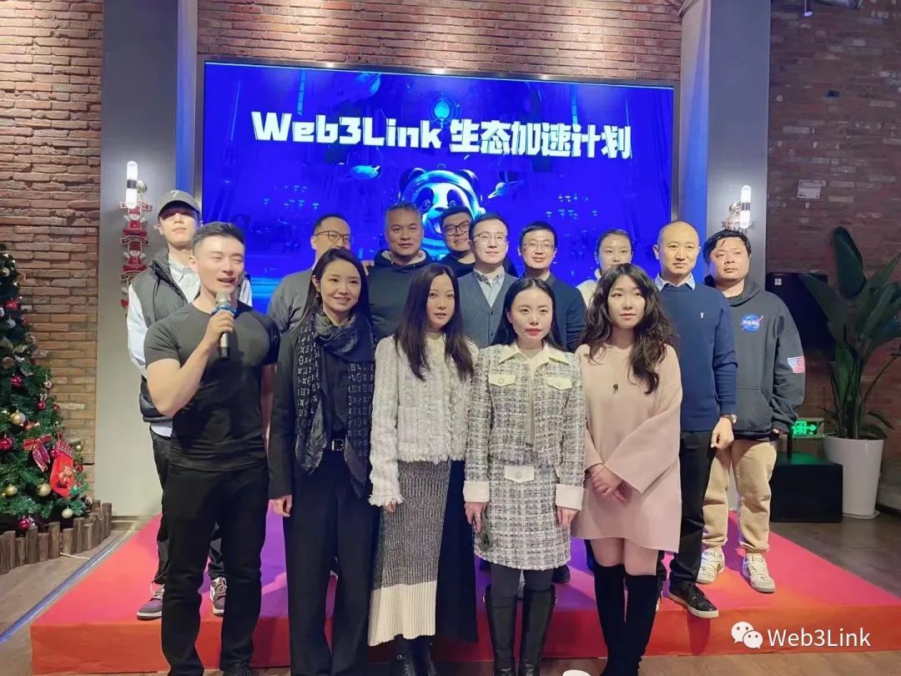
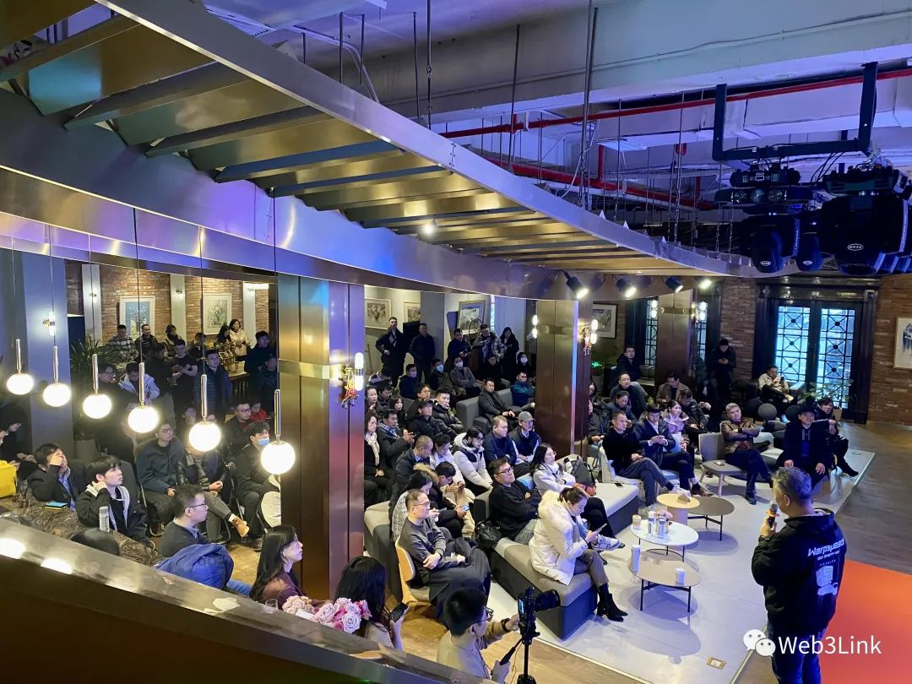

Web3Link 在上海外滩8号召开年度论坛，邀请了 Web3 的多位领袖讨论如何为 Web3 项目孵化加速

<!--truncate-->

## 活动议程

## 活动回顾 (Web3Link)

2023年12月16日, Web3Link在上海外滩8号成功举办了生态加速论坛, 邀请了各大机构及生态社区负责人, 共同探讨行业最新热点及优秀项目孵化加速计划。

下面来回顾一下本次活动的精彩内容:

论坛主持人，Web3Link Builder Scarlett Yan 为本次活动及会议主旨进行了开场介绍.

Web3Link Builder 刘思宇先生向大家介绍了万美金加速计划, 我们将拿出3300万美金的诚意,给到入选我们加速器的项目作为创业基金, 为项目在即将到来的牛市爆发做好充足准备。同时Web3Link还首创合作了区块链各大生态社区, 旨在吸引更多技术开放人员进入区块链及Web3领域。

Web3Link系统性的课程体系和不断增加的导师团成员, 也将在行业资源、技术、经验等方方面面为项目方提供更个性化指导和专业建议。我们其中的两位导师也来到了现场, 带来了主题分享。

紫辉创投创始人郑刚先生, 共投资过100多家移动互联网和高科技创业企业, 知名参投项目包括香榭丽传媒、陌陌科技、茶香书香、珠宝网、锤子科技、触宝科技、映客等。他向我们讲述了传统投资向Web3转型的原因, 呼吁大家共同拥抱Web3.0新的投资机遇。

DFINITY亚太区总经理 Herbert Yang, 为我们详细分享了ICP生态以及如果打造一个明星Web3项目。

除了DFINITY, 我们还合作了Solana、Polkadot、Ton、Aptos等生态和各大公链的丰富社区网络, 为大家提供了更广泛的联动和互动空间。

Web3Link Builder Echo还1V1访谈了不同领域的参会嘉宾, 他们分别是: 香港区块链协会副会长&白露会客厅创始人 白露女士, Redline Capita创始人 李勇敏先生, 时代投研&超维空间联合创始人 沈忱先生, 菲律宾最大的合规交易所Coins.PH ALita, 香港区块链应用与投资研究院执行院长 胡烜峰先生, 上海崛鼎资本董事长 张凯先生, 科航投资董事长 田斌先生, SAS一号基金管理人 任佳奇先生, Shiku Metaverse Anna女士。

## 主办方介绍

Web3Link加速器拥有Solana、Polkadot、Cosmos、DFINITY、Sui、Ton、Aptos等生态合作和各大公链的丰富社区网络，全方位系统化的课程指导，专业资深的导师团队匹配，旨在为Web3创业者提供从融资对接、市场宣发、社群运营到Token发行辅助等一站式解决方案。

原文链接：https://mp.weixin.qq.com/s/wAp7PzL68AoaUzDR1BEQvA

