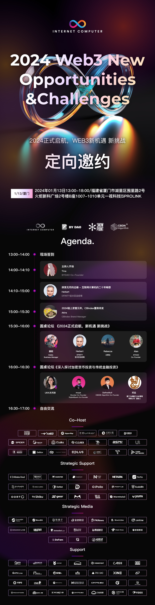
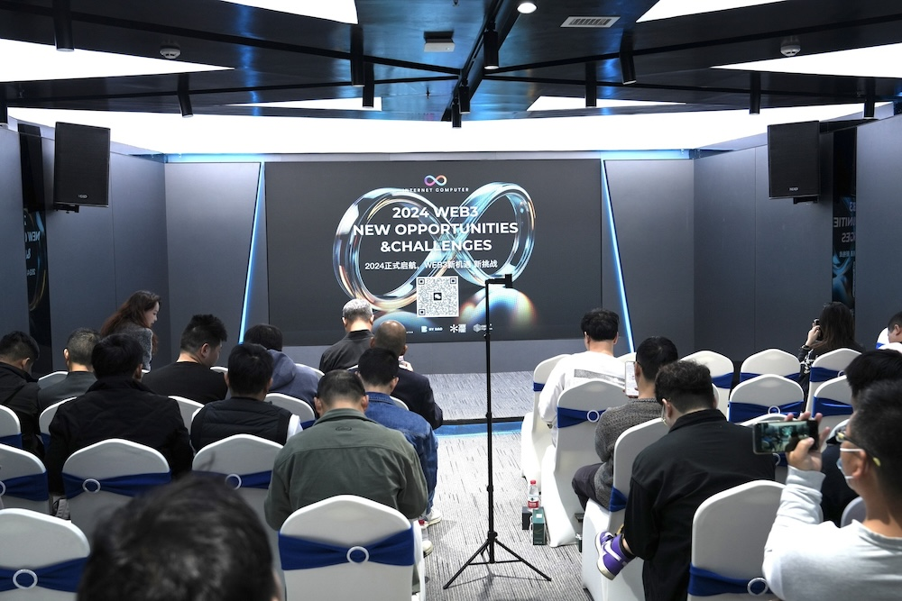
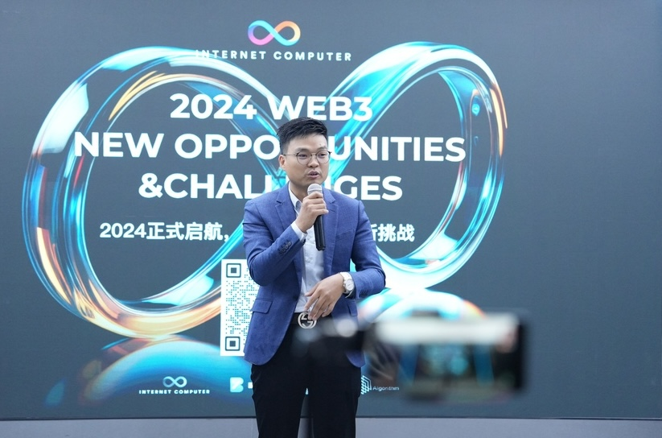
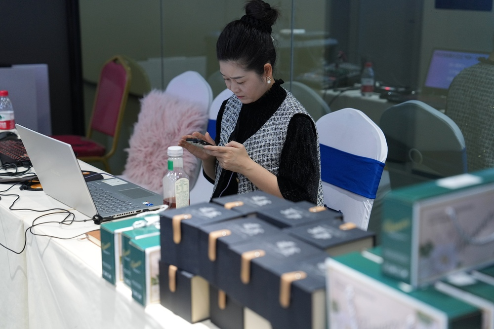
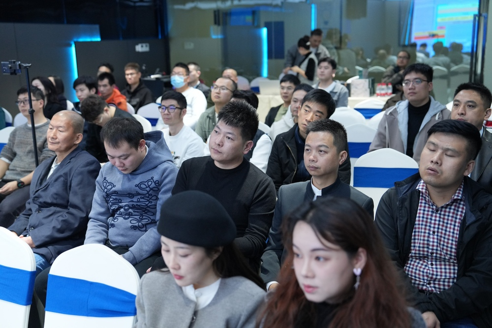
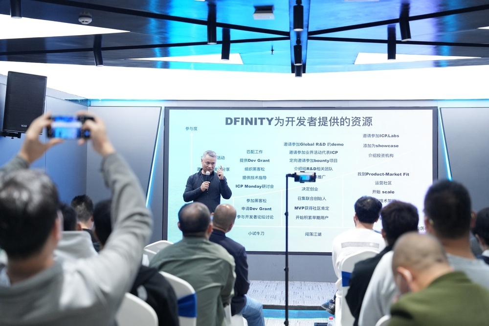
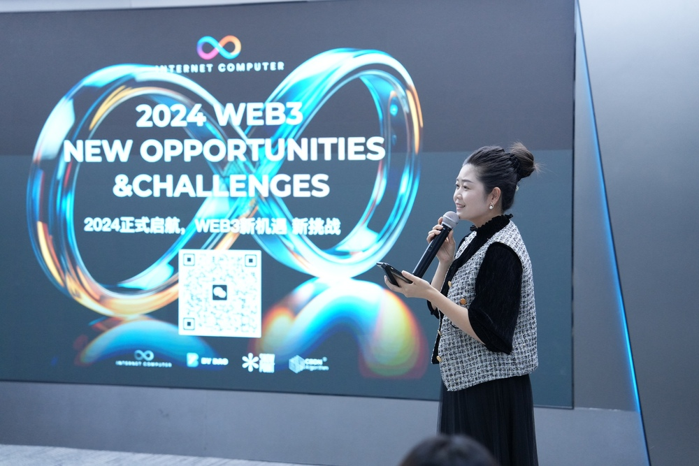
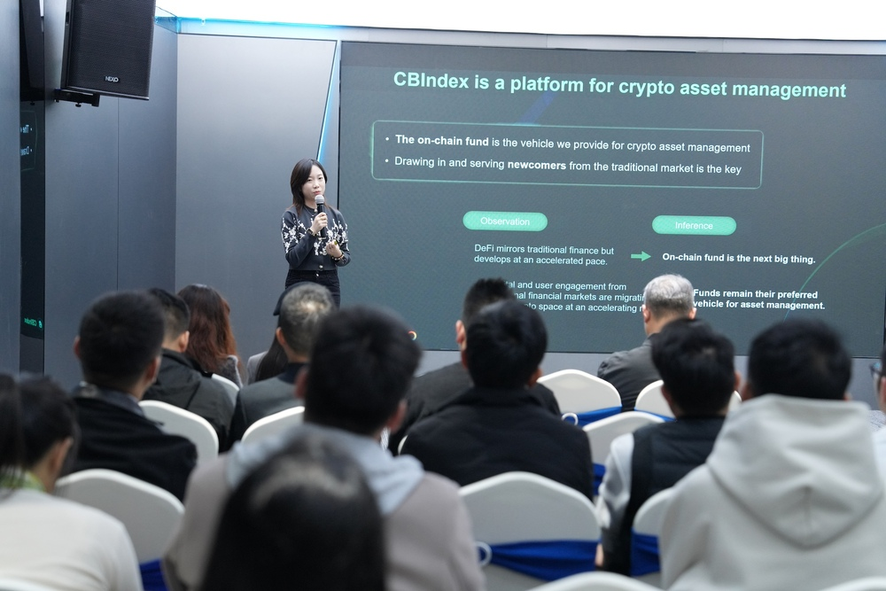
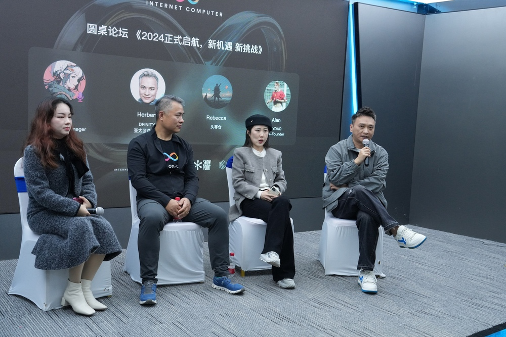
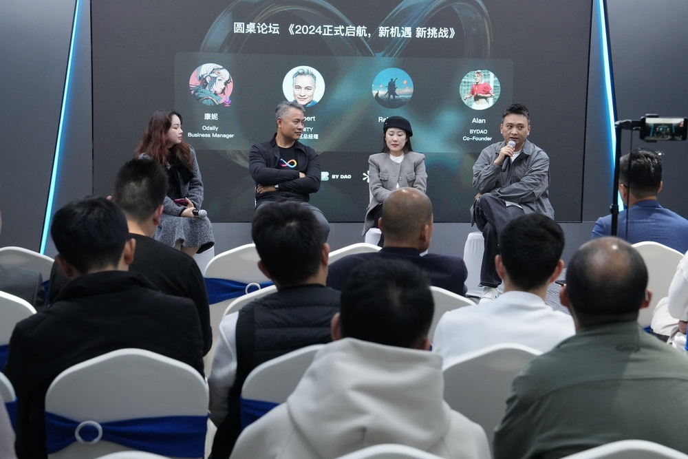

import Community from '../../docs/community.md';

DFINITY 官方团队跟 By DAO 社区在厦门联合举办 ICP 开发者活动，邀请 ICP 生态里的开发者分享经验，联合本地 Web3 头部项目一起探讨行业发展前景

<!--truncate-->

## 宣发

https://twitter.com/BYDAO_CN/status/1745080283907444879

## 议程

这次活动跟前天刚刚结束的 [深圳 ICP Dev Meetup 活动](https://ic123.xyz/blog/bydao-shenzhen-icp-meetup) 一样，都是干货充实的五个小时，包括两个主题演讲，两个圆桌讨论。邀请了 ICP 生态里的开发者和厦门当地的社区参与分享。

## 活动现场

厦门以前也是个科技重镇 - Dell 电脑的中国区总部就设在厦门。区块链行业鼎鼎有名的安全审计公司 [慢雾](https://twitter.com/SlowMist_Team) 在迁移到香港以前也是在厦门。厦门气候宜人，环境秀美，海景无敌，吸引了很多行业 OG 来这里退休。

这次厦门的活动，得到了当地初代 OG ，[CBDN Algorithm](https://twitter.com/CBDN_Algorithm) 创始人吴总的大力支持。吴总的公司，是第一家在厦门注册的区块链公司，见证了行业的起起伏伏。在 ICP 这次厦门活动之前，当地已经很久没有这种大规模的线下聚会了。

[BY DAO](https://twitter.com/BYDAO_CN) 为厦门的活动准备了很多设计精美的周边礼品，在活动上往往供不应求。

ICP 生态的开发者聚会通常会准备一些甜点 - 5/6个小时的内容，颇需要一点体力才可以充分吸收。DFINITY 基金会每次也都会赞助，支持社区合作伙伴的工作。

## 主题演讲 - DFINITY

这次 Herbert 的演讲主题是 《[探索 Web3 无尽的边际 - 不破不立的互联网计算机 2024 年展望](https://ic123.xyz/docs/intro-ic/latest-deck/)》。这个演讲颇受欢迎，在厦门讲了几乎 90 分钟。ICP 技术和生态的内容太丰富了，短短的十几二十分钟难以展示全貌。

这个演讲里介绍了 ICP 生态里十大垂直领域里的技术创新和涌现出来的头部 DApp。对于刚刚开始了解互联网计算机的开发者和用户来说，提供了很好的索引和指南。

## 现场直播

BY DAO 在行业里资源丰富，每次为 ICP 举办的活动，都会在 Huobi Live 上现场直播，力求让更多的受众接触到 ICP 颠覆性的技术创新。

## 主题演讲 - CBIndex

CB Index 的 Akira 给大家介绍他们如何利用 ICP 公链的独特技术来搭建链上的资产管理平台。

## 圆桌讨论 - 1

BY DAO 的联合创始人 Alan 继续主持第一个圆桌讨论。这个圆桌除了 DFINITY 的 Herbert 外，还邀请了 ODaily 的康妮和头等舱的 Rebecca。

## 圆桌讨论 - 2

第二个圆桌由著名的 KOL [尤可欣](https://twitter.com/isadora288881) 主持，邀请了 EBunker 联合创始人 muye，CBDN Algorithm 的创始人吴总，和厦门九鼎智汇企业管理有限公司创始人邓总，来探讨 《加密货币投资于传统金融投资》

https://twitter.com/isadora288881/status/1746149893440459028

## 媒体报道

感谢 BY DAO 的媒体回顾！《[感激厦门ICP聚会，老板们的智慧共振！](https://mp.weixin.qq.com/s/5524MhClI7UUvh_0rpRNiQ)》

<Community />