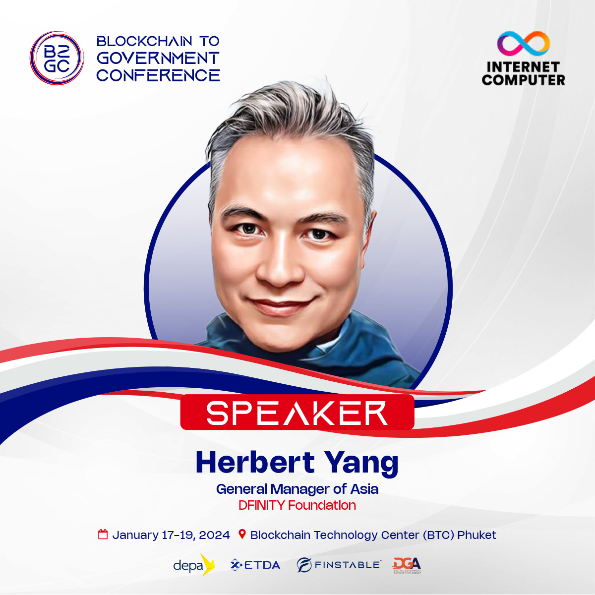
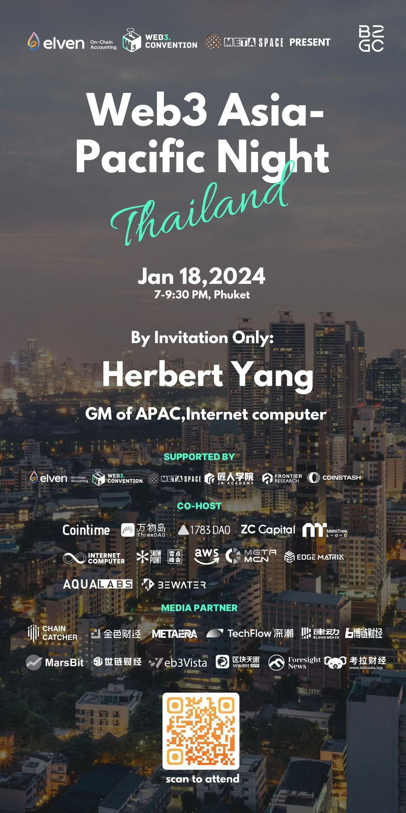

import Community from '../../docs/community.md';

1月17-19在泰国普吉岛召开的 Blockchain to Government Conference ("B2GC") 聚集了大量华语社区，开发者和投资人，在普吉岛这个风景宜人的美丽海岛，畅谈 Web3 如何在东南亚落地

<!--truncate-->

## B2GC 大会

https://twitter.com/FinstableCo/status/1744630089353199827

## Phuket DAO 成立大会

## Web3 Asia-Pacific Night

<Community />