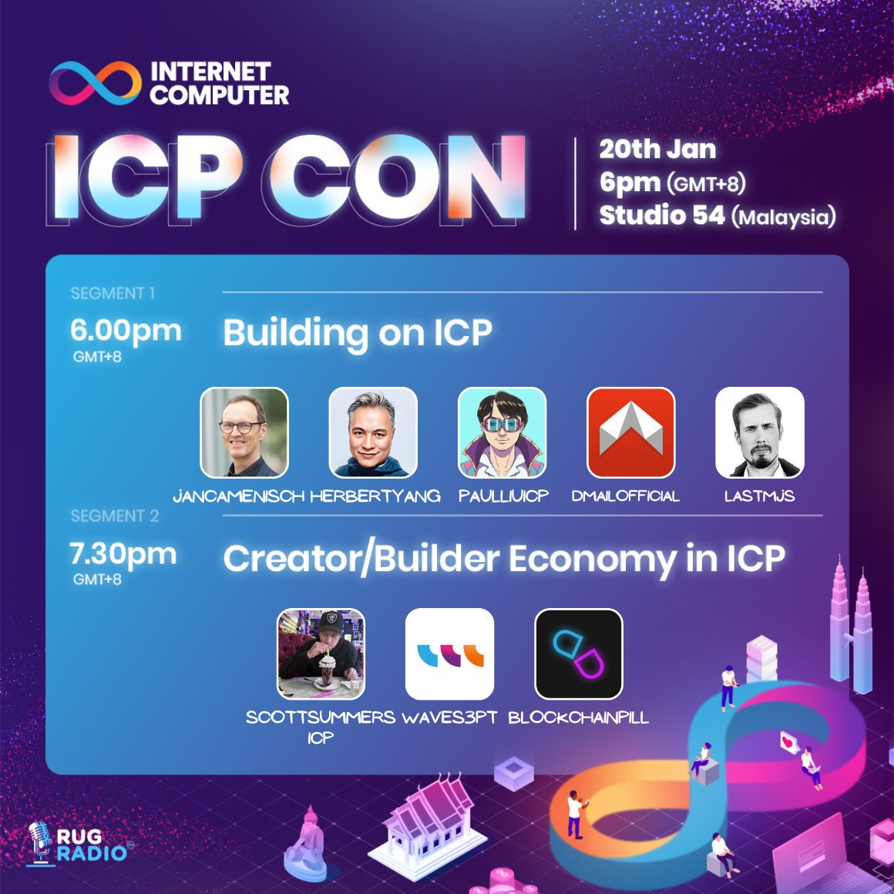

import Community from '../../docs/community.md';

xx

<!--truncate-->

## 宣发

https://x.com/pukecast/status/1744913091559833947?s=20

## 视频回放

30.8K tuned in for the 342-minute marathon Twitter Spaces

<blockquote class="twitter-tweet" data-media-max-width="560">
<a href="https://t.co/0F180RQgRM">https://t.co/0F180RQgRM</a>
&mdash; Pukecast (@pukecast) <a href="https://twitter.com/pukecast/status/1748646902650863910?ref_src=twsrc%5Etfw">January 20, 2024</a></blockquote> 

<Community />