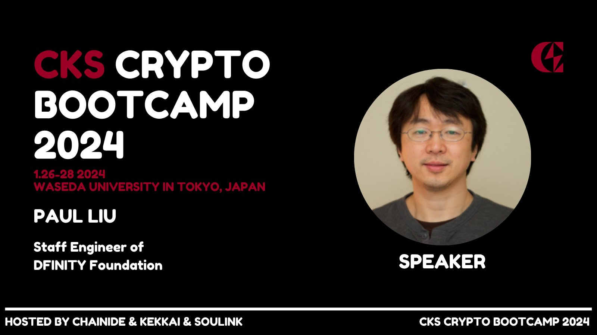

import Community from '../../docs/community.md';

ChainIDE 邀请 DFINITY 的 Staff Engineer Paul Liu 老师为 CKS Crypto Bootcamp 在日本早稻田大学做线上分享

<!--truncate-->

## 宣发

https://twitter.com/CKSweb3/status/1750091906963681412

<Community />
