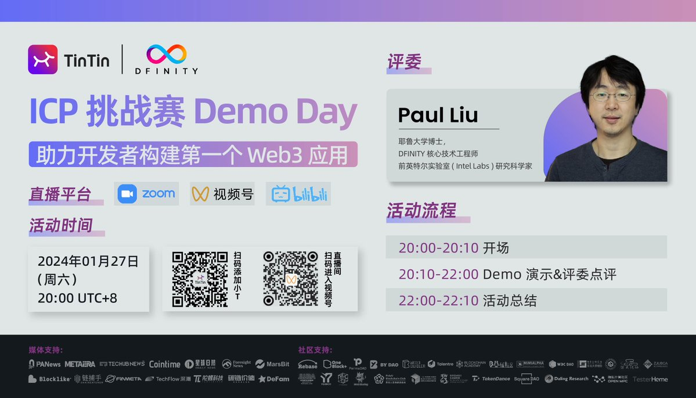

import Community from '../../docs/community.md';

TintinLand 联合 DFINITY 举办的 IC Developer Course 降下帷幕。DFINITY 的 Staff Engineer Paul Liu 老师作为评委点评参赛项目

<!--truncate-->

## 宣发

https://twitter.com/OurTinTinLand/status/1749737671415783892

## B站回放

    <iframe src="//player.bilibili.com/player.html?aid=666914694&bvid=BV1ja4y187gc&cid=1422343195&p=1" scrolling="no" border="0" frameborder="no" framespacing="0" allowfullscreen="true"> </iframe>

<Community />