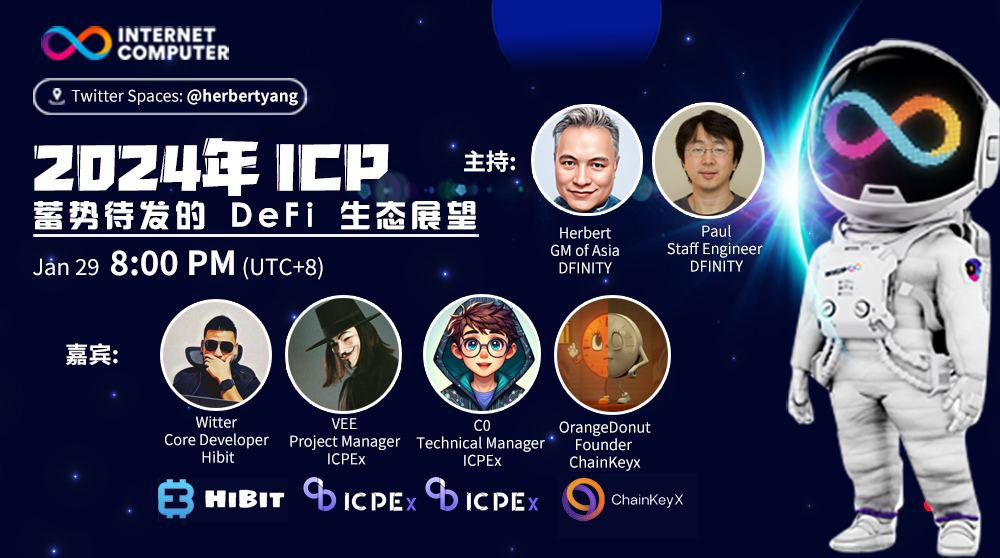

import Community from '../../docs/community.md';

A thriving #DeFi ecosystem is mission critical for a L1 blockchain. What’s the outlook for #DeFi on #ICP in 2024? Who are the new players that would join the foray and make a splash?

<!--truncate-->

## 宣发

https://twitter.com/herbertyang/status/1749729770726936676

日期：1月29日

时间：20:00 UTC+8

主持：

- Herbert Yang, Asia GM, DFINITY
- Paul Liu, Staff Engineer, DFINITY

嘉宾：

- Witter, Hibit
- Wade, Hibit
- Vee, ICPEx
- C0, ICPEx
- Orange Donut, ChainKeyX

## Q1

## Q2

## Q3

## Q4

## Q5

## Q6

## Q7

## 视频回放

<blockquote class="twitter-tweet" data-media-max-width="560">
今晚网络不稳定，竟然炸房四次。感谢几位嘉宾的耐心分享和 <a href="https://twitter.com/paulliuicp?ref_src=twsrc%5Etfw">@paulliuicp</a> 的沉稳主持。我把几个存留下来的音频缝合成一个完整视频。虽然房间断断续续，但几位嘉宾的分享很精彩， Paul 也提供了很有帮助的建议，欢迎各位 <a href="https://twitter.com/hashtag/ICP?src=hash&amp;ref_src=twsrc%5Etfw">#ICP</a> 开发者，尤其是 <a href="https://twitter.com/hashtag/DeFi?src=hash&amp;ref_src=twsrc%5Etfw">#DeFi</a> 开发者转发回放。 <a href="https://t.co/8bPXwAAQaz">pic.twitter.com/8bPXwAAQaz</a>
&mdash; herbert.icp (@herbertyang) <a href="https://twitter.com/herbertyang/status/1752023339714125988?ref_src=twsrc%5Etfw">January 29, 2024</a></blockquote> 

<Community />
