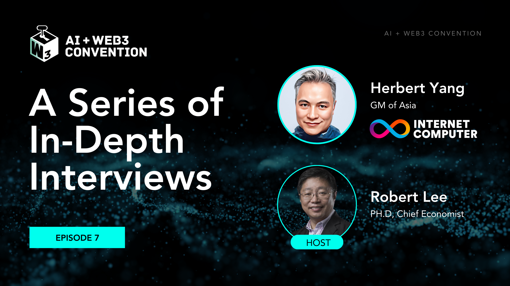

import Community from '../../docs/community.md';

xxx

<!--truncate-->

## 宣发

日期：1月31日

时间：14:00 UTC+8

主持：Dr. Robert Lee, [区块链元宇宙](https://www.youtube.com/@blockchainmetaverse/streams)

嘉宾：Herbert Yang, Asia GM, [DFINITY](https://twitter.com/dfinity)

直播：https://www.youtube.com/@blockchainmetaverse/streams

<Community />