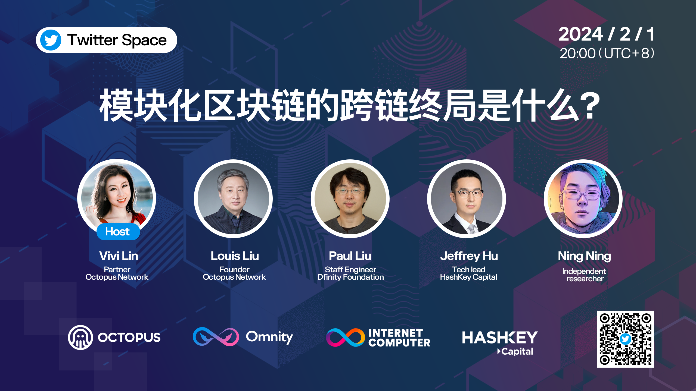

import Community from '../../docs/community.md';

ICP 生态的跨链新人王 Octopus Network 邀请 DFINITY 基金会和 Hashkey 的专家一起来讨论模块化区块链的现状

<!--truncate-->

## 宣发

日期：2月1日

时间：20:00 UTC+8

嘉宾

- Host: Vivi Lin, [Octopus Network](https://twitter.com/oct_network)
- 嘉宾：Louis Liu, [Octopus Network](https://twitter.com/oct_network)
- 嘉宾：Paul Liu, [DFINITY](https://twitter.com/dfinity)
- 嘉宾：Jeffrey Hu, [Hashkey Capital](https://twitter.com/HashKey_Capital)
- 嘉宾：Ning Ning

推广链接

- 宣发：https://twitter.com/oct_network/status/1752238946073874792
- Twitter Spaces: https://twitter.com/i/spaces/1ZkKzjlkrpLKv

## 视频回放

<iframe width="560" height="315" src="https://www.youtube.com/embed/UC7j8N_xzUA?si=fBfaUUtWSfsF8_oj" title="YouTube video player" frameborder="0" allow="accelerometer; autoplay; clipboard-write; encrypted-media; gyroscope; picture-in-picture; web-share" referrerpolicy="strict-origin-when-cross-origin" allowfullscreen></iframe>

<Community />