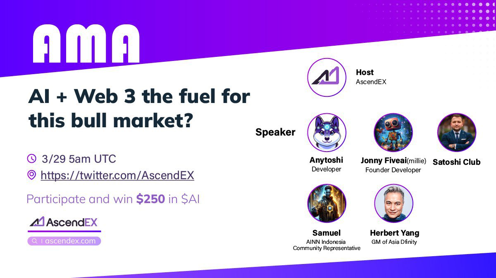

import Community from '../../docs/community.md';

How will AI and Web3 drive this bull market together?

<!--truncate-->

## 宣发

日期：3月29日

主持人: [AscendEX](https://x.com/AscendEX_)

宣发：https://x.com/AscendEX_/status/1773384171614007570

Twitter Spaces: https://x.com/i/spaces/1gqxvQbRlwwJB

## 视频

<iframe width="560" height="315" src="https://www.youtube.com/embed/r3fIdqkMA2g?si=Y2p6Z4_4PH4YgLlF" title="YouTube video player" frameborder="0" allow="accelerometer; autoplay; clipboard-write; encrypted-media; gyroscope; picture-in-picture; web-share" referrerpolicy="strict-origin-when-cross-origin" allowfullscreen></iframe>

<Community />