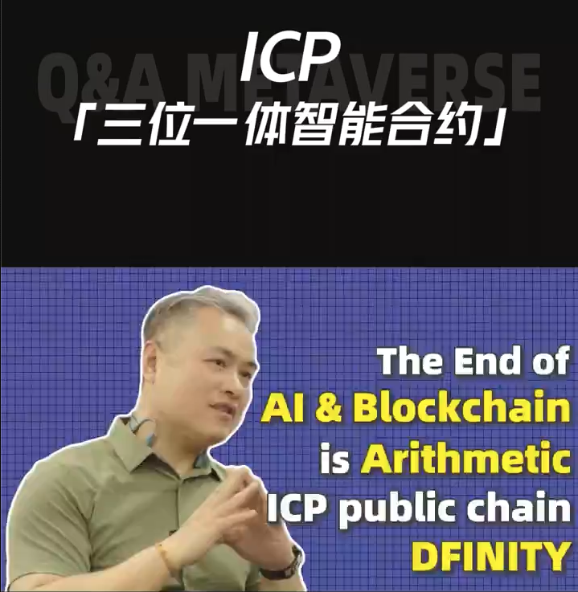

import Community from '../../docs/community.md';

QA Metaverse 在香港 Web3 Festival 期间采访 DFINITY 基金会亚太区负责人 Herbert

<!--truncate-->

## 宣发

日期：4月6日

地点: 香港

推广链接

- 宣发：https://x.com/QAMetaverse/status/1796336012706390148

## 视频回放

<iframe width="560" height="315" src="https://www.youtube.com/embed/3T2xlQ0knF0?si=ULNRH_FOyVjftZ0i" title="YouTube video player" frameborder="0" allow="accelerometer; autoplay; clipboard-write; encrypted-media; gyroscope; picture-in-picture; web-share" referrerpolicy="strict-origin-when-cross-origin" allowfullscreen></iframe>

<Community />