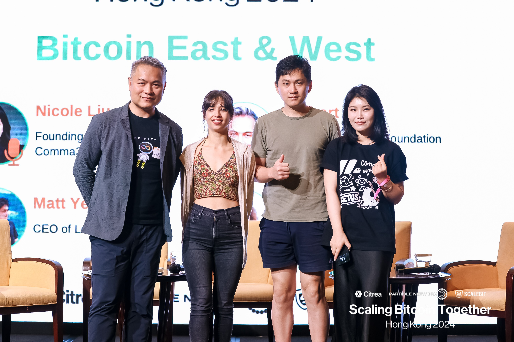
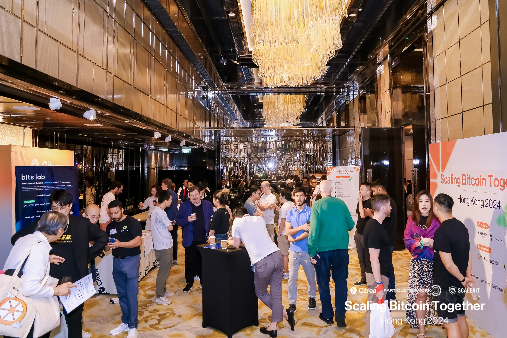

import Community from '../../docs/community.md';

As developers are flocking into the recently reinvigorated BTC ecosystem, how are the east and the west influencing this historical surge in their own ways? Competition or collaboration?

<!--truncate-->

## 宣发

日期：5月11日

地点：The Ritz-Carlton Hong Kong

注册：https://lu.ma/scaling-bitcoin-hk-2024

回顾: https://x.com/herbertyang/status/1788769925408215405

议程:

## 现场

## 视频

<iframe width="560" height="315" src="https://www.youtube.com/embed/OzEuvUmv6NI?si=ZItJB7ok_fsZiKoY" title="YouTube video player" frameborder="0" allow="accelerometer; autoplay; clipboard-write; encrypted-media; gyroscope; picture-in-picture; web-share" referrerpolicy="strict-origin-when-cross-origin" allowfullscreen></iframe>

<Community />