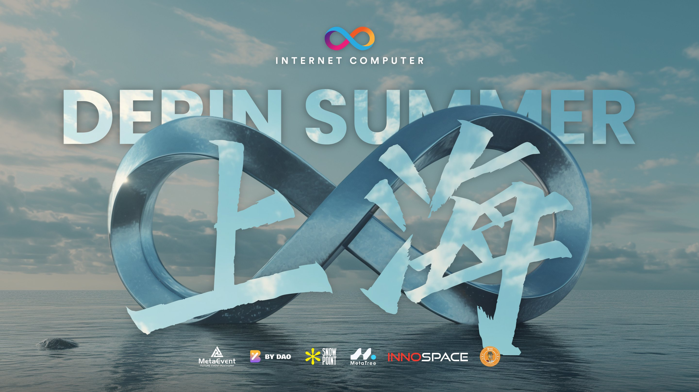
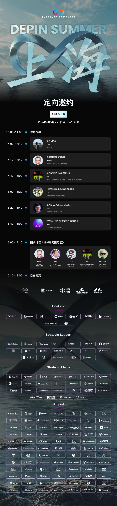
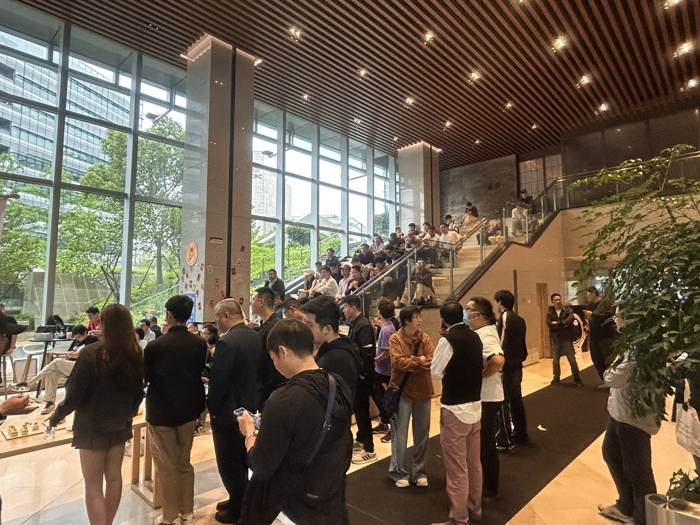
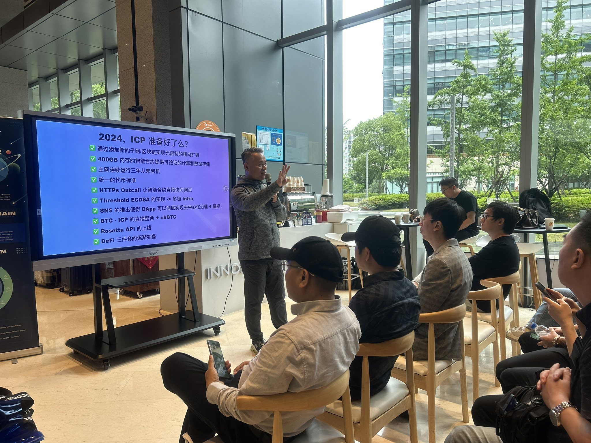
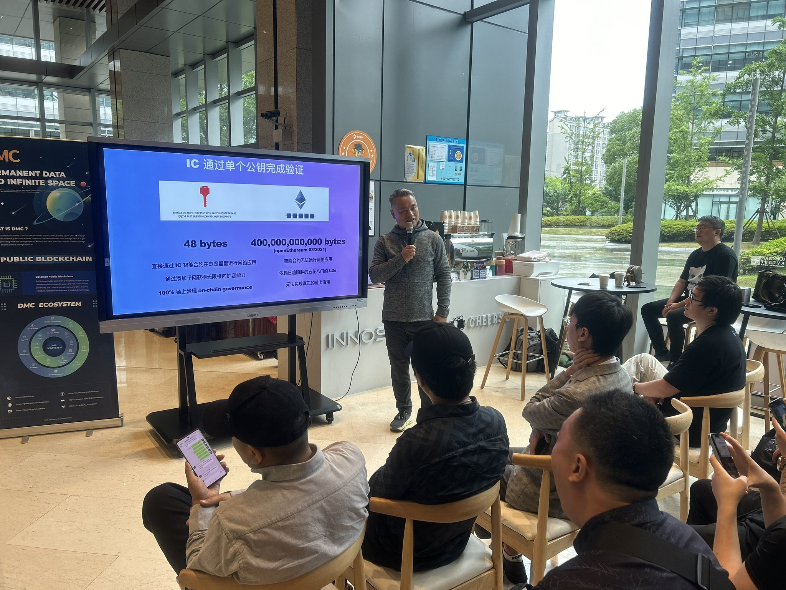
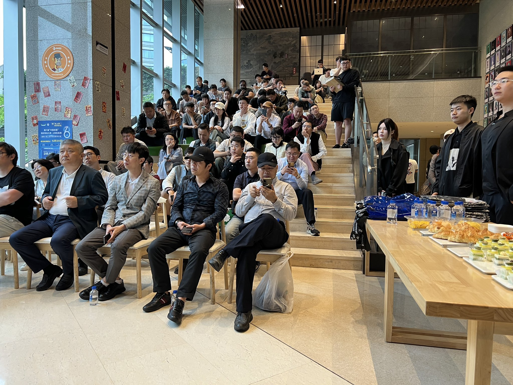
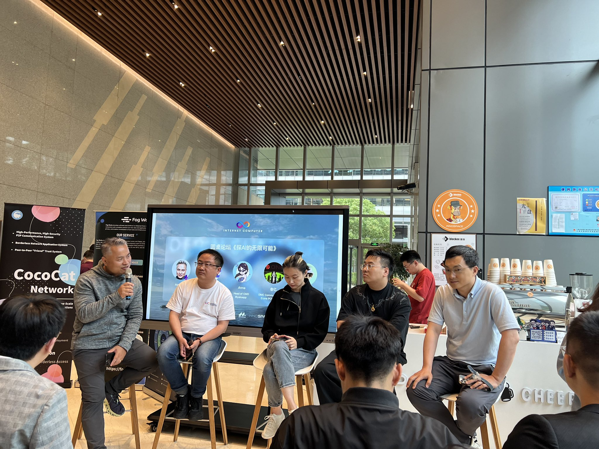
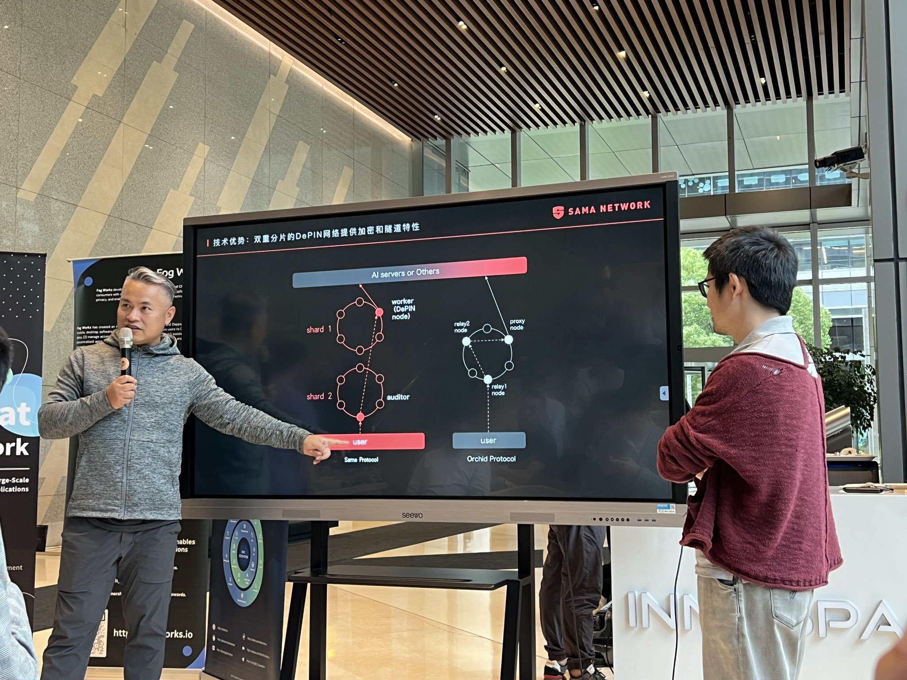

import Community from '../../docs/community.md';

在这场专注于DePIN技术的夏季盛会中，我们将展示如何利用区块链技术增强个人隐私保护和安全性

<!--truncate-->

## 宣发

日期：5月27日

地点：上海杨浦区大学路

议程

宣发：https://x.com/bydao_cn/status/1794276131614724342

## 现场

在复旦的大本营，开放式的空间，效果不错，松弛而自由，

互联网计算机在 2024 里充满了机遇

IC 可以在智能合约里运行网络应用前端的秘密

大家都听得很专注

每次的 ICP 活动，都会引起同场出席的其他生态的嘉宾对 ICP 的兴趣，譬如 DMC 和 CocoCat

Herbert 主持的圆桌讨论

Sama Network 利用 ICP 领先业界的高并发特性提供隐私服务

<Community />