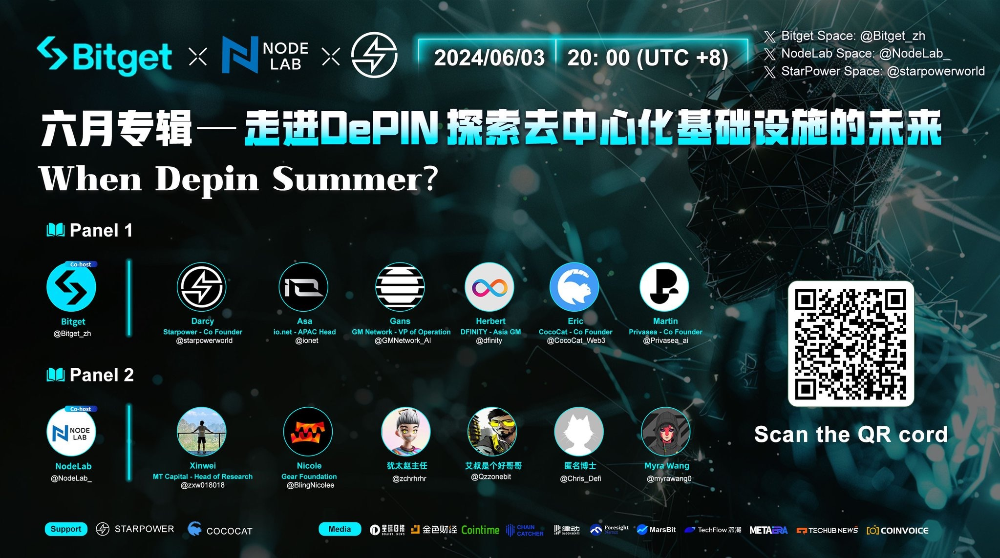

import Community from '../../docs/community.md';

When DePin Summer？六月专辑, by Bitget 和 Node Lab

<!--truncate-->

## 宣发

日期：6月03日

时间：20:00 UTC+8

宣发：https://x.com/Bitget_zh/status/1797462964993445982

Twitter Spaces: https://x.com/i/spaces/1RDGllPZdDMGL

## 演讲者

主持
- Bitget
- Node Lab

嘉宾
- Herbert, Asia GM, DFINITY
- Darcy, Co-Founder, Starpower
- Asa, APAC Head, io.net
- Gans, VP of Operation, GM Network
- Eric, Co-Founder, CocoCat
- Martin, Co-Founder, Privasea
- Xinwei, Head of Research, MT Capital
- Nicole, Gear Foundation
- 犹太赵主任
- 匿名博士
- Myra Wang

## 视频回放

<Community />