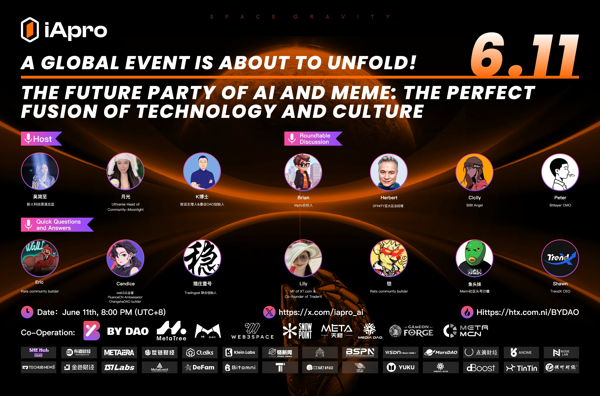

import Community from '../../docs/community.md';

 The Perfect Fusion of Technology & Culture, a Twitter Spaces hosted by iAPro

<!--truncate-->

## 宣发

日期：6月11日

时间：20:00 UTC+8

宣发：https://x.com/iapro_ai/status/1799850442681401473

Twitter Spaces: https://x.com/i/spaces/1vOxwjMbgodJB

## 嘉宾

Host
- 吴简至，新火科技渠道总监
- 月光，Head of Community of Moonlight
- K 博士，夜话主理人

嘉宾
- Brian, iApro 合伙人
- Herbert, DFINITY Asia GM
- Cicily, BIBI Angel
- Peter, Bitlayer CMO
- Lily, VP of XT.com
- 铠, Rats community builder
- 鱼头妹, Meme社区头号沙雕
- Shawn, TrendX CEO

## 效应

`4.6 million` tune-ins

## 视频+字幕回放

<Community />