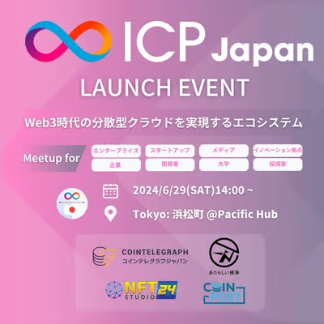
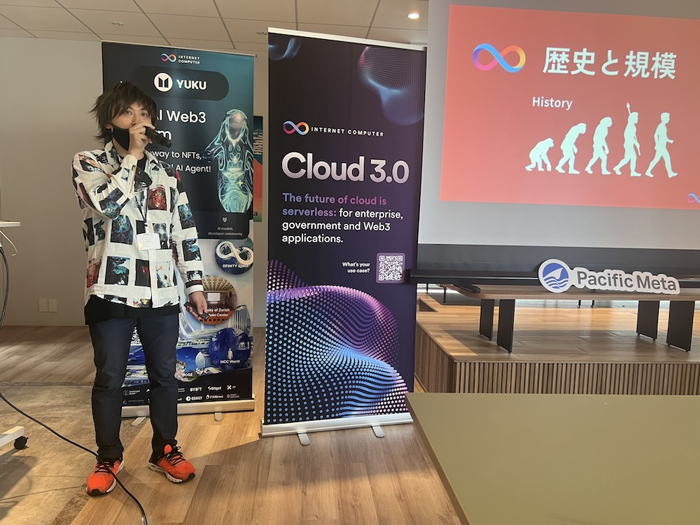
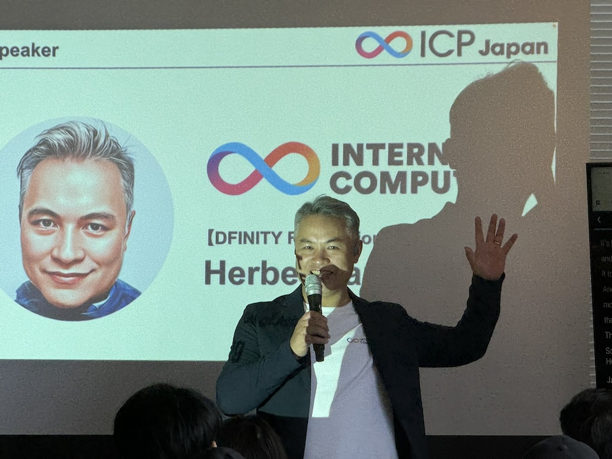
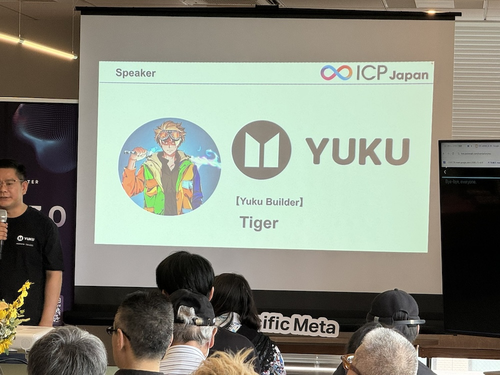
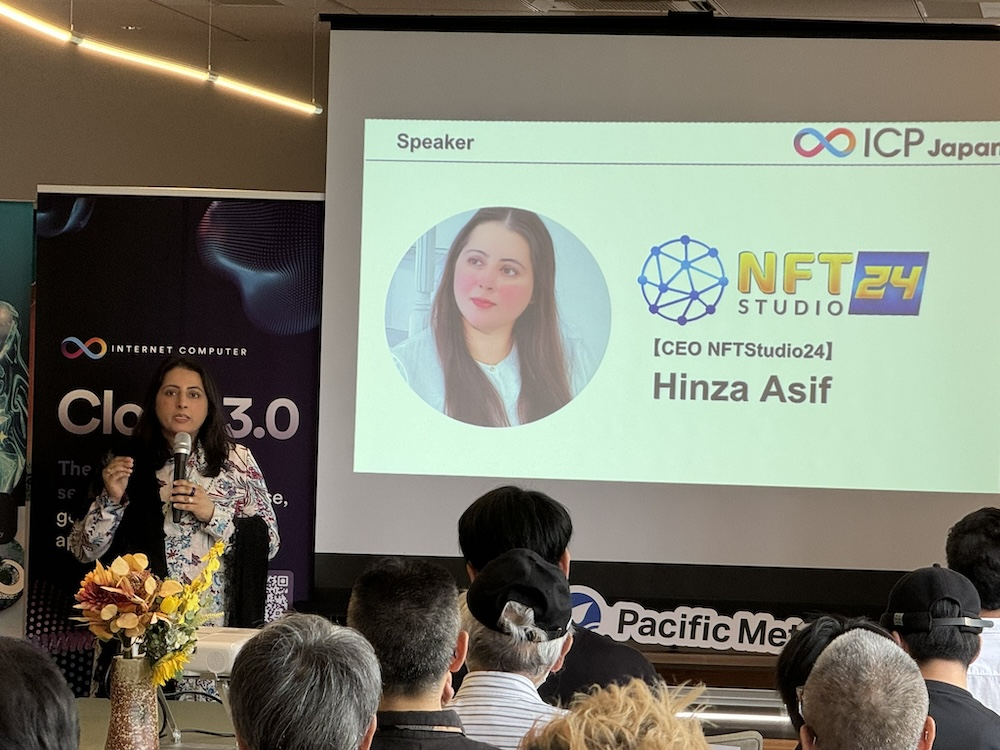
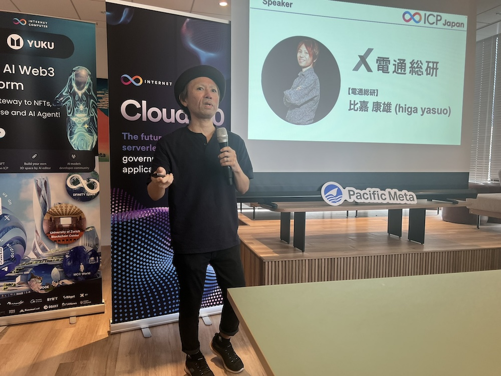
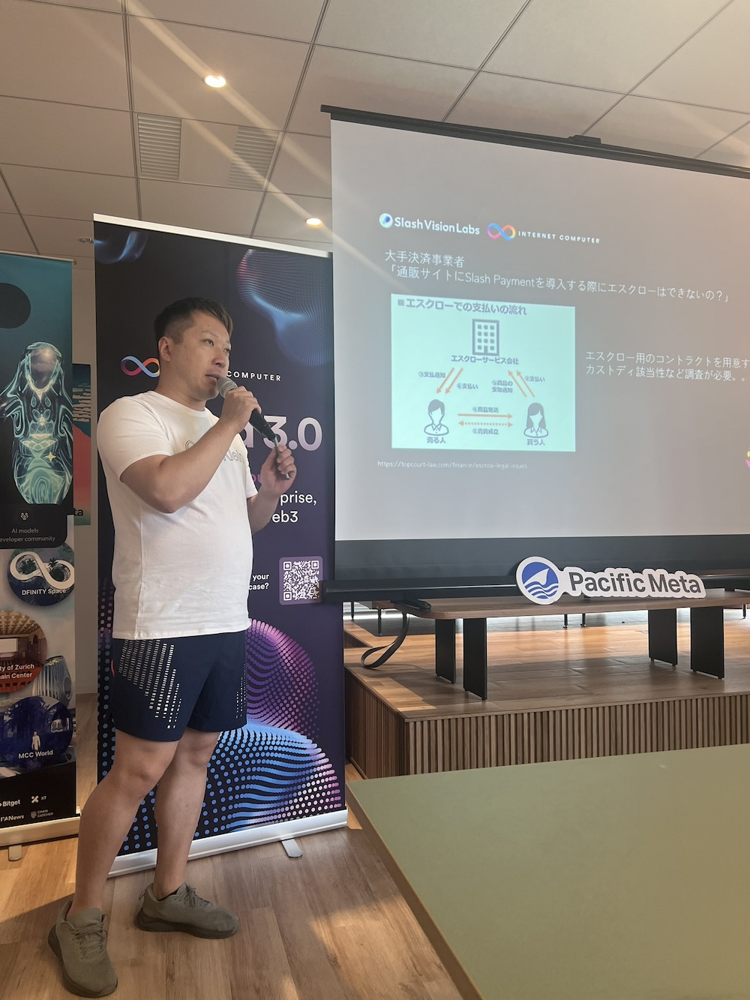
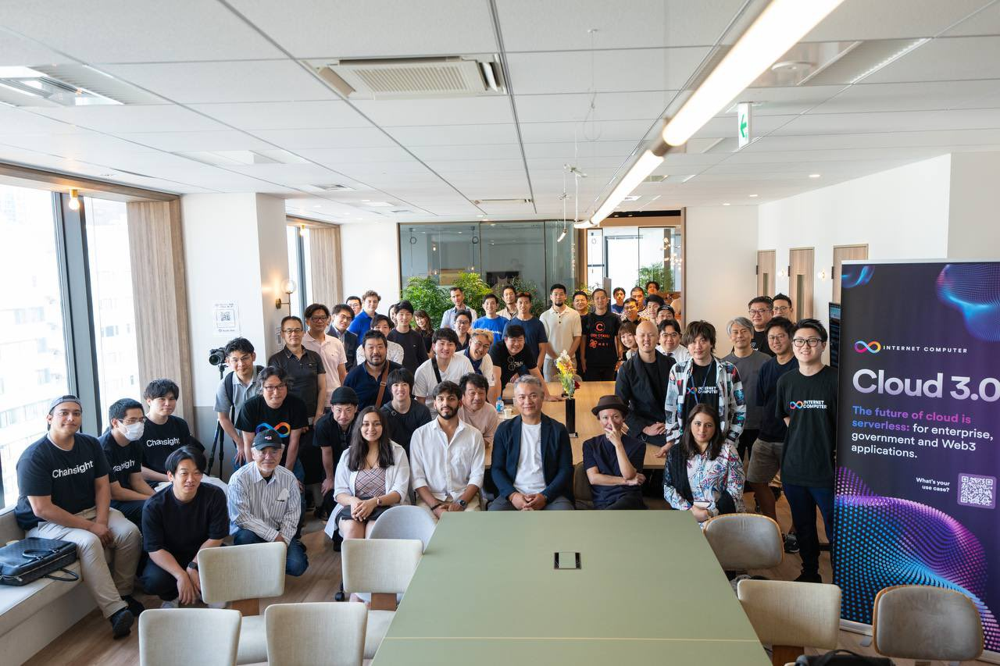

import Community from '../../docs/community.md';

ICP 在日本的社区已经默默地耕耘了两年多，现在终于也要启动本地的 ICP.Hub 了

<!--truncate-->

## 宣发

日期：2024年6月29日

地点：[浜松町PREX](https://www.google.com/maps/place/%E6%B5%9C%E6%9D%BE%E7%94%BAPREX/@35.6529802,139.7536882,17z/data=!3m1!4b1!4m6!3m5!1s0x60188be6ffed63f3:0x4df539a48cf167bb!8m2!3d35.6529802!4d139.7536882!16s%2Fg%2F11txy0vf9x?entry=ttu)

报名：https://lu.ma/nkx03pza

宣发: https://x.com/icp_Japan_/status/1803625070025383939

## 现场

日本社区的技术骨干 ShoT 给大家介绍 ICP

DFINITY Asia GM Herbert 给日本社区带来基金会的祝贺

ICP 生态第一大 NFT/元宇宙项目 Yuku DAO 的联合创始人 Tiger 的团队跟日本社区有很多合作机会

NFT Studio 24 的创始人 Hinza Asif 在日本 Web3 行业资源丰富，人脉广阔

比嘉康雄分享对 ICP 研究的心得

Masato Kato 介绍 [Slash Vision](https://x.com/Slashvision) 如何用 ICP 的技术提供支付方案 Slash Card

大合影！

