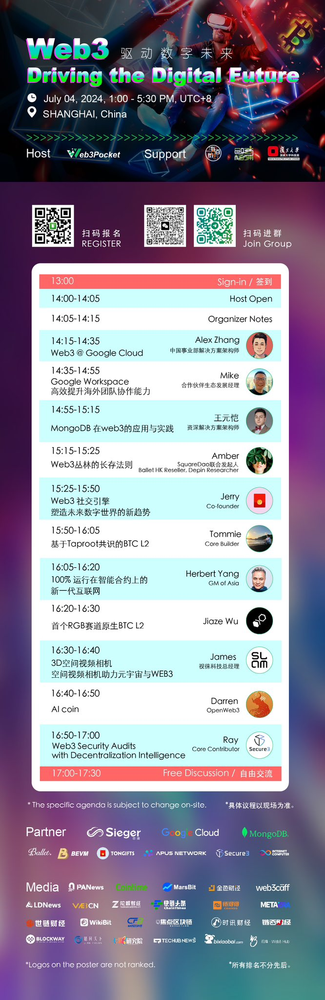
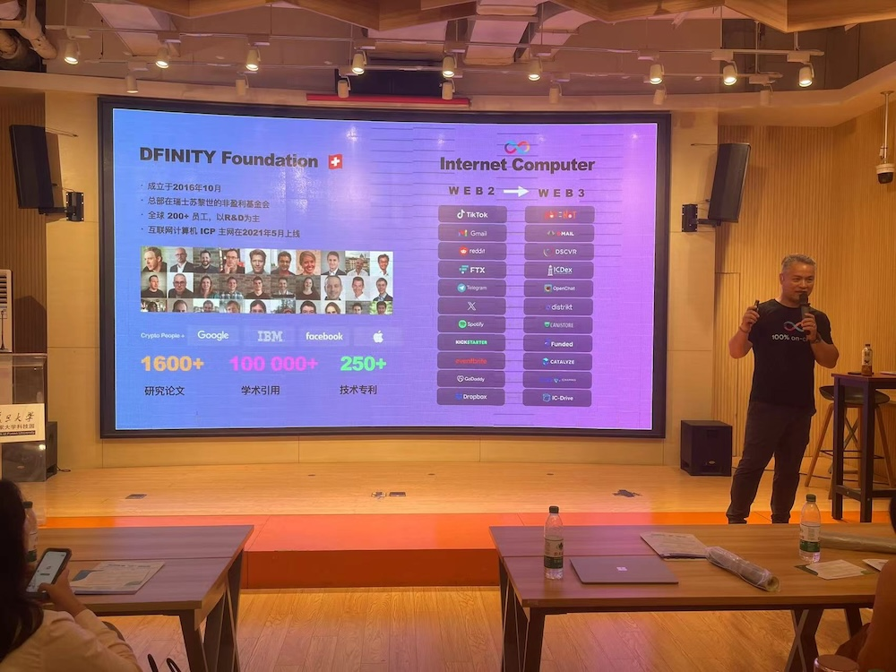
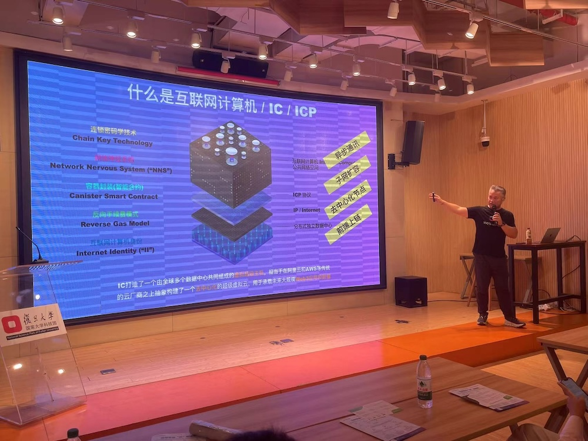
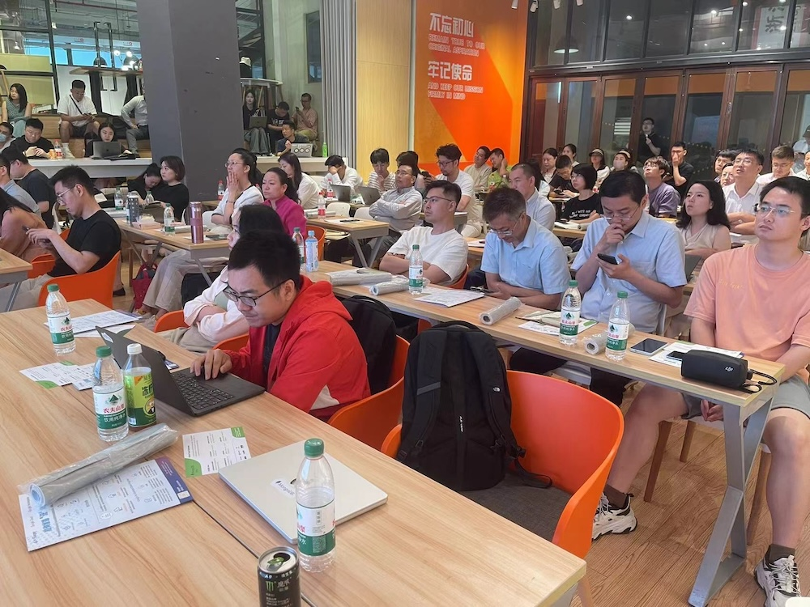

import Community from '../../docs/community.md';

一个融合了 Web3 和 Web2 两大阵营里的开发者的讨论会。数字化的未来是大家的共同目标。

<!--truncate-->

## 宣发

日期：2024年7月4日

地点：上海

议程:

宣发: https://x.com/herbertyang/status/1808398538956554527

## 现场

给 Web2 的开发者介绍 DFINTIY 基金会

互联网计算机的技术特点和优势

大家都听得很认真，来了不少复旦的大学生

