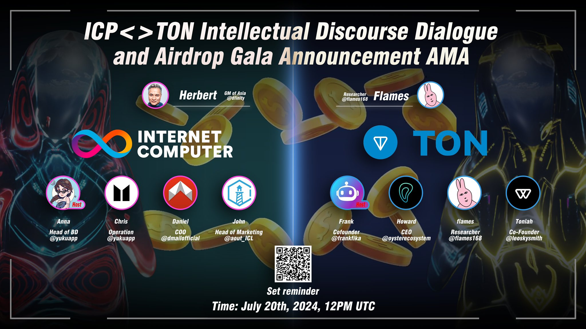

import Community from '../../docs/community.md';

ICP 和 TON 两大生态碰撞在一起，会产生什么样的火花？Yuku DAO 邀请了两个生态的代表交流一下彼此的想法

<!--truncate-->

## 宣发

日期：2024年7月20日

宣发: https://x.com/yukuapp/status/1814248913261773141

Twitter Spaces: https://x.com/i/spaces/1MnxnDReARoGO

1.5K 人参加了这次 Twitter Spaces