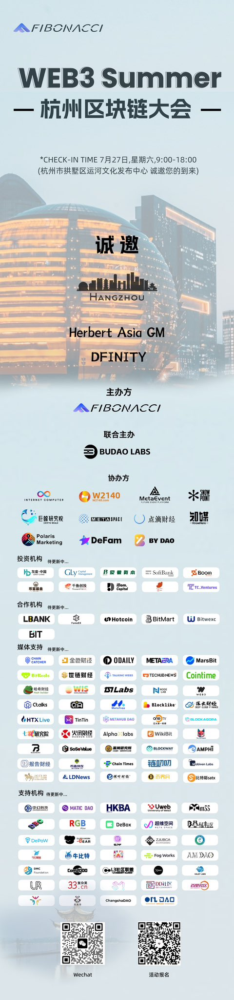
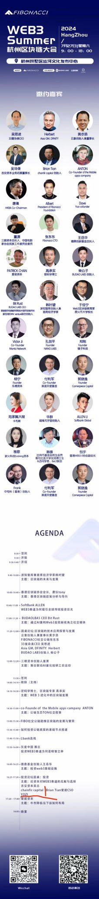
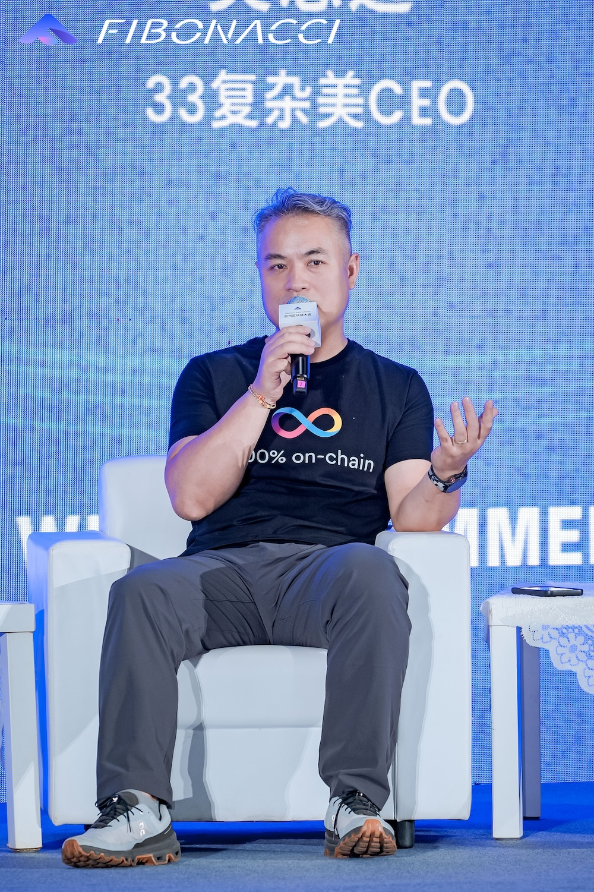
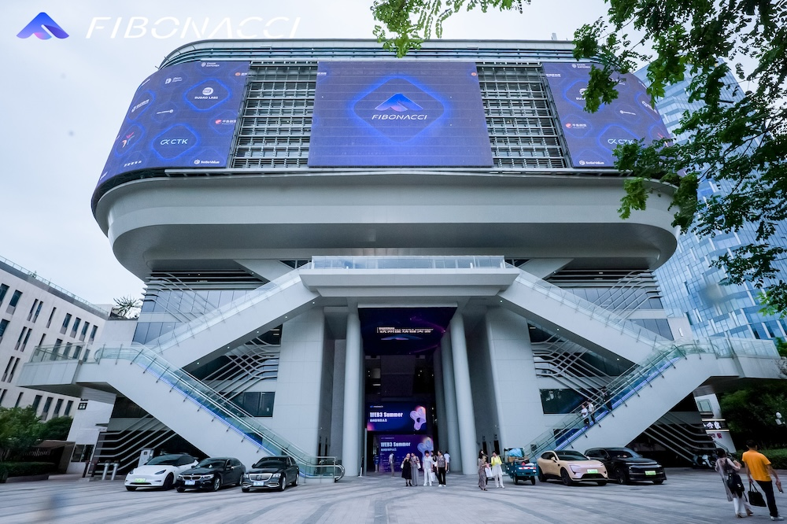
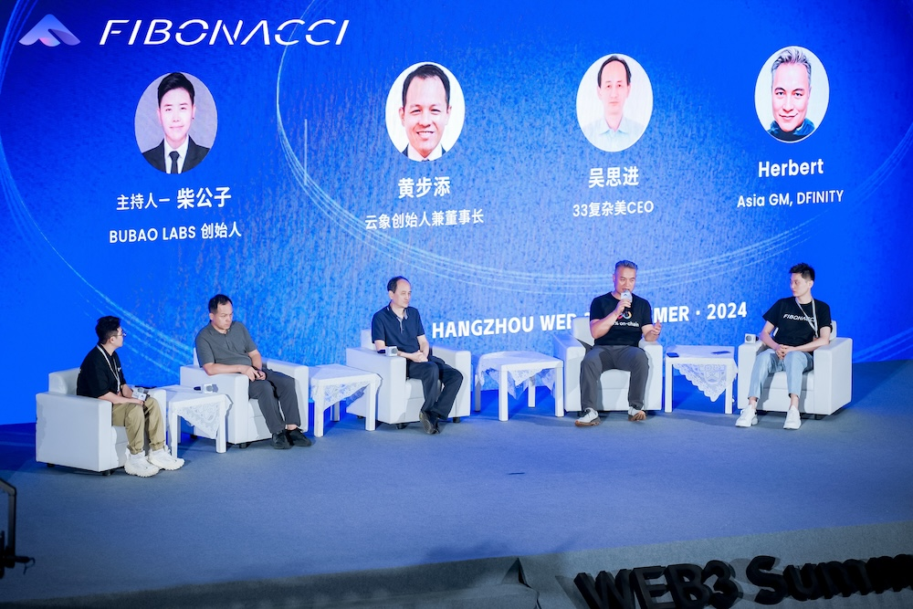
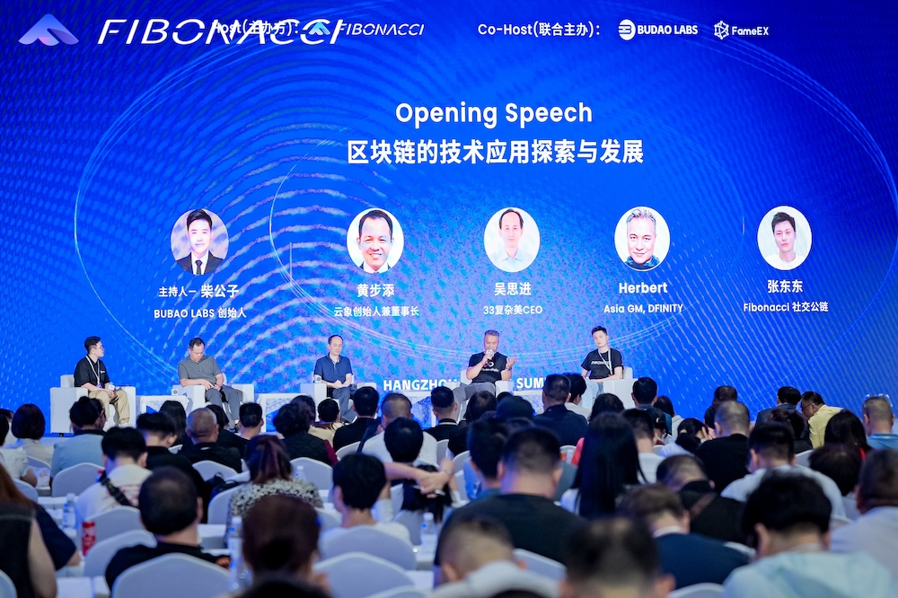
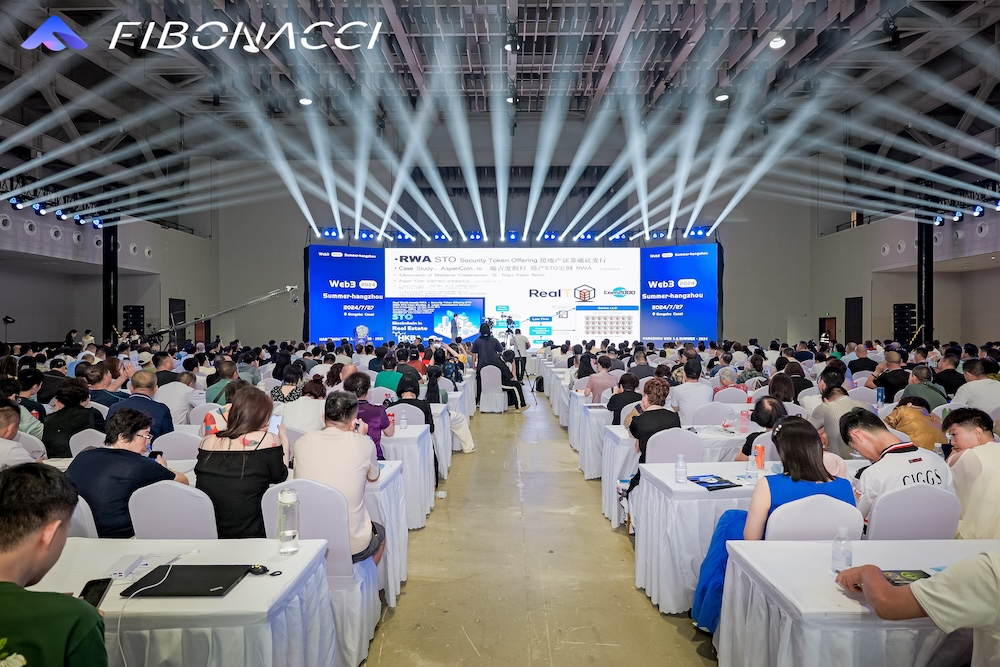

import Community from '../../docs/community.md';

夏日炎炎，当然应该继续探讨 Web3 了。Fibonacci 联手 BUDAO Labs 在杭州举办规模上千人的区块链大会，遍邀沪杭两地的嘉宾来做分享

<!--truncate-->

## 宣发

日期：2024年7月27日

地点：杭州拱墅区运河文化发布中心

议程

宣发：https://x.com/Bu_dao_official/status/1816787205060460723

## 圆桌

Q1: 从技术角度来说你觉得当下区块链最大的技术难点是什么？有什么更好的解决方案？

>有两大难点，一个是在智能合约上运行网络应用，一个是真正的去中心化实现数据安全。
>
>行业里大多数的L1区块链，除了互联网计算机（“IC”）以外，仅仅只是提供一个账本，无法直接运行网络应用，所以区块链行业里目前只能做金融属性非常强的应用，这只是传统互联网里非常小的一个子集。互联网计算机的容器型智能合约（“Canister”）拥有 400 GB 稳定内存（未来会扩展到 1TB 以上），可以直接运行任何网络应用的前端，包括各种网站，游戏，SaaS，甚至 LLM。开发者不再需要中心化的云计算服务器，可以大幅度降低开发和部署成本。
>
>L1区块链网络能提供的最大价值，就是数据安全。去中心化的网络部署是实现真正数据安全的唯一途径。目前行业里的L1/L2 网络，中心化属性都很强，要么是所谓的单机房链，要么依赖 PoS，要么缺乏去中心化的治理机制。互联网计算机自从三年前主网上线以来，已经在全球部署500 多个节点，由独立的几十家运营商分别运营。在最近发布的路线图上，将会在不久的未来把边缘节点的准入也实现去中心化，而且会在节点机器上部署 AMD-SEV，实现行业里最高程度的物理可信环境（“TE”）。IC 路线图上另外一个万众期盼的功能是 vetKeys，这将实现智能合约里保存秘密，实现真正的端到端的加密和解密。

Q2: 当下公链百花齐，从技术角度来分析你们更看好哪个赛道的公链，原因是什么？

>互联网计算机的技术在整个区块链行业里独树一帜，在多个最前沿的技术领域努力扩展行业的边际，探索跟 Web2 融合的路径，拥有最高的天花板。有五点值得关注：
>
>1. 唯一的L1，可以在智能合约里直接运行网络应用，指数级别地降低开发和运维成本，实现前端后端100% 上链，降低前端被黑的风险。
>
>2. 2023年推出的门限 ECDSA 技术，使 IC 成为极佳的跨链技术中间件平台，已经实现不依赖中心化桥的跟比特币和以太坊的直接整合，可以成为多链世界的交通枢纽中心。
>
>3. IC 上采用反向 gas 费用模式，没有 gas 费用，每项交易仅仅只需要支付 0.0001 的 ICP （防止 DDOS 攻击）。每秒可以处理30万以上的交易量（根据以太坊的定义），每秒产出30多个区块。在网络性能上跟传统 Web2 用户的期望值已经非常接近。
>
>4. 容器型智能合约从2022年9月开始就拥有了 https outcall 的功能，也就是说，可以从智能合约里直接访问任何网站，直接获取传统互联网网页的数据，不再依赖中心化程度高而且价格昂贵的 Oracle。
>
>5. IC 是唯一可以提供可验证计算的 L1 区块链网络，可以直接在区块链上运行计算，提供冷热数据的存储。DFINITY 基金会正在研发一个全部由 GPU 机器组成的子网，希望在未来1-2年内实现在去中心化区块链网络上运行原生的AI 智能合约。最近 DFINITY 的 R&D 团队已经实现在容器型智能合约里运行 LLM 识别图像。

Q3: 从技术角度出发，你觉得区块链当下处于什么阶段？未来的发展前景是什么

>区块链还处于非常早期的发展阶段。三年前互联网计算机主网上线的前夕，DFINITY 基金会创始人 Dominic Williams 写了一篇长文，展望了未来二十年 IC 的技术路线图。现在三年过去了，很多路线图上的功能已经实现，但未来仍然有很多激动人心的功能，需要互联网计算机生态里的开发者跟基金会一起共同努力来实现。
>
>比特币证明了数字黄金的可行性，以太坊提出的 ERC-20 标准，为所有 Web3 项目实现去中心化账本提供了模版，互联网计算机 2021年上线后，解决了困扰行业多年的横向扩容和运行网络应用前端的问题，提供了可验证的计算。区块链底层基础设施所涉及的最艰难的技术创新，已经在几家 L1 的推动下实现了很多，打下了坚实的基础。
>
>未来 2-3 年，将会是 Web3 应用大爆发的寒武纪，从纯金融走向更为广阔的社交，游戏，企业服务，甚至电商，这是硬核开发者最好的年代。

## 现场

在有限的时间里，尽量介绍 ICP 复杂的技术创新

会场规模不小，可以容纳上千人

BUDAO Labs 主持的圆桌包括了海外公链 ICP，国内联盟链公司云象和33复杂美，以及社交公链 Fibonacci

上千人来到现场交流聚会

## 新闻

[布道财金](https://x.com/Bu_dao_official) 对本次活动的报道：

[《2024年杭州web3 summer区块链大会圆满成功》](https://mp.weixin.qq.com/s/MPAB8yivMMZu1hjRP__fcg)

<Community />