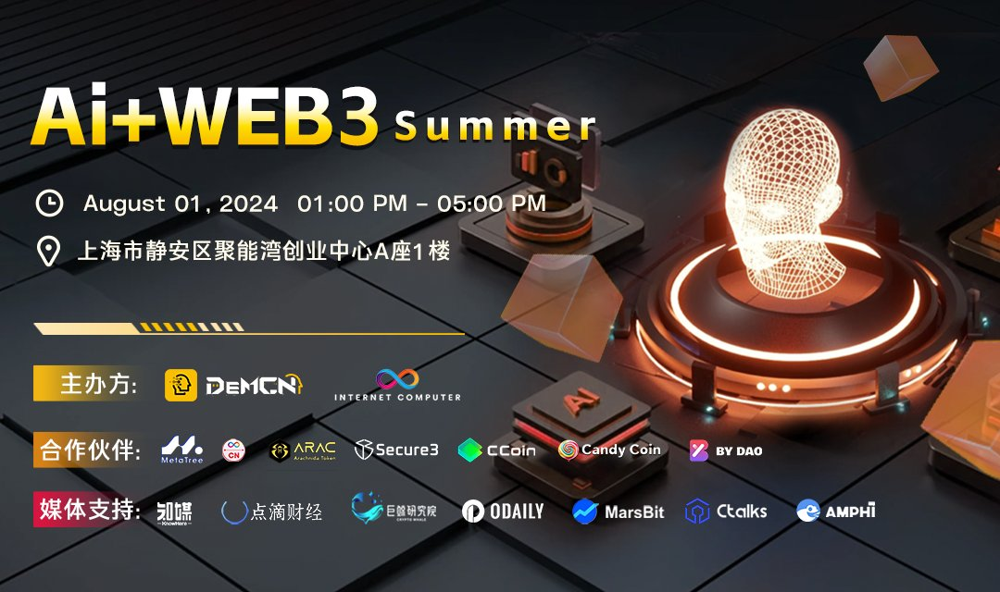
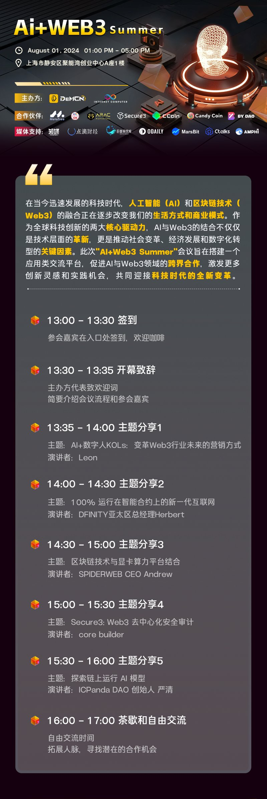

import Community from '../../docs/community.md';

ICP 一直以来高度重视和关注 AI 技术的发展，并致力于将其与 Web3 相结合。本次活动将展示 ICP 在 AI 领域的最新成果，并探讨 AI 如何推动 Web3 的创新与进步

<!--truncate-->

## 宣发

日期：2024年8月1日

地点：上海静安区聚能湾创业中心A座1楼

议程

宣发: https://x.com/bydao_cn/status/1816690183338684712

