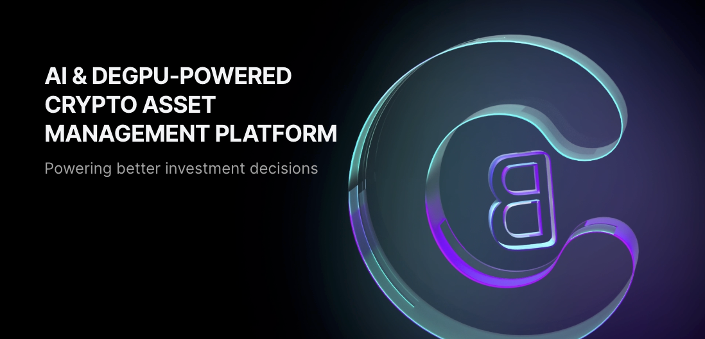
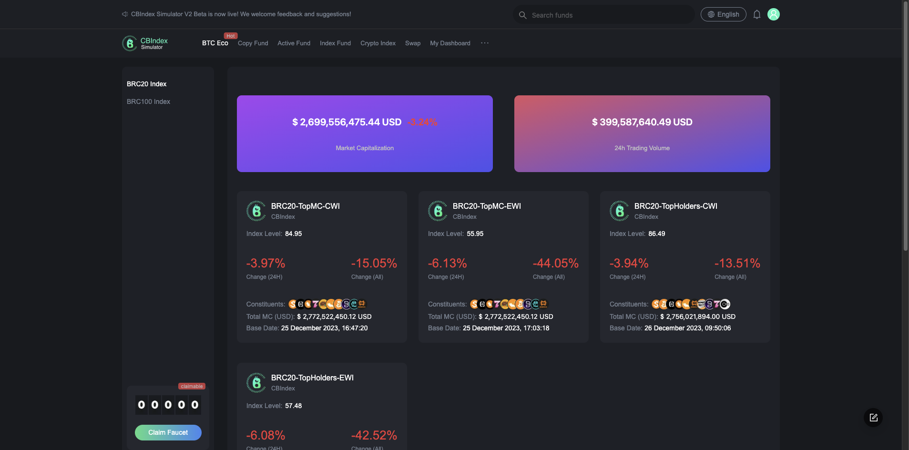
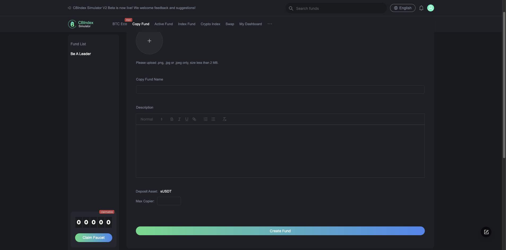
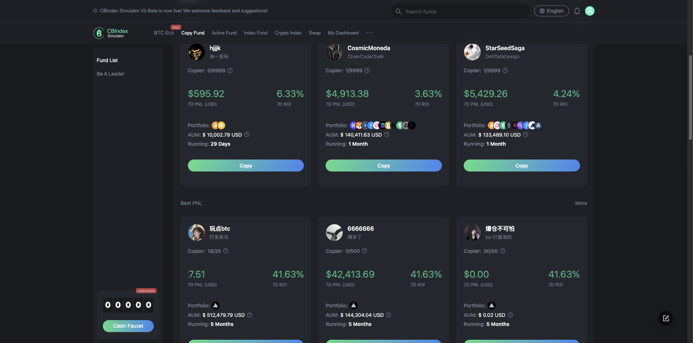
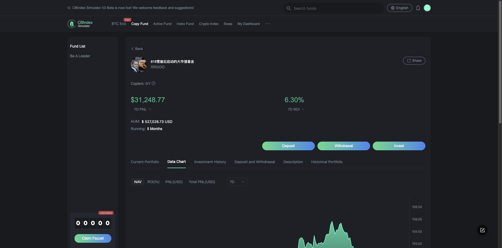

import Tabs from '@theme/Tabs';
import TabItem from '@theme/TabItem';

# CBIndex 使用攻略

## 概述

- [CBIndex](https://cbindex.finance/) 是 BTCFi 驱动的全链资产管理协议。

  - 功能强大：面向加密行业各类投资者提供 BTC 金融为主的各类资产管理工具和服务
  - BTCFi 驱动：提供最全面的 BTC 金融解决方案
  - 安全可信：加密资产的管理 100%在链上完成

- 服务加密领域中处于不同阶段的用户
  - 新手用户：提供 BTCFi 相关信息、加密资管模拟环境、基本的资产管理工具和服务
  - 专业用户：提供全面的 BTCFi 解决方案，包括 cbBTC，Bitcoin lending & borrowing, Bitcoin indexer 等
- 功能涵盖加密资管各个方面
  - cbBTC: A bridgeless & non-custodial wrapped Bitcoin. It stands as a groundbreaking innovation in the realm of digital assets, offering a bridgeless and non-custodial wrapped Bitcoin solution. Unlike traditional wrapped Bitcoin solutions that rely on intermediaries or custodial services, cbBTC eliminates the need for bridges and custodians, thereby reducing points of vulnerability and enhancing the security and trustlessness of transactions. This approach ensures that users retain full control over their assets without compromising on the decentralized ethos of blockchain technology.
  - Bitcoin cross-chain restaking: It represents a novel approach to enhancing the utility and yield-generating potential of Bitcoin within the DeFi ecosystem. Drawing inspiration from concepts similar to those pioneered by EigenLayer and Babylon, this innovative mechanism allows Bitcoin holders to participate in the security and consensus mechanisms of various Proof of Stake (PoS) networks. By restaking their Bitcoin across different blockchains, users can earn additional yields on their BTC holdings, effectively turning their Bitcoin into a productive asset that not only appreciates in value but also generates passive income. This cross-chain restaking model leverages advanced technologies to ensure a seamless, secure, and efficient process for Bitcoin holders. By enabling Bitcoin to be used in restaking activities without leaving its native blockchain, this approach mitigates the risks associated with transferring assets across chains while preserving the trustless and decentralized nature of the transactions. As a result, Bitcoin cross-chain restaking opens up a world of opportunities for BTC holders, allowing them to engage with the broader DeFi landscape, earn staking rewards from multiple PoS blockchains, and diversify their investment strategies beyond traditional Bitcoin use cases.
  - Bitcoin lending and borrowing: It enables Bitcoin holders to lend their assets in exchange for interest payments, providing a passive income stream that wasn't possible. Conversely, borrowers can access Bitcoin loans by putting up collateral, often in the form of other cryptocurrencies, which unlocks the liquidity of their holdings without the need to sell. This mechanism not only enhances the utility of Bitcoin but also introduces a flexible, secure, and efficient way to manage digital assets. CBIndex's approach is a bridgeless fixed-rate lending of Bitcoin via on-chain auctions, which refines this concept further by integrating it into a broader, omnichain DeFi strategy. By leveraging the security and liquidity of Bitcoin in conjunction with the flexibility of the ICP, CBIndex offers a decentralized platform where users can easily lend, borrow, and manage their Bitcoin assets across multiple blockchain networks. This not only democratizes access to financial services but also catalyzes innovation within the DeFi space, allowing users to maximize their financial strategies in a secure, transparent, and user-friendly environment. Through CBIndex, Bitcoin lending and borrowing become more accessible, offering enhanced opportunities for yield generation and financial growth in the digital age.
  - The decentralized Bitcoin inscription indexer: It is a cutting-edge solution designed to catalog and provide accessible, searchable information on inscriptions and tokenized assets, such as BRC20 tokens, within the Bitcoin blockchain. This innovative platform leverages decentralized technology to ensure that all data related to Bitcoin inscriptions—digital artifacts, smart contracts, or tokenized assets—are transparently and immutably recorded, offering a trustless and censorship-resistant environment for users. By doing so, it addresses the growing need for a reliable and secure method to interact with and explore the burgeoning space of Bitcoin-based tokens and inscriptions, which are becoming increasingly important for the ecosystem's expansion into DeFi, NFTs, and beyond. The introduction of this decentralized indexer marks a significant milestone in enhancing the functionality and utility of the Bitcoin network. It not only facilitates the discovery and verification of Bitcoin inscriptions and tokens for users and developers but also supports the integration of Bitcoin assets into a wider range of applications and services. This decentralized approach to indexing Bitcoin inscriptions ensures that the ecosystem remains open and accessible, fostering innovation and development while maintaining the core values of decentralization and security that are fundamental to Bitcoin. As the Bitcoin network continues to evolve, the decentralized Bitcoin inscription indexer will play a crucial role in unlocking new possibilities and driving the adoption of Bitcoin-based assets across various sectors.
  - Incorporating on-chain funds into our suite of BTCFi products, CBIndex elevates Bitcoin token management to new heights, addressing the growing demand for sophisticated asset management solutions within the Bitcoin ecosystem. This innovative approach not only encompasses the management of emerging Bitcoin tokens, such as BRC20 and Atomicals, but also leverages on-chain funds as dynamic vehicles for investment and diversification. By integrating these advanced asset management tools, CBIndex offers users a comprehensive platform for the strategic allocation, trading, and optimization of Bitcoin and its tokens. This holistic management solution empowers investors to fully harness the potential of their digital assets, maximizing returns while mitigating risks in the volatile cryptocurrency market. CBIndex's utilization of on-chain funds as part of its Bitcoin token management strategy represents a significant advancement in decentralized finance (DeFi). These funds, operating entirely on the blockchain, provide transparent, secure, and efficient means for collective investment strategies, directly tapping into the liquidity and innovative potential of Bitcoin tokens. Supported by the robust infrastructure of ICP, CBIndex ensures that these on-chain funds are not only accessible and user-friendly but also benefit from enhanced security, interoperability, and real-time asset management capabilities. This integration of on-chain funds into the platform's BTCFi products positions CBIndex as a leader in DeFi innovation, offering a versatile and powerful toolset for investors seeking to explore the full spectrum of investment opportunities within the Bitcoin ecosystem.
  - CBIndex's Crypto Index product stands as a beacon in the rapidly evolving landscape of digital asset management, offering a meticulously curated index of cryptocurrencies. This innovative product is designed to provide investors with a comprehensive and diversified exposure to the crypto market, encapsulating the performance of selected cryptocurrencies through a single, accessible investment vehicle. By leveraging advanced algorithms and blockchain technology, the Crypto Index dynamically adjusts its composition to reflect the changing market conditions, ensuring that investors are always aligned with the most promising and stable assets in the crypto space. The Crypto Index product simplifies the investment process for individuals looking to enter the cryptocurrency market without the need to extensively research individual assets. It offers a balanced and diversified portfolio strategy, reducing the volatility and risk typically associated with investing in single cryptocurrencies. This product is ideal for both seasoned investors seeking broad market exposure and newcomers desiring a straightforward entry point into crypto asset management.
  - CBIndex introduces two cornerstone products designed to bring clarity and structure to the rapidly expanding universe of digital assets: the Bitcoin Ecosystem Classification Scheme (BECS) and the Crypto Industry Classification Standard (CICS). These classification systems are meticulously crafted to categorize and standardize the diverse entities within the crypto space, providing investors, researchers, and enthusiasts with a coherent framework to navigate the complex landscape of cryptocurrencies and blockchain technologies. The BECS focuses specifically on the Bitcoin ecosystem, categorizing assets, projects, and initiatives related to Bitcoin to highlight their roles, functionalities, and contributions to the broader Bitcoin network. This scheme aids in understanding the multifaceted nature of Bitcoin beyond its primary function as a digital currency, encompassing areas such as security, scalability solutions, and financial services within the Bitcoin ecosystem. On the other hand, the CICS offers a broader classification of the entire crypto industry, segmenting projects and assets across various blockchains and technologies into clearly defined categories. This standard facilitates a deeper understanding of the crypto market's structure, trends, and investment opportunities, enabling informed decision-making and strategic asset management planning. Together, BECS and CICS represent CBIndex's commitment to enhancing transparency, accessibility, and sophistication in the asset management landscape. By providing these comprehensive classification systems, CBIndex empowers stakeholders to make sense of the crypto world's complexity, fostering informed engagement and promoting the growth of a more organized and navigable digital asset market.

## 网址

- 官方网站：[https://cbindex.finance/](https://cbindex.finance/)
- 模拟器应用：[https://sim.cbindex.finance/](https://sim.cbindex.finance/)

## 注册

- 可通过 Google、Twitter 等方式一键登录

## Bitcoin 生态板块

推出[Bitcoin 生态指数](https://sim.cbindex.finance/btceco/list)，目前支持 BRC20 和 BRC100 协议。指数产品包括：
- BRC20-TopMC-CWI：以市值排名靠前的 BRC20 加密资产作为指数成分，采用市值加权计算方法构建的指数；
- BRC20-TopMC-EWI：以市值排名靠前的 BRC20 加密资产作为指数成分，采用等权重计算方法构建的指数；
- BRC20-TopHolders-CWI：以持币者数量排名靠前的 BRC20 加密资产作为指数成分，采用市值加权计算方法构建的指数；
- BRC20-TopHolders-EWI：以持币者数量排名靠前的 BRC20 加密资产作为指数成分，采用等权重计算方法构建的指数；
- BRC100-TopMC-CWI：以市值排名靠前的 BRC100 加密资产作为指数成分，采用市值加权计算方法构建的指数；
- BRC100-TopMC-EWI：以市值排名靠前的 BRC100 加密资产作为指数成分，采用等权重计算方法构建的指数；

## 跟单基金板块

CBIndex 模拟器中的跟单基金板块，为用户提供提供一个模拟环境，可以创建自己的加密基金并根据自己的决策进行加密资产的模拟投资。也可以跟踪其他用户创建的加密基金，根据其他用户的决策进行加密资产的模拟投资。

- 创建【跟单基金】

用户只需要填写一些简单信息，即可创建自己的跟单基金。基金创建完成后，其他用户可以跟踪该基金。基金创建者在基金中的投资和赎回等操作，会实时推送给基金的跟踪者。

- 跟踪【跟单基金】
  
  
  用户可以在【跟单基金】板块中查看到所有的跟单基金，可以根据自己的喜好进行筛选。点击【跟单】按钮，即可跟踪该基金。跟踪基金后，用户可以在【我的仪表盘】板块中查看到自己跟踪的基金。

## 代币

- CBIndex 项目目前没有发行代币

## 联系

- 官方网址：[https://cbindex.finance/](https://cbindex.finance/)
- 社交账号：[https://twitter.com/CBIndex_Global](https://twitter.com/CBIndex_Global)
- Github：[https://github.com/CypherBabel-Lab](https://github.com/CypherBabel-Lab)
- Telegram：[https://github.com/CypherBabel-Lab](https://github.com/CypherBabel-Lab)

## 问题

如果暂时没有得到 CBIndex 团队的回应，您也可以在 [ICP China 的 Twitter Community](https://twitter.com/i/communities/1679302895571988481) 上提问，DFINITY 亚太团队会尽快把您的问题反馈给 dapp-name 团队，或者邀请社区里的深度用户来一起解答。

欢迎所有喜爱 CBIndex 的用户提交 PR，一起来补充这个 dapp-name 的攻略！点击 `Edit this page` 即可。