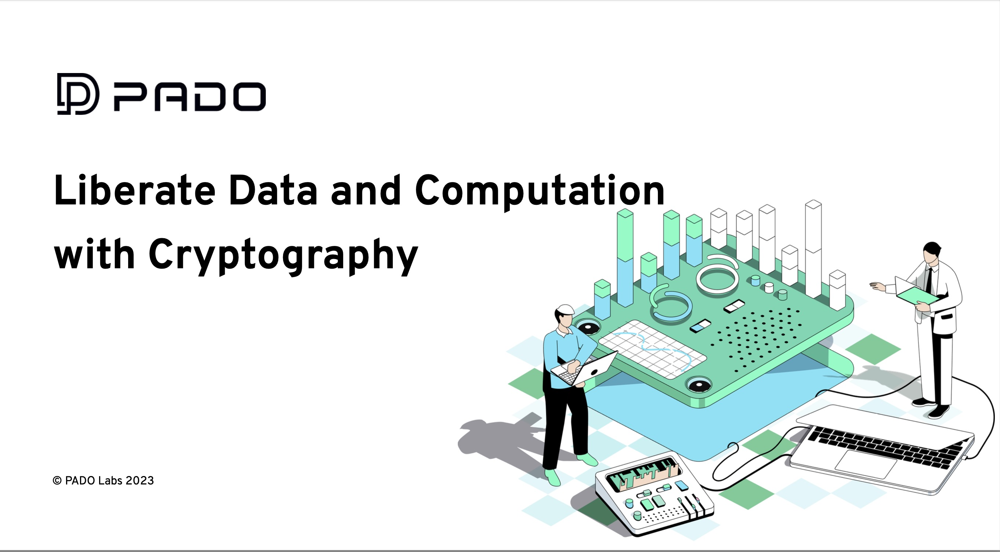

import Dapp from '../../dapp.md';

# 去中心化数据证明和计算协议PADO

## PADO是什么？

PADO是一个去中心化的隐私数据证明和计算协议。基于纯粹的密码学技术，PADO的使命是破除数据孤岛，在保护个人数据主权和隐私的前提下，将用户数据与智能合约结合，促进Web3应用创新和帮助个人数据安全变现。

目前PADO基于Chrome浏览器推出了首个真正实现数据自托管和本地ZK证明计算的插件产品，支持连接社交平台、中心化交易所和身份服务等十多个链下数据源，用户可以通过插件实现全流程的数据管理，以及创建链上证明。

PADO的长期愿景包括构建一个去中心化的数据证明和计算网络，使开发人员能够创建与互联网数据无缝集成的应用程序。利用PADO强大的基础设施和工具，基于标准化的API模板，使传统开发人员能够自主集成更多不同类别的数据源，同时使Web3开发人员能够为他们的dApp独立选择数据源和zk证明逻辑。

简单介绍PADO背后的团队
  + PADO Labs团队由几位密码学专家和软件工程师创办，他们在密码学算法、隐私保护技术和分布式系统开发方面具有非常丰富的经验。
+ 在哪里可以联系到团队
  + 你可以随时加入PADO Labs的社区（[Discord](https://discord.gg/YxJftNRxhh)）联系他们。
  + 你也可以在[Twitter]（https://x.com/padolabs）上找到他们的官方团队。

## PADO插件的主要功能

- 数据获取：用户可以随时随地通过API的方式获取他/她在不同互联网平台上私有数据。目前插件支持社交媒体、中心化交易所、身份服务、链上地址等十多项数据源，并且仍在持续添加中。
- 数据分类看板：插件支持对不同类别的数据进行分类管理，例如社交和资产。用户在资产数据面板里，可以使用一一体化的看板功能，获取在所有链下交易所和链上钱包内的资产汇总和分布动态。
- 创建隐私数据证明以及链上分享：用户可以用PADO插件内置的交互式零知识证明算法（与PADO的证明和计算网络进行通信）创建隐私数据的证明。通过区块链钱包授权之后，用户可以将这些数据最小化的证明分享给不同链上的证明服务和任意应用。
- 你也可以观看这段[视频](https://youtu.be/3FjqI6uBVEs)来快速了解PADO插件的主要功能。

## PADO的独特之处

- 为什么对用户有吸引力
  - 从互联网经济和用户数据价值捕获的角度而言，PADO解决了几个关键挑战：如何将不同互联网巨头把控的数据归还给用户？如何在保护隐私的同时将互联网数据，特别是用户的私人数据无缝集成到智能合约中？如何在使用数据时确保用户隐私？如何激励用户参与管理他们拥有的数据？如何促进开发人员之间更强的协作？PADO基于严格密码学的技术栈和网络机制将为个人用户和开发者在数据应用方面提供多种价值。

- 对什么样的用户最有吸引力
  - 尊重个人数据主权，重视个人隐私的用户
  - 拥抱区块链和去中心化技术的用户
  - 希望实现个人数据安全变现的用户
  - 希望获得安全可靠的个人数据的应用开发者

- 独特的竞争优势
  - 安全性：PADO基于纯粹的密码学技术，包括交互式零知识证明（IZK），基于TLS协议的安全多方计算（MPC-TLS），以及基于零知识证明的可验证全同态加密算法（zkFHE), 为个人用户和应用开发者提供核心数据安全，这包括用户数据的来源准确可靠（数据真实性），数据隐私信息最小化披露（数据隐私保护），数据加密后的外包计算（机密性），密文计算准确可靠（计算可验证性）。
  - 性能：PADO通过自研的高性能密码协议，允许用户和开发者在资源受限的设备上实现快速准确的数据获取和证明流程。
  - 数据可扩展性：基于标准化的API接入和应用计算模版套件，开发者可以方便的在PADO插件乃至自己的dApp上添加任意的链下数据源，以及实现定制化的数据应用逻辑。
  - 计算可扩展性：对于计算能力受限的用户设备，PADO支持将关于隐私数据的计算外包给PADO计算网络。借助可验证同态加密算法，用户的隐私数据将被加密后传递给外包算力。同时，零知识证明技术确保基于密文的计算结果准确可靠。

## 如何在ICP上使用PADO

PADO团队正在努力完成PADO插件与ICP的集成开发。在不久的将来，用户可以通过PADO插件方便的获取其在各类平台上的自身数据，并且通过插件实现一站式的数据管理和看板，以及创建各类数据证明。用户可以基于ICP的钱包将PADO插件上的数据证明传递到ICP链上，并在Verax证明服务进行存储和授权访问。

PADO团队将在完成ICP上的部署后同步更新使用手册。

<Dapp />
