import Tabs from '@theme/Tabs';
import TabItem from '@theme/TabItem';
import Dapp from '../../dapp.md';

# AstroX ME 钱包使用攻略

## 概述

AstroX 的 [ME](https://astrox.me/) 钱包是一个多链智能钱包，通过先进的加密技术提供类似 Web2 应用的流畅交互体验。ME 钱包使用指纹和面部识别等生物识别技术，而不是传统钱包的私钥管理方法，创造性地在新设备上恢复钱包，无需助记词。它支持多条链和多个币种。

作为连接用户和 DApp 的桥梁，ME 钱包在授权机制的设计上也进行了创新，提供了两种授权登录模式，具有不同的隐私级别：`全局` / `隐私`，使用户能够决定第三方 DApp 是否可以跟踪应用内或跨应用的行为数据。

## 下载

- 官方下载地址

<Tabs>
  <TabItem value="App Store" label="iOS" default>
    <a href="https://apps.apple.com/us/app/astrox-me-wallet/id1634031707">App Store 下载</a>
  </TabItem>
  <TabItem value="Google Play" label="Android">
    <a href="https://play.google.com/store/apps/details?id=com.astrox.me">Google Play 下载</a>
  </TabItem>
  <TabItem value="APK" label="APK">
    <a href="https://s3.ap-east-1.amazonaws.com/op.astrox.app/channel_package/pkg/20230921/SEALED_inside_prod_me_plus_v1.6.2%2B50_202309220020_1077c8bf.apk">APK 下载</a>
  </TabItem>
  <TabItem value="Web" label="Web">
    <a href="https://63k2f-nyaaa-aaaah-aakla-cai.raw.ic0.app/login/">Web 客户端</a>
  </TabItem>
</Tabs>

## 创建账号

您可以使用移动智能手机注册 ME 身份账号。

与 ME 网页版类似，您可以在智能手机上创建 ME 身份，并用 PIN 码与支持指纹/面容/虹膜生物识别功能的设备确保资产安全。使用 ME 最给力的事情之一是您可以使用其他登录了 ME 身份账号的设备恢复身份账号。

:::tip
此处“私钥”与“助记词”不是同一个概念
:::

下面开始介绍如何创建 ME 身份账号。

### Step 1: 开始

打开 ME App后，你可以使用Google账号或本机设备进行创建。

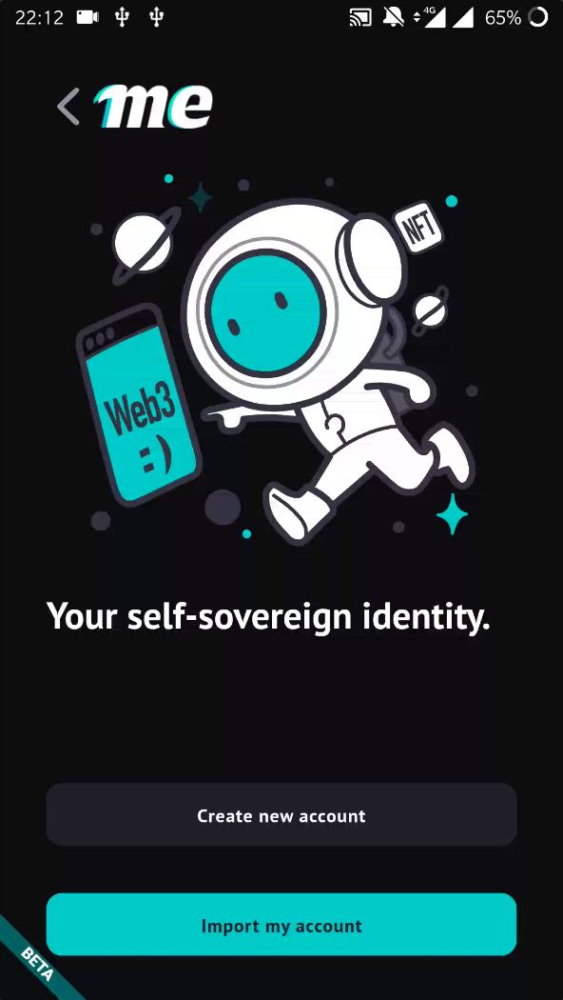

### Step 2: 输入用户名

用户名是 ME 里唯一的标识符。设置用户名时请不要与您的其他应用软件的用户名雷同；用户名长度为 6-30 位，支持字母(a-z)、数字(0-9)，也可以使用“.”符号。

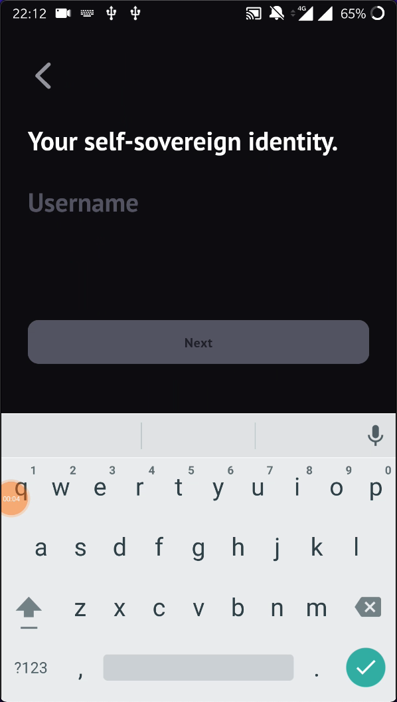

### Step 3: 等待注册完毕

页面会显示注册过程，请耐心等待流程完成。

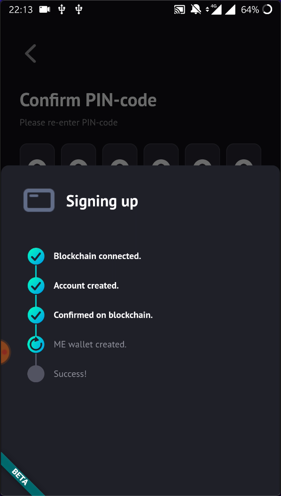

### Step 4: 注册完成

恭喜！您已经创建了ME账号。

！[step 4](./img/signup-04.jpg)

### 短语备份

这是可选的，但如果您是 ME 的新用户，我们强烈建议您备份恢复短语。恢复短语可以在“设置”页面中备份。请记住，用户名 + 恢复短语是您在失去所有设备访问权限后恢复帐户的唯一方法。请将其安全保存，除了您之外，没有其他人可以访问它。

:::note
恢复短语与其他区块链上的种子短语不同。它只是恢复的一种方法。因此，如果您忘记了之前备份的恢复短语，可以重置为新的恢复短语。
:::

## 多链钱包

对于新用户，当您完成创建钱包后，您现在应该拥有一个功能完整的多链钱包。

对于老用户，当您更新到最新版本时，您需要升级到多链钱包。

点击顶部的网络名称，然后选择另一个网络。

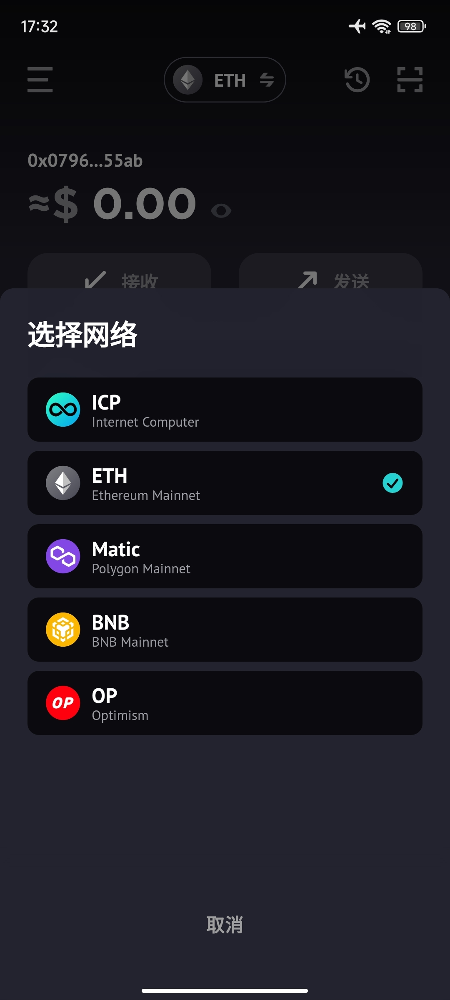

## 发送 ICP

您可以发送和接收 ICP、ETH、Matic、BNB、OP、ARB 以及其他 ERC-20 代币。

### Step 1: 单击`发送`按钮

:::note
如果您更改登录ME的方式或使用未与II Anchor同步的设备登录ME，将要求您进行验证
:::

### Step 2: 输入交易信息

输入您要发送 ICP 的钱包地址。您也可以扫描钱包地址二维码填写地址框。然后您可以输入要发送的 ICP 数量。

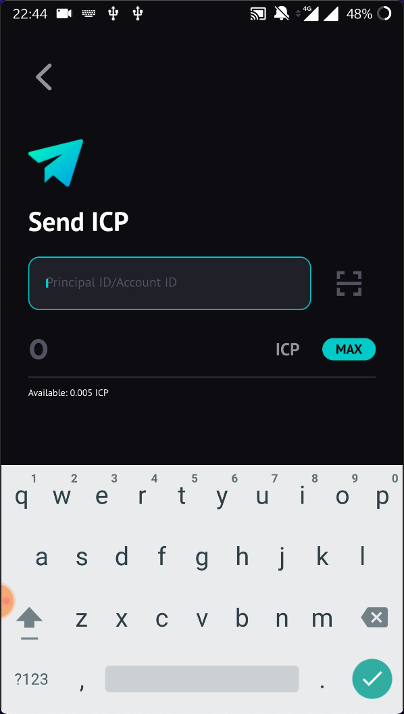

### Step 3: 确认交易

阅读交易详情并确认。

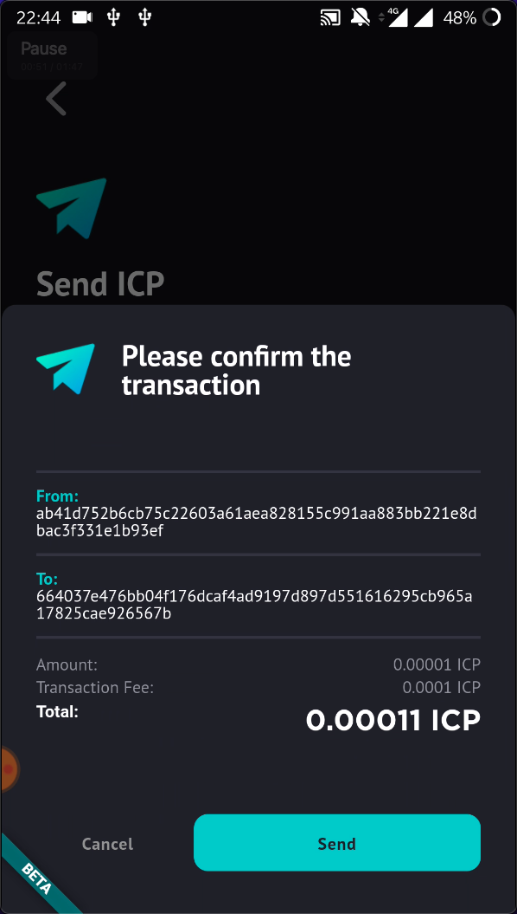

### Step 4: 成功

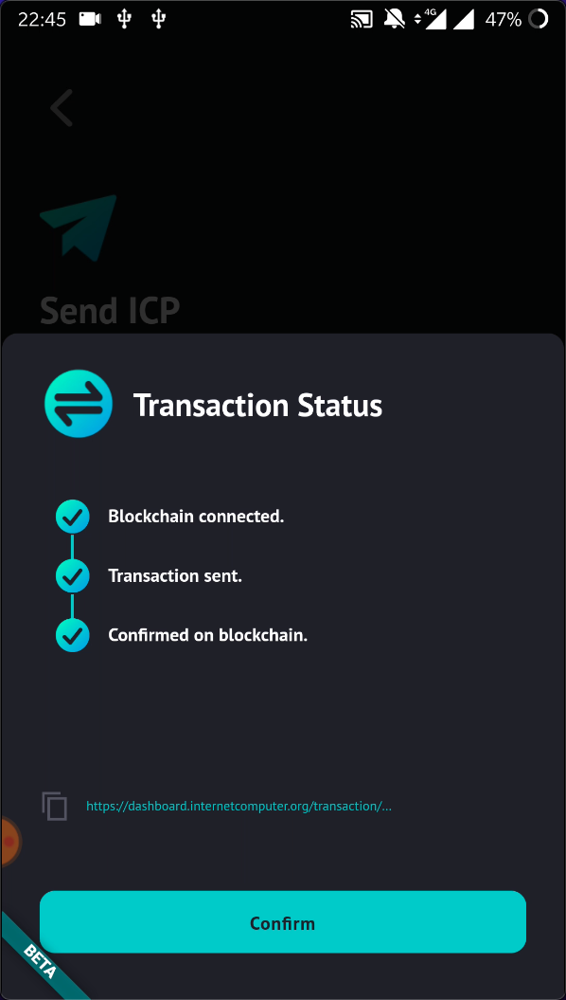

## 接收 ICP

单击“接收”按钮，将显示钱包地址。您可以复制地址或将二维码提供给其他将向您发送 ICP 的用户。

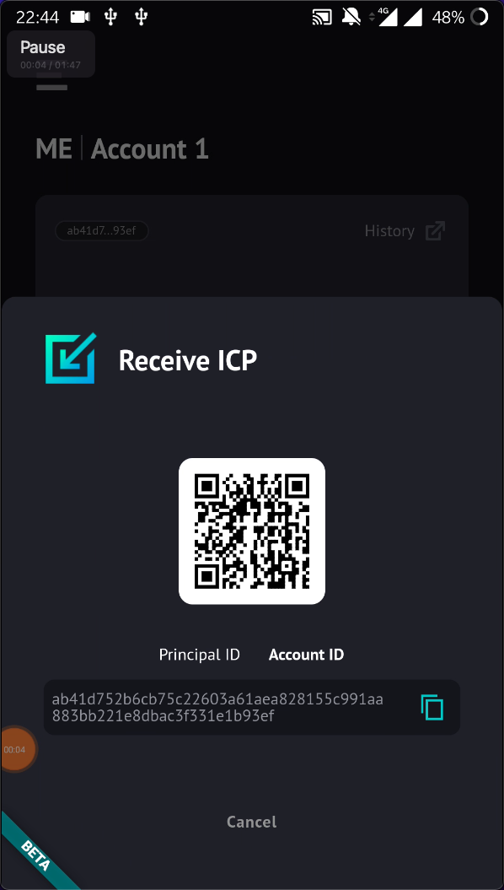

## 连接 NNS 钱包

DFINITY 团队开发了一个 NNS 钱包，让 IC 上的用户可以转移他们的 ICP 代币并质押 ICP。每个 Internet Identity anchor 可以创建一个 NNS 钱包。

作为 IC 世界中的重要参与者，我们希望为用户提供更好的体验，以使用 NNS 功能。我们付出了努力，现在很高兴地宣布 ME 允许用户连接到他们的 NNS 钱包并直接发送 ICP。

连接 NNS 钱包的功能由 `Settings -> Experiments` 页面上的一个开关控制。在继续操作之前，请先将其打开。

让我们一起来看看如何操作：

连接一个新的 NNS 钱包

### Step 1: 打开钱包列表

请点击`添加 NNS 钱包`按钮。您将需要阅读安全提示。当您确认能自担风险并希望通过 ME 管理 NNS 钱包才继续操作。

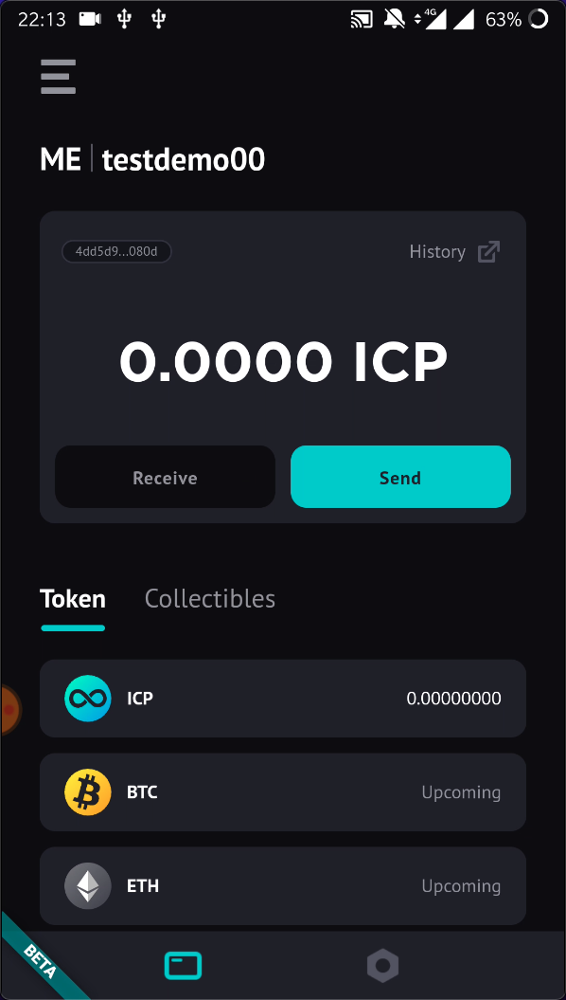

### Step 2: 连接 II 身份锚

在连接 NNS 钱包之前，您需要连接 II 身份锚。如果您想取消连接 II 身份锚，可前往https://identity.ic0.app 删除通过 ME 添加的设备。

#### Step 2.1: 单击`连接`

继续输入II身份锚。

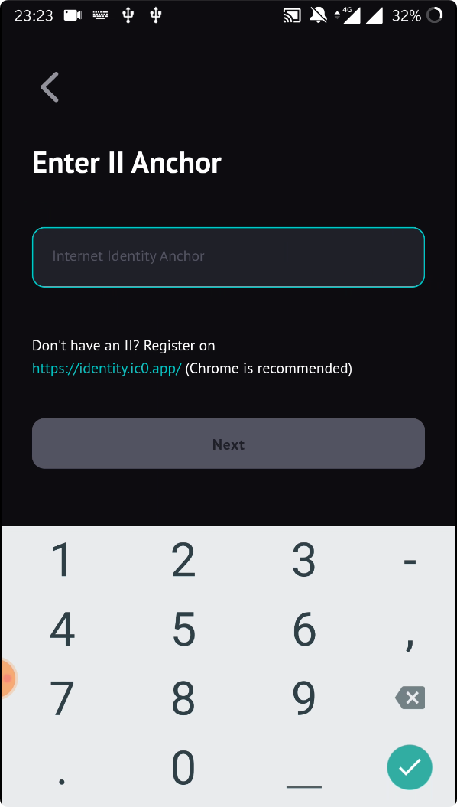

#### Step 2.2: 按照说明进行操作

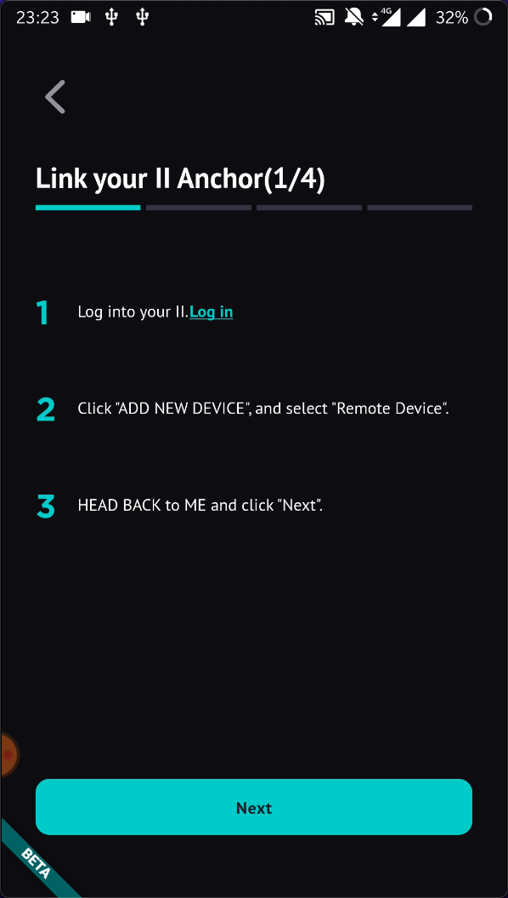

登录您的 II 身份

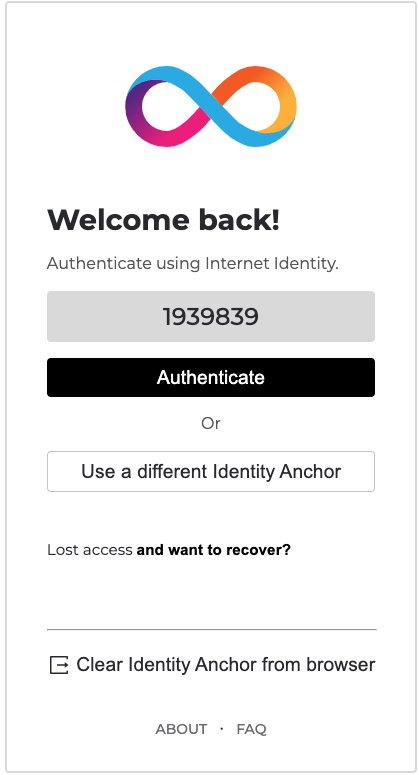

点击`添加新设备`并选择`远程设备`。

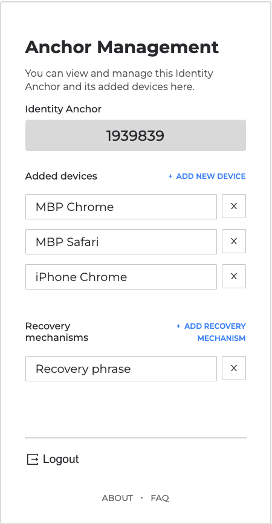
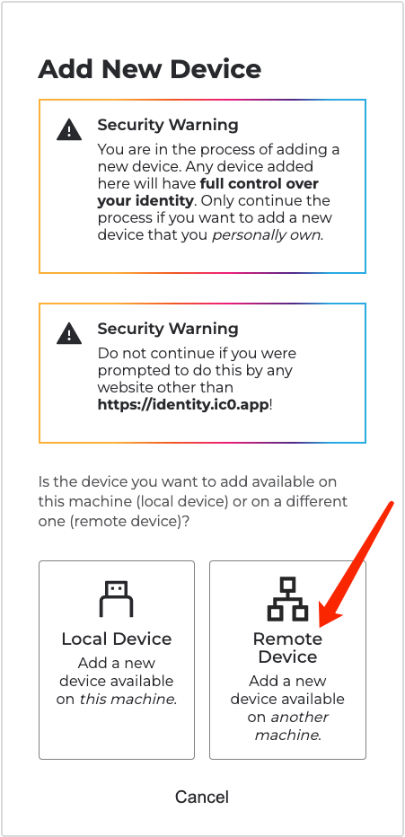

回到 ME 并点击“下一步”。

:::note
选择`远程设备`后，当页面变化显示一些说明时，您可以返回 to ME 页面。请忽略它。只需返回 ME 并单击`下一步`。
:::

#### Step 2.3: 输入设备名称

输入您要连接的 II 锚 并命名您的 要添加到 II 锚 的新设备。

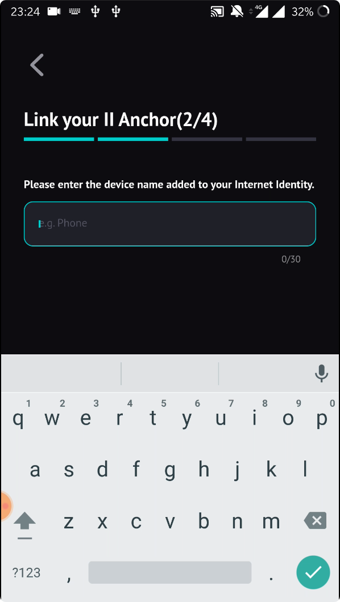

#### Step 2.4: 复制验证码

等待验证码，如果出现则复制。

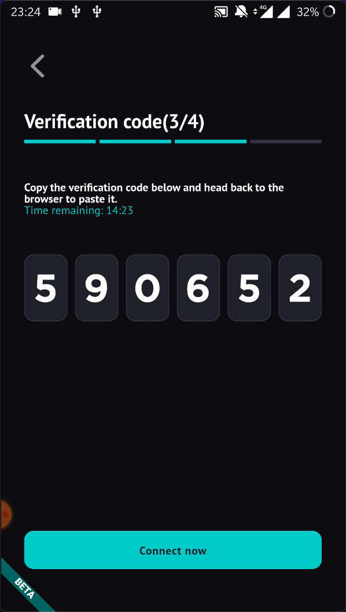

#### Step 2.5: 粘贴代码

前往 II 页面并粘贴代码。

### Step 3: 成功

现在 NNS 连接成功，您可以使用 NNS 钱包通过 ME App 发送或接收 ICP。

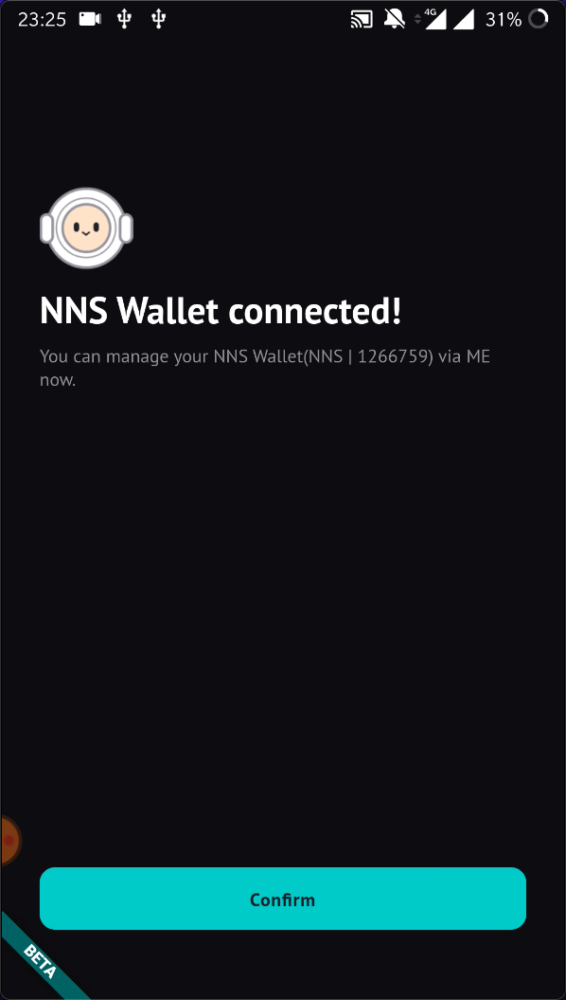

## 断开 NNS 钱包

### Step 1: 转到钱包列表

单击`...`按钮，然后单击`断开连接`按钮。

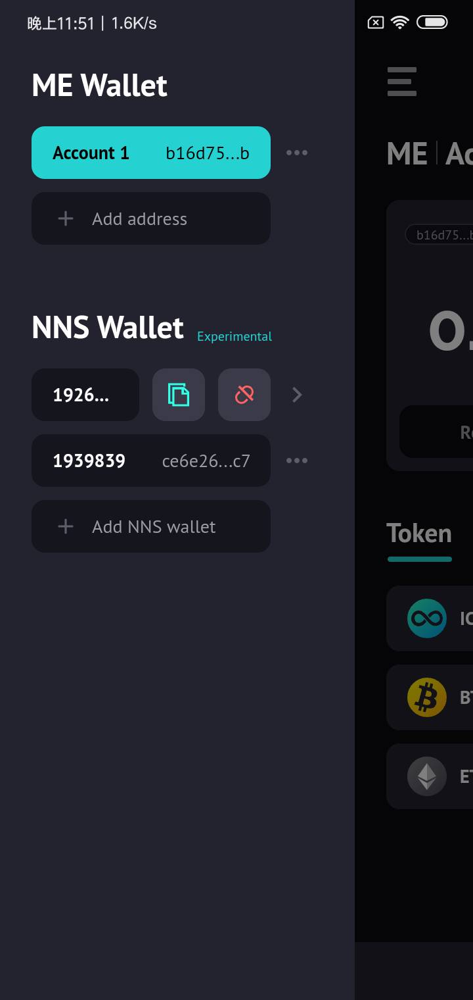

### Step 2: 确认断开连接

这可能需要几秒钟才能完成。

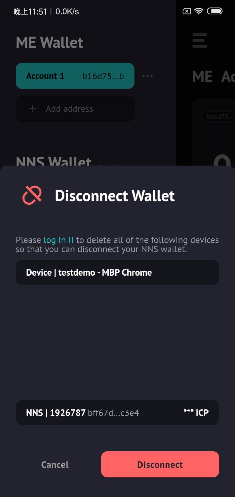

## 添加设备

您也可以通过 ME 将设备添加到您的帐户。

:::caution
如果您仅将 ME 添加到一台设备，而您丢失了该设备，您将被锁定
:::

:::tip
我们建议将多个设备和备份助记词添加到您的身份
:::

假设您当前已登录，我们将逐步介绍如何完成。

### Step 1: 单击`添加设备`按钮

转到`设置 -> 安全 -> 设备管理`，然后单击底部的`添加设备`按钮。

### Step 2: 选择设备类型

选择您要添加的设备类型。 `ME App`是指添加安装在另一部手机上的 ME App。 `生物识别设备`是指添加其他具有指纹/面部/虹膜方法的设备。

### Step 3: 添加生物识别设备的过程

我们以添加生物识别设备为例。请按照说明先在生物识别设备上进行操作。

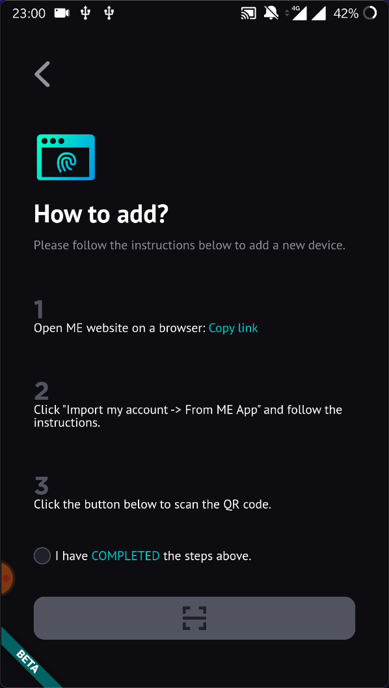

继续使用原来的 ME 应用程序。

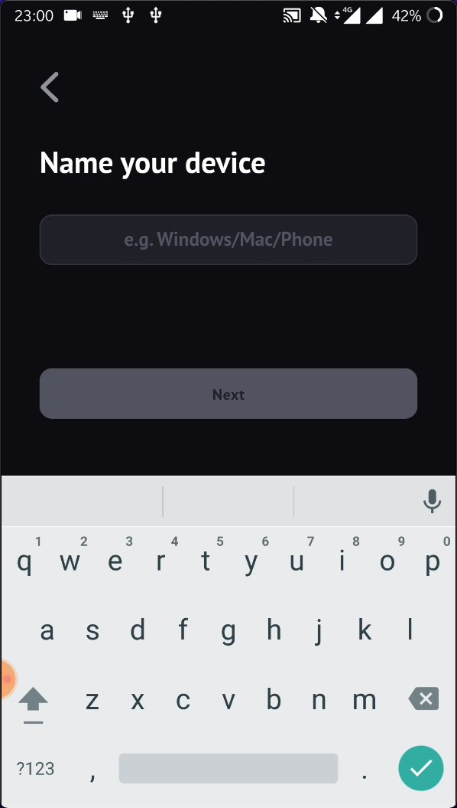

### Step 4: 成功

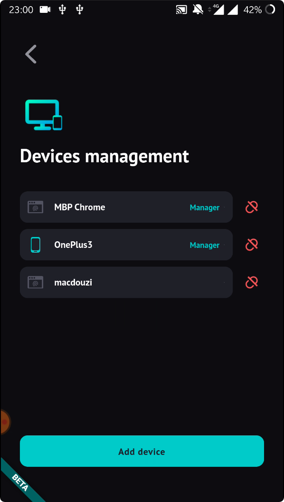

## 删除设备

### Step 1: 单击`删除`按钮

:::note
请确保 ME 具有`设备管理员`角色。否则不允许 ME 删除任何设备。
:::

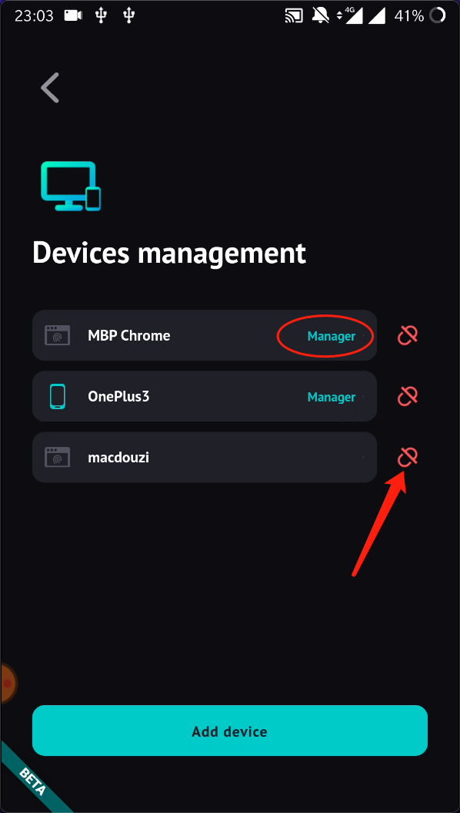

### Step 2: 最后一个设备？助记词？

如果它是最后一个设备，ME App 会要求您确认删除，如果您没有，则备份助记词。

:::caution
如果您要断开最后一个设备，请确保您已备份您的助记词。
:::

:::danger
如果您没有助记词并删除最后一个设备，您将无法再次登录 ME。因此，我们强烈建议您备份它，因为这是恢复您的帐户的唯一方法。
:::

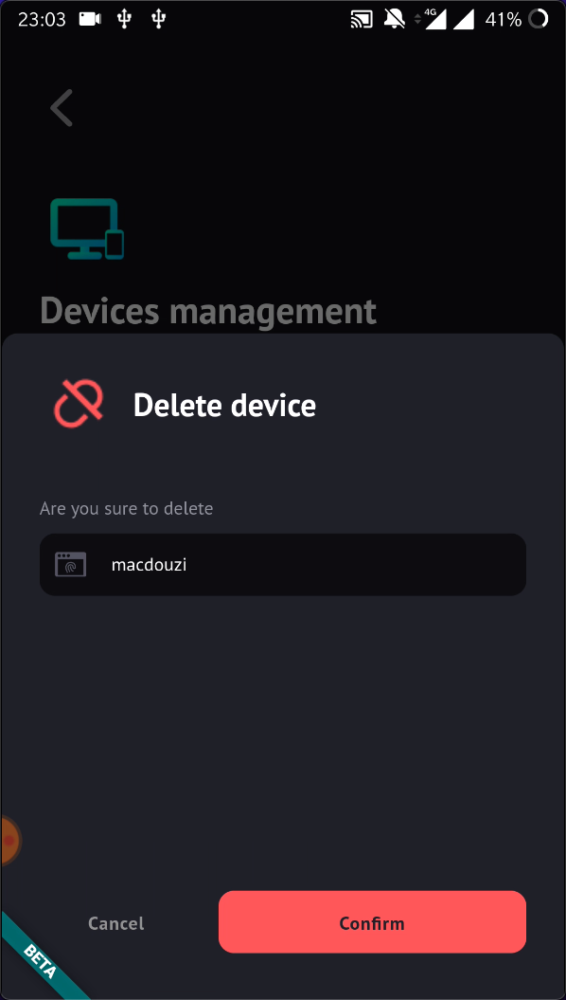

### Step 3: 设备已删除

经过几个必要的确认步骤后，设备将被删除。该列表将在几秒钟后刷新。

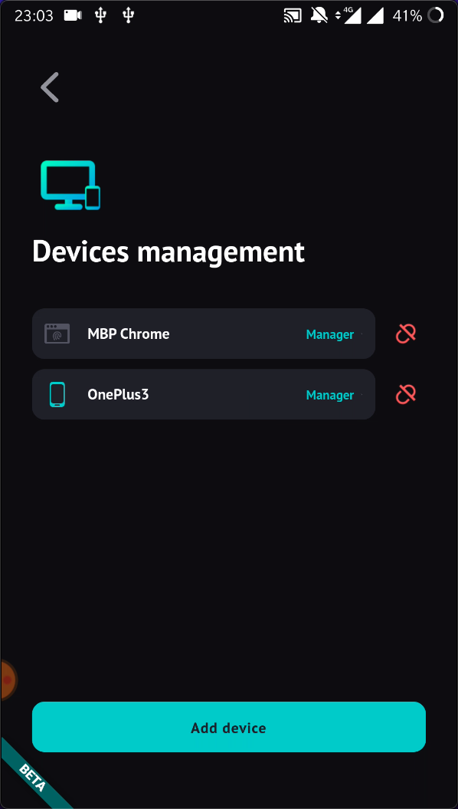

## 设备权限

我们认为每个设备都拥有相同的权限是不够安全的。例如，如果有人偷了您的手机并设法登录您的帐户，即使他没有助记词，他也可以删除您之前添加的所有设备并添加自己的设备。

因此，我们提供了一项新功能，您可以为每台设备设置不同的权限。

`设备管理器`：您可以添加或删除设备以及验证操作。

`验证者`：只能对登录、交易、授权参与活动等操作进行认证。

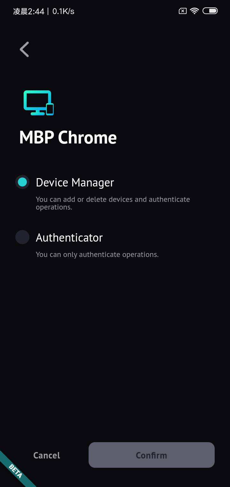

:::tip
您应该拥有至少一个具有`设备管理员`角色的设备。只能在具有`设备管理员`角色的设备上更改设备权限。

如果您不想备份助记词，我们建议大家在您的帐户中添加更多设备，并设置两台具有`设备管理员`角色的设备。

例如，一个 ME 和一台电脑可以设置为`设备管理器`。而对于其他设备或一些公共设备，您可以将其设置为`验证者`。一旦您发现任何一台设备存在风险，您可以登录 ME 或电脑立即删除。
:::

## 添加助记词

创建 ME 帐户时，系统会提示您备份助记词作为恢复机制。

您可以随时选择执行此操作，但请注意：

:::caution
如果您不再有权访问授权设备，则需要使用助记词来恢复身份。没有它，您将被锁定在任何需要 ME 登录的 DApp 之外。
:::

如果您设置了助记词，则可以重新获得对您身份的访问权限。一个助记词由 24 个英文单词组成。

:::danger
切勿透露或丢失助记词。任何知道您的用户名及助记词的人都可以完全访问您的身份。

您只能在备份时阅读助记词。这是恢复您的帐户的唯一方法。因此，我们建议您尽快仔细地备份您的助记词。
:::

:::note
助记词与其他钱包的助记词不同。这只是恢复 ME 的一种方法。因此，它可以被删除和重新生成。
:::

请按照以下说明备份您的助记词。

### Step 1: 添加助记词

可以前往访问`设置 -> 安全 -> 助记词管理`页面。

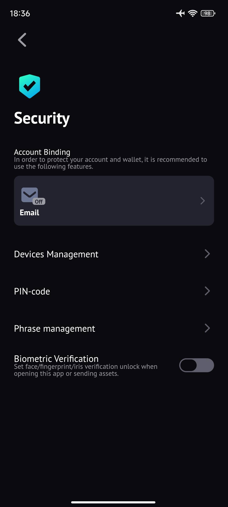

### Step 2: 点击`立即备份`

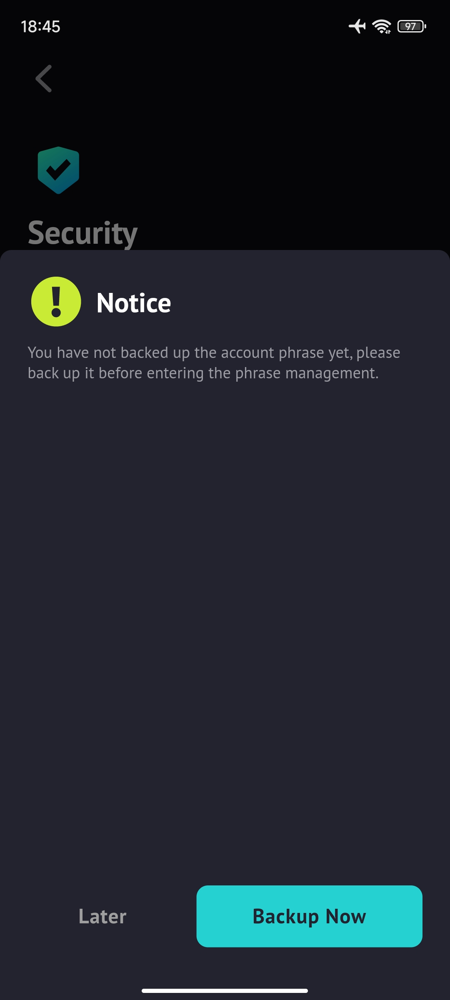

### Step 3: 备份

:::tip
我们建议将用户名及助记词写在纸上并妥善保管。
:::

您可以复制助记词并将其粘贴到只有您可以访问的位置。

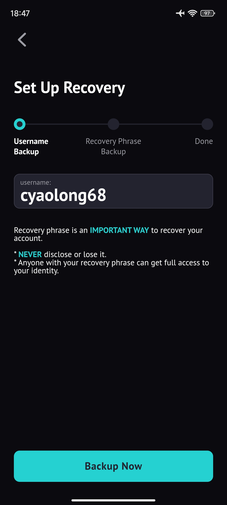

## 重置助记词

助记词是一种检索您的帐户的方法。它与其他区块链钱包的助记词不同。您可以随时删除并重新生成助记词。

### Step 1: 转到`安全性`

请前往`设置 -> 安全性 -> 短语管理`以访问短语备份选项。您可以备份两种类型的短语：一个用于您的 ME 账户，另一个用于其他链上的钱包。

对于钱包短语，您可以将其导入到其他以太坊和 EVM 钱包中，如 MetaMask、imToken、Rainbow等。

### Step 2: 单击`重置`按钮

该过程与添加助记词相同。

## 使用助记词恢复账号

只要您有助记词，您就可以随时恢复 ME 帐户。

请按照以下说明恢复您的帐户。

### Step 1: 进入恢复流程

如果您是初次使用 ME 时想要导入帐户，可以选择`导入我的帐户 -> 助记词`。

如果您想通过导入添加帐户，请进入`设置 -> 帐户`页面，然后单击`添加帐户 -> 导入我的帐户`按钮。

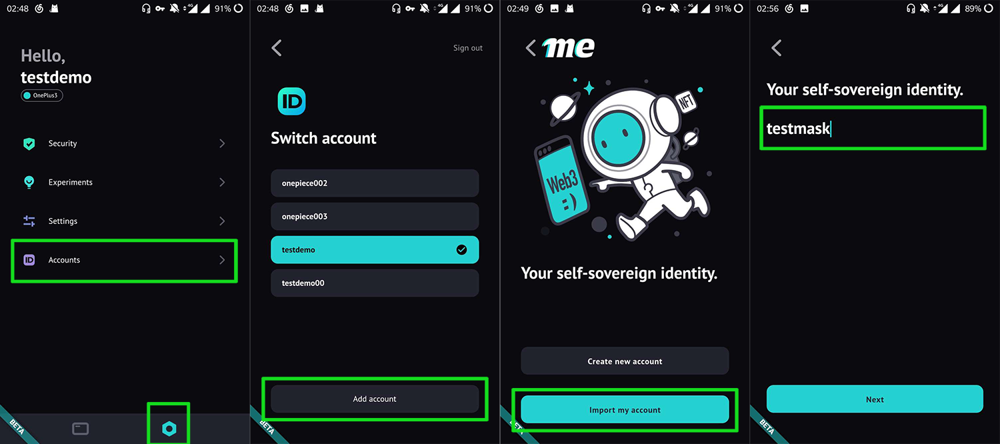

### Step 2: 输入用户名

输入您的用户名并选择`助记词`。

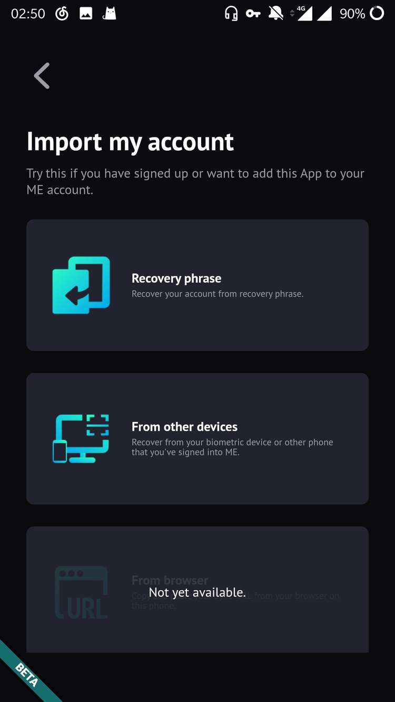

### Step 3: 输入助记词

输入与刚才输入的用户名对应的助记词。

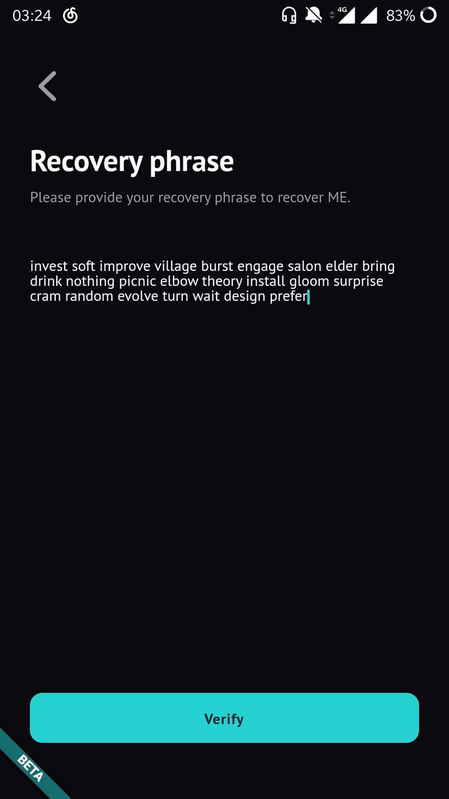

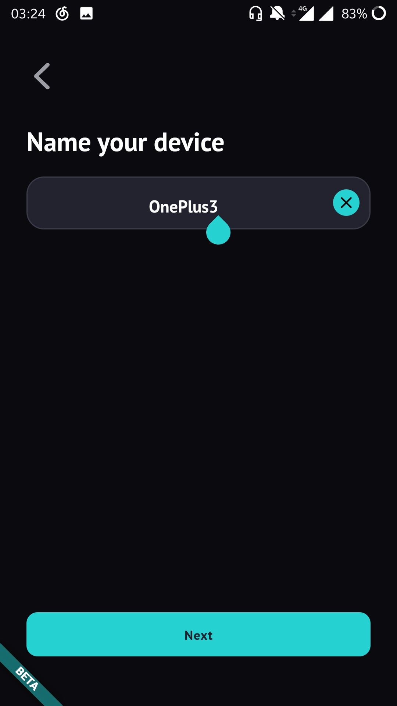

### Step 4: 成功

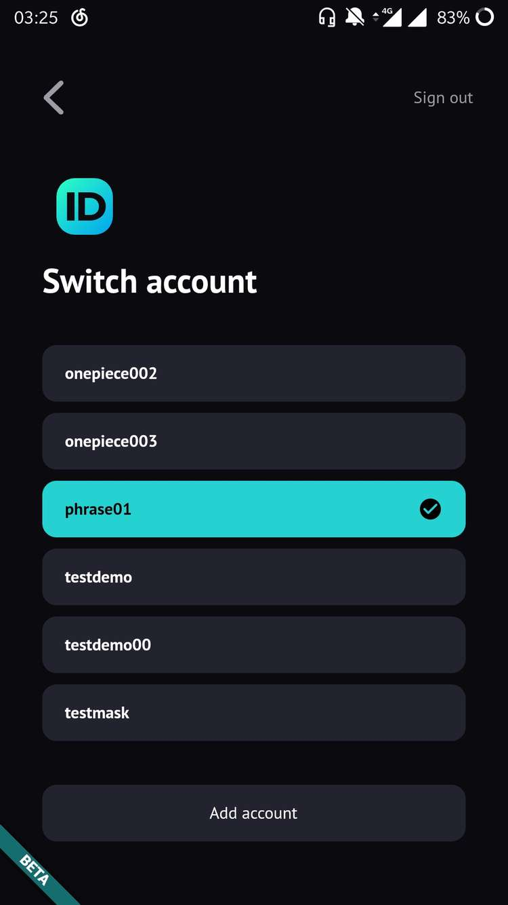

## 从其他设备恢复账号

您可以从另一个 ME 应用程序或生物识别设备将 ME 帐户恢复到您的 ME 应用程序，您可以在没有助记词的情况下登录 ME 帐户。在某种程度上，我们认为这比每次失去对 ME 帐户的访问权限时都输入助记词要安全得多。

请按照以下说明恢复您的帐户。

### Step 1: 进入恢复流程

进入“设置 -> 账户”页面并点击“添加账户 -> 导入我的账户”按钮。

### Step 2: 按照说明进行操作

按照页面中的说明进行操作。完成后单击“扫描”按钮。

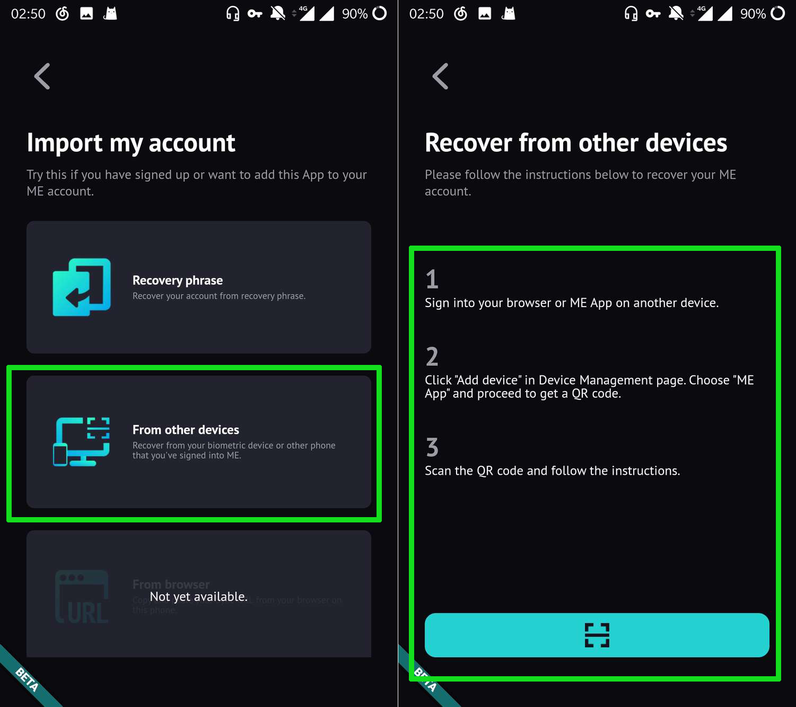

### Step 3: 扫描二维码

扫描另一台设备上显示的二维码。有3-5个二维码需要扫描，请拿稳手机。如果ME App无法识别二维码，请对准二维码并尝试前后移动。

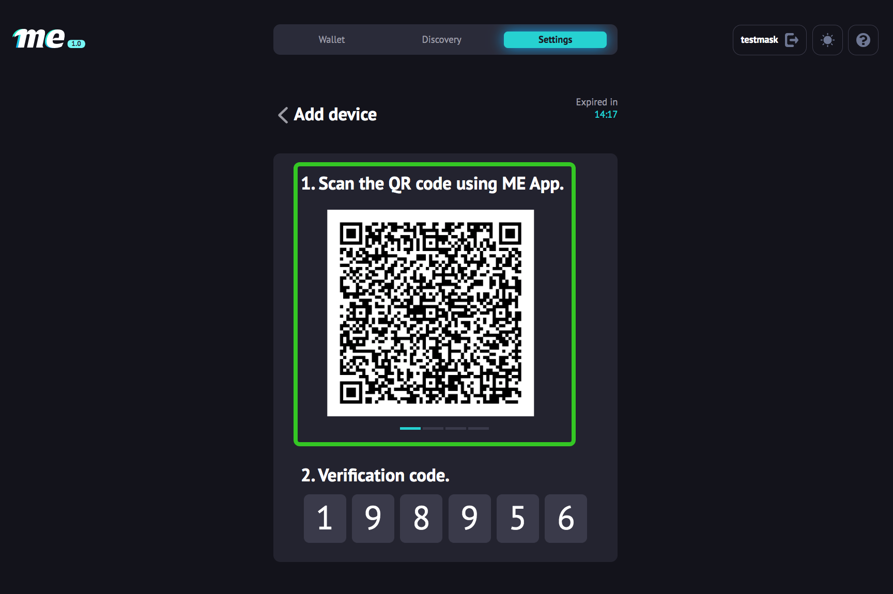

### Step 4: 验证

输入一次性密码和验证码进行验证。

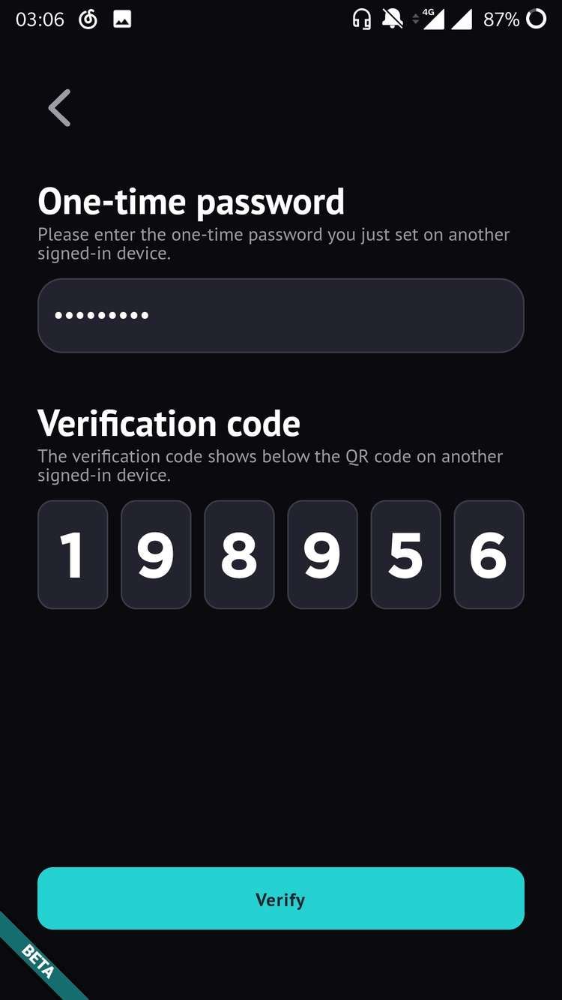

### Step 5: 设置 PIN 码

为您的新 ME 应用程序设置一个 PIN 码，然后再次输入以确认。

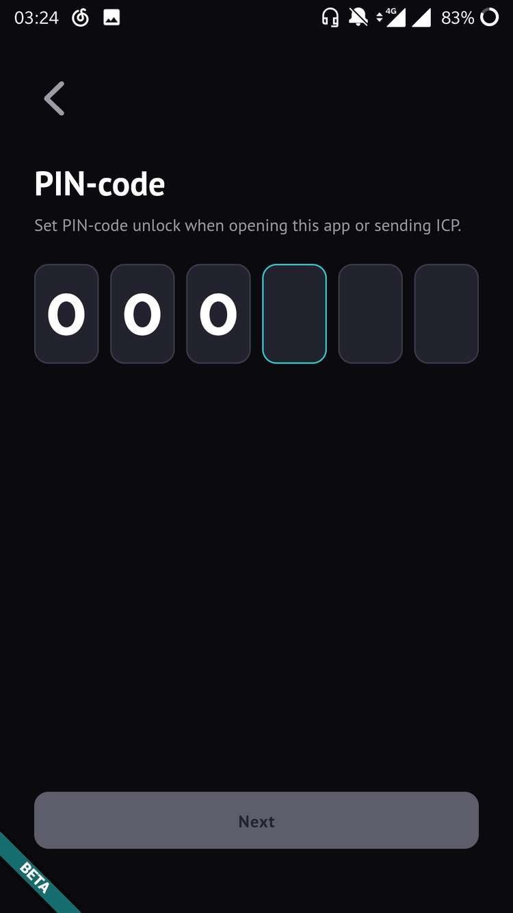

### Step 6: 成功

## 独特优势

- 支持多条链，包括以太坊、Polygon、BNB Chain 和 Optimism
- 支持以太坊和 EVM 上的 ERC-20 代币，以及 ICP 上的多个代币和收藏品标准，例如ICRC-1、EXT、DIP、CCC 和 GIGA
- 使用 Google 帐户和易记的用户名进行注册和登录
- 与多个设备（例如台式计算机和智能手机）进行安全连接
- 种子短语不是唯一的恢复方法
- 使用计算机和手机进行生物识别登录
- 支持在 ME 钱包中登录活动和 DApp
- 使用 Metamask 在网站上登录以太坊

## 代币

- AstroX ME 尚未发币

## 联系

团队
- https://astrox.network/
- https://twitter.com/AstroX_Network
- https://linktr.ee/astrox_official
- https://github.com/AstroxNetwork
- https://t.me/astrox_networke
- https://discord.com/invite/HpP5mvwJT2

产品
- https://twitter.com/me_wallet_
- https://astrox.me/

## 问题

如果暂时没有得到 AstroX 团队的回应，您也可以在 [ICP China 的 Twitter Community](https://twitter.com/i/communities/1679302895571988481) 上提问，DFINITY 亚太团队会尽快把您的问题反馈给 AstroX 团队，或者邀请社区里的深度用户来一起解答。

:::tip
[官方 FAQ](https://astroxnetwork.github.io/me_docs/docs/1.4.0/intro/)
:::

:::info
[官方使用教程](https://astroxnetwork.github.io/me_docs/zh-CN/docs/1.4.0/category/tutorials)
:::

欢迎所有喜爱 AstroX ME 的用户提交 PR，一起来补充这个 AstroX ME 的攻略！点击 `Edit this page` 即可。

<Dapp />