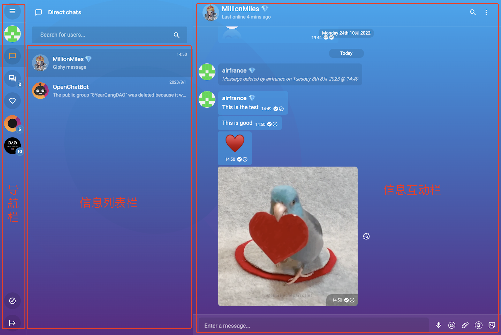
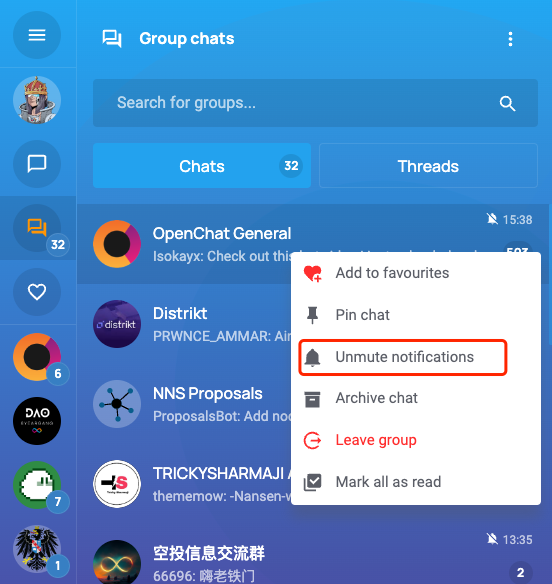
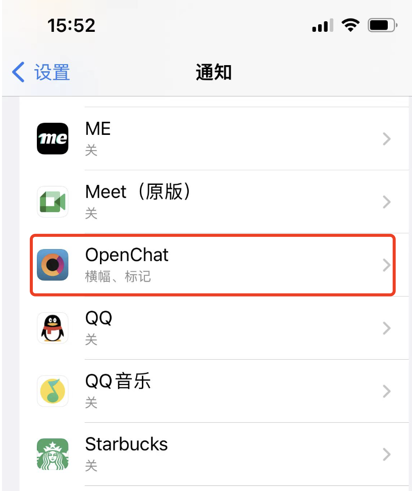

# 如何使用 Openchat

## Openchat是什么？

+ [Openchat](https://oc.app/?ref=unz26-uyaaa-aaaaf-aaswq-cai)是基于Internet Computer区块链的端到端的全功能聊天平台
    + 100%链上：所有用户及群组数据都100%存储在链上
    + DAO控制：产品路线图只能由DAO决定和批准
    + 开源：所有代码都进行开源，任何人都可以验证代码的真实性
    + 可扩展：基于Canister的软件架构决定了系统可以依赖IC进行无限扩展
    + 安全：基于IC技术的高级区块链技术确保信息的安全性
    + 可信赖：基于每个Canister的复制性你不用担心数据丢失
+ 简单介绍Openchat背后的团队
  + Openchat团队由Matt,Hamish及Julian三人的英国小团队创办，他们三人都在分布式系统开发和软件技术方面具有非常丰富的经验。
+ 在哪里可以联系到团队
  + 你可以随时加入Openchat,加入Openchat社区联系他们

## Openchat的主要功能

- Openchat是基于响应式页面RWD开发的社交平台，因此能够适应任何尺寸的移动设备和桌面设备
- 用户可以创建公开和私有的群组及社区，并且可以对群和社区的权限做详细的控制
- 通过"探索社区"来加入你感兴趣的组织，或者你也可以通过搜索关键词来找到他们
- 你可以配置你的个人信息页，管理你的加密账号以及存储空间等信息
- 你可以发送文字，表情符，图片，视频/gif，语音以及加密货币，甚至你还可以发起投票，让大众参与调查
- 你可以通过在NNS设置hotkey来允许你在Openchat进行治理提案投票

## Openchat的独特之处

+ 独特的竞争优势
  + Openchat是核心代码是100%链上的，相较其他SocialFi，传统基于AWS的应用很难做到真正的去中心化
  + Openchat支持ICP,ckBTC等代币通过消息形式在好友之间发送转移，未来将支持ETH等所有ERC20代币的发送
  + Openchat具有通过FT/NFT控制访问的功能，这对于SocialFI平台是巨大的产品运营优势
  + Openchat用户的所有数据都在链上归用户所有，完全不用担心数据丢失，这是其他平台做不到的
+ 为什么对中国用户有吸引力
  + 不需要翻墙
  + 没有言论审查，可以畅所欲言
  + 建群的人数没有限制。最大的华人群已达1万人以上。对于需要运营私域流量的个人和公司，极大地提升了管理效率
  + 可以在用户之间直接发区块链代币红包，符合中国人日常交际行为
  + 在分享链接的时候可以直接预览网页，分享内容的效果和效率远超微信
  + 不需要下载App，不受不同国家的App Store下载的限制。只要有手机浏览器就行
  + 管理群组的时候可以设置多项管理员功能，譬如多个管理员，浏览历史谈话等等
+ 对什么样的用户最有吸引力
  + 希望言论自由，相信拥抱区块链技术的用户
  + 希望能够建立不断成长的社区，并能够进行有效管理的平台
  + 希望通过ICP生态建立关系网的用户

## 如何使用Openchat

+ 访问网页[Openchat](https://oc.app/?ref=unz26-uyaaa-aaaaf-aaswq-cai) 点击Launch App即可，无需安装其他任何软件，即可运行（要求浏览器
+ 注册用户
  + Openchat目前仅支持Internet Identity(简称II)登录，如果你没有注册过，请参考[注册互联网身份](https://ic123.xyz/docs/ic-web3/register-internet-identity)
    + 有了II，即可在本设备登录Openchat
    + 如需在其他设备登录，需通过II对该设备进行授权后即可在多设备进入Openchat
+ 使用方法
  + 主界面讲解
  
    + 导航栏
      + 私聊：你可以通过点击私聊查看所有的私聊信息
      + 群聊：你可以通过点击群聊查看所有群聊或者频道
      + 关注：你可以通过点击关注查看所有你关注的群聊或者频道或者个人
      + 社区：你可以通过点击社区查看社区的信息
    + 消息列表栏
      + 展示所有私聊或者群聊或者频道内容
    + 信息为互动栏
      + 你可以在这里查看私聊或者群聊或者频道内的所有信息
      + 通过发送文字，图片，表情等信息进行社交互动
  + 创建群聊
    + 点击导航栏的群聊
      + 
    + 在消息列表栏的Option选项里点击创建群聊
      + 
    + 填写群聊名称，设置群规，访问控制等
    + 点击创建群聊即可
  + 创建社区
    + 
    + 当你创建群聊后，点击点击群聊互动栏的Option选项，选择"Convert to Community"即可将现有群转换成社区
+ 创建Openchat桌面图标（iOS)
  + 打开手机Safari浏览器
    + 访问[Openchat](https://oc.app/)
  + 点击底部分享按钮
    + 
  + 命名图标名称后即可在桌面从创建Openchat访问图标，如同其他APP一样使用
+ 启动/关闭通知
  + 通过开启和关闭通知来自定义通知信息,避免群聊的信息过载 
    + 
  + 可以通过在手机里设置打开Openchat的通知来获取系统级消息通知
    + 

