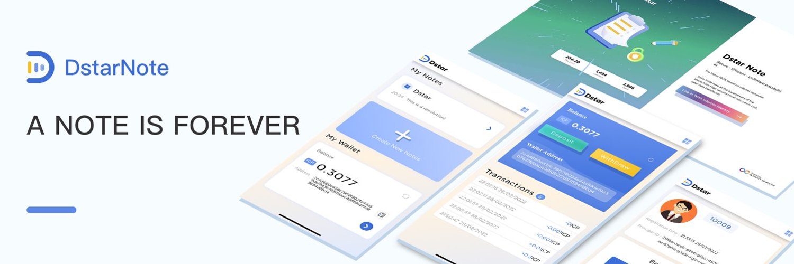

# 如何使用 Dstar Notes

## XXX是什么？

- 一句话介绍XXX是一个什么样的应用，为什么样的人服务，可以做什么
- 简单介绍XXX背后的团队
- 在哪里可以联系到团队

## XXX的主要功能

- 功能 1
- 功能 2
- 功能 3
- 功能 x

## XXX的独特之处

- 针对竞品的分析
- 为什么对用户有吸引力
- 对什么样的用户最有吸引力
- 独特的竞争优势

## 如何使用XXX

- 安装、下载
- 注册用户
- 使用方法

:::info

有用信息

:::

:::note

注意事项

:::

:::tip

使用贴士

:::

:::caution

需要小心的地方

:::

:::danger

危险区域！

:::
