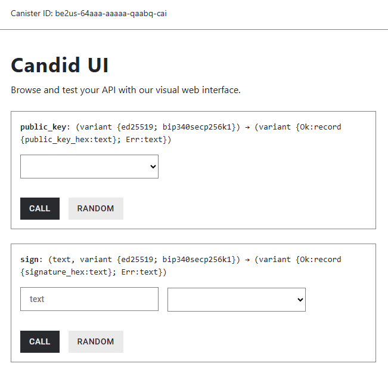
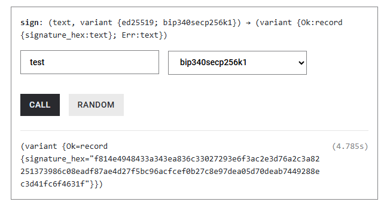

import TeamContact from '../../contact.md';

# 门限 Schnorr 签名


## 概览 {#overview}

本教程提供了一个最小的容器智能合约、用于展示[门限 Schnorr](https://internetcomputer.org/docs/current/developer-docs/smart-contracts/signatures/t-schnorr) 的相关接口。

该示例容器使用基于容器 ID 和所选算法（BIP340 或 Ed25519）派生的密钥来创建 Schnorr 签名。具体包括：

- 示例容器接收到包含消息和算法 ID 的请求；  
- 示例容器使用密钥派生字符串作为派生路径；  
- 示例容器根据上述信息向门限 Schnorr 子网请求签名（门限 Schnorr 子网是生成门限 Schnorr 签名的子网）。

本教程提供了完整的开发介绍：从下载 IC SDK 开始直到在 IC 主网上部署代码。其中重点介绍 [Motoko](https://internetcomputer.org/docs/current/developer-docs/backend/motoko/) 编程语言编写的[版本](https://github.com/dfinity/examples/tree/master/motoko/threshold-schnorr)，同时也提供了 Rust [版本](https://github.com/dfinity/examples/tree/master/rust/threshold-schnorr)以供参考。

## 要求 {#prerequisites}

- 下载并安装 [IC SDK](https://ic123.xyz/docs/getting-started/install-dfx/)。  
  如果您想要在本地开发环境进行测试，dfx 的版本不低于 `0.22.0-beta.0`。
- 下载[示例仓库](https://github.com/dfinity/examples)。 

## 开始 {#get-started}

在示例仓库中，`threshold-schnorr` 的示例代码有 [Motoko](https://github.com/dfinity/examples/tree/master/motoko/threshold-schnorr) 和 [Rust](https://github.com/dfinity/examples/tree/master/rust/threshold-schnorr) 两个版本。

### 本地部署并测试 {#deploy-locally}

本教程使用 [Motoko](https://github.com/dfinity/examples/tree/master/motoko/threshold-schnorr) 版本的进行演示。在完成 Clone [示例仓库](https://github.com/dfinity/examples)之后，执行如下命令：

```bash
cd examples/motoko/threshold-schnorr
dfx start --background
dfx deploy
```

其中：
- `dfx start --background` 会在本地后台启动一个 IC 的运行实例。
- `dfx deploy` 将会编译 `threshold-schnorr` 工程、并将容器部署到 IC 本地的运行实例。

如果成功，您会在命令行看到类似如下的输入：

```bash
Deployed canisters.
URLs:
  Backend canister via Candid interface:
    schnorr_example_motoko: http://127.0.0.1:4943/?canisterId=br5f7-7uaaa-aaaaa-qaaca-cai&id=be2us-64aaa-aaaaa-qaabq-cai
```

如果您在浏览器中打开上述的 URL，您将会看到一个如下图所示的界面，它展示了容器所实现的 `public_key` 和 `sign` 方法。



## IC 主网部署 {#ic-mainnet-deployment}

在将容器部署到 IC 主网之前，您需要完成以下两件事情：

- 获取 cycles。  
  您可以参考[如何获取 cycles](https://ic123.xyz/docs/getting-started/get-cycles/) 来从 cycles 水龙头获取免费 cycles。
- 更新示例代码中的 key ID。

### 修改代码 {#update-code}

在部署到 IC 主网之前，您需要修改 `src/schnorr_example_motoko/main.mo` 文件中的 `key_id` 的 `name` 属性。

关于 `key_id` 的 `name` 属性，有三个选项：

- `dfx_test_key`: 默认值，用来在本地 IC 的运行实例部署容器。
- `test_key_1`: 主测试秘钥，用于主网。
- `key_1`: 主生产秘钥，用于主网。

关于 `test_key_1` 和 `key_1` 的详细信息，请参考 [Schnorr 秘钥](https://internetcomputer.org/docs/current/references/t-sigs-how-it-works#threshold-keys)。

示例中 `src/ecdsa_example_motoko/main.mo` 的代码可直接部署到本地，它包含了如下两段代码：

```jsx
let { public_key } = await ic.schnorr_public_key({
  canister_id = null;
  derivation_path = [Principal.toBlob(caller)];
  key_id = { algorithm = algorithm_arg; name = "dfx_test_key" };
});
```

```jsx
let { signature } = await ic.sign_with_schnorr({
  message = Text.encodeUtf8(message_arg);
  derivation_path = [Principal.toBlob(caller)];
  key_id = { algorithm = algorithm_arg; name = "dfx_test_key" };
});
```

如果您需要部署到 IC 主网，则需要将以上两处 `key_id` 的 `dfx_test_key` 值根据您的意图替换为 `test_key_1` 或 `key_1`，而且它们必须一致。

### 部署到 IC 主网 {#deploy-to-ic-mainnet}

如果您从没有部署到 IC 主网，请参考 [Hello World](https://ic123.xyz/docs/getting-started/hello-world/) 示例。

部署到 IC 主网很简单，您只需在命令行执行：

```bash
dfx deploy --network ic
```

```bash
Deployed canisters.
URLs:
  Backend canister via Candid interface:
    schnorr_example_motoko: https://a4gq6-oaaaa-aaaab-qaa4q-cai.raw.icp0.io/?id=736w4-cyaaa-aaaal-qb3wq-cai
```

:::info
该容器的 Rust 实现（schnorr_example_rust）已经部署在主网上，可以通过Candid UI URL https://a4gq6-oaaaa-aaaab-qaa4q-cai.raw.icp0.io/?id=enb64-iaaaa-aaaap-ahnkq-cai 进行访问。
:::

## 获取公钥 {#obtain-public-key}

当您部署了容器之后会获得一个指向 Candid UI 的 URL，在这个页面您可以访问容器提供的公开方法。下图所示就是调用 `public_key` 方法：


该方法在选择 `bip340secp256k1` 算法时返回的公钥是 `02b818747853a0bb233be0dc4301edf6626c8d8626f3162b52980507f4bfe4bf64`。

### 代码分析 {#analyze-public-key}

如果您打开 [src/schnorr_example_motoko/main.mo](https://github.com/dfinity/examples/blob/master/motoko/threshold-schnorr/src/schnorr_example_motoko/main.mo)，如下的代码展示了如何获得一个 Schnorr 公钥。

```jsx
var ic : IC = actor ("aaaaa-aa");

  public shared ({ caller }) func public_key(algorithm_arg : SchnorrAlgorithm) : async {
    #Ok : { public_key_hex : Text };
    #Err : Text;
  } {
    try {
      let { public_key } = await ic.schnorr_public_key({
        canister_id = null;
        derivation_path = [Principal.toBlob(caller)];
        key_id = { algorithm = algorithm_arg; name = "dfx_test_key" };
      });
      #Ok({ public_key_hex = Hex.encode(Blob.toArray(public_key)) });
    } catch (err) {
      #Err(Error.message(err));
    };
  };
```

可以看到容器代码调用了 [IC 管理容器](https://internetcomputer.org/docs/current/references/ic-interface-spec/#ic-management-canister)的 `schnorr_public_key` 方法。

:::note
[IC 管理容器](https://internetcomputer.org/docs/current/references/ic-interface-spec/#ic-management-canister)遵循了[外观设计模式](https://en.wikipedia.org/wiki/Facade_pattern)，也就是说并没有一个真正意义上的容器存在，这种设计让其他容器能以人性化的方式调用 IC 系统 API（就好像存在一个真实的容器）。上面的代码示例使用了 IC 管理容器创建了一个 Schnorr 公钥。而 `let ic: IC = actor("aaaaa-aa")` 则声明了 IC 管理容器。
:::

### 容器根公钥 {#canister-root-public-key}

在调用 IC 管理容器的 `schnorr_public_key` 方法时，您可以将 `derivation_path` 设置为空来获取容器的根公钥。

### 秘钥派生 {#key-derivation}

在 BIP-32 密钥派生层次中，需要指定一个派生路径以获取容器根密钥下的公钥。一般来说，派生路径数组中的每个元素是一个以大端序编码的 4 个字节 32 位整数，或者是任意长度的字节数组。该元素用于在派生层次结构的相应级别中派生密钥。

在上面的示例代码中，我们使用从 `caller` 主体中提取的字节来填充 `derivation_path`，以便不同的调用者容器都能够通过调用的 `public_key` 方法的获取自己的公钥。

## 签名 {#sign}

计算门限 Schnorr 签名是此功能的核心。**容器本身不持有 Schnorr 密钥**，而是从专用子网持有的主密钥派生密钥。容器可以通过 IC 管理容器的接口 `sign_with_schnorr` 请求计算签名。该请求将会被路由到持有指定密钥的子网，并使用门限密码学来计算所请求的签名。这样就可以从共享密钥和请求容器的主体标识符中，来派生进一步派生所获得的密钥或容器根密钥。因此，容器只能请求为其容器根密钥或从其派生的密钥创建签名。这意味着容器“控制”着其私有的 Schnorr 密钥，因为它们决定何时使用它们创建签名、但本身不持有私有密钥。

下图所示就是在 Candid UI 页面调用 `sign` 方法：



该方法在选择 `bip340secp256k1` 算法时返回的签名是 `f814e4948433a343ea836c33027293e6f3ac2e3d76a2c3a82251373986c08eadf87ae4d27f5bc96acfcef0b27c8e97dea05d70deab7449288ec3d41fc6f4631f`。

### 代码分析 {#analyze-sign}

如下的代码展示了如何获得一个 Schnorr 签名。

```jsx
  public shared ({ caller }) func sign(message_arg : Text, algorithm_arg : SchnorrAlgorithm) : async {
    #Ok : { signature_hex : Text };
    #Err : Text;
  } {
    try {
      Cycles.add(25_000_000_000);
      let { signature } = await ic.sign_with_schnorr({
        message = Text.encodeUtf8(message_arg);
        derivation_path = [Principal.toBlob(caller)];
        key_id = { algorithm = algorithm_arg; name = "dfx_test_key" };
      });
      #Ok({ signature_hex = Hex.encode(Blob.toArray(signature)) });
    } catch (err) {
      #Err(Error.message(err));
    };
  };
```

同样，容器调用了 [IC 管理容器](https://internetcomputer.org/docs/current/references/ic-interface-spec/#ic-management-canister)的 `sign_with_schnorr` 方法。

## 验证签名 {#verify-signature}

为了完整起见，本教程展示了如何使用相同容器和派生路径所对应的公钥来验证签名。请注意，与该示例的 Rust 版本相比，签名验证并不属于容器实现的一部分，而是在 Javascript 中进行的。

`Ed25519` 可以如下验证：

```jsx
import('@noble/curves/ed25519').then((ed25519) => { verify(ed25519.ed25519); })
  .catch((err) => { console.log(err) });

function verify(ed25519) {
  const test_sig = '1efa03b7b7f9077449a0f4b3114513f9c90ccf214166a8907c23d9c2bbbd0e0e6e630f67a93c1bd525b626120e86846909aedf4c58763ae8794bcef57401a301'
  const test_pubkey = '566d53caf990f5f096d151df70b2a75107fac6724cb61a9d6d2aa63e1496b003'
  const test_msg = Uint8Array.from(Buffer.from("hello", 'utf8'));

  console.log(ed25519.verify(test_sig, test_msg, test_pubkey));
  }
```

`BIP340` 可以如下验证：

```jsx
import('@noble/curves/secp256k1').then((bip340) => { verify(bip340.schnorr); })
  .catch((err) => { console.log(err) });

function verify(bip340) {
  const test_sig = '1b64ca7a7f02c76633954f320675267685b3b80560eb6a35cda20291ddefc709364e59585771c284e46264bfbb0620e23eb8fb274994f7a6f2fcbc8a9430e5d7';
  // the first byte of the BIP340 public key is truncated
  const pubkey = '0341d7cf39688e10b5f11f168ad0a9e790bcb429d7d486eab07d2c824b85821470'.substring(2)
  const test_msg = Uint8Array.from(Buffer.from("hello", 'utf8'));

  console.log(bip340.verify(test_sig, test_msg, test_pubkey));
}
```

借助支持 [BIP340](https://github.com/bitcoin/bips/blob/master/bip-0340.mediawiki#user-content-Messages_of_Arbitrary_Size) 中指定的任意消息长度的 `bip340secp256k1` 签名和 `ed25519` 签名的加密库，类似的验证可以在许多其他语言中完成。

## 总结 {#conclusion}

在本教程中，您部署了一个容器：
- 使用私有 Schnorr 密钥签名，而容器本身不持有 Schnorr 密钥。
- 请求公钥。
- 验证签名。

<TeamContact />