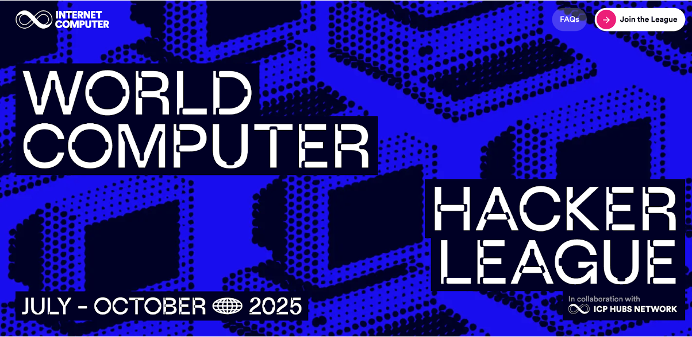
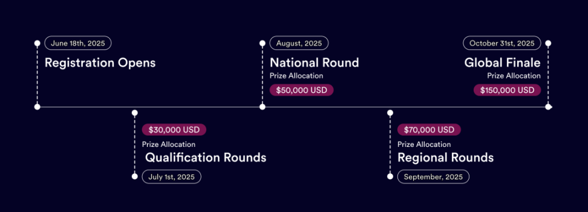

## 黑客松

全球最大规模的 ICP 黑客松联盟赛事 - World Computer Hacker League 2025（WCHL25）正式开启报名！

2025 世界计算机黑客联盟（WCHL）是由 ICP HUBS Network 牵头的一项全球黑客马拉松，该赛事旨在发现、培养和展示互联网计算机协议（ICP）生态系统中的顶尖开发者人才，在接下来的四个月里，该倡议将推动创新，扩大开发者社区，并支持具有影响力的应用程序。

从 2025 年 7 月到 10 月，横跨全球的黑客松大赛，将点燃开发者们的创新激情，助力打造下一代去中心化应用。

## 四个月，助你从想法到落地

在长达四个月的黑客松中，参赛者将设计并开发出基于 Internet Computer Protocol (ICP) 的完整功能性产品。这不仅仅是概念的展示，而是真正的 主网级 MVP 落地实战！

🏆 300,000 美金奖金池，四大赛段 🏆

- 资格预选赛（7月）：$30,000 奖金
- 国家赛（8月）：$50,000 奖金
- 区域赛（9月）：$70,000 奖金
- 全球总决赛（10月31日）：$150,000 奖金

## 参赛优势

- 顶级技术支持：ICP HUB、DFINITY 工程师一对一辅导
- 全球人脉拓展：与来自全球开发者与社群建立联系
- 长期发展机会：赢得孵化支持、基金会资助与投资人对接
- 全球舞台展示：让你的项目在全球曝光，吸引潜在合作与融资

## 五大热门赛道

- AI：去中心化 AI，打造链上智能代理
- Bitcoin DeFi：基于 ICP 比特币集成的 DeFi 生态
- Fully On-Chain：完全上链的资产与交互场景
- RWA：链上现实资产代币化
- Open Track：自由探索前沿应用场景

## 全程陪跑赋能

- 每周技术工作坊
- 商业导师指导商业模型、融资与市场落地
- 快速通道对接资助与投资资源

## 顶尖导师阵容

来自全球 ICP HUB、DEVCON、投资机构与生态领袖们的重量级评委与导师全程陪跑，更多重磅导师等待后续官宣。

## 立即加入世界电脑黑客联盟，一起打造未来！

- 📅 报名开启时间：2025年6月18日
- 加入报名 👉 [**Join the League**](https://dorahacks.io/hackathon/wchl25-qualification-round/detail)
- 微信入群 👉 微信号：`annacafechat`

## 信息发布

- [Foresight News](https://foresightnews.pro/article/detail/87073)
- [ICP Hubs Network](https://x.com/ICPHUBS/status/1937139008527614114)
- [ICP China Twitter Community](https://x.com/herbertyang/status/1937337577758924841)