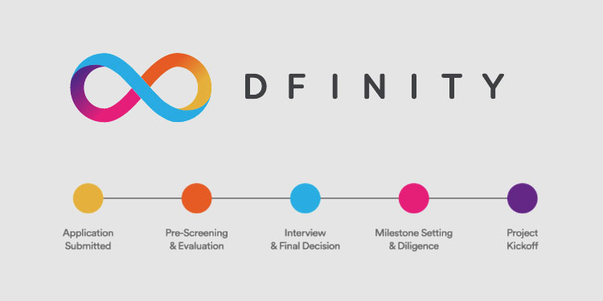
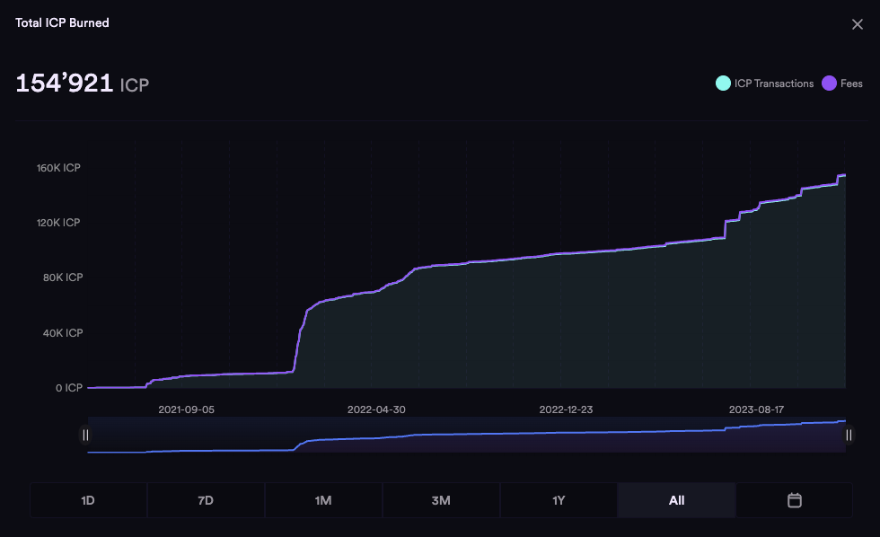
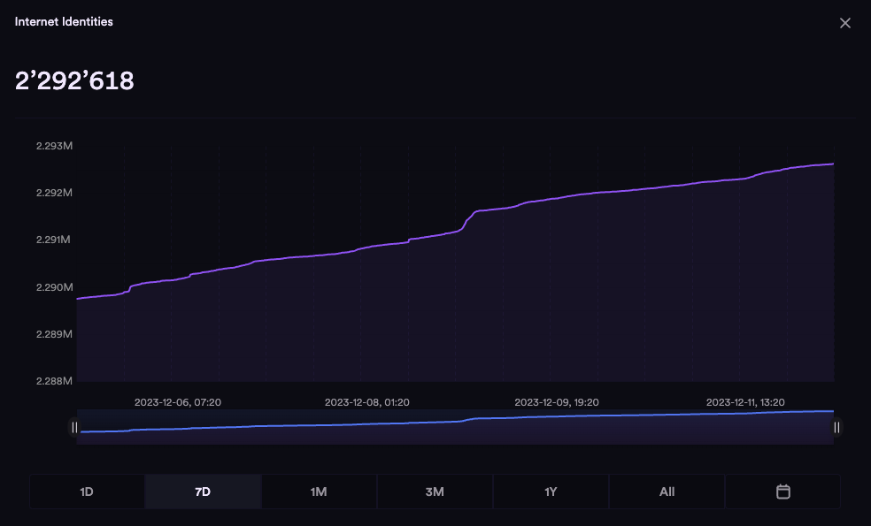
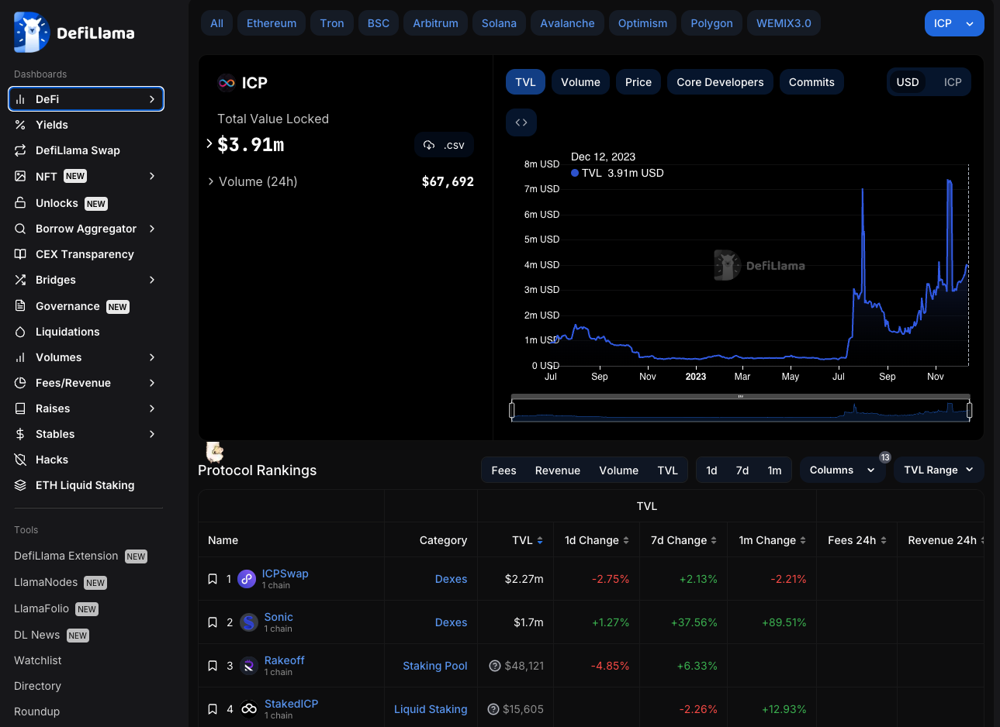
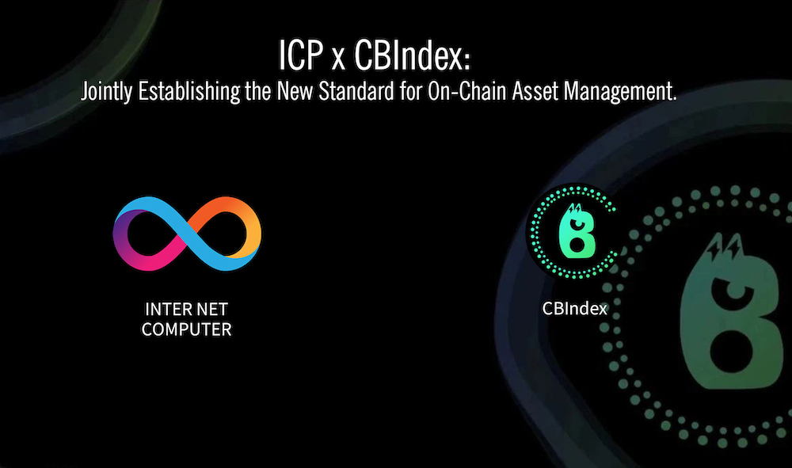

import TeamContact from '../../contact.md';

## 介绍 {#intro}

[DFINITY 基金会提供的总额达二亿美元的开发者 Grants 计划](https://www.coindesk.com/tech/2021/05/25/dfinity-offering-220m-in-developer-grants-for-ambitious-internet-computer-project/)旨在推动互联网计算生态系统的发展。通过为有潜力的开发者和团队提供支持，降低开发者的开发成本，孵化去中心化的应用，并吸引更多来自世界各地的开发者参与生态的共建。

<b>可用的总资金</b>

$200,000,000

:::info
在 DFINITY 基金会官网上[填写 Dev Grant 申请表格](https://dfinity.submittable.com/submit)
:::

### 期望 {#goals}

DFINITY 希望 ICP 生态里的开发者可以通过富有创意的去中心化 Web3 应用，在以下几个方面促进生态的发展：

1. 燃烧更多的 **cycles**

  [Cycles](https://ic123.xyz/docs/getting-started/ic-glossary/#cycle) 是 ICP 生态的稳定币，用来计量 [canister 智能合约](https://ic123.xyz/docs/getting-started/ic-glossary/#canister) 所消耗的计算资源。部署，运行 ICP 独特的容器智能合约需要 cycles 。开发者可以在生态里的 [DEX 平台](https://app.sonic.ooo/swap) 购买 cycles，也可以获取了 [$ICP](https://coinmarketcap.com/currencies/internet-computer/) 之后将 ICP 转换为 cycles 。这个过程中 [ICP 被销毁，整体 ICP 的流通供应量减少，产生通缩](https://dashboard.internetcomputer.org/circulation) (见网页右下角的 “Total ICP Burned")。

  

  :::tip
  对于任何一个 ICP 应用来说，能为整个生态带来的最大价值，就是尽可能地燃烧 cycles
  :::
  
  对于 ICP 经济体来说，一个 DApp 越有价值 => 带来的用户越多 => 用户访问带来更多的 Update Call 和需要存储的数据 => 更多的 Update Call 和存储数据需要消耗更多的 cycles => 因为 cycles 的消耗最终来自 ICP 的销毁，所以 ICP 总量减少。
  
  对于开发者来说，只有当 DApp 能产生足够价值，找到自己的 product-market fit => 才能产生可持续性的收入模式 => 才有能力支付相应的产品运营成本，包括智能合约消耗的 cycles 。

  所以，cycles 的消耗，或者 "ICP 的燃烧“，是检验一个 DApp，乃至整个 ICP 技术生态是否可以为社会创造价值的唯一标准。

2. 带来更多的**互联网身份用户**

  [Internet Identity](https://ic123.xyz/docs/getting-started/ic-glossary/#internet-identity )（互联网身份） 是 ICP 非常独特的身份认证技术，帮助 ICP DApp 解决用户身份的认证和登录，类似于 Metamask 对以太坊智能合约的意义，但安全性远胜传统区块链行业里基于中心化浏览器的插件钱包。用户可以用一个互联网身份来登录所有的 ICP 应用。

  衡量一个 DApp 是否有价值，除了传统的日活用户（DAU）以外，就是总体用户的增长，也就是[新创建的互联网身份](https://dashboard.internetcomputer.org/)的数量。

  

3. 带来更多的**容器智能合约** 

  一个可以吸引很多用户的 ICP DApp ，通常会带来大量新增的容器数量，尤其是当 DApp 的设计思路里为每个用户产生自己直接控制的容器，譬如 [OpenChat](https://oc.app) 和 [Mora](https://mora.app)。[容器数量越多](https://dashboard.internetcomputer.org/)，通常也会带来更多的 cycles 的消耗并意味着更多的互联网身份用户。

  

4. 带来更多的链上资产 **TVL (Total Value Locked)**

  对于 DeFi 应用来说，能否为一个公链带来更多的[链上资产](https://defillama.com/chain/ICP)至关重要。ICP 的 DeFi 生态刚刚起步不久，未来发展有大量可想像空间。

  

5. 赋能社区的其他开发者

  ICP 的很多[底层协议都已经开源](https://medium.com/dfinity/the-dfinity-canister-smart-contract-sdk-is-now-open-source-54b2e5e797ad)。ICP 技术生态还处于早期发展阶段，还需要社区的开发者和 DFINITY 基金会共同创建更多的开发者工具，来降低更多开发者进入 ICP 的门槛。基金会鼓励获得 Dev Grant 的团队尽可能开源代码，尤其是工具类的产品。

:::tip
在以上五个方面的贡献越大，越能获得更多的 DFINITY 基金会的支持
:::

### 资助对象 {#target}

什么样的项目容易得到 DFINITY 基金会的 Dev Grant 呢？ICP 的容器智能合约可以用在几乎互联网所有的垂直领域里，包括社交，游戏，媒体，娱乐，金融，企业服务，跨链协议等等。DFINITY 基金会欢迎开发者充分发挥自己的想象力，搭建最具有颠覆性的去中心化 Web3 应用。

:::warning
DFINITY 基金会不欢迎 grant-shopping 或者re-skin的团队
:::

在区块链行业，一个项目方经常会就同一个产品申请多加公链基金会的补贴。对于这种现象，DFINITY 基金会既不排斥，但也不鼓励。各家公链基金会有自己的标准和目的。一个项目方的创始人需要尽其所能获取更多的资源养活自己的团队，但我们希望创始人首先关注是否能找到产品的 product-market fit，尽快找到愿意付费的用户，而不是靠各大基金会的 grant 活下去。

:::info
DFINITY 通过 Dev Grant 计划将 ICP 发给开发者，是补贴开发者使用，测试容器智能合约的成本。这笔 ICP 既不是赞助费用，也不是投资金额，不应该花费在跟部署智能合约无关的其他行为上（譬如，市场营销，人员招聘，电脑采购等）。
:::

### 涵盖领域 {#domains}

- 开发者工具  
  例如 IDEs, debuggers, logging libraries 等。

- 基础设施  
  例如 oracles, asset bridges 等。

- 集成与 APIs  
  例如 chat, email, maps 等。

- DApps 和开放互联网服务  
  例如[此处](https://github.com/dfinity/grant-rfps/blob/main/requests-for-startups.md)所列出的项目。

- 容器开发包 (CDKs) 和 Agents

### 近期热点 {#whats-hot}

自从 ICP 主网于2021年5月上线以后，DFINITY 的 R&D 团队沿着[路线图](https://internetcomputer.org/roadmap)持续不断地开发，推出了几项重磅功能。我们鼓励开发者在以下几个热门领域做出更多的尝试，充分发挥 ICP 强大的技术优势。

- [HTTPs Outcalls](https://internetcomputer.org/https-outcalls)
- [BTC-ICP直接整合](https://internetcomputer.org/docs/current/developer-docs/integrations/bitcoin/)
- [ETH-ICP直接整合](https://internetcomputer.org/ethereum-integration)
- [人工智能](https://www.prnewswire.com/news-releases/dfinity-foundation-launches-5-million-grant-to-support-decentralized-ai-on-the-internet-computer-blockchain-301877065.html)
- [vetKeys](https://internetcomputer.org/blog/features/vetkey-primer)

:::info
用referral code `DeAI2023` 来申请跟人工智能相关的 Dev Grant
:::

更多细节，请见 [DFINITY Dev Grants](https://dfinity.org/grants) 的英文官网。

## 如何写 Grant 申请 {#write-grant-application}

### 做好预研 {#do-research}

在申请 Grant 之前，请做好研究准备工作。包括：

- 对 IC 技术的理解  
  - 了解 IC 能做些什么；IC的技术特点是什么
  - 为什么您的产品需要用到 IC 的技术；具体需要用到哪些技术
  - 如何在 IC 上进行开发；了解如何使用 dfx，如何在 IC 上部署智能合约等等
- 对 IC 生态的了解  
  - IC 生态里面已经有了哪些项目
  - 有没有和您的项目类似的项目；在您感兴趣的领域里有哪些头部项目
  - 如果有，它们的优缺点各是什么
- 做好可行性研究  
  - 您需要对项目进行一个可行性研究 Proof of Concept (POC)。最好是在申请的时候能有一个小视频、或者线上项目来展示您的研究结果。

:::tip
可以通过[ic123.xyz](https://ic123.xyz/) 来开始您的预研
:::

### 选择 Grant 规模 {#grant-size}

目前 Grant 的规模有三个等级：
- $5,000
- $25,000
- $100,000

对于首次申请 DFINITY Dev Grant 的团队，建议从一个较小 ($5,000, $25,000) 的 grant 申请开始，它包含一个明确的目标、如何与 IC 发生关联、清晰的里程碑规划等。*请不要一开始就申请 $100K的 grant* - 会在预审阶段直接被拒掉。首次 grant 顺利完成了后，您可以继续申请下一个。基金会和社区开发者之间的信任，需要在申请，完成 grant 的过程中逐渐建立，巩固。

### 合理规划 {#project-scope}

对 dev grant 申请的审评人来说，评审的重要目标就是了解您的项目的团队、以及项目内容。比如：这个项目要完成一个什么目标？这个目标如何与 IC 发生关联？申请团队是否有能力完成这个目标？

这其中，最重要的一个问题就是项目的里程碑是否清晰。我们希望您撰写的里程碑能满足以下要求：

- **避免抽象的里程碑**。交附项目尽量具体、可验收。例如，不要写”实现仪表盘”，而应该指定仪表盘所包含的具体功能，具体到包括哪几个按键。
- **做好预研**。在提交 dev grant application 之前，确保完成可行性研究。项目的里程碑不应该包括“定义项目范畴”、“技术研究”等内容。
- **提供架构概述**。项目的架构概述（文字、图表等形式）能够展示您对 IC、对项目的理解。
- **详细的接口说明**。如果您的项目是提供服务、开发库等，请提供清晰的 API 接口，包括参数和返回值。如果可能，请用 [Candid](https://ic123.xyz/docs/getting-started/ic-glossary/#candid) 来描述。
- **突出对 IC 的使用**。明确指出项目的哪些部分如何和 IC 发生关联，比如项目哪些部分将被部署到 IC 上，哪些数据将会被存储到 IC 上，哪些操作会消耗 cycles 。如果您用到了 IC 独特的功能，比如 HTTP outcalls, vetKeys 或比特币集成，也请详细列出。
- **包含用例**。一个好的用例 (use case) 能够帮助审评人站在用户视角看待产品，并理解用户能从项目中获得的价值。
- **如何获取用户**。一个没有用户的产品，技术上再先进，产品设计再巧妙，也没有意义。什么样的用户会用这个产品，为什么必须用这个产品，用户是否愿意为止付费，这些问题越早考虑越好。
- **对 IC 生态的影响**。上述的五个方面（cycles, Internet Identity, canister, TVL, 开源工具）中，您的产品在哪（几）个方面可以为 IC 生态做出贡献？
- 如果您的产品已经在其他平台发布，用户量如何，如何证明？如果您在 grant 申请提到了相关信息，也请在申请中提供一些验证途径。

:::tip
一个合理规划的 dev grant，通常开发周期在三到四个月之间
:::

DFINITY 基金会对少数的非常成熟的 ICP 项目方也会提供高达$100K的 dev grant。这种项目需要满足三个条件：

1. 已经完成过 dev grant ，具备成功完成 ICP grant 项目，落地产品的资历和经验
2. 产品已经积累了相当的用户规模，有 traction
3. 已经开始产生大量的 cycles 消耗

### 开始申请 {#how-to-apply}

请点击下面 Submittable 的链接开始申请👇

:::info
**[申请开发者 Grant](https://dfinity.submittable.com/submit)**
:::

在申请页面，选择 `Developer Grant Program` 并根据提示继续后续步骤，具体操作可以参考[如何提交一个 Grant 申请](https://support.dfinity.org/hc/en-us/articles/4401932864020-How-to-Submit-a-Grant-Application)。

### 其他注意事项 {#other-notes}

:::danger
请不要粘贴您给投资人看的商业计划书
:::

DFINITY 基金会衡量一个 Dev Grant 申请的标准跟投资人投资初创企业的思路完全不同。在判断一个项目是否应该获得 Dev Grant 的时候，我们只看产品和技术本身，只关心您的产品如何用到了 ICP 的技术。其他融资 BP 里大家喜闻乐见的内容，譬如豪华的顾问团队，创始团队以前彪悍的业界资历，各大机构伙伴的合作 buff，对于 Web3 未来的宏伟情怀，摇曳多姿的商业模式，言必称万亿的蓝海市场，对于我们的评判没有任何借鉴意义。相反，在 dev grant 申请里提及这些内容几乎都是减分项 - 因为您显然误解了 DFINITY Dev Grant 的目的。基金会不是天使投资人。我们只是希望能推广一个开源技术，仅此而已。

还需要特别注意的是对团队背景的描述。在申请表里描述会**直接**参与这个 grant 项目的前端/后端工程师，UX设计师，产品经理等就可以 - 大多数情况下团队规模是3-10人之内。我们只关心开发者的技术能力和背景。整个团队的创始人，不管是CMO，CFO，CBO，还是CEO或者投资人，不管他们的背景如何辉煌，如果不是直接参与到这个 ICP developer grant 的项目小组里，他们的职业经历没有必要写在 grant 申请表里。您可能跟徐小平，沈南鹏是邻居，这个大招可以留给未来的投资人，而不是一个描述开发者如何编写容器智能合约的申请表里。

:::tip
最重要的原则是**实在**，越**实在**越好。切忌夸夸其谈。切忌大而空的泛泛而谈。
:::

另外，独立开发者也是可以申请 dev grant 的，这种例子很多。一个 10x 的工程师，在几个月之内做出一个惊艳的 ICP 爆款 DApp 完全有可能。当然，独立工程师以后在推广产品，运营社区的时候挑战会比较大。希望到了那个阶段，您的团队可以继续茁壮成长。

更多的问题请参考：[开发者 Grant FAQs (英文)](https://support.dfinity.org/hc/en-us/sections/8730977702804-Grants)。

## 面试 {#interview}

### 递交申请之后 {#after-submission}

在 Submittable 里递交了申请后，DFINITY 的 DevRel 工程师会根据材料做一个书面审核。多票通过的话，项目方会收到邮件，邀请面试。如果多票没有通过，则会邮件通知项目方申请没有通过。

如果递交了超过一周还没有得到消息，可以联系 DFINITY 亚太团队 (TG `@yangherbert`)，或者在 [ICP China Twitter 社区](https://twitter.com/i/communities/1679302895571988481)留言，告诉我们您的项目名称。我们会帮您查看进度。

由于东西方的文化差异和语言的障碍，很多华人团队递交的 dev grant 申请（英文）远远不能体现出团队真正的实力。

:::tip
建议团队在递交申请前就联系 DFINITY 亚太团队，共同探讨如何规划 dev grant 的申请，而不是等到申请之后。
:::

### 准备面试 {#prep-interview}

来自 DFINITY 团队成员的面试邀请邮件，是这个样子：

> Subject: Good news - your application has made it to the next phase!
>
> Dear Joe,
>
> Congratulations! Your grant application has made it to the next phase of our review process. At this stage, we would like to set up a short 30-minute interview with you.
>
> The purpose of this interview is three-fold:
>
> Introductions (5 min) - Get to know you and any team members a bit better
> Project Overview (10 min) - Hear more about your project, in your own words
> Milestone Refinement (15 minutes) - Discuss and provide feedback on your proposed grant milestones and deliverables
> 
> ...
> 
> Calendar #1 openings with Jennifer (US Timezone)
> 
> Calendar #2 openings with Moritz (EU & Asia Timezone)
> 
> Calendar #3 openings in Chinese language (Asia Timezone)

:::tip
选择 [Calendar #3 openings in Chinese language (Asia Timezone)](https://calendly.com/d/crg-s2h-69f/developer-grant-interview-p-v)
:::

这样的话，就是 DFINITY 亚太团队在 **UTC+8** 时区用**中文**（如果您想用英文，当然也可以）来做面试。 

跟 DFINITY 团队初次面试的时候，有两点建议：

1. 带上团队的**技术**负责人。我们 95% 的关注要点都在技术上。如果您讲不了技术细节，可以请开发者或者技术负责人来讲，这样沟通效率会高很多。我们不在乎您的头衔，在团队里的职级，以前的背景。我们只关心您有多了解 ICP 的技术，能不能把一个 DApp 做出来。
2. 打开**摄像头**。我们希望可以在 Zoom call 上对您有更深入的了解。技术的验证是容易的，人与人之间建立信任则要难多了，没有可以取巧偷懒的地方。基金会跟开发者之间的信任级别越高，双方愿意投入的资源也越多。反之亦然。

## 面试之后 {#after-interview}

面试之后，DFINITY 基金会的 Developer Grant 委员会将根据团队的技术能力，对 ICP 的理解，产品对 ICP 生态的潜在影响多个方面做一个评估。合乎要求的团队将很快收到一封来自基金会的电子邮件，

> Hello XXX,
>
> Congratulations! Based on your application and interview, we would like to award you a developer grant in the amount of $XXX in support of your work.
>
> For reference, your grant ID is XXX.
> ...

这个时候，可以说，您的 DFINITY Developer Grant 正式开始了。很多团队会借这个机会在推特上宣传一下。这种振奋人心的消息也是我们乐于看到的。[CBIndex](https://twitter.com/CBIndex_Global) 的官宣是个不错的模版：

:::tip
可以向 DFINITY 的市场团队[申请推特上的联合推广](http://localhost:3000/docs/ecosystem-guide/co-marketing/)
:::

一方面您的团队应该已经开始开发DApp了，另一方面，还有两个动作需要完成：

1. 在 Submittable 里填写 Program Milestone and Payment Exhibit
2. 完成 KYC (Know-Your-Customer) 的验证 （否则无法收到 ICP 的代币）

这些都是跟基金会的运营团队通过电子邮件的沟通来完成。请确保基金会的邮件不要进入垃圾邮箱。

:::tip
请把 `grants@dfinity.org` 和 `@submittable.com` 加入到邮箱的白名单里
:::

### 沟通 {#communicate}

一个典型的 developer grant 的开发周期通常在3-4个月。时间太短不足以做出有影响力的产品；时间太长难以跟进市场前进的步伐。这段期间里，希望开发者们可以跟基金会保持沟通，有技术或者市场各方面的问题随时交流。DFINITY 基金会存在的主要目的，除了继续开发 ICP 的底层协议，就是支持，孵化，赋能社区里的 ICP 团队。为开发者解决问题，是我们日常的主要工作。

微信的功能过于简陋，我们尽量在Telegram和Twitter上建立持续的沟通。

:::info
请添加 Asia GM [Herbert Yang](https://twitter.com/herbertyang) 的Telegram ID: `@yangherbert` ，方便建群
:::

在 Telegram 的 `DFINITY x XXX` 群里，可以把您的技术开发者都邀请入群，一起讨论。

如果有技术问题，可以在 ICP China 的 Twitter 社区里提出来，方便更多的开发者从**公开**的回答中受益，也方便基金会邀请各方面的专家来回答问题。在微信或者 Telegram 上私下做一对一的回复效率太低了。我们希望尽可能公开地做**一对多**或者**多对多**的交流。

:::info
[ICP China的推特社区链接](https://twitter.com/i/communities/1679302895571988481)
:::

另外，DFINITY 基金会官方的开发者论坛（英文）是必须关注的。ICP 生态里重大技术问题的讨论，不管是来自基金会或者社区，通常都是从这个论坛开始。很多基金会 R&D 团队的研究员，开发者，工程师，team lead，都深度参与论坛的讨论，包括基金会的创始人 [Dom](https://forum.dfinity.org/u/dominicwilliams/summary)。R&D 团队在 [ICP 路线图](https://internetcomputer.org/roadmap) 上取得的进展，会在论坛上第一时间发布。

:::info
[DFINITY 开发者论坛链接 - https://forum.dfinity.org](https://forum.dfinity.org/)
:::

还有其他的跟基金会沟通的方式，譬如，建立 Slack 群 - 但 Slack 在中国使用并不方便也不普及，所以效率有限。DFINITY 亚太团队以前曾经尝试过各种社区讨论的工具，从微信群，Telegram 频道，到 Discord 服务器，甚至 [OpenChat](https://oc.app/?ref=inda5-hyaaa-aaaaf-aaioq-cai) 讨论群，但效果都不够理想。

除了保持畅通的跟基金会的沟通以外，积极参加 ICP 生态里的活动也是很重要的。生态的繁荣需要集合社区的力量一起共建。在后疫情时代，有很多可以线下见面交流的机会，基金会也积极地出席行业里的各种活动，跟社区合作伙伴共同举办开发者聚会。我们希望看到新加入的团队，在社区活动上分享自己的开发体验，帮助我们答疑解惑，招募身边的开发者朋友。

> Think not, what ICP can do for you
>
> Think, what you can do for ICP

### 验收 {#check-out}

Milestone 完成了后，在 Submittable 里标注一下，递交必要的资料，然后通过 [Calendly](https://calendly.com/) 来约 DFINITY 团队的时间做 milestone 的验收 （Submittable的邮件里会提供指示）。

:::note
Milestone 面试最关键的是 live demo。我们只看可以在现场被验证的代码演示。
:::

这个面试不是看 PPT ， 也不需要知道融资计划，也不需要分享最新的 BD 合作，更加不需要畅享 Web3 的宏伟愿景，我们只看代码。所以，请务必让团队的**技术负责人**或者**开发者**来做演示。面试严格按照团队一开始递交的 Milestone TODO list 来验收开发成果。一个高效的团队会这样来驾驭这个面试：

1. 把 Submittable 里的 milestone items 粘贴到 Zoom 对话窗口
2. 根据 item list ，在 Zoom 里共享桌面，逐项做代码 的 demo 
3. 有必要的话，可以在线把相关代码 （本地或者 Github 上尚未开源的 repo 里）给 DFINITY 的工程师看一下
4. 沟通一些平时积累的技术问题

## 下一步 {#next-step}

第一个 grant 的开发顺利结束后，只是走出了第一步。我们希望愿意深耕 ICP 生态的团队继续申请更多的 follow-on grants。很多 ICP 里的成熟团队都拿过多个 DFINITY 基金会的 developer grants。

:::tip
DFINITY 基金会欢迎 ICP 项目申请更多的 follow-on grants
:::

Grant 的结束，对团队的开发能力，技术研发实力，产品落地能力，和社区运营能力都是一个综合的考量和验证，同时也会解锁多项 DFINITY 基金会提供给 ICP 生态项目的资源，譬如：

- 受邀参加 DFINITY Global R&D 周例会做产品 demo 
- 受邀参加 DFINITY 基金会在瑞士苏黎世定期举办的 [ICP.Lab 加速营](https://dfinity.org/icplab)
- 投资机构以及多加机构合作伙伴（交易所，做市商，安全审计公司，加速器，企业伙伴）的推荐和介绍

DFINITY 基金会擅长的是搭建互联网最底层最抽象的技术协议。互联网计算机这个极具颠覆性的技术如果要像30年前的早期互联网那样实现 mass adoption，能为全球互联网用户 - 不管是个人还是企业，带来日常生活，工作中的有价值的服务，还需要社区的开发者来开发更多的有创意的去中心化应用DApp。我们希望在未来的 ICP 生态里会涌现出一大批改变人类生活的超级独角兽，重新定义数据主权的归属，让数据真正地服务于个体，重新定义个体和群体的生产关系和资源配置，让个体的光芒永远照亮人类文明前行的雄关漫道。

>     乘风破浪会有时，直挂云帆济沧海

加油吧，乘风的少年们！

<TeamContact />