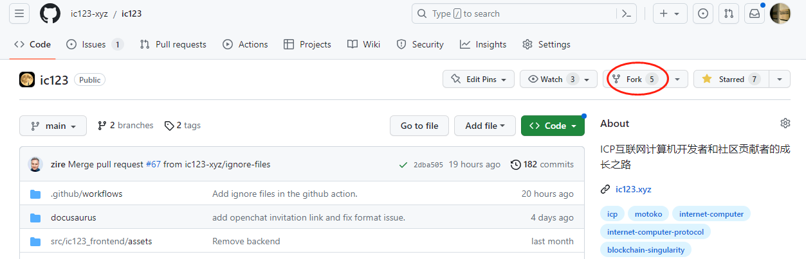
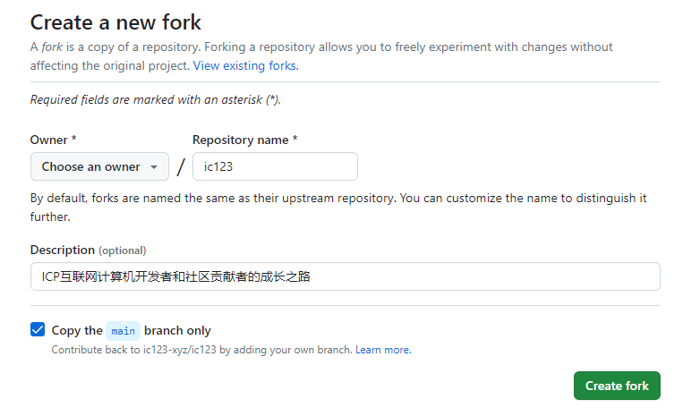
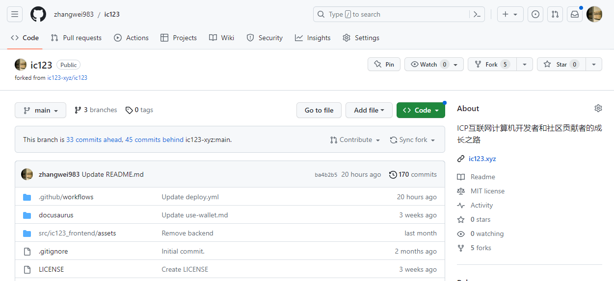
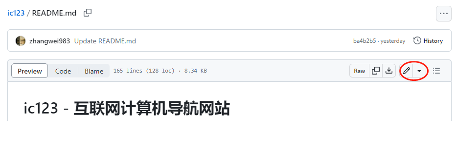
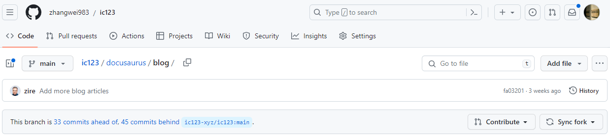
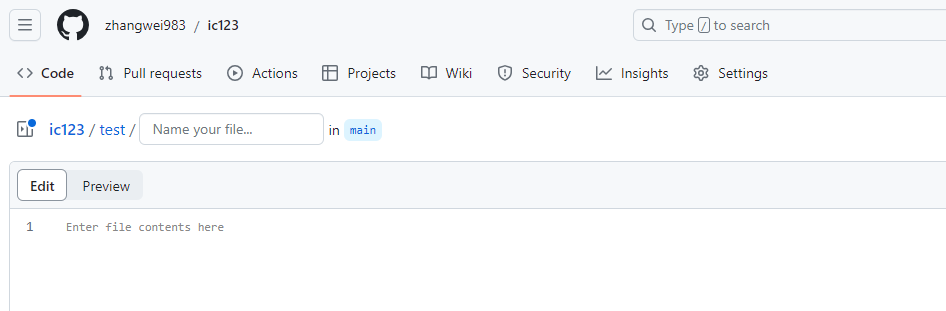

# 非程序员如何参与 ic123

本文档的目的在于简化非程序员参与 [ic123](https://github.com/ic123-xyz/ic123) 的流程。

目前 [ic123](https://github.com/ic123-xyz/ic123) 的流程偏程序员。团队目前没有资源为 [ic123.xyz](https://ic123.xyz/) 实现一个交互式的前端：登录 + 在线文件编辑。这里我们编写了此文档用来引导非程序员参与到 [ic123](https://github.com/ic123-xyz/ic123)。

## 基本要求

**GitHub 账号 + 基本的 Markdown 文件编辑**

## GitHub

目前的流程下，您需要一个 `GitHub` 账号。因为 [ic123.xyz](https://ic123.xyz/) 的源文件都是托管在 GitHub 上，所以向 [ic123.xyz](https://ic123.xyz/) 添加、修改内容唯一的方式就是向 [ic123](https://github.com/ic123-xyz/ic123) 发起 pull requests。 

### 注册账号

如果您还没有 GitHub 账号，请参考[如何注册 GitHub 账号](https://docs.github.com/en/get-started/signing-up-for-github/signing-up-for-a-new-github-account)。

### Fork

Fork 操作就是在您的 GitHub 账号下，创建一个 [ic123](https://github.com/ic123-xyz/ic123) 的拷贝仓库，关于 Fork 的具体介绍可以参考 [GitHub 的官方文档](https://docs.github.com/en/pull-requests/collaborating-with-pull-requests/working-with-forks/about-forks)。

当您注册好 GitHub 账号后，请进入 [ic123](https://github.com/ic123-xyz/ic123) 进行 `Fork` 操作，如下图所示。

点击 Fork 后，会跳出如下界面。

在 `Choose an owner` 对话框，选择您前面注册好的 GitHub 账号，其他配置不用修改，点击 `Create fork` 创建分叉。如下就是 Fork ic123 创建的一个仓库示例。

***通常以上的 GitHub 账号注册、Fork 这两步操作只需完成一次。***

### 编辑

至此，通常程序员会选择：
1. 本地安装好 git，配置 sshkey；
2. 将 Fork 后的仓库 Clone 到本地；
3. 在本地编辑器中编辑；
4. 通过 git 命令将改动推送到 GitHub 仓库。

但这些步骤对于非程序员来说比较麻烦，也很难配置，不过 GitHub 提供了在线文档编辑可以一定程度解决这个问题。

#### 编辑文件

找到您想编辑的文件，点击如下所示的编辑按钮。

编辑之后，请点击 `Preview` 进行预览，确保改动正确。具体如何编辑请参考 [Markdown 文件编辑](#markdown-editing)。

最后点击 `Commit changes`，将改动提交到仓库。

#### 添加文件

可以通过如下所示的 `Add file` 来添加文件。

***需要注意的是***：请先进入到你想要添加的目录之后再添加文件。

比如你想要在 `ic123/docusaurus/blog` 目录下添加文件，请先浏览到该目录，再进行 `Add file` 操作。

为了规则统一，也为了避免一些工具对空格支持不太好，这里关于文件名有如下要求：
1. 采用英文
2. 小写
3. 空格请用 `-` 替代。

#### 添加目录

如果您想将您新增的文件放在一个新目录下，请按下述步骤进行操作，以 `ic123/test/test.md` 为例。

- 在输入文件名时，先输入您要创建的目录；
- 当您输入路径分隔符 `/` 的时候，GitHub 会检测到并为您创建新的目录。比如输入 `test/`，会出现如下图所示的结果。

### 发起 Pull Request

当您在 forked 仓库上完成修改后，就可以发起 `PR (Pull Request)` 将您的改动提交回 [ic123](https://github.com/ic123-xyz/ic123) 。发起 PR 的界面如下图所示。

点击弹出的 `Open pull request` 发起 PR，如下图所示。

这个页面的参数配置如下：
- `base repository`: 选择 ic123-xyz/ic123
- `base`: 选择 main
- `head repository`: 这里就是你 fork 的仓库
- `compare`: 就是你的 main branch

也请认真填写 PR 的 `title` 和 `description`，以帮助 reviewers 更好的审阅您的 PR。

完成以上步骤后请点击 `Create pull request` 最终完成 PR 的发起过程。

### 同步 Fork

当 [ic123](https://github.com/ic123-xyz/ic123) 处于开发过程中，它的改动会比较频繁，这也意味着您 Fork 的仓库可能与 ic123 并不同步。这里建议当您想添加内容、并发起一个 PR 之前，可以先同步 ic123，以减少冲突的可能性。同步的方法如下图所示。

## Markdown 文件编辑 {#markdown-editing}

当您熟悉了 GitHub 的操作之后，需要了解的是如何进行 Markdown 文件的编辑。[ic123](https://github.com/ic123-xyz/ic123) 的内容都采用 Markdown 文件来编写，[docusaurus](https://docusaurus.io/) 文档工具会自动将 Markdown 文件转换为对应的 html 文件。

Markdown 是一种轻量级标记语言，本身并不复杂。关于如何编写 Markdown 的指南有很多，例如：
1. [Markdown 的官方文档](https://www.markdownguide.org/getting-started/)
2. [Markdown 菜鸟教程](https://www.runoob.com/markdown/md-tutorial.html)

### 
支持 Markdown 文件的编辑器也很多，比如 [Obsidian](https://obsidian.md/)、面向程序员的 [Visual Studio Code](https://code.visualstudio.com/) 等，可以参考[该文档](https://www.markdownguide.org/getting-started/#notes)来选择您熟悉的工具进行编辑。
