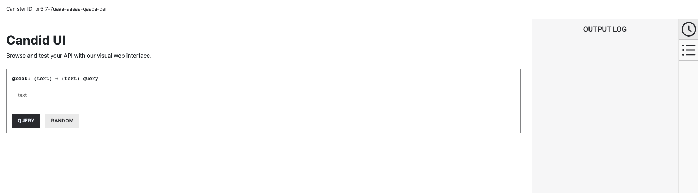

# 五分钟体验 IC 上的 Hello World

## 概览

本教程提供了一个适合初学者的入门指南，介绍了如何在不到5分钟的时间内在互联网计算机（IC）上部署一个去中心化应用（dapp）。通过完成本教程，您将了解 dapp 的结构和部署过程，并在 IC 上创建一个简单的 “Hello, world!” dapp。为简单起见，这个 dapp 只完成一个功能：接受文本输入并返回该文本输入。

在开始之前，可以先查看一个运行在链上的该 dapp 的版本：https://jqylk-byaaa-aaaal-qbymq-cai.icp0.io/


## 要求

在本教程中，部署 dapp 只需要有对终端界面的基本使用知识。另外您需要满足以下条件：

- 预先安装 [Node.js](https://nodejs.org/en)，本教程使用高于`16.*.*`版本的 Node.js。

## 第一步: 安装 IC SDK

本教程将会使用 IC SDK，目前是由 DFINITY 基金会维护。请参照[如何安装 IC SDK](https://ic123.xyz/docs/getting-started/install-dfx) 安装 IC SDK。

安装完成后，IC SDK 将提供一些工具供您使用。其中之一是 `dfx` 命令，您将在本教程中多次看到。

为了验证 IC SDK 是否正确安装，请运行：

```
dfx --version
```

## 第二步: 创建一个项目

IC SDK 可以创建新的项目模板。一个项目是一组包括源代码和配置文件在内的工件，可以编译为容器智能合约。

通过运行以下命令创建一个新项目：

```
dfx new hello
cd hello
dfx start --background
```

### 这些命令的作用

- `dfx new hello`  
  在您的本地机器上创建了一个名为 `hello` 的新项目。
- `cd hello`  
  进入到您新创建的 `hello`` 项目目录中。
- `dfx start --background`  
  启动一个可用于本地的测试和部署的 IC 实例。您可以通过在浏览器访问类似于 http://localhost:50325/_/dashboard 的URL来查看此本地实例的信息。

```
根据您的平台和本地安全设置，可能会显示一个警告。如果提示您允许或拒绝网络连接，请点击“允许”。
```

现在在您的机器上有一个本地的 IC 执行环境实例正在运行！在完成剩余的步骤之前，请保持此终端窗口和浏览器页面处于运行状态，以便教程可以顺利进行。

## 第三步: 本地部署 dapp

现在您通过运行以下命令进行本地部署：

```
npm install
dfx deploy
npm start
```

输出应该显示两个URL，用于访问您的dapp。例如：

```
URLs:
  Frontend canister via browser
    hello_frontend: http://127.0.0.1:4943/?canisterId=renrk-eyaaa-aaaaa-aaada-cai
  Backend canister via Candid interface:
    hello_backend: http://127.0.0.1:4943/?canisterId=rdmx6-jaaaa-aaaaa-aaadq-cai&id=rno2w-sqaaa-aaaaa-aaacq-cai
```

在上面的示例输出中，`hello_frontend` 是 dapp 的前端，`hello_backend` 是dapp的后端。在您的本地环境中部署时，您将看到不同的链接。

前端容器的 URL 和后端容器的 URL 都可以通过浏览器访问。

前端示例:


后端示例：




至此，您已经在本地部署了您的第一个 ICP dapp。

### 通过命令行测试本地部署的 dapp

现在您的容器智能合约已经部署到本地执行环境，您可以通过发送和接收消息与其交互。由于该容器具有一个名为 `greet` 的方法（接受一个字符串作为参数），我们将发送一条消息给它。

运行以下命令：

```
dfx canister call hello_backend greet everyone
```

你将会接收到 `greeting` 的返回输出：

```
("Hello, everyone!")
```

#### 这个命令的作用

- `dfx canister call`  
  该命令要求您指定要调用的容器和函数名称。
- `hello_backend`  
  即是您要调用的容器的名称。
- `greet`  
  即是您要调用的函数名称。
- `everyone`  
  则是您传递给 `greet` 函数的参数。

### 通过浏览器测试本地部署的 dapp

现在您已经通过命令行验证了已部署的 dapp，接下来让我们验证是否可以通过浏览器访问 dapp 前端。

打开一个浏览器，并访问之前步骤中接收到的 `hello_frontend` 的 URL。

您应该看到以下内容：


## 第四步: 将 dapp 部署到链上

在将您的应用程序部署到链上之前，您需要两样东西：一个钱包和一些 cycles。

### 获取 cycles

为了将 dapp 部署到链上运行，IC dapps 需要 cycles 来支付计算和存储所需的费用。这意味着开发人员需要获取 cycles 并将其充值到他们的容器中。Cycles是通过 ICP 代币创建的。

这个流程对于熟悉 Web2 软件开发的人来说可能是全新的。在 Web2 中，他们可以将信用卡添加到托管提供商、部署他们的应用程序、并稍后付款。在 Web3 中，为了部署智能合约，区块链要求他们的智能合约消耗某种代币（无论是以太坊的 ETH 代币还是 IC 的 cycles）。下面的步骤对于那些熟悉加密货币或区块链的人会比较熟悉，他们已经习惯了部署 dapp 的第一步是获取代币。

您可能还想知道为什么 dapp 消耗 cycles 而不是 ICP 代币，原因是 ICP 代币的价格会随着加密货币市场的波动而波动，但 cycles 是可预测且相对稳定的代币、并与XDR挂钩。一万亿 cycles 的成本始终为一个 [XDR](https://en.wikipedia.org/wiki/Special_drawing_rights)，无论 ICP 的价格如何。

关于 cycles 的重要注意事项：

- [免费 cycles 水龙头](https://ic123.xyz/docs/getting-started/get-cycles#如何获得免费-cycles)会为新开发人员提供20万亿 cycles。
- 部署一个容器需要1000亿 cycles，但为了给容器加载足够的循环，IC SDK 默认会新创建的容器注入3万亿 cycles（这是一个可更改的参数）。
- 您可以在这里查看[计算和存储费用](https://internetcomputer.org/docs/current/developer-docs/gas-cost)。

### 设置钱包

您可以任选如下几个方式来设置 cycles 钱包：

- 您可以通过[免费 cycles 水龙头](https://ic123.xyz/docs/getting-started/get-cycles#如何获得免费-cycles)获得免费的 cycles，该水龙头为新开发人员提供20万亿 cycles。该指南将引导您在兑换免费 cycles 券时创建钱包，这也是本教程中我们将使用的选项。如果这是您第一次进入 IC 生态系统，我们建议您选择此选项。

您还可以使用以下任一方式设置 cycles 钱包：

- 如果这是您第一次使用 IC 主网且尚未设置钱包，您可以使用以下命令：`dfx quickstart`  
- 您可以使用以下命令为此身份、网络组合配置钱包：`dfx identity set-wallet <wallet id> --network <network name>`  
- 如果您已经配置了钱包，您可以通过在命令中添加 `--network <network name>` 标志来使用它。  
- 如果您有一个已经配置了钱包的身份，您可以使用以下命令配置 `dfx` 使用该身份：`dfx identity use <identity name>`  

### 通过免费 cycles 水龙头获取 cycles

在[如何获取免费 cycles 教程](https://ic123.xyz/docs/getting-started/get-cycles#如何获得免费-cycles)中，您可以从 cycles 水龙头获取 `Hello` dapp 所需的免费 cycles。**请注意，该水龙头只能使用一次**。

#### 检查 cycles 余额

现在您已经使用了 cycles 水龙头，您可以检查您的 cycles 余额：

```
dfx wallet --network ic balance
```

如果您在通过 cycles 水龙头兑换了免费 cycles 后运行此命令，您应该会看到大约20万亿 cycles。

### 链上部署

现在您的钱包中有一些 cycles，您现在可以将您的 `hello` dapp 部署到链上。

建议您通过 ping 来检查您与 IC 网络的连接是否稳定：

```
dfx ping ic
```

如果成功，您将看到类似以下的输出：

```
$ {
  "ic_api_version": "0.18.0"  "impl_hash": "d639545e0f38e075ad240fd4ec45d4eeeb11e1f67a52cdd449cd664d825e7fec"  "impl_version": "8dc1a28b4fb9605558c03121811c9af9701a6142"  "replica_health_status": "healthy"  "root_key": [48, 129, 130, 48, 29, 6, 13, 43, 6, 1, 4, 1, 130, 220, 124, 5, 3, 1, 2, 1, 6, 12, 43, 6, 1, 4, 1, 130, 220, 124, 5, 3, 2, 1, 3, 97, 0, 129, 76, 14, 110, 199, 31, 171, 88, 59, 8, 189, 129, 55, 60, 37, 92, 60, 55, 27, 46, 132, 134, 60, 152, 164, 241, 224, 139, 116, 35, 93, 20, 251, 93, 156, 12, 213, 70, 217, 104, 95, 145, 58, 12, 11, 44, 197, 52, 21, 131, 191, 75, 67, 146, 228, 103, 219, 150, 214, 91, 155, 180, 203, 113, 113, 18, 248, 71, 46, 13, 90, 77, 20, 80, 95, 253, 116, 132, 176, 18, 145, 9, 28, 95, 135, 185, 136, 131, 70, 63, 152, 9, 26, 11, 170, 174]
}
```

现在您已经测试了与ICP网络的连接，请运行：

```
npm install
dfx deploy --network ic --with-cycles 1000000000000
```

#### 这个命令的作用

- `--network` 选项指定将要部署的 `dapp` 的网络别名或 `URL`。当部署到 IC 主网上时，需要该选项。
- `--with-cycles` 告诉 IC SDK 要使用多少个 cycles，否则将使用默认的3万亿个 cycles。

如果成功，您的终端应该显示类似如下的信息：

```
Deploying all canisters.
Creating canisters...
Creating canister hello_backend...
hello_backend canister created on network ic with canister id: jxzn6-maaaa-aaaal-qbyma-cai
Creating canister hello_frontend...
hello_frontend canister created on network ic with canister id: jqylk-byaaa-aaaal-qbymq-cai
Building canisters...
Shrink WASM module size.
Building frontend...
WARN: Building canisters before generate for Motoko
WARN: .did file for canister 'hello_frontend' does not exist.
Shrink WASM module size.
Generating type declarations for canister hello_frontend:
  src/declarations/hello_frontend/hello_frontend.did.d.ts
  src/declarations/hello_frontend/hello_frontend.did.js
  src/declarations/hello_frontend/hello_frontend.did
Generating type declarations for canister hello_backend:
  src/declarations/hello_backend/hello_backend.did.d.ts
  src/declarations/hello_backend/hello_backend.did.js
  src/declarations/hello_backend/hello_backend.did

Installing canisters...
Installing code for canister hello_backend, with canister ID jxzn6-maaaa-aaaal-qbyma-cai
Installing code for canister hello_frontend, with canister ID jqylk-byaaa-aaaal-qbymq-cai
Uploading assets to asset canister...
Fetching properties for all assets in the canister.
Starting batch.
Staging contents of new and changed assets in batch 1:
  /sample-asset.txt 1/1 (24 bytes) sha 2d523f5aaeb195da24dcff49b0d560a3d61b8af859cee78f4cff0428963929e6 (with 7 headers)
  /main.css 1/1 (537 bytes) sha 75ac0c5aea719bb2b887fffbde61867be5c3a9eceab3d75619763c28735891cb (with 7 headers)
  /index.js.LICENSE.txt 1/1 (413 bytes) sha f2dcfd36875be0296e171d0a6b1161de82510a3e60f4d54cc1b4bec0829f8b33 (with 7 headers)
  /favicon.ico 1/1 (15406 bytes) sha 4e8d31b50ffb59695389d94e393d299c5693405a12f6ccd08c31bcf9b58db2d4 (with 7 headers)
  /index.html (gzip) 1/1 (350 bytes) sha 16289744897bd78f5df24924dac6972c19e0bb56f5ddcf695de65656b942d769 (with 7 headers)
  /logo2.svg 1/1 (15139 bytes) sha 037eb7ae523403daa588cf4f47a34c56a3f5de08a5a2dd2364839e45f14f4b8b (with 7 headers)
  /index.js.LICENSE.txt (gzip) 1/1 (273 bytes) sha db89b3ccdfe399f8ef3135c0b076326a0ae9e1c96409f79f8e686031537c572c (with 7 headers)
  /index.js (gzip) 1/1 (88325 bytes) sha 37809370db58979a0bd92a68eb403eb06f9314748862376e2b4ac2d6d171e631 (with 7 headers)
  /main.css (gzip) 1/1 (299 bytes) sha b4879e7ba34e68b2965d626e48d772ce615e4f6b78b69cc8f2f91127ed18b850 (with 7 headers)
  /index.html 1/1 (539 bytes) sha 053f9dc1283c64d114d43cbf03b0b0062afae08a04a5044ae58dbc68f4a1f93f (with 7 headers)
  /index.js 1/1 (246603 bytes) sha 0de3c2e257ca0ac85423b3e4c7dc0a3aeb8906b73e3b72e47924ed6e80247406 (with 7 headers)
Committing batch.
Deployed canisters.
URLs:
  Frontend canister via browser
    hello_frontend: https://jqylk-byaaa-aaaal-qbymq-cai.icp0.io/
  Backend canister via Candid interface:
    hello_backend: https://a4gq6-oaaaa-aaaab-qaa4q-cai.raw.icp0.io/?id=jxzn6-maaaa-aaaal-qbyma-cai
```

请注意消息底部返回的 URL，您可以在其中查看部署在链上的容器的前端：https://jqylk-byaaa-aaaal-qbymq-cai.icp0.io/

### 您已成功将 dapp 部署到链上

在 dapp 加载之前，浏览器会显示一条消息：Installing "Internet Computer Validating Service Worker"。

该 [service worker](https://ic123.xyz/docs/getting-started/ic-glossary#service-worker) 来自 ICP 网络，用于确保用户所看到的 Web 应用程序是正确的、未被篡改的前端。一旦加载完成，您的浏览器将缓存该 service worker，您的 Web 应用程序也将加载得更快。

## 总结

您已经完全在链上构建了一个 dapp（包括后端和前端）。本教程的要点总结：

- 去中心化应用可以由多个容器组成，包括 `dapp` 的后端和前端。
- 去中心化应用可以在本地和链上部署。
- Cycles 是驱动 dapps 所需的能量。
- 可以从 cycles 水龙头获取免费 cycles。
- 免费 cycles 可以用于为其他 dapps 提供动力。
