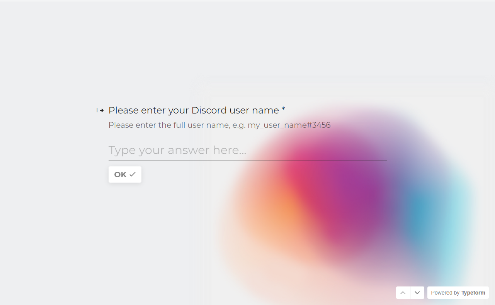
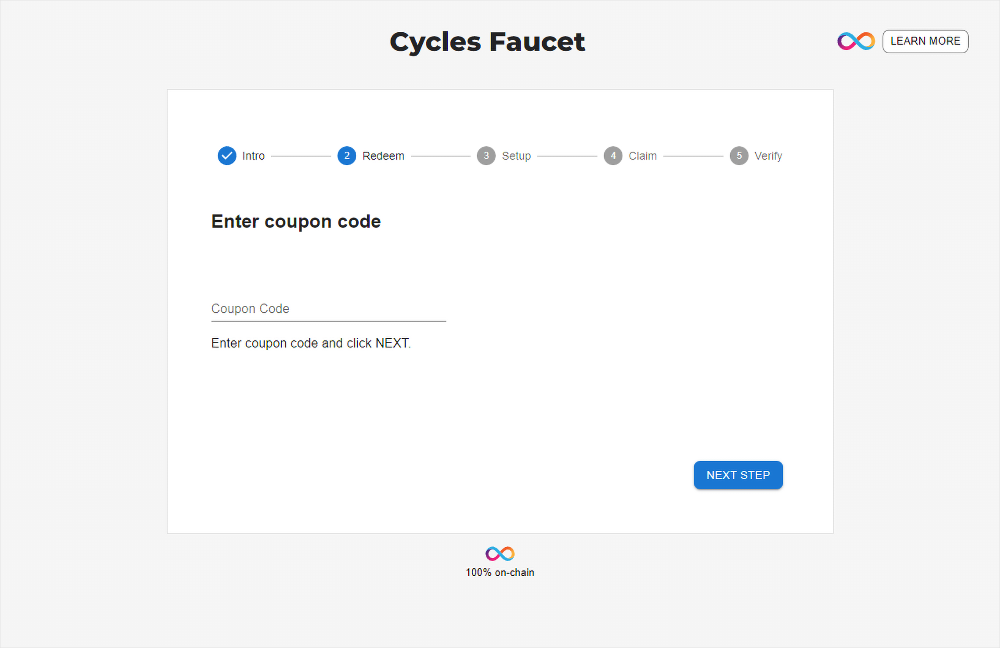
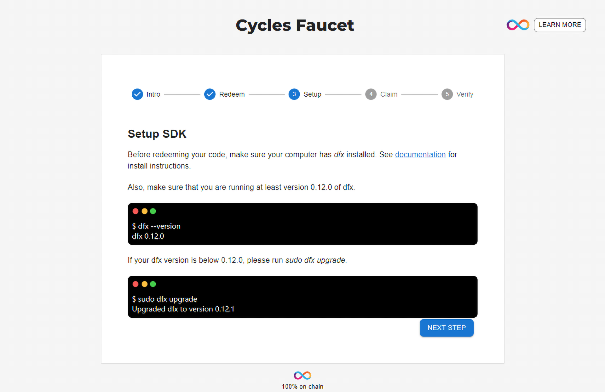

import TeamContact from '../../contact.md';

# 获取 cycles


## 概述

为了使互联网计算机可持续发展，开发人员需要支付其容器所消耗的资源费用，而 cycles 则用于支付这些资源费用。接下来介绍几种获得 cycles 的方式。

这里将解释如何使用 cycles 水龙头获取您的第一笔 10T 免费 cycles，以用于在主网上部署您的 dapp。

:::note
请注意，cycles 水龙头只能使用一次
:::

## 要求

请按照[此指南](https://ic123.xyz/docs/getting-started/install-dfx)安装 IC SDK。

## 第一步：获取 cycles 优惠券

下面将介绍如何获得 cycles 优惠券。

### 加入 DFINITY 官方 dev Discord 服务器

首先请访问 https://faucet.dfinity.org 页面。


点击该页面 `REQUEST CYCLES` 按钮加入 [DFINITY 官方 Dev Discord 服务器](https://discord.com/invite/jnjVVQaE2C)。

:::info
Discord 服务器地址：https://discord.com/invite/jnjVVQaE2C
:::

### 提交 cycles 优惠券请求

进入 DFINITY 官方 dev Discord 服务器后，转到 `＃cycles-faucet` 频道。


在该频道中，发送一个获取 cycles 优惠券的消息：

```
/request
```

### DFINITY 团队将与您联系

- 发送获取 cycles 优惠券的消息后，DFINITY 团队的成员将通过 Discord 的直接消息与您联系。请确保您的 Discord 设置为允许其他用户发送直接消息。

- DFINITY 团队的消息中包含一份调查问卷，您必须完成此调查问卷。

  

- 当您完成调查问卷后，请回复通知团队成员您已经完成了调查问卷。随后他们将向您发送一张优惠券。

## 第二步：兑换 cycles 优惠券

- 再次访问 https://faucet.dfinity.org 页面，点击 `NEXT STEP`。

- 在如下页面输入你的 cycles 优惠码，确认无误后点击 `NEXT STEP` 继续。
  

- 按照页面提示设置 IC SDK，并确认 `dfx` 版本不低于 0.12.0。
  

## 第三步：创建新的身份来领取 cycles

请使用以下命令创建一个新的身份：

```
dfx identity new MyNewIdentity
```

该命令会返回您的身份的助记词（seed phrase），请确保将其安全保存。

随后将此身份设置为默认身份：

```
dfx identity use MyNewIdentity
```

## 领取 cycles

请运行以下命令来领取免费 cycles：

```
dfx wallet --network ic redeem-faucet-coupon <your-coupon-code>
```


## 验证
最后一步是通过一下命令检查钱包余额，以验证钱包是否设置正确。

```
dfx wallet --network ic balance
```


## 总结

至此您已经准备好在 IC 上托管网站或按照我们的 dapp 教程进行操作，您可以在[这里](https://internetcomputer.org/docs/current/tutorials/)找到相关教程。

<TeamContact />