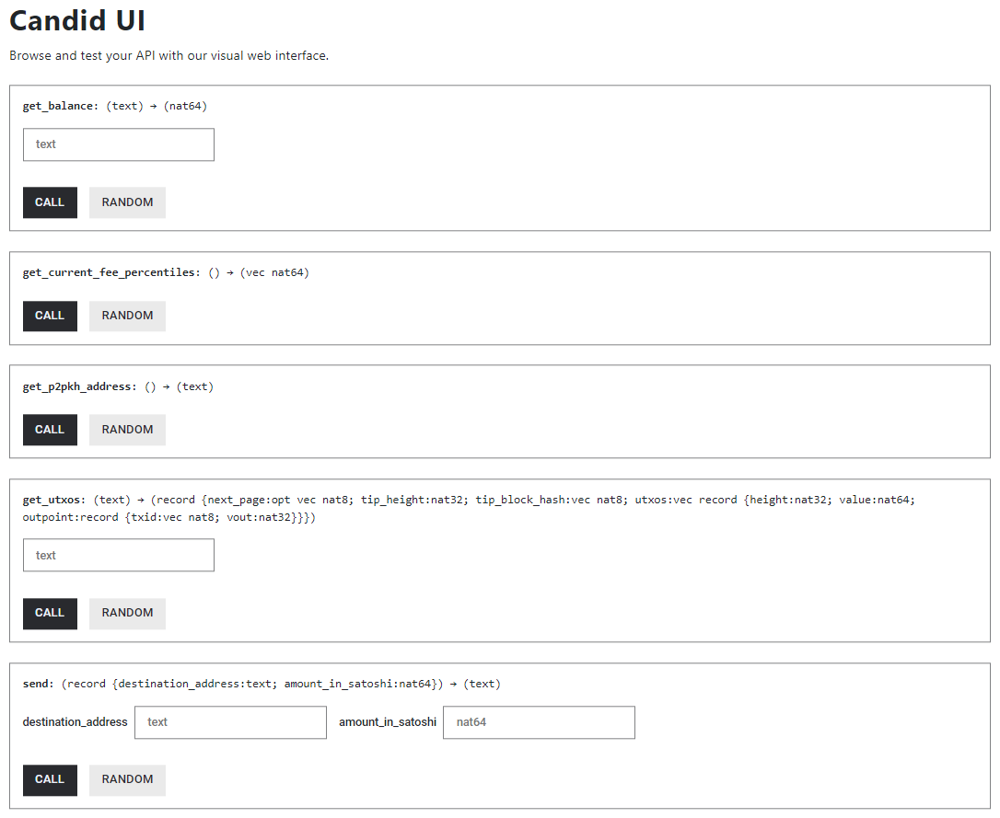
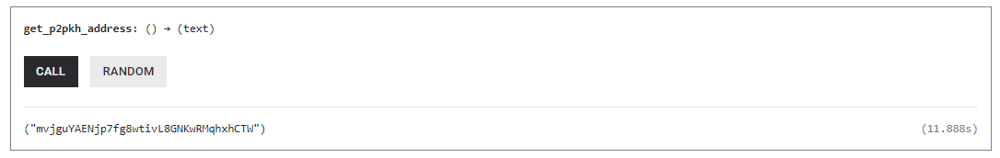
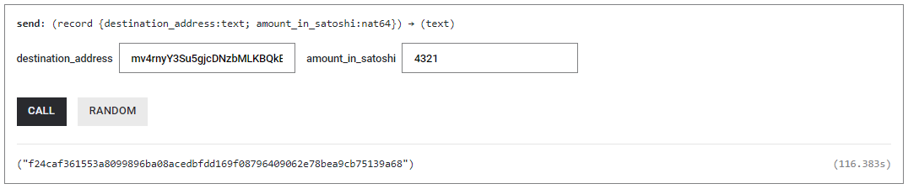

import TeamContact from '../../../contact.md';

# BTC 集成


## 概览 {#overview}

本教程将指导您如何部署一个容器智能合约示例，该合约可以在 IC 上发送和接收比特币。本教程使用[示例仓库](https://github.com/dfinity/examples)中的 `Basic Bitcoin` 示例，该示例内部调用了 IC 的 [门限 ECDSA 接口](https://internetcomputer.org/docs/current/references/ic-interface-spec/#ic-ecdsa_public_key) 和 [比特币接口](https://internetcomputer.org/docs/current/references/ic-interface-spec/#ic-bitcoin-api)。

如果您想要深入了解 IC 和比特币的集成，请参阅 IC 维基百科上的[比特币集成](https://wiki.internetcomputer.org/wiki/Bitcoin_Integration)和 IC 开发者文档的[比特币集成](https://internetcomputer.org/docs/current/developer-docs/integrations/bitcoin/)。 关于门限 ECDSA 接口的使用，可以参考[门限 ECDSA 签名示例](http://localhost:3000/docs/getting-started/code-examples/threshold-ecdsa/)。

## 要求 {#prerequisites}

- 下载并安装 [IC SDK](https://ic123.xyz/docs/getting-started/install-dfx/)。  
- 下载[示例仓库](https://github.com/dfinity/examples)。 

## 部署 {#deploy}

### 下载代码仓库 {#clone-code}

本教程提供了 [Motoko](https://github.com/dfinity/examples/tree/master/motoko/basic_bitcoin) 和 [Rust](https://github.com/dfinity/examples/tree/master/rust/basic_bitcoin) 版本，它们功能相同。您可以根据需要部署其中任何一个。

- 选项 1： 下载 Motoko 版本的代码：

   ```bash
   git clone https://github.com/dfinity/examples
   cd examples/motoko/basic_bitcoin
   git submodule update --init --recursive
   ```

- 选项 2： 下载 Rust 版本的代码：

   ```bash
   git clone https://github.com/dfinity/examples
   cd examples/rust/basic_bitcoin
   git submodule update --init --recursive
   ```

:::info

如果您选择在 MacOS 上下载 Rust 版，则需要安装 `Homebrew` 并运行 `brew install llvm` 才能编译示例。

:::

本教程中我们将使用 Motoko 版本进行演示。

### 获取 cycles {#acquire-cycles}

在将容器部署到 IC 主网之前，您需要获取 cycles。您可以参考[如何获取 cycles](https://ic123.xyz/docs/getting-started/get-cycles/) 从 cycles 水龙头获取免费 cycles。

### IC 主网部署 {#ic-mainnet-deployment}

您可以在命令行执行以下命令将示例中的容器智能合约部署到 IC 主网。

```bash
dfx deploy --network=ic basic_bitcoin --argument '(variant { testnet })'
```

:::info

该命令中使用参数 `--argument '(variant { testnet })'` 初始化容器，使容器连接到比特币的测试网络。具体来说，是比特币社区当前使用的比特币测试网络 `Testnet3`。

要连接到Bitcoin主网，应使用参数 `--argument '(variant { mainnet })'`。

:::

如果执行成功，您将看到如下的输入：

```
Deploying: basic_bitcoin
All canisters have already been created.
Building canisters...
...
Deployed canisters.
URLs:
  Backend canister via Candid interface:
    basic_bitcoin: https://a4gq6-oaaaa-aaaab-qaa4q-cai.raw.icp0.io/?id=<YOUR-CANISTER-ID>
```

至此，您的容器已经上线。您可以通过命令行或者 Candid UI 来访问该容器的公开方法，点击 URL `https://a4gq6-oaaaa-aaaab-qaa4q-cai.raw.icp0.io/?id=<YOUR-CANISTER-ID>`，您将会看到如下图所示的界面：



## 生成比特币地址 {#generate-btc-address}

比特币拥有不同类型的地址（例如 P2PKH，P2SH 等），大多数地址都可以从 ECDSA 公钥生成。本教程中展示了如何使用 [ecdsa_public_key](https://internetcomputer.org/docs/current/references/ic-interface-spec/#ic-ecdsa_public_key) 接口生成 [P2PKH 地址](https://en.bitcoin.it/wiki/Transaction#Pay-to-PubkeyHash)。

在上图所示的 Candid UI 上，点击 `get_p2pkh_address` 方法的 `Call` 按钮以生成 P2PKH 比特币地址，结果如下图所示：



您也可以执行如下命令：

```bash
dfx canister --network=ic call basic_bitcoin get_p2pkh_address
```

:::info

- 您在自己的容器调用 `get_p2pkh_address` 方法看到的比特币地址与上图所示地址不同，是因为您的容器所获得的 ECDSA 公钥是唯一的。

- 您生成的是比特币测试网地址，该地址仅可用于在比特币测试网上发送或接收比特币。

:::

## 接收比特币 {#receive-btc}

现在您已经部署了容器、并且拥有了比特币地址，接下来您可以从比特币水龙头从测试网上接收一些比特币。本教程我们使用 [coinfaucet.eu](https://coinfaucet.eu/) 来接收比特币。

进入 [coinfaucet.eu](https://coinfaucet.eu/) 网站之后，选择 `Bitcoin testnet`，您会看到如下页面：


输入您在[上一步](#generate-btc-address)所生成的比特币地址、并单击 `Get bitcoins!`。上图中使用的是比特币测试网地址 `mvjguYAENjp7fg8wtivL8GNKwRMqhxhCTW`，请确保使用您自己的地址。

下图展示了该地址从比特币测试网上接收了 `0.01816312` 个测试比特币。


当交易至少有一个确认（可能需要等待几分钟），您就可以在您的容器中查询该余额。

## 查询比特币余额 {#check-btc-balance}

您可以调用容器的 `get_balance` 方法在查询比特币地址的余额，该方法调用了 IC 的 [bitcoin_get_balance](https://internetcomputer.org/docs/current/references/ic-interface-spec/#ic-bitcoin_get_balance) 方法。具体调用如下图所示：


在图中的 Candid UI 中，输入您自己的比特币地址，然后单击 `Call`。

您也可以使用命令行调用 `get_balance` 方法，请务必将示例中的 `mvjguYAENjp7fg8wtivL8GNKwRMqhxhCTW` 替换为您自己的比特币地址。

```bash
dfx canister --network=ic call basic_bitcoin get_balance '("mvjguYAENjp7fg8wtivL8GNKwRMqhxhCTW")'
```

## 发送比特币 {#send-btc}

您可以调用容器的 `send` 方法发送比特币。

在 Candid UI 中，您可以输入比特币目标地址和要发送的金额。在下图的示例中，您将向测试网水龙头发送 4,321 Satoshi (0.00004321 BTC)。



您也可以在命令行调用 `send`方法，如下所示：

```bash
dfx canister --network=ic call basic_bitcoin send '(record { destination_address = "mv4rnyY3Su5gjcDNzbMLKBQkBicCtHUtFB"; amount_in_satoshi = 4321; })'
```

这里我们详细描述下 `send` 方法具体发送比特币的步骤，您可以查看该方法的 [Motoko 版本](https://github.com/dfinity/examples/blob/master/motoko/basic_bitcoin/src/basic_bitcoin/src/BitcoinWallet.mo#L60)实现：

1. 调用 [bitcoin_get_current_fee_percentiles](https://internetcomputer.org/docs/current/references/ic-interface-spec/#ic-bitcoin_get_current_fee_percentiles) 方法获取比特币网络上最近费用的百分位数。
2. 调用 [bitcoin_get_utxos](https://internetcomputer.org/docs/current/references/ic-interface-spec/#ic-bitcoin_get_utxos) 方法获取未花费交易输出 (UTXOs)。
3. 使用步骤 2 中的一些 UTXOs 作为输入，将目标地址和发送金额作为输出构建交易。使用步骤 1 中获得的费用百分位数设置适当的费用。
4. 调用 [sign_with_ecdsa](https://internetcomputer.org/docs/current/references/ic-interface-spec/#ic-sign_with_ecdsa) 方法签名交易的输入。
5. 调用 [bitcoin_send_transaction](https://internetcomputer.org/docs/current/references/ic-interface-spec/#ic-bitcoin_send_transaction) 方法将已签名的交易发送至比特币网络。 

`send` 方法将返回它发送至网络的交易 ID，您可以使用区块浏览器跟踪此交易的状态。当交易至少有一个确认，您就可以在您的当前余额中看到变化。

## 总结 {#conclusion}

在本教程中，我们向您展示了：
- 在 IC 上部署一个能够接收和发送比特币的容器智能合约；
- 使用 cycles 水龙头获取免费cycles，并将容器部署到 IC 主网；
- 将容器连接到比特币测试网、并获取比特币地址；
- 使用比特币水龙头获取一些测试网比特币； 
- 检查容器比特币地址的测试网比特币余额；
- 使用容器将测试网比特币发送到另一个比特币地址。

<TeamContact />