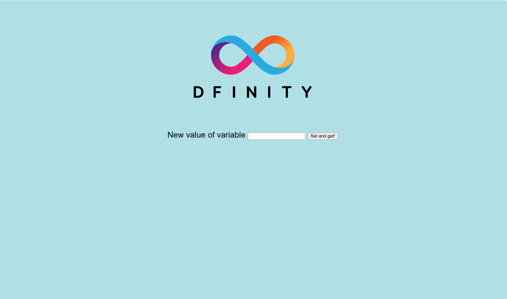
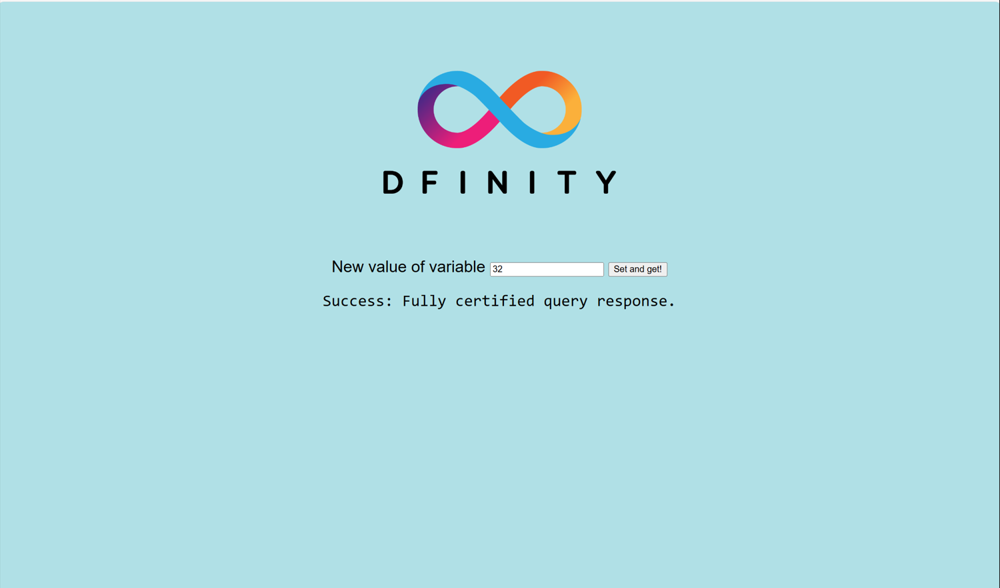

import TeamContact from '../../../contact.md';

# 可认证变量


## 概览 {#overview}

本教程演示了如何使用互联网计算机 (IC) 的[可认证变量](https://ic123.xyz/docs/getting-started/ic-glossary/#certified-variable)功能。

由于查询调用不经过共识，因此其响应不能被认证。通过使用可认证变量，开发者则可以发起能够返回可认证响应的查询调用，这种响应是可以验证和信任的。

可认证变量利用[链钥加密](https://ic123.xyz/docs/getting-started/ic-glossary/#chain-key)生成数字签名，这些签名可以使用 ICP 的单个永久公钥进行验证。这与传统签名有所不同，因为私钥从不存在于单一位置、而始终分布在多个不同节点之中。只有当存储私钥片段的大多数节点在加密协议中合作时，才能生成有效的签名。通过这种方法，应用程序可以立即验证由认证变量所覆盖的数据，而不必信任处理查询响应的单个节点。

认证在[容器](https://ic123.xyz/docs/getting-started/ic-glossary/#canister)级别进行。容器的可认证变量在更新调用中进行设置，而更新调用会改变容器的状态并通过共识。当可认证变量被设置后，开发者可以在未来的查询调用中读取、并在查询调用的响应中以可信和安全的方式返回可认证变量。

从技术上讲，每个容器可以指定一个 32 字节的值，该值将由子网认证。开发者可以使用熟知的 [Merkle 树](https://en.wikipedia.org/wiki/Merkle_tree)、或更通用的[可认证数据结构](https://cs.brown.edu/research/pubs/pdfs/2003/Tamassia-2003-ADS.pdf)将认证从单一的 32 字节值扩展到任意数量的数据。开发者也可以使用类似 [certified-map](https://github.com/dfinity/cdk-rs/tree/main/library/ic-certified-map) 这样的库，从而更轻松地使用该功能。

本示例代码演示了一个保存单个 32 位变量的容器的可认证响应认证。它包含两个部分：

- 后端容器，使用 Motoko 编写；
- 前端容器，用 Javascript 编写。

其中后端容器保存一个单一的可认证变量，为一个 32 位数字；而前端容器代码则查询并认证此数字的当前证书。后端容器在响应中给前端容器提供一个当前证书，该证书由整个 IC 使用特殊系统功能签名。

在前端容器信任来自的后端容器的响应之前，它会进行以下检查并验证其真实性：

1. 验证系统证书；
2. 检查系统证书的时间戳是否超时；
3. 检查系统证书中的容器 ID；
4. 检查响应是否与证据相符。

在步骤 2、3 和 4 中，前端容器从证书 (Blob) 中提取数据。在 `agent-js` 库中，`Certificate` 类提供了一种通过路径访问这些数据的方法。时间和数据的编码都是 Candid。IC 规范使用 LEB128 编码表示时间，而认证数据使用小端序表示。

值得注意的是，当容器所包含的数据不仅仅是示例所示的单个数字、或者查询调用的接口更加复杂，我们通常需要更多的工作来认证每个查询响应：

- 使用 Witnesses 重新计算哈希;
- 检查查询参数是否与 Witnesses 匹配。

而本示例因为只保存了一个单一的 32 位数字，则可以省略这些步骤。

本教程基于 Motoko 版本的示例，目前没有 Rust 版本。

## 要求 {#prerequisites}

- 下载并安装 [IC SDK](https://ic123.xyz/docs/getting-started/install-dfx/)。  
- 下载[示例仓库](https://github.com/dfinity/examples)。 

## 进入示例 {#navigate-into-example}

按照如下命令进入包含项目文件的文件夹，并使用启动 IC 的本地开发环境。

```bash
cd examples/motoko/cert-var
dfx start --background
```

## 安装前端容器依赖 {#install-dependencies}

```bash
npm install
```

## 本地部署 {#deploy}

您可以执行以下脚本将您的容器部署到 IC 的本地开发环境。

```bash
dfx deploy
```

如果成功，您将会看到类似如下的输出信息：

```bash
...
Deployed canisters.
URLs:
  Frontend canister via browser
    cert_var_assets:
      - http://127.0.0.1:4943/?canisterId=bd3sg-teaaa-aaaaa-qaaba-cai
      - http://bd3sg-teaaa-aaaaa-qaaba-cai.localhost:4943/
  Backend canister via Candid interface:
    cert_var: http://127.0.0.1:4943/?canisterId=be2us-64aaa-aaaaa-qaabq-cai&id=bkyz2-fmaaa-aaaaa-qaaaq-cai
...
```

## 测试 dapp {#test}

请在浏览器中打开 `cert_var_assets` 的 URL，您将会看到如下界面：



请输入一个数字，并点击 `Set and get!` 按钮。

当运行完成，您会看到如下所示界面：



<TeamContact />
