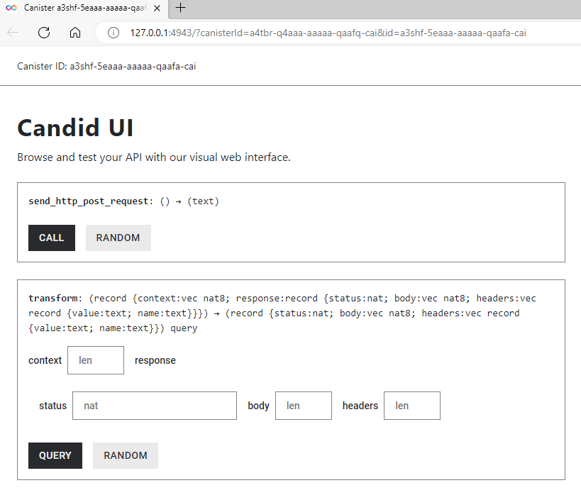

import TeamContact from '../../../contact.md';

# HTTPS outcalls

## 概览 {#overview}

直到现在区块链都是孤立的实体，智能合约无法直接与外部服务器或其他区块链进行通信。其中的根本原因是区块链是一个复制状态机，其中每个副本都需要对相同的状态执行相同的计算、以便在每一轮中进行相同的转换。如果以一种过于简单的方式将外部服务的结果作为输入进行计算，会很容易导致副本之间的状态发生分歧，因此需要一些周全的技术考量才可行。

互联网计算机上的容器 HTTP(S) requests 或 HTTP(S) outcalls 功能，使得区块链历史上首次能够让智能合约直接调用区块链外部的 HTTP(S) 服务器、并在智能合约中使用响应，从而可以安全地使用这些输入更新复制状态。

:::info

在本文档的其余部分中，HTTP 代表 HTTP 和 HTTPS，它指代的是底层协议。实际上，目前公共网络上的 HTTP 流量基本都是通过安全的 HTTPS 进行的。

:::

在此之前，智能合约与外部服务器通信的唯一手段是通过预言机 (Oracles)。而相比于目前使用的预言机模型，容器 `HTTPS outcalls` 支持许多用例、具有很多优势：

- 更强的信任模型：容器 HTTPS outcalls 基于更强的信任模型，因为智能合约与外部服务器通信不需要外部中介（预言机）。

- 更低的费用：没有中介来收取额外的服务费。

- 更接近标准的编程范式：与使用预言机相比，智能合约直接向外部服务器发起 HTTPS requests 的编程范式更接近工程师所习惯的“正常的”编程范式。

容器 HTTPS outcalls 有许多用例，以下是一些典型的例子：

- 最重要的用例之一是从外部 HTTPS APIs 读取数据。例如，去中心化交易所中使用的定价数据或去中心化保险应用中使用的天气数据等。

- 物联网 dapps 需要从与传感器交互的传统服务器获取数据。未来互联网计算机甚至预想与传感器直接交互。

- 聊天服务向用户发送有关消息的推送通知。

预想中大多数 HTTPS outcalls 是为了读取 Web 2.0 数据的 GET 调用；但 POST 调用能够向Web 2.0服务器写入数据，显然也对与外部系统的交互有着重要作用。

## 核心概念 {#key-concepts}

### 支持的方法 {#methods-supported}

HTTPS outcalls 功能目前支持使用 GET，HEAD 和 POST 方法进行 HTTPS requests。

### IC 管理容器 {#ic-management-canister}

为了让容器使用 HTTPS outcalls，它需要调用 IC 的系统接口。容器可以通过向 IC 管理容器发送消息来调用系统接口，目的是让使用系统接口像调用另一个容器一样简单。IC 管理容器可以通过使用标识符 `aaaaa-aa` 来唤起。 

:::info

[IC 管理容器](https://internetcomputer.org/docs/current/references/ic-interface-spec/#ic-management-canister)遵循了[外观设计模式](https://en.wikipedia.org/wiki/Facade_pattern)，也就是说并没有一个真正意义上的容器（具有隔离的状态，Wasm 代码等）存在。

:::

### Cycles

使用 HTTPS outcalls 需要支付 cycles，而用于支付调用的 cycles 必须与调用一起明确地转移，即它们不会从调用者的 cycles 余额中隐式地扣除。

关于具体的价格可以参考 [gas 费用](https://internetcomputer.org/docs/current/developer-docs/gas-cost) 和 [HTTPS outcalls 费用](https://internetcomputer.org/docs/current/developer-docs/integrations/https-outcalls/https-outcalls-how-it-works#pricing)。

## HTTP outcalls 接口

根据[互联网计算机接口规范](https://internetcomputer.org/docs/current/references/ic-interface-spec)，容器可以按[以下构造](https://internetcomputer.org/docs/current/references/ic-interface-spec#ic-http_request)使用 `http_request` 方法：

### 请求 {#request}

HTTP outcalls 请求中应提供以下参数：

- `url`：请求的 URL。URL 必须符合 [RFC-3986](https://www.ietf.org/rfc/rfc3986.txt) 的规范，且长度不得超过 8192。URL 可以指定自定义端口号。

- `max_response_bytes`：可选，用来指定响应的最大字节数。如果提供了该参数，值不得超过 `2MB`（`2_000_000B`）。如果未提供，则使用最大值 `2MB`。请求调用将根据此参数收费，具体计费法则请参考 [HTTPS outcalls 费用](https://internetcomputer.org/docs/current/developer-docs/integrations/https-outcalls/https-outcalls-how-it-works#pricing)。

- `method`：目前，只支持 GET、HEAD 和 POST。

- `headers`：HTTP 请求头部及其对应值的列表。

- `body`：可选；请求主体的内容。

- `transform`：一个可选的函数，用于将原始响应转换为经过整理的响应，以及在调用时提供给该函数的字节编码的上下文和要整理的响应。如果提供了该函数，发起调用的容器必须导出此函数。

### 响应 {#response}

返回的响应（以及提供给 transform 函数的响应）包含以下字段：

- `status`：响应状态（例如，200，404）。

- `headers`：HTTP 响应头部及其对应值的列表。

- `body`：响应的正文。

## 资源 {#resources}

如果您想深入了解 HTTPS outcalls 功能是如何工作的、以及在开发容器时如何使用它，请参阅[参考文档](https://internetcomputer.org/docs/current/developer-docs/integrations/https-outcalls/https-outcalls-how-it-works)。

在[示例代码仓库](https://github.com/dfinity/examples)中，您可以找到一些示例，可以作为构建自己的 dapps 的起点：

- [Rust 中进行 HTTP GET 请求的示例代码](https://github.com/dfinity/examples/tree/master/rust/send_http_get)
- [Motoko 中进行 HTTP GET 请求的示例代码](https://github.com/dfinity/examples/tree/master/motoko/send_http_get)
- [Rust 中进行 HTTP POST 请求的示例代码](https://github.com/dfinity/examples/tree/master/rust/send_http_post)
- [Motoko 中进行 HTTP POST 请求的示例代码](https://github.com/dfinity/examples/tree/master/motoko/send_http_post)

## HTTPS outcalls: GET {#https-outcalls-get}

这里我们实现一个进行 `GET` HTTPS request 的最简单示例。这个 dapp 的目的只是展示如何从容器发送 HTTPS request。示例代码包含 Motoko 和 Rust 两个版本，展示了容器向 Coinbase API 发送一个 GET 请求，并获取一些关于 ICP 代币的历史数据。

这个示例容器的主要意图是向开发者展示如何进行[幂等](https://en.wikipedia.org/wiki/Idempotence)的 GET 请求，只需要不到 5 分钟就能完成。

### 示例 dapp {#sample-dapp-get}

本教程中的容器包含一个名为 `get_icp_usd_exchange()` 的公共方法。当该方法被调用时，它会触发一个指向某个外部服务的 `HTTPS GET request`。该示例只有一个后端容器，您可以通过 `Candid Web UI` 与它的公共方法进行交互，如下图所示：


`get_icp_usd_exchange()` 方法返回的是某一天 USD 和 ICP 之间的汇率的 Coinbase 数据，对应的 API 响应如下所示：

```
  [
     [
         1682978460, <-- start timestamp
         5.714, <-- lowest price during time range 
         5.718, <-- highest price during range
         5.714, <-- price at open
         5.714, <-- price at close
         243.5678 <-- volume of  traded
     ],
  ]
```

### Motoko 版本 {#motoko-version-get}

#### Motoko 代码结构 {#motoko-code-structure-get}

在您深入了解之前，我们先介绍您将要接触的代码的大致结构：

- main.mo

  ```jsx
  //Import some custom types from `src/backend_canister/Types.mo` file
  import Types "Types";

  actor {

    //0. method that uses the HTTP outcalls feature and returns a string
    public func foo() : async Text {

      //1. DECLARE MANAGEMENT CANISTER
      let ic : Types.IC = actor ("aaaaa-aa");

      //2. SETUP ARGUMENTS FOR HTTP GET request
      let request : Types.HttpRequestArgs = {
          //construct the request
      };

      //3. ADD CYCLES TO PAY FOR HTTP REQUEST
      //code to add cycles

      //4. MAKE HTTPS REQUEST AND WAIT FOR RESPONSE
      let response : Types.HttpResponsePayload = await ic.http_request(request);

      //5. DECODE THE RESPONSE
      //code to decode response

      //6. RETURN RESPONSE OF THE BODY
      response
    };

    //7. CREATE TRANSFORM FUNCTION
    public query func transform(raw : Types.TransformArgs) : async Types.CanisterHttpResponsePayload { 
      ////code for the transform function
    }

  };
  ```

- Types.mo

  ```jsx
  module Types {

      //type declarations for HTTP requests, HTTP responses, management canister, etc...

  }
  ```

#### Motoko 步骤 {#motoko-steps-get}

- 进入您想要创建工程的目录，执行以下命令创建新工程：
  ```
  dfx new --no-frontend send_http_get_motoko
  cd send_http_get_motoko
  ```
  这里我们使用了 `--no-frontend` 选项，创建了一个最简单的工程。

- 打开 `dfx.json` 文件，替换为以下内容：

  ```
  {
    "canisters": {
      "send_http_get_motoko_backend": {
        "main": "src/send_http_get_motoko_backend/main.mo",
        "type": "motoko"
      }
    },
    "defaults": {
      "build": {
        "args": "",
        "packtool": ""
      }
    },
    "output_env_file": ".env",
    "version": 1
  } 
  ```
  这样您的工程只包含一个后端容器，同时您可以删除掉 `src\send_http_get_motoko_frontend` 目录。

- 打开 `src/send_http_get_motoko_backend/main.mo` 替换为以下内容：

  ```jsx
  import Debug "mo:base/Debug";
  import Blob "mo:base/Blob";
  import Cycles "mo:base/ExperimentalCycles";
  import Error "mo:base/Error";
  import Array "mo:base/Array";
  import Nat8 "mo:base/Nat8";
  import Nat64 "mo:base/Nat64";
  import Text "mo:base/Text";

  //import the custom types you have in Types.mo
  import Types "Types";

  //Actor
  actor {

  //This method sends a GET request to a URL with a free API you can test.
  //This method returns Coinbase data on the exchange rate between USD and ICP 
  //for a certain day.
  //The API response looks like this:
  //  [
  //     [
  //         1682978460, <-- start timestamp
  //         5.714, <-- lowest price during time range 
  //         5.718, <-- highest price during range
  //         5.714, <-- price at open
  //         5.714, <-- price at close
  //         243.5678 <-- volume of ICP traded
  //     ],
  // ]
    
    public func get_icp_usd_exchange() : async Text {

      //1. DECLARE MANAGEMENT CANISTER
      //You need this so you can use it to make the HTTP request
      let ic : Types.IC = actor ("aaaaa-aa");

      //2. SETUP ARGUMENTS FOR HTTP GET request

      // 2.1 Setup the URL and its query parameters
      let ONE_MINUTE : Nat64 = 60;
      let start_timestamp : Types.Timestamp = 1682978460; //May 1, 2023 22:01:00 GMT
      let end_timestamp : Types.Timestamp = 1682978520;//May 1, 2023 22:02:00 GMT
      let host : Text = "api.pro.coinbase.com";
      let url = "https://" # host # "/products/ICP-USD/candles?start=" # Nat64.toText(start_timestamp) # "&end=" # Nat64.toText(start_timestamp) # "&granularity=" # Nat64.toText(ONE_MINUTE);

      // 2.2 prepare headers for the system http_request call
      let request_headers = [
          { name = "Host"; value = host # ":443" },
          { name = "User-Agent"; value = "exchange_rate_canister" },
      ];

      // 2.2.1 Transform context
      let transform_context : Types.TransformContext = {
        function = transform;
        context = Blob.fromArray([]);
      };

      // 2.3 The HTTP request
      let http_request : Types.HttpRequestArgs = {
          url = url;
          max_response_bytes = null; //optional for request
          headers = request_headers;
          body = null; //optional for request
          method = #get;
          transform = ?transform_context;
      };

      //3. ADD CYCLES TO PAY FOR HTTP REQUEST

      //The IC specification spec says, "Cycles to pay for the call must be explicitly transferred with the call"
      //The management canister will make the HTTP request so it needs cycles
      //See: https://internetcomputer.org/docs/current/motoko/main/cycles
      
      //The way Cycles.add() works is that it adds those cycles to the next asynchronous call
      //"Function add(amount) indicates the additional amount of cycles to be transferred in the next remote call"
      //See: https://internetcomputer.org/docs/current/references/ic-interface-spec/#ic-http_request
      Cycles.add(20_949_972_000);
      
      //4. MAKE HTTPS REQUEST AND WAIT FOR RESPONSE
      //Since the cycles were added above, you can just call the management canister with HTTPS outcalls below
      let http_response : Types.HttpResponsePayload = await ic.http_request(http_request);
      
      //5. DECODE THE RESPONSE

      //As per the type declarations in `src/Types.mo`, the BODY in the HTTP response 
      //comes back as [Nat8s] (e.g. [2, 5, 12, 11, 23]). Type signature:
      
      //public type HttpResponsePayload = {
      //     status : Nat;
      //     headers : [HttpHeader];
      //     body : [Nat8];
      // };

      //You need to decode that [Nat8] array that is the body into readable text. 
      //To do this, you:
      //  1. Convert the [Nat8] into a Blob
      //  2. Use Blob.decodeUtf8() method to convert the Blob to a ?Text optional 
      //  3. You use a switch to explicitly call out both cases of decoding the Blob into ?Text
      let response_body: Blob = Blob.fromArray(http_response.body);
      let decoded_text: Text = switch (Text.decodeUtf8(response_body)) {
          case (null) { "No value returned" };
          case (?y) { y };
      };

      //6. RETURN RESPONSE OF THE BODY
      //The API response will looks like this:

      // ("[[1682978460,5.714,5.718,5.714,5.714,243.5678]]")

      //Which can be formatted as this
      //  [
      //     [
      //         1682978460, <-- start/timestamp
      //         5.714, <-- low
      //         5.718, <-- high
      //         5.714, <-- open
      //         5.714, <-- close
      //         243.5678 <-- volume
      //     ],
      // ]
      decoded_text
    };

    //7. CREATE TRANSFORM FUNCTION
    public query func transform(raw : Types.TransformArgs) : async Types.CanisterHttpResponsePayload {
        let transformed : Types.CanisterHttpResponsePayload = {
            status = raw.response.status;
            body = raw.response.body;
            headers = [
                {
                    name = "Content-Security-Policy";
                    value = "default-src 'self'";
                },
                { name = "Referrer-Policy"; value = "strict-origin" },
                { name = "Permissions-Policy"; value = "geolocation=(self)" },
                {
                    name = "Strict-Transport-Security";
                    value = "max-age=63072000";
                },
                { name = "X-Frame-Options"; value = "DENY" },
                { name = "X-Content-Type-Options"; value = "nosniff" },
            ];
        };
        transformed;
    };
  };
  ```

  :::info

  上述代码有可能更新，请参考 [main.mo](https://github.com/dfinity/examples/blob/master/motoko/send_http_get/src/send_http_get_backend/main.mo) 获取最新版本。

  :::

  - `get_icp_usd_exchange()` 是一个更新调用。因为要经过共识，所有执行 HTTPS outcalls 的方法都必须是更新调用，即使该 HTTPS outcall 调用仅仅是一个 GET 请求。

  - 上面的代码添加了 `20_949_972_000` 个 cycles。通常对于 GET 请求这个设置是足够的，不过您还是有可能需要根据具体情况进行调整。

  - 上面的代码导入了 `Types.mo`，以将自定义类型与 actor 文件分开。

- 创建 `src/send_http_get_motoko_backend/Types.mo` 文件，并将其内容替换为以下文本：

  ```jsx
  module Types {

    public type Timestamp = Nat64;
    
    //1. Type that describes the Request arguments for an HTTPS outcall
      //See: https://internetcomputer.org/docs/current/references/ic-interface-spec/#ic-http_request
      public type HttpRequestArgs = {
          url : Text;
          max_response_bytes : ?Nat64;
          headers : [HttpHeader];
          body : ?[Nat8];
          method : HttpMethod;
          transform : ?TransformRawResponseFunction;
      };

      public type HttpHeader = {
          name : Text;
          value : Text;
      };

      public type HttpMethod = {
          #get;
          #post;
          #head;
      };

      public type HttpResponsePayload = {
          status : Nat;
          headers : [HttpHeader];
          body : [Nat8];
      };

      //2. HTTPS outcalls have an optional "transform" key. These two types help describe it.
      //"The transform function may, for example, transform the body in any way, add or remove headers, 
      //modify headers, etc. "
      //See: https://internetcomputer.org/docs/current/references/ic-interface-spec/#ic-http_request

      //2.1 This type describes a function called "TransformRawResponse" used in line 14 above
      //"If provided, the calling canister itself must export this function." 
      //In this minimal example for a `GET` request, you declare the type for completeness, but 
      //you do not use this function. You will pass "null" to the HTTP request.
      public type TransformRawResponseFunction = {
          function : shared query TransformArgs -> async HttpResponsePayload;
          context : Blob;
      };

      //2.2 These types describes the arguments the transform function needs
      public type TransformArgs = {
          response : HttpResponsePayload;
          context : Blob;
      };

      public type CanisterHttpResponsePayload = {
          status : Nat;
          headers : [HttpHeader];
          body : [Nat8];
      };

      public type TransformContext = {
          function : shared query TransformArgs -> async HttpResponsePayload;
          context : Blob;
      };

      //3. Declaring the management canister which you use to make the HTTPS outcall
      public type IC = actor {
          http_request : HttpRequestArgs -> async HttpResponsePayload;
      };

  }
  ```

  :::info

  上述代码有可能更新，请参考 [Types.mo](https://github.com/dfinity/examples/blob/master/motoko/send_http_get/src/send_http_get_backend/Types.mo) 获取最新版本。

  :::

- 本地部署并测试。

  执行以下命令：
  ```
  dfx start --background
  dfx deploy
  ```

  如果成功，您将在命令行看到类似如下的输出：
  ```
  Deployed canisters.
  URLs:
    Backend canister via Candid interface:
      send_http_get_motoko_backend: http://127.0.0.1:4943/?canisterId=avqkn-guaaa-aaaaa-qaaea-cai&id=b77ix-eeaaa-aaaaa-qaada-cai
  ```

  您可以打开 Candid Web UI 并调用 `get_icp_usd_exchange()` 方法。

- 在 IC 主网部署并测试。

  执行以下命令：
  ```
  dfx deploy --network ic
  ```

  如果成功，您将在命令行看到类似如下的输出：
  ```
  Deployed canisters.
  URLs:
    Backend canister via Candid interface:
      send_http_get_motoko_backend: https://a4gq6-oaaaa-aaaab-qaa4q-cai.raw.icp0.io/?id=eppuh-hqaaa-aaaan-qlsoa-cai
  ```

  同样您可以打开 Candid Web UI 并调用 `get_icp_usd_exchange()` 方法。


### Rust 版本 {#rust-version-get}

#### Rust 代码结构 {#rust-code-structure-get}

在您深入了解之前，我们先介绍您将要接触的代码的大致结构：

```jsx
//1. DECLARE MANAGEMENT CANISTER
use ic_cdk::api::management_canister::http_request::{
    http_request, CanisterHttpRequestArgument, HttpHeader, HttpMethod, HttpResponse, TransformArgs,
    TransformContext,
};

//Update method using the HTTPS outcalls feature
#[ic_cdk::update]
async fn foo() {
    //2. SETUP ARGUMENTS FOR HTTP GET request
    let request = CanisterHttpRequestArgument {
        //instantiate the request
    };

    //3. MAKE HTTPS REQUEST AND WAIT FOR RESPONSE
    //Note: in Rust, `http_request()` already sends the cycles needed 
    //so no need for explicit Cycles.add() as in Motoko
    match http_request(request).await {
        
        //4. DECODE AND RETURN THE RESPONSE
        Ok((response,)) => {
            //Ok case 
        }
        Err((r, m)) => {
            //error case
        }
    }
}

// 4. CREATE TRANSFORM FUNCTION 
#[query]
fn transform(raw: TransformArgs) -> HttpResponse { }
```

#### Rust 步骤 {#rust-steps-get}

- 进入您想要创建工程的目录，执行以下命令创建新工程：
  ```
  dfx new --type=rust --no-frontend send_http_get_rust
  cd send_http_get_rust
  ```
  这里我们使用了 `--no-frontend` 选项，创建了一个最简单的工程。

- 打开 `dfx.json` 文件，替换为以下内容：

  ```
  {
    "canisters": {
      "send_http_get_rust_backend": {
        "candid": "src/send_http_get_rust_backend/send_http_get_rust_backend.did",
        "package": "send_http_get_rust_backend",
        "type": "rust"
      }
    },
    "defaults": {
      "build": {
        "args": "",
        "packtool": ""
      }
    },
    "output_env_file": ".env",
    "version": 1
  }
  ```
  这样您的工程只包含一个后端容器，同时您可以删除掉 `src\send_http_get_rust_frontend` 目录。

- 打开 `src/send_http_get_rust_backend/src/lib.rs` 替换为以下内容：

  ```jsx
  //1. IMPORT MANAGEMENT CANISTER
  //This includes all methods and types needed
  use ic_cdk::api::management_canister::http_request::{
      http_request, CanisterHttpRequestArgument, HttpHeader, HttpMethod, HttpResponse, TransformArgs,
      TransformContext, TransformFunc,
  };

  use ic_cdk_macros::{query, update};

  //Update method using the HTTPS outcalls feature
  #[update]
  async fn get_icp_usd_exchange() -> String {
      //2. SETUP ARGUMENTS FOR HTTP GET request

      // 2.1 Setup the URL and its query parameters
      type Timestamp = u64;
      let start_timestamp: Timestamp = 1682978460; //May 1, 2023 22:01:00 GMT
      let seconds_of_time: u64 = 60; //start with 60 seconds
      let host = "api.pro.coinbase.com";
      let url = format!(
          "https://{}/products/ICP-USD/candles?start={}&end={}&granularity={}",
          host, start_timestamp, start_timestamp, seconds_of_time
      );

      // 2.2 prepare headers for the system http_request call
      //Note that `HttpHeader` is declared in line 4
      let request_headers = vec![
          HttpHeader {
              name: "Host".to_string(),
              value: format!("{host}:443"),
          },
          HttpHeader {
              name: "User-Agent".to_string(),
              value: "exchange_rate_canister".to_string(),
          },
      ];

      //note "CanisterHttpRequestArgument" and "HttpMethod" are declared in line 4
      let request = CanisterHttpRequestArgument {
          url: url.to_string(),
          method: HttpMethod::GET,
          body: None,               //optional for request
          max_response_bytes: None, //optional for request
          transform: Some(TransformContext {
              // The "method" parameter needs to the same name as the function name of your transform function
              function: TransformFunc(candid::Func {
                  principal: ic_cdk::api::id(),
                  method: "transform".to_string(),
              }),
              // The "TransformContext" function does need a context parameter, it can be empty
              context: vec![],
          }),
          headers: request_headers,
      };

      //3. MAKE HTTPS REQUEST AND WAIT FOR RESPONSE

      //Note: in Rust, `http_request()` needs to pass cycles if you are using ic_cdk: ^0.9.0
      let cycles = 230_949_972_000;

      match http_request(request, cycles).await {
          //4. DECODE AND RETURN THE RESPONSE

          //See:https://docs.rs/ic-cdk/latest/ic_cdk/api/management_canister/http_request/struct.HttpResponse.html
          Ok((response,)) => {
              //if successful, `HttpResponse` has this structure:
              // pub struct HttpResponse {
              //     pub status: Nat,
              //     pub headers: Vec<HttpHeader>,
              //     pub body: Vec<u8>,
              // }

              //You need to decode that Vec<u8> that is the body into readable text.
              //To do this:
              //  1. Call `String::from_utf8()` on response.body
              //  3. You use a switch to explicitly call out both cases of decoding the Blob into ?Text

              //The API response will looks like this:

              // ("[[1682978460,5.714,5.718,5.714,5.714,243.5678]]")

              //Which can be formatted as this
              //  [
              //     [
              //         1682978460, <-- start/timestamp
              //         5.714, <-- low
              //         5.718, <-- high
              //         5.714, <-- open
              //         5.714, <-- close
              //         243.5678 <-- volume
              //     ],
              //  ]

              //Return the body as a string and end the method
              String::from_utf8(response.body).expect("Transformed response is not UTF-8 encoded.")
          }
          Err((r, m)) => {
              let message =
                  format!("The http_request resulted into error. RejectionCode: {r:?}, Error: {m}");

              //Return the error as a string and end the method
              message
          }
      }
  }

  // Strips all data that is not needed from the original response.
  #[query]
  fn transform(raw: TransformArgs) -> HttpResponse {
      let headers = vec![
          HttpHeader {
              name: "Content-Security-Policy".to_string(),
              value: "default-src 'self'".to_string(),
          },
          HttpHeader {
              name: "Referrer-Policy".to_string(),
              value: "strict-origin".to_string(),
          },
          HttpHeader {
              name: "Permissions-Policy".to_string(),
              value: "geolocation=(self)".to_string(),
          },
          HttpHeader {
              name: "Strict-Transport-Security".to_string(),
              value: "max-age=63072000".to_string(),
          },
          HttpHeader {
              name: "X-Frame-Options".to_string(),
              value: "DENY".to_string(),
          },
          HttpHeader {
              name: "X-Content-Type-Options".to_string(),
              value: "nosniff".to_string(),
          },
      ];

      let mut res = HttpResponse {
          status: raw.response.status.clone(),
          body: raw.response.body.clone(),
          headers,
      };

      if res.status == 200u64 {
          res.body = raw.response.body;
      } else {
          ic_cdk::api::print(format!("Received an error from coinbase: err = {:?}", raw));
      }
      res
  }
  ```

  :::info

  上述代码有可能更新，请参考 [lib.rs](https://github.com/dfinity/examples/blob/master/rust/send_http_get/src/send_http_get_backend/src/lib.rs) 获取最新版本。

  :::

  - `get_icp_usd_exchange() -> String` 返回了一个字符串。这不是必须的，本教程中这样做是为了更容易测试。

  - `lib.rs` 文件使用了 [http_request](https://docs.rs/ic-cdk/latest/ic_cdk/api/management_canister/http_request/fn.http_request.html)，这是 Rust CDK 提供的一个方法，它在底层向 IC 管理容器发送 cycles。该方法能够计算出在大多数情况下，对于一个 13 节点的子网需要发送多少cycles。如果您的 HTTPS outcall 需要更多的 cycles，请使用 `http_request_with_cycles()` 方法，并明确地提供所需的 cycles 数量。

  - 上面使用的 Rust CDK 方法 `http_request` 封装了 IC 管理容器的 `http_request` 方法，但它们两者并不严格相同。

- 打开 `src/send_http_get_rust_backend/send_http_get_rust_backend.did` 文件，替换为以下内容：
  
  ```
  service : {
      "get_icp_usd_exchange": () -> (text);
  }  
  ```

  这样 Candid 接口文件就能匹配 `src/send_http_get_rust_backend/src/lib.rs` 中的 `get_icp_usd_exchange()` 方法。

- 打开 `src/send_http_get_rust_backend/Cargo.toml` 文件，替换为以下内容：
  ```
  [package]
  name = "send_http_get_rust_backend"
  version = "0.1.0"
  edition = "2021"

  # See more keys and their definitions at https://doc.rust-lang.org/cargo/reference/manifest.html

  [lib]
  crate-type = ["cdylib"]

  [dependencies]
  candid = "0.10.2"
  ic-cdk = "0.12.1"
  ic-cdk-macros = "0.8.4"
  ```

- 本地部署并测试。

  执行以下命令：
  ```
  dfx start --background
  dfx deploy
  ```

  如果成功，您将在命令行看到类似如下的输出：
  ```
  Deployed canisters.
  URLs:
    Backend canister via Candid interface:
      send_http_get_rust_backend: http://127.0.0.1:4943/?canisterId=avqkn-guaaa-aaaaa-qaaea-cai&id=b77ix-eeaaa-aaaaa-qaada-cai
  ```

  您可以打开 Candid Web UI 并调用 `get_icp_usd_exchange()` 方法。

- 在 IC 主网部署并测试。

  执行以下命令：
  ```
  dfx deploy --network ic
  ```

  如果成功，您将在命令行看到类似如下的输出：
  ```
  Deployed canisters.
  URLs:
    Backend canister via Candid interface:
      send_http_get_rust_backend: https://a4gq6-oaaaa-aaaab-qaa4q-cai.raw.icp0.io/?id=eppuh-hqaaa-aaaan-qlsoa-cai
  ```

  同样您可以打开 Candid Web UI 并调用 `get_icp_usd_exchange()` 方法。

## HTTPS outcalls: POST

这里我们实现一个进行 POST HTTPS request 的最简单示例。示例代码包含 Motoko 和 Rust 两个版本，展示了容器向一个免费的 API 发送一个带有 JSON 数据 的 POST 请求、并验证头部和正文是否发送正确。

这个示例容器的主要意图是向开发者展示如何进行[幂等](https://en.wikipedia.org/wiki/Idempotence)的 POST 请求，只需要不到 5 分钟就能完成。

:::info

HTTPS outcalls 功能只适用于向支持 IPV6 的服务器或 API 端点发送 HTTP POST 请求。

:::

### 示例 dapp {#sample-dapp-post}

本教程中的容器包含一个名为 `send_http_post_request()` 的公共方法。当该方法被调用时，它会触发一个 HTTP POST request。该示例只有一个后端容器，您可以通过 Candid Web UI 与它的公共方法进行交互，如下图所示：



当您调用该方法时，容器将发送一个 HTTP POST 请求，其响应体中包含如下 JSON 数据：

```
{
    "name": "Grogu",
    "force_sensitive": "true"
}
```

#### 验证 HTTP POST request {#verify-http-post-request}

为了验证您的容器发送了您期望的 HTTP request，该示例容器向一个[公开的 API 服务](https://putsreq.com/aL1QS5IbaQd4NTqN3a81/inspect)发送 HTTP request，您可以在那里检查 HTTP request。如下图所示，您可以检查 POST request 的头部和正文，以确保它是容器所发送的内容。


### 关于 POST requests 的重要注意事项 {#http-post-request-notes}

由于 HTTPS outcalls 需要经过共识，开发者应该预期容器发出的任何 HTTPS POST request 都会被多次发送。即使不是 Web3 的世界，也存在多个相同的 POST 请求会被发送的问题，因为客户端出于各种原因（例如目标服务器不可用）而重试请求是很常见的。

HTTP POST request 的建议使用方式是在头部添加幂等性键，以便目标服务器知道哪些来自客户端的 POST requests 是相同的。

开发者应该小心，目标服务器需要能理解和使用幂等性键。一个容器可以被编写为发送幂等性键，但最终还是由服务器决定如何处理它们。这里有一个使用幂等性键的 API 服务的[例子](https://stripe.com/docs/api/idempotent_requests)，供大家参考。

### Motoko 版本 {#motoko-version-post}

#### Motoko 代码结构 {#motoko-code-structure-post}

在您深入了解之前，我们先介绍您将要接触的代码的大致结构：

- main.mo

  ```jsx
  //Import some custom types from `src/backend_canister/Types.mo` file
  import Types "Types";

  actor {

  //method that uses the HTTP outcalls feature and returns a string
    public func foo() : async Text {

      //1. DECLARE MANAGEMENT CANISTER
      let ic : Types.IC = actor ("aaaaa-aa");

      //2. SETUP ARGUMENTS FOR HTTP GET request
      let request : Types.HttpRequestArgs = {
          //construct the request
      };

      //3. ADD CYCLES TO PAY FOR HTTP REQUEST
      //code to add cycles

      //4. MAKE HTTPS REQUEST AND WAIT FOR RESPONSE
      let response : Types.HttpResponsePayload = await ic.http_request(request);

      //5. DECODE THE RESPONSE
      //code to decode response

      //6. RETURN RESPONSE OF THE BODY
      response
    };
  };
  ```

- Types.mo

  ```jsx
  module Types {

      //type declarations for HTTP requests, HTTP responses, management canister, etc...

  }
  ```

#### Motoko 步骤 {#motoko-steps-post}

- 进入您想要创建工程的目录，执行以下命令创建新工程：
  ```
  dfx new --no-frontend send_http_post_motoko
  cd send_http_post_motoko
  ```
  这里我们使用了 `--no-frontend` 选项，创建了一个最简单的工程。

- 打开 `dfx.json` 文件，替换为以下内容：

  ```
  {
    "canisters": {
      "send_http_post_motoko_backend": {
        "main": "src/send_http_post_motoko_backend/main.mo",
        "type": "motoko"
      }
    },
    "defaults": {
      "build": {
        "args": "",
        "packtool": ""
      }
    },
    "output_env_file": ".env",
    "version": 1
  }
  ```
  这样您的工程只包含一个后端容器，同时您可以删除掉 `src\send_http_post_motoko_frontend` 目录。

- 打开 `src/send_http_post_motoko_backend/main.mo` 替换为以下内容：

  ```jsx
  import Debug "mo:base/Debug";
  import Blob "mo:base/Blob";
  import Cycles "mo:base/ExperimentalCycles";
  import Array "mo:base/Array";
  import Nat8 "mo:base/Nat8";
  import Text "mo:base/Text";

  //import the custom types you have in Types.mo
  import Types "Types";

  actor {

    //function to transform the response
    public query func transform(raw : Types.TransformArgs) : async Types.CanisterHttpResponsePayload {
        let transformed : Types.CanisterHttpResponsePayload = {
            status = raw.response.status;
            body = raw.response.body;
            headers = [
                {
                    name = "Content-Security-Policy";
                    value = "default-src 'self'";
                },
                { name = "Referrer-Policy"; value = "strict-origin" },
                { name = "Permissions-Policy"; value = "geolocation=(self)" },
                {
                    name = "Strict-Transport-Security";
                    value = "max-age=63072000";
                },
                { name = "X-Frame-Options"; value = "DENY" },
                { name = "X-Content-Type-Options"; value = "nosniff" },
            ];
        };
        transformed;
    };

  //PUBLIC METHOD
  //This method sends a POST request to a URL with a free API you can test.
    public func send_http_post_request() : async Text {

      //1. DECLARE MANAGEMENT CANISTER
      //You need this so you can use it to make the HTTP request
      let ic : Types.IC = actor ("aaaaa-aa");

      //2. SETUP ARGUMENTS FOR HTTP GET request

      // 2.1 Setup the URL and its query parameters
      //This URL is used because it allows you to inspect the HTTP request sent from the canister
      let host : Text = "putsreq.com";
      let url = "https://putsreq.com/aL1QS5IbaQd4NTqN3a81"; //HTTP that accepts IPV6

      // 2.2 prepare headers for the system http_request call

      //idempotency keys should be unique so create a function that generates them.
      let idempotency_key: Text = generateUUID();
      let request_headers = [
          { name = "Host"; value = host # ":443" },
          { name = "User-Agent"; value = "http_post_sample" },
          { name= "Content-Type"; value = "application/json" },
          { name= "Idempotency-Key"; value = idempotency_key }
      ];

      // The request body is an array of [Nat8] (see Types.mo) so do the following:
      // 1. Write a JSON string
      // 2. Convert ?Text optional into a Blob, which is an intermediate reprepresentation before you cast it as an array of [Nat8]
      // 3. Convert the Blob into an array [Nat8]
      let request_body_json: Text = "{ \"name\" : \"Grogu\", \"force_sensitive\" : \"true\" }";
      let request_body_as_Blob: Blob = Text.encodeUtf8(request_body_json); 
      let request_body_as_nat8: [Nat8] = Blob.toArray(request_body_as_Blob); // e.g [34, 34,12, 0]

      // 2.2.1 Transform context
      let transform_context : Types.TransformContext = {
        function = transform;
        context = Blob.fromArray([]);
      };

      // 2.3 The HTTP request
      let http_request : Types.HttpRequestArgs = {
          url = url;
          max_response_bytes = null; //optional for request
          headers = request_headers;
          //note: type of `body` is ?[Nat8] so it is passed here as "?request_body_as_nat8" instead of "request_body_as_nat8"
          body = ?request_body_as_nat8; 
          method = #post;
          transform = ?transform_context;
          // transform = null; //optional for request
      };

      //3. ADD CYCLES TO PAY FOR HTTP REQUEST

      //The management canister will make the HTTP request so it needs cycles
      //See: https://internetcomputer.org/docs/current/motoko/main/cycles
      
      //The way Cycles.add() works is that it adds those cycles to the next asynchronous call
      //See: https://internetcomputer.org/docs/current/references/ic-interface-spec/#ic-http_request
      Cycles.add(21_850_258_000);
      
      //4. MAKE HTTPS REQUEST AND WAIT FOR RESPONSE
      //Since the cycles were added above, you can just call the management canister with HTTPS outcalls below
      let http_response : Types.HttpResponsePayload = await ic.http_request(http_request);
      
      //5. DECODE THE RESPONSE

      //As per the type declarations in `Types.mo`, the BODY in the HTTP response 
      //comes back as [Nat8s] (e.g. [2, 5, 12, 11, 23]). Type signature:
      
      //public type HttpResponsePayload = {
      //     status : Nat;
      //     headers : [HttpHeader];
      //     body : [Nat8];
      // };

      //You need to decode that [Na8] array that is the body into readable text. 
      //To do this:
      //  1. Convert the [Nat8] into a Blob
      //  2. Use Blob.decodeUtf8() method to convert the Blob to a ?Text optional 
      //  3. Use Motoko syntax "Let... else" to unwrap what is returned from Text.decodeUtf8()
      let response_body: Blob = Blob.fromArray(http_response.body);
      let decoded_text: Text = switch (Text.decodeUtf8(response_body)) {
          case (null) { "No value returned" };
          case (?y) { y };
      };

      //6. RETURN RESPONSE OF THE BODY
      let result: Text = decoded_text # ". See more info of the request sent at at: " # url # "/inspect";
      result
    };

    //PRIVATE HELPER FUNCTION
    //Helper method that generates a Universally Unique Identifier
    //this method is used for the Idempotency Key used in the request headers of the POST request.
    //For the purposes of this exercise, it returns a constant, but in practice it should return unique identifiers
    func generateUUID() : Text {
      "UUID-123456789";
    }
  };
  ```

  :::info

  上述代码有可能更新，请参考 [main.mo](https://github.com/dfinity/examples/blob/master/motoko/send_http_post/src/send_http_post_backend/main.mo) 获取最新版本。

  :::

- 创建 `src/send_http_post_motoko_backend/Types.mo` 文件，并将其内容替换为以下文本：

  ```jsx
  module Types {

      //1. Type that describes the Request arguments for an HTTPS outcall
      //See: https://internetcomputer.org/docs/current/references/ic-interface-spec/#ic-http_request
      public type HttpRequestArgs = {
          url : Text;
          max_response_bytes : ?Nat64;
          headers : [HttpHeader];
          body : ?[Nat8];
          method : HttpMethod;
          transform : ?TransformRawResponseFunction;
      };

      public type HttpHeader = {
          name : Text;
          value : Text;
      };

      public type HttpMethod = {
          #get;
          #post;
          #head;
      };

      public type HttpResponsePayload = {
          status : Nat;
          headers : [HttpHeader];
          body : [Nat8];
      };

      //2. HTTPS outcalls have an optional "transform" key. These two types help describe it.
      //"The transform function may, for example, transform the body in any way, add or remove headers, 
      //modify headers, etc. "
      //See: https://internetcomputer.org/docs/current/references/ic-interface-spec/#ic-http_request
      
      //2.1 This type describes a function called "TransformRawResponse" used in line 14 above
      //"If provided, the calling canister itself must export this function." 
      //In this minimal example for a GET request, declare the type for completeness, but 
      //you do not use this function. You will pass "null" to the HTTP request.
      public type TransformRawResponseFunction = {
          function : shared query TransformArgs -> async HttpResponsePayload;
          context : Blob;
      };

      //2.2 This type describes the arguments the transform function needs
      public type TransformArgs = {
          response : HttpResponsePayload;
          context : Blob;
      };

      public type CanisterHttpResponsePayload = {
          status : Nat;
          headers : [HttpHeader];
          body : [Nat8];
      };

      public type TransformContext = {
          function : shared query TransformArgs -> async HttpResponsePayload;
          context : Blob;
      };

      //3. Declaring the management canister which is used to make the HTTPS outcall
      public type IC = actor {
          http_request : HttpRequestArgs -> async HttpResponsePayload;
      };
  }
  ```

  :::info

  上述代码有可能更新，请参考 [Types.mo](https://github.com/dfinity/examples/blob/master/motoko/send_http_post/src/send_http_post_backend/Types.mo) 获取最新版本。

  :::

- 本地部署并测试。

  执行以下命令：
  ```
  dfx start --background
  dfx deploy
  ```

  如果成功，您将在命令行看到类似如下的输出：
  ```
  Deployed canisters.
  URLs:
    Backend canister via Candid interface:
      send_http_post_motoko_backend: http://127.0.0.1:4943/?canisterId=a4tbr-q4aaa-aaaaa-qaafq-cai&id=a3shf-5eaaa-aaaaa-qaafa-cai
  ```

  您可以打开 Candid Web UI 并调用 `send_http_post_request()` 方法。

- 在 IC 主网部署并测试。

  执行以下命令：
  ```
  dfx deploy --network ic
  ```

  如果成功，您将在命令行看到类似如下的输出：
  ```
  Deployed canisters.
  URLs:
    Backend canister via Candid interface:
      send_http_post_motoko_backend: https://a4gq6-oaaaa-aaaab-qaa4q-cai.raw.icp0.io/?id=b5wdk-xiaaa-aaaan-qlsqq-cai
  ```

  同样您可以打开 Candid Web UI 并调用 `send_http_post_request()` 方法。

### Rust 版本 {#rust-version-post}

#### Rust 代码结构 {#rust-code-structure-post}

在您深入了解之前，我们先介绍您将要接触的代码的大致结构：

```jsx
//1. DECLARE MANAGEMENT CANISTER
use ic_cdk::api::management_canister::http_request::{
    http_request, CanisterHttpRequestArgument, HttpHeader, HttpMethod, HttpResponse, TransformArgs,
    TransformContext,
};

//Update method using the HTTPS outcalls feature
#[ic_cdk::update]
async fn foo() {
    //2. SETUP ARGUMENTS FOR HTTP GET request
    let request = CanisterHttpRequestArgument {
        //instantiate the request
    };

    //3. MAKE HTTPS REQUEST AND WAIT FOR RESPONSE
    //Note: in Rust, `http_request()` already sends the cycles needed 
    //so no need for explicit Cycles.add() as in Motoko
    match http_request(request).await {
        
        //4. DECODE AND RETURN THE RESPONSE
        Ok((response,)) => {
            //Ok case 
        }
        Err((r, m)) => {
            //error case
        }
    }
}
```

#### Rust 步骤 {#rust-steps-post}

- 进入您想要创建工程的目录，执行以下命令创建新工程：
  ```
  dfx new --type=rust --no-frontend send_http_post_rust
  cd send_http_get_rust
  ```
  这里我们使用了 `--no-frontend` 选项，创建了一个最简单的工程。

- 打开 `dfx.json` 文件，替换为以下内容：

  ```
  {
    "canisters": {
      "send_http_post_rust_backend": {
        "candid": "src/send_http_post_rust_backend/send_http_post_rust_backend.did",
        "package": "send_http_post_rust_backend",
        "type": "rust"
      }
    },
    "defaults": {
      "build": {
        "args": "",
        "packtool": ""
      }
    },
    "output_env_file": ".env",
    "version": 1
  }
  ```
  这样您的工程只包含一个后端容器，同时您可以删除掉 `src\send_http_post_rust_frontend` 目录。

- 打开 `src/send_http_post_rust_backend/src/lib.rs` 替换为以下内容：

  ```jsx
  //1. IMPORT MANAGEMENT CANISTER
  //This includes all methods and types needed
  use ic_cdk::api::management_canister::http_request::{
      http_request, CanisterHttpRequestArgument, HttpHeader, HttpMethod, HttpResponse, TransformArgs,
      TransformContext,
  };

  use ic_cdk_macros::{self, query, update};
  use serde::{Serialize, Deserialize};
  use serde_json::{self, Value};

  // This struct is legacy code and is not really used in the code.
  #[derive(Serialize, Deserialize)]
  struct Context {
      bucket_start_time_index: usize,
      closing_price_index: usize,
  }

  //Update method using the HTTPS outcalls feature
  #[ic_cdk::update]
  async fn send_http_post_request() -> String {
      //2. SETUP ARGUMENTS FOR HTTP GET request

      // 2.1 Setup the URL
      let host = "putsreq.com";
      let url = "https://putsreq.com/aL1QS5IbaQd4NTqN3a81";

      // 2.2 prepare headers for the system http_request call
      //Note that `HttpHeader` is declared in line 4
      let request_headers = vec![
          HttpHeader {
              name: "Host".to_string(),
              value: format!("{host}:443"),
          },
          HttpHeader {
              name: "User-Agent".to_string(),
              value: "demo_HTTP_POST_canister".to_string(),
          },
          //For the purposes of this exercise, Idempotency-Key" is hard coded, but in practice
          //it should be generated via code and unique to each POST request. Common to create helper methods for this
          HttpHeader {
              name: "Idempotency-Key".to_string(),
              value: "UUID-123456789".to_string(),
          },
          HttpHeader {
              name: "Content-Type".to_string(),
              value: "application/json".to_string(),
          },
      ];

      //note "CanisterHttpRequestArgument" and "HttpMethod" are declared in line 4.
      //CanisterHttpRequestArgument has the following types:

      // pub struct CanisterHttpRequestArgument {
      //     pub url: String,
      //     pub max_response_bytes: Option<u64>,
      //     pub method: HttpMethod,
      //     pub headers: Vec<HttpHeader>,
      //     pub body: Option<Vec<u8>>,
      //     pub transform: Option<TransformContext>,
      // }
      //see: https://docs.rs/ic-cdk/latest/ic_cdk/api/management_canister/http_request/struct.CanisterHttpRequestArgument.html

      //Where "HttpMethod" has structure:
      // pub enum HttpMethod {
      //     GET,
      //     POST,
      //     HEAD,
      // }
      //See: https://docs.rs/ic-cdk/latest/ic_cdk/api/management_canister/http_request/enum.HttpMethod.html

      //Since the body in HTTP request has type Option<Vec<u8>> it needs to look something like this: Some(vec![104, 101, 108, 108, 111]) ("hello" in ASCII)
      //where the vector of u8s are the UTF. In order to send JSON via POST, do the following:
      //1. Declare a JSON string to send
      //2. Convert that JSON string to array of UTF8 (u8)
      //3. Wrap that array in an optional
      let json_string : String = "{ \"name\" : \"Grogu\", \"force_sensitive\" : \"true\" }".to_string();

      //note: here, r#""# is used for raw strings in Rust, which allows you to include characters like " and \ without needing to escape them.
      //You could have used "serde_json" as well.
      let json_utf8: Vec<u8> = json_string.into_bytes();
      let request_body: Option<Vec<u8>> = Some(json_utf8);

      // This struct is legacy code and is not really used in the code. Need to be removed in the future
      // The "TransformContext" function does need a CONTEXT parameter, but this implementation is not necessary
      // the TransformContext(transform, context) below accepts this "context", but it does nothing with it in this implementation.
      // bucket_start_time_index and closing_price_index are meaninglesss
      let context = Context {
          bucket_start_time_index: 0,
          closing_price_index: 4,
      };

      let request = CanisterHttpRequestArgument {
          url: url.to_string(),
          max_response_bytes: None, //optional for request
          method: HttpMethod::POST,
          headers: request_headers,
          body: request_body,
          transform: Some(TransformContext::new(transform, serde_json::to_vec(&context).unwrap())),
      };

      //3. MAKE HTTPS REQUEST AND WAIT FOR RESPONSE

      //Note: in Rust, `http_request()` already sends the cycles needed
      //so no need for explicit Cycles.add() as in Motoko
      match http_request(request).await {
          //4. DECODE AND RETURN THE RESPONSE

          //See:https://docs.rs/ic-cdk/latest/ic_cdk/api/management_canister/http_request/struct.HttpResponse.html
          Ok((response,)) => {
              //if successful, `HttpResponse` has this structure:
              // pub struct HttpResponse {
              //     pub status: Nat,
              //     pub headers: Vec<HttpHeader>,
              //     pub body: Vec<u8>,
              // }

              //You need to decode that Vec<u8> that is the body into readable text.
              //To do this:
              //  1. Call `String::from_utf8()` on response.body
              //  3. Use a switch to explicitly call out both cases of decoding the Blob into ?Text
              let str_body = String::from_utf8(response.body)
                  .expect("Transformed response is not UTF-8 encoded.");
              ic_cdk::api::print(format!("{:?}", str_body));

              //The API response will looks like this:
              // { successful: true }

              //Return the body as a string and end the method
              let result: String = format!(
                  "{}. See more info of the request sent at: {}/inspect",
                  str_body, url
              );
              result
          }
          Err((r, m)) => {
              let message =
                  format!("The http_request resulted into error. RejectionCode: {r:?}, Error: {m}");

              //Return the error as a string and end the method
              message
          }
      }
  }

  // Strips all data that is not needed from the original response.
  #[query]
  fn transform(raw: TransformArgs) -> HttpResponse {

      let headers = vec![
          HttpHeader {
              name: "Content-Security-Policy".to_string(),
              value: "default-src 'self'".to_string(),
          },
          HttpHeader {
              name: "Referrer-Policy".to_string(),
              value: "strict-origin".to_string(),
          },
          HttpHeader {
              name: "Permissions-Policy".to_string(),
              value: "geolocation=(self)".to_string(),
          },
          HttpHeader {
              name: "Strict-Transport-Security".to_string(),
              value: "max-age=63072000".to_string(),
          },
          HttpHeader {
              name: "X-Frame-Options".to_string(),
              value: "DENY".to_string(),
          },
          HttpHeader {
              name: "X-Content-Type-Options".to_string(),
              value: "nosniff".to_string(),
          },
      ];

      let mut res = HttpResponse {
          status: raw.response.status.clone(),
          body: raw.response.body.clone(),
          headers,
          ..Default::default()
      };

      if res.status == 200 {

          res.body = raw.response.body;
      } else {
          ic_cdk::api::print(format!("Received an error from coinbase: err = {:?}", raw));
      }
      res
  }
  ```

  :::info

  上述代码有可能更新，请参考 [lib.rs](https://github.com/dfinity/examples/blob/master/rust/send_http_post/src/send_http_post_backend/src/lib.rs) 获取最新版本。

  :::

  - `send_http_post_request() -> String` 返回了一个字符串。这不是必须的，本教程中这样做是为了更容易测试。

  - `lib.rs` 文件使用了 [http_request](https://docs.rs/ic-cdk/latest/ic_cdk/api/management_canister/http_request/fn.http_request.html)，这是 Rust CDK 提供的一个方法，它在底层向 IC 管理容器发送 cycles。该方法能够计算出在大多数情况下，对于一个 13 节点的子网需要发送多少cycles。如果您的 HTTPS outcall 需要更多的 cycles，请使用 `http_request_with_cycles()` 方法，并明确地提供所需的 cycles 数量。

  - 上面使用的 Rust CDK 方法 `http_request` 封装了 IC 管理容器的 `http_request` 方法，但它们两者并不严格相同。

- 打开 `src/send_http_post_rust_backend/send_http_post_rust_backend.did` 文件，替换为以下内容：
  
  ```
  service : {
      "send_http_post_request": () -> (text);
  }  
  ```

  这样 Candid 接口文件就能匹配 `src/send_http_post_rust_backend/src/lib.rs` 中的 `send_http_post_request()` 方法。

- 打开 `src/send_http_post_rust_backend/Cargo.toml` 文件，替换为以下内容：
  ```
  [package]
  name = "send_http_post_rust_backend"
  version = "0.1.0"
  edition = "2021"

  # See more keys and their definitions at https://doc.rust-lang.org/cargo/reference/manifest.html

  [lib]
  crate-type = ["cdylib"]

  [dependencies]
  candid = "0.8.2"
  ic-cdk = "0.6.0"
  ic-cdk-macros = "0.6.0"
  serde = "1.0.152"
  serde_json = "1.0.93"
  serde_bytes = "0.11.9"
  ```

- 本地部署并测试。

  执行以下命令：
  ```
  dfx start --background
  dfx deploy
  ```

  如果成功，您将在命令行看到类似如下的输出：
  ```
  Deployed canisters.
  URLs:
    Backend canister via Candid interface:
      send_http_get_rust_backend: http://127.0.0.1:4943/?canisterId=avqkn-guaaa-aaaaa-qaaea-cai&id=b77ix-eeaaa-aaaaa-qaada-cai
  ```

  您可以打开 Candid Web UI 并调用 `send_http_post_request()` 方法。

- 在 IC 主网部署并测试。

  执行以下命令：
  ```
  dfx deploy --network ic
  ```

  如果成功，您将在命令行看到类似如下的输出：
  ```
  Deployed canisters.
  URLs:
    Backend canister via Candid interface:
      send_http_get_rust_backend: https://a4gq6-oaaaa-aaaab-qaa4q-cai.raw.icp0.io/?id=eppuh-hqaaa-aaaan-qlsoa-cai
  ```

  同样您可以打开 Candid Web UI 并调用 `send_http_post_request()` 方法。

<TeamContact />