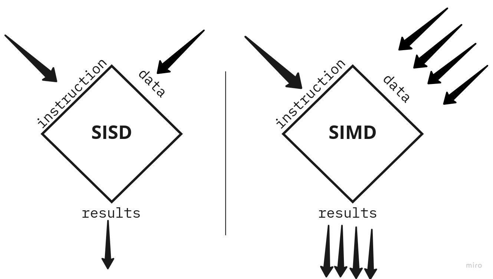

import TeamContact from '../../../contact.md';

# WebAssembly SIMD



## 概览 {#overview}

本教程演示了如何使用互联网计算机 (IC) 的 WebAssembly SIMD 功能。

ICP 支持确定性的 WebAssembly SIMD，这是智能合约链上性能的一个重要里程碑，特别是对于人工智能、图像处理、游戏、科学等领域具有重要意义。

同时传统区块链操作的性能也有可能得到显著提升，例如奖励分配或加密操作都可能受益于新的 WebAssembly SIMD 指令。

### 什么是 WebAssembly SIMD {#what-is-wasm-simd}

WebAssembly SIMD（单指令多数据）是一组定义在 [WebAssembly 核心规范](https://webassembly.github.io/spec/core/syntax/instructions.html#vector-instructions)中的指令集，它包含 200 多条确定性矢量指令。通过并行处理，可以显著地加速某些在 ICP 容器中运行的特定任务。

:::note
WebAssembly SIMD 功能在所有的 ICP 节点上都可用。
:::

### 带给开发者的益处 {#developer-benefits}

WebAssembly SIMD 的支持使得 ICP 在性能上达到了一个全新的水平。开发者可以：

- 优化计算密集型任务  
  识别容器代码中可以从 SIMD 指令中受益的部分，并针对性能进行代码优化。
- 解锁新的可能性  
  探索以前因处理能力受限而无法实现的新功能和复杂应用。
- 构建面向未来的基础  
  使得开发者处于区块链创新的前沿。

## 使用 WebAssembly SIMD {#using-simd}

在智能合约中利用 WebAssembly SIMD 主要有两种方法：

- 循环自动矢量化  
  只需启用 WebAssembly SIMD 并重新编译项目，就有可能获得显著的性能提升。这种优化一般来说很简单、安全，并且可以通过一行代码来完成，但其结果在很大程度上取决于所使用的算法、库和编译器。

- SIMD intrinsics 函数  
  一些计算密集型的函数可以直接使用 SIMD 指令编写，这种方式可以充分发挥 SIMD 的潜力。但在许多情况下，一些核心容器算法可能都需要使用新指令重写。

### 循环自动矢量化 {#loop-vectorization}

要利用循环自动矢量化，您可以为整个工作区全局启用 WebAssembly SIMD 功能，或为某些容器的特定函数局部启用。一旦这些指令对编译器可用，编译器就会自动将一些普通的循环转换为带有并行计算的循环。

虽然这种改动简单且不易出错，但最终结果取决于许多因素，如算法本身、编译器的优化选项和级别、项目依赖等。

#### 示例 {#loop-vectorization-example}

如果您想要为整个工作区及其所有依赖项全局启用 WebAssembly SIMD 指令，需要创建 `.cargo/config.toml` 文件并包含以下内容：

```rust
[build]
target = ["wasm32-unknown-unknown"]

[target.wasm32-unknown-unknown]
rustflags = ["-C", "target-feature=+simd128"]
```

如果您仅需要仅为容器的特定函数启用 WebAssembly SIMD 指令，请做如下修改：

```rust
#[target_feature(enable = "simd128")]
fn auto_vectorization() {
    ...
}
```

### WebAssembly SIMD intrinsics 函数 {#wasm-simd-intrinsics}

WebAssembly SIMD 指令以 `wasm32` 平台的特定 intrinsics 函数的形式提供。如果您需要使用这些 intrinsics 函数，应按照[前一节](#loop-vectorization-example)的说明启用 WebAssembly SIMD 指令。

#### 示例 {#simd-intrinsics-example}

以下是一个简短的代码片段，演示了如何使用单个 SIMD 指令来相乘两个包含四个浮点元素的数组：

```rust
#[inline(always)]
#[target_feature(enable = "simd128")]
pub fn mul4(a: [f32; 4], b: [f32; 4]) -> [f32; 4] {
    use core::arch::wasm32::*;

    // Load the arrays `A` and `B` into the SIMD registers.
    let a = unsafe { v128_load(a.as_ptr() as *const v128) };
    let b = unsafe { v128_load(b.as_ptr() as *const v128) };

    // Multiply elements of `A` and `B` using a single SIMD instruction.
    let c = f32x4_mul(a, b);

    // Store and return the result.
    let mut res = [0.0; 4];
    unsafe { v128_store(res.as_mut_ptr() as *mut v128, c) };
    res
}
```

## 要求 {#prerequisites}

- 下载并安装 [IC SDK](https://ic123.xyz/docs/getting-started/install-dfx/)。
- 下载[示例仓库](https://github.com/dfinity/examples)。 

:::note
使用 WebAssembly SIMD 功能需要 dfx 版本 0.20.2-beta.0 或更高版本。
:::

该示例展示了利用 WebAssembly SIMD 指令的不同方法：将 Rust 循环自动矢量化和 SIMD intrinsics 函数分别用于矩阵乘法，这是一项机器学习和人工智能应用中的核心操作。该示例比较了各种 SIMD 优化技术及其潜在的性能提升效果。

## 进入示例 {#navigate-into-example}

按照如下命令进入包含项目文件的文件夹，并启动 IC 的本地开发环境。

```bash
cd examples/rust/simd

dfx stop
dfx start --clean
```

您会看到类似如下输出：

```bash
Running dfx start for version 0.22.0
Using the default configuration for the local shared network.
Initialized replica.
Dashboard: http://localhost:45111/_/dashboard
```

## 本地部署 {#deploy}

请打开另一个命令行终端，执行以下脚本将您的容器部署到 IC 的本地开发环境：

```bash
cd examples/rust/simd

dfx deploy
```

您会看到类似如下输出：

```bash
Deployed canisters.
URLs:
  Backend canister via Candid interface:
    mat_mat_mul: http://127.0.0.1:4943/?canisterId=bd3sg-teaaa-aaaaa-qaaba-cai&id=bkyz2-fmaaa-aaaaa-qaaaq-cai
```

## 容器接口 {#canister-interfaces}

容器 `mat_mat_mul` 提供以下接口：

- `naive_f32`/`naive_u32`  
  返回使用简单算法对矩阵 `A` 和 `B` 进行 1K 次逐元素相乘的循环所使用的指令数。

- `optimized_f32`/`optimized_u32`  
  返回使用优化算法对矩阵 `A` 和 `B` 的 `K x 4` packed slices 进行 1K 次逐元素相乘的循环所使用的指令数。

- `auto_vectorized_f32`/`auto_vectorized_u32`  
  返回使用 Rust 循环自动矢量化对矩阵 `A` 和 `B` 的 `K x 4` packed slices 进行 1K 次逐元素相乘的循环所使用的指令数。

- `simd_f32`  
  返回使用 WebAssembly SIMD 指令对矩阵 `A` 和 `B` 的 `K x 4` packed slices 进行 1K 次逐元素相乘的循环所使用的指令数。

您可以在前一节部署的 `Backend canister` 的 `Candid UI URL` 查看所有公开接口，如下所示：

```bash
  Backend canister via Candid interface:
    mat_mat_mul: http://127.0.0.1:4943/?canisterId=...
```

## 运行 {#run-canister}

### 示例 1：浮点数矩阵乘法 {#example-1}

该示例执行一个循环将矩阵 A 和 B 的 K x 4 packed slices 进行 1K 次逐元素相乘，并将不同版本的实现进行比较：
- 使用优化算法
- 启用了 Rust 自动矢量化的算法
- 使用 WebAssembly SIMD 指令的算法

```bash
$ dfx canister call mat_mat_mul optimized_f32
(39_518_255 : nat64)
$ dfx canister call mat_mat_mul auto_vectorized_f32
(13_697_228 : nat64)
$ dfx canister call mat_mat_mul simd_f32
(13_697_228 : nat64)
```

在这个示例中，Rust 的自动矢量化在优化矩阵乘法方面表现出色，相比优化算法版本实现了 3 倍的性能提升！此外，它与手工编写的 WebAssembly SIMD 实现性能相当。

:::note
示例中 `optimized_f32` 的结果 `39_518_255` 是基于 dfx `0.22.0` 所获得的，如果您基于 dfx `0.21.0` 及之前版本运行则会得到 `168_542_255 `。这是因为 `wasmtime` 中一个已知 的 NaN 规范化问题已经得到修复，并包含在了在最新版本的 dfx `0.22.0` 之中。具体的修改可以参考[这里](https://github.com/bytecodealliance/wasmtime/commit/72a3b8b99d7c0343bacb7cd2cff3151b0144179d)。
:::

### 示例 2：整型矩阵乘法 {#example-2}

该示例执行一个循环将整数矩阵 A 和 B 的 K x 4 packed slices 进行 1K 次逐元素相乘，并将不同版本的实现进行比较：
- 使用优化算法;
- 启用了 Rust 自动矢量化化的算法

```bash
% dfx canister call mat_mat_mul optimized_u32
(32_342_253 : nat64)
% dfx canister call mat_mat_mul auto_vectorized_u32
(16_164_254 : nat64)
```

Rust 自动矢量化在这个示例中再次展示了其强大功能，自动矢量化后的整数矩阵乘法版本相比原始代码实现了约 2 倍的性能提升。

## 结论 {#conclusion}

WebAssembly SIMD 功能为互联网计算机（IC）解锁了新的可能性，尤其是在机器学习和人工智能领域中。

该示例展示了通过使用 Rust 的循环自动矢量化技术，在很小代价的情况下矩阵乘法的性能可以提高约 3 倍。示例也展示了整数运算的性能也能提高，尽管提升幅度只约为 2 倍。

:::note
在实际应用中，根据具体应用和所涉及的操作类型的不同，性能提升的效果也会有所不同。
:::

<TeamContact />
