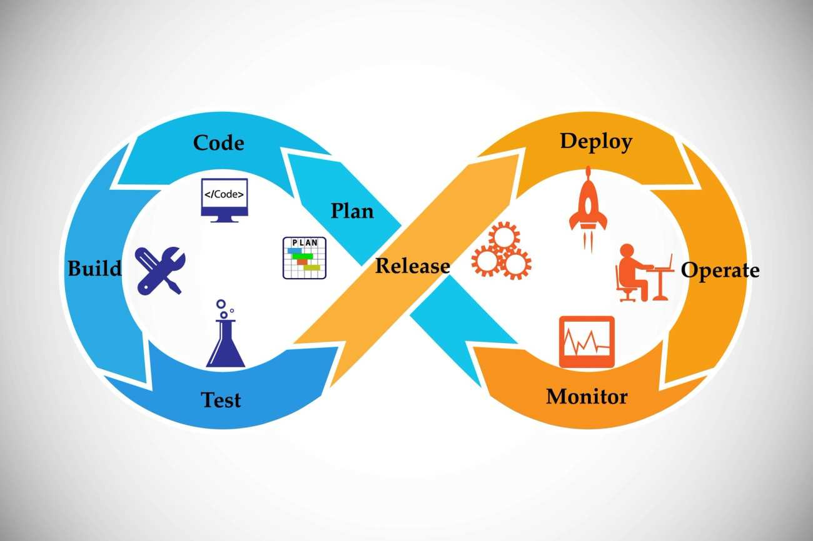

import TeamContact from '../../contact.md';

# 开发流程

## 概览 {#overview}

ICP (Internet Computer Protocol) 接受并执行以 WebAssembly (Wasm) 二进制格式编写的智能合约。理论上，开发者可以直接在 Wasm 字节码中编写有效的智能合约。然而这样做过于繁琐且耗时，标准做法是使用更高级的编程语言（例如 JavaScript/TypeScript, Motoko, Python 或 Rust ）编写智能合约代码，然后将其编译成 Wasm。

ICP 生态系统中的主要开发工具是 dfx。dfx 是一个命令行多功能工具，在整个开发过程中开发者都会用到它：从生成开发者密钥，到设置新项目，进而到编译、部署和管理智能合约。

默认情况下，dfx 生成的项目结构会包含两个智能合约：前端[容器](https://ic123.xyz/docs/getting-started/ic-glossary/#canister)和后端容器。

- 前端容器包含 Web 资产，如 JavaScript、HTML、CSS 和图像，这些资产会提供给浏览器；
- 后端容器则定义了智能合约的实际程序逻辑。

:::info

前端和后端容器的配置只是一种约定。实际上您可以编写一个单一的容器，它既包含了智能合约的程序逻辑、又托管了 Web 资产。

:::

由于智能合约可以使用不同的编程语言编写，因此它们都需要在接受参数和返回结果的二进制格式上达成一致。这种通用格式允许用户和智能合约调用其他智能合约，而不用关心它们是用哪种语言编写的。在传统编程中，这个概念被称为[应用程序二进制接口](https://en.wikipedia.org/wiki/Application_binary_interface)（ABI）。ICP 拥有自己的 ABI 语言，称之为 [Candid](https://ic123.xyz/docs/getting-started/ic-glossary/#candid)，它类似于 JSON 或 Protobuf、但专为 ICP 而定制。

在开发过程中，dfx 使用后端的 ABI 自动生成前端的 JavaScript 样板代码。生成的样板代码在底层使用了一个名为 [agent-js](https://github.com/dfinity/agent-js/tree/main) 的库对 Candid 值进行编码，并从浏览器向后端容器发出 HTTP 请求。您可以认为 agent-js 类似于以太坊中的 web3.js。

[Wasm 标准](https://webassembly.org/)仅定义了 Wasm 虚拟机的指令和内存。至于 Wasm 程序如何与其他程序和用户交互则由托管虚拟机的宿主决定。ICP 作为 Wasm 的宿主，提供了一组函数供 Wasm 代码读取传入的参数、调用系统和其他智能合约、并返回结果，这些函数统称为**系统 API** 。开发者不应直接使用系统 API，因为过于底层且容易出错。相反，开发人员应使用特定语言的容器开发包 (CDK)，这些库是对系统 API 的高级封装。

## 部署智能合约 {#deploying-smart-contracts}

开发者可以在本地测试网络或 ICP 主网上部署智能合约。本地测试网络内置于 dfx 中，可以通过 `dfx start` 命令运行。本地测试网络由单个节点（即本地计算机）组成。请注意，截至目前 ICP 没有官方的公共测试网络。

开发者需要 ICP 代币或 cycles 以在 ICP 主网上部署智能合约。使用 ICP 代币时，dfx 会自动将所需数量的代币转换为 cycles，这是因为所有与智能合约相关的操作都需要使用 cycles 进行支付。有关如何获取 cycles 的更多信息，请参阅[此指南](https://ic123.xyz/docs/getting-started/get-cycles/)。

部署智能合约的命令是 `dfx deploy`，它会自动将源代码构建为 Wasm 二进制文件、并将其部署到目标网络。默认情况下该命令会针对本地测试网络，通过传递额外的 `–-network ic` 参数，可以指示该命令使用主网进行部署。这里无需指定要连接的节点的 URL，因为 dfx 已经预先配置了主网边界（RPC）节点的 URLs，但是您可以通过编辑 dfx 配置文件来更改 URL。

更多关于 dfx 开发相关的命令请参考[该指南](https://ic123.xyz/docs/getting-started/use-dfx/#development)。

## 调用智能合约 {#calling-smart-contracts}

通常调用后端智能合约的方法有三种：

- 使用浏览器加载托管在前端智能合约中的网页，并使用网页的用户界面与后端智能合约进行交互。  
  在底层，用户界面使用 JavaScript 和 agent-js 向后端智能合约发送消息。这是普通用户与智能合约交互的标准方式。

- 使用 `dfx canister call` 命令，并将输入参数作为命令行参数传递。  
  在底层，dfx 使用名为 `ic-agent` 的 Rust 库向智能合约发送消息。

- 编写一个链下程序，并使用[代理库](https://internetcomputer.org/docs/current/developer-docs/developer-tools/off-chain/agents/overview)向后端智能合约发送消息。

<TeamContact />
