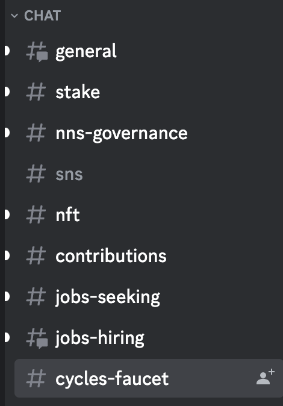
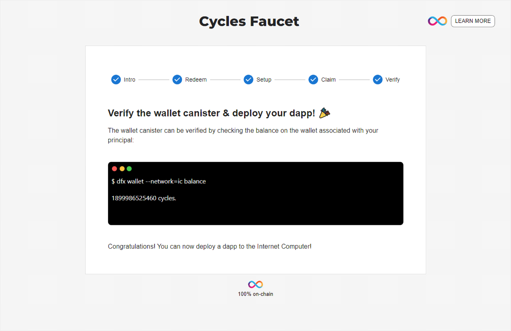

import TeamContact from '../../contact.md';

# 获取 cycles


## 概述 {#overview}

### 什么是 cycles {#what-is-cycles}

为了使互联网计算机可持续发展，开发人员需要支付其容器所消耗的资源费用（例如存储、算力等），而 cycles 则用于支付这些资源费用。每一万亿个 cycles 等于1个 [XDR](https://en.wikipedia.org/wiki/Special_drawing_rights)，这意味着容器的运行成本与 ICP 代币的价格波动无关。关于更多 cycles 的信息，请参考[这里](https://internetcomputer.org/docs/current/concepts/tokens-cycles#cycles)。

## 要求 {#prerequisites}

请按照[此指南](https://ic123.xyz/docs/getting-started/install-dfx)安装 IC SDK。

## 从 cycles 水龙头获取 cycles {#cycles-faucet}

这里将解释如何使用 cycles 水龙头获取您的第一笔 10T 免费 cycles，以用于在主网上部署您的 dapp。

:::note
请注意，cycles 水龙头只能使用一次。
:::

### 获取 cycles 优惠券 {#get-cycles-coupon}

下面将介绍如何获得 cycles 优惠券。

#### 加入 DFINITY 官方 dev Discord 服务器 {#join-discord}

首先请访问 https://faucet.dfinity.org 页面。


点击该页面 `REQUEST CYCLES` 按钮加入 [DFINITY 官方 Dev Discord 服务器](https://discord.com/invite/jnjVVQaE2C)。

:::info

Discord 服务器地址：https://discord.com/invite/jnjVVQaE2C

:::

#### 提交 cycles 优惠券请求 {#request-cycles-coupon}

进入 DFINITY 官方 dev Discord 服务器后，转到 `＃cycles-faucet` 频道。



在该频道中，发送一个获取 cycles 优惠券的消息：

```bash
/request
```

#### DFINITY 团队将与您联系 {#reached-by-dfinity}

- 发送获取 cycles 优惠券的消息后，DFINITY 团队的成员将通过 Discord 的直接消息与您联系。请确保您的 Discord 设置为允许其他用户发送直接消息。

- DFINITY 团队的消息中包含一份调查问卷，您必须完成此调查问卷。

  

- 当您完成调查问卷后，请回复通知团队成员您已经完成了调查问卷。随后他们将向您发送一张优惠券。

### 兑换 cycles 优惠券 {#redeem-cycles-coupon}

- 再次访问 https://faucet.dfinity.org 页面，点击 `NEXT STEP`。

- 在如下页面输入你的 cycles 优惠码，确认无误后点击 `NEXT STEP` 继续。
  

- 按照页面提示设置 IC SDK，并确认 `dfx` 版本不低于 0.12.0。
  

### 创建新的身份 {#create-new-identity}

如果您没有[身份](https://ic123.xyz/docs/getting-started/ic-glossary/#identity)，请使用以下命令[创建一个新的身份](https://ic123.xyz/docs/getting-started/use-dfx/#create-identity)：

```bash
dfx identity new myNewIdentity
```

该命令会返回您的身份的助记词（seed phrase），请确保将其安全保存。

随后将此身份设置为默认身份：

```bash
dfx identity use myNewIdentity
```

关于身份的更多命令请参考[这里](https://ic123.xyz/docs/getting-started/use-dfx/#identity)。

### 领取 cycles {#claim-cycles}

请运行以下命令来领取免费 cycles：

```bash
dfx wallet redeem-faucet-coupon <your-coupon-code> --network ic
```

:::info

该命令会帮你创建一个钱包，并将 cycles 转入其中，关于钱包的更多命令请参考[这里](https://ic123.xyz/docs/getting-started/use-dfx/#cycles-wallet)。

:::


### 验证 cycles {#verify-cycles}

最后一步是通过一下命令检查钱包余额，以验证钱包是否设置正确。

```bash
dfx wallet balance --network ic
```




## 获取 ICP 代币 {#acquire-icp-tokens}

不管是使用 cycles ledger 还是 cycles 钱包，您都需要先获得一些 ICP 代币。您可以在交易所上获取 ICP，或者向您认识的人请求一些代币。

### 如何获取账户 {#get-account-id}

当您创建[身份](https://ic123.xyz/docs/getting-started/ic-glossary/#identity)之后，您就会自动获得一个账本[账户](https://ic123.xyz/docs/getting-started/ic-glossary/#account)。

您可以在命令行运行以下命令获取您的账户 ID：

```
dfx ledger account-id
```

您将会在命令行看到类似的输出：

```
e213184a548871a47fb526f3cba24e2ee2fbbc8129c4ab497ef2ce535130a0a4
```

:::info

关于如何创建身份，您可以参考[这里](https://ic123.xyz/docs/getting-started/use-dfx/#create-identity)。关于身份的更多命令，请参考[这里](https://ic123.xyz/docs/getting-started/use-dfx/#identity)。

:::

### 如何获取 ICP 代币 {#get-icp-tokens}

获取 ICP 代币有几种不同的方式，包括但不限于：

- 通过支持 ICP 代币的交易所直接购买。请查看[该页面](https://coinmarketcap.com/currencies/internet-computer/markets/)以了解可以购买 ICP 代币的交易所。

- 通过参与 [IC 治理](https://ic123.xyz/docs/ic-web3/stake-icp/)的奖励获得代币。

- 通过参与 DFINITY 基金会的[开发者计划](https://ic123.xyz/docs/dev-resources/dev-grants/)获得 ICP 代币。

- 作为[节点提供者](https://ic123.xyz/docs/ecosystem-guide/node-provider-faq/)获得 ICP 代币，以作为提供算力的报酬。

通常来说，价值 5 到 10 美元的 ICP 代币足以开始您的开发工作。后续您可以根据您的工作流程和实际用例来决定是否获取更多的 ICP 代币。

#### 查询 ICP 代币余额 {#get-icp-balance}

当您获得了ICP 并转入[您的账户](#get-account-id)之后，你可以通过以下命令查询余额：

```bash
dfx ledger balance --network ic
```

您将会看到类似如下的输出：

```bash
12.49840000 ICP
```

## 使用 cycles 钱包 {#using-cycles-wallet}

容器需要 cycles 来执行操作、并为所使用的资源付费，用户和开发人员可以通过一种称为 cycles 钱包的特殊容器来管理 cycles 的分配和所有权。关于 cycles 钱包的更多信息，请参考[这里](https://ic123.xyz/docs/getting-started/use-dfx/#cycles-wallet)。

目前 cycles 钱包是一种复杂的解决方案，它本质上是一个容器、自身也会消耗 cycles。因此最近 DFINITY 基金会推出了一个叫做 [cycles 账本](#using-cycles-ledger)的新功能，用来简化 cycles 的管理。

### 如何创建 cycles 钱包 {#create-cycles-wallet}

前面我们在介绍如何通过[领取优惠券](#claim-cycles)的方式获得 cycles 的时候，提到了 `dfx wallet redeem-faucet-coupon` 会自动帮您创建 cycles 钱包。

接下来我们介绍如何自己手动创建钱包，如果您已经拥有 cycles 钱包（您可以通过 [dfx identity get-wallet](https://ic123.xyz/docs/getting-started/use-dfx/#get-wallet) 来查看您的钱包配置），则可以跳过此步骤。

:::info

您可以查看[该文档](https://ic123.xyz/docs/getting-started/use-dfx/#cycles-wallet)了解更多关于 cycles 钱包的信息。

:::

### 创建一个新的容器 {#create-canister}

Cycles 钱包本质上是一个特殊的容器，所以第一步我们需要创建一个新的容器，您可以参考 [dfx ledger create-canister](https://ic123.xyz/docs/getting-started/use-dfx/#ledger-create-canister) 来创建容器。下面是一个示例：

```bash
dfx ledger create-canister tsqwz-udeik-5migd-ehrev-pvoqv-szx2g-akh5s-fkyqc-zy6q7-snav6-uqe --amount 1.25 --network ic
```

该命令将在 IC 主网上创建一个容器，将指定的主体设置为容器的控制者，并向充值价值为 `1.25 ICP` 的 cycles。

如果创建成功会返回类似如下所示信息：

```
Transfer sent at BlockHeight: 20
Canister created with id: "53zcu-tiaaa-aaaaa-qaaba-cai"
```

### 安装 cycles 钱包代码 {#install-cycles-wallet}

创建容器完成后，我们将运行如下命令将 cycles 钱包代码安装到所创建的容器之中：

```bash
dfx identity --network ic deploy-wallet <canister-identifier>
```

关于 `dfx identity deploy-wallet` 的详细信息可以参考[这里](https://ic123.xyz/docs/getting-started/use-dfx/#deploy-wallet)。

下面是一个示例：

```bash
dfx identity deploy-wallet 53zcu-tiaaa-aaaaa-qaaba-cai --network ic
```

它会在 IC 主网上在指定容器 (53zcu-tiaaa-aaaaa-qaaba-cai) 安装 cycles 钱包 Wasm 代码。

## 使用 cycles 账本 {#using-cycles-ledger}

Cycles 账本是一种用于替代 cycles 钱包的 cycles 管理方案。

Cycles 账本和 cycles 钱包之间最大的区别在于：
- cycles 账本是一个全局单一的账本容器；
- 而 cycles 钱包必须由每个开发者独立部署。

此外 cycles 钱包还存在一些缺点，包括：

- cycles 钱包是一种将 cycles 与[主体](https://ic123.xyz/docs/getting-started/ic-glossary/#principal)关联的复杂解决方案；
- cycles 钱包本身会消耗 cycles，这意味着开发者需要支付 cycles 来存储 cycles；
- 如果丢失了 cycles 钱包的容器 ID，那么该 cycles 钱包中的 cycles 也会丢失。

而 cycles 账本则解决了这些问题。简而言之，cycles 账本通过提供让主体持有 cycles 的能力、简化了 cycles 管理。

目前 cycles 账本遵循 ICRC-1、ICRC-2 和 ICRC-3 标准。除了标准的账本功能外，cycles 账本还与 NNS 容器和用户容器交互、以提供 cycles 账本特有的功能，包括：

- 接受来自其他容器发送的 cycles；
- 向其他容器发送 cycles；
- 使用 cycles 创建新容器。

:::info
需要注意的是，cycles 账本无法提供用 cycles 对其他容器进行任意调用的功能，而 cycles 钱包则可以。这是因为开放调用上下文会给 cyles 账本增添复杂性。

如果需要用 cycles 对其他容器进行任意调用，可以像以前一样使用 cycles 钱包。
:::

接下会介绍关于 `dfx cycles` 命令及其子命令的一些用法，这里我们只会设计一些基本参数和操作。请在 `dfx cycles` 命令及其子命令上使用 `-h` 参数查看详细信息。

### 要求 {#cycles-ledger-prerequisites}

要使用 cycles 账本，您需要 dfx 版本 [0.19.0](https://github.com/dfinity/sdk/releases/tag/0.19.0)、并且需要设置以下环境变量：

```bash
DFX_CYCLES_LEDGER_SUPPORT_ENABLE=1
```

在 dfx `0.19.0` 中，cycles 账本还是 Beta 版本，所以您需要通过设置以上的环境变量来显示的启用。如果您未设置该环境变量，类似 `dfx deploy --network ic`、`dfx canister create <CANISTER_NAME> --network ic` 等需要消耗 cycles 的命令仍然会从 cycles 钱包获取 cycles。

### 检查 cycles 余额 {#cycles-ledger-balance}

您可以执行以下命令查看当前身份的 cycles 余额。

```bash
dfx cycles balance --network ic
```

### 将 ICP 转换为 cycles {#cycles-ledger-converting}

您可以执行以下命令将 ICP 账本中的 ICP 转换为 cycles。

```bash
dfx cycles convert --amount <AMOUNT> --network ic
```

请将 `<AMOUNT>` 替换为要转换为 cycles 的 ICP 数量，例如 `2.7`。

您也可以使用 `--icp` 和 `--e8s` 选项以 ICP 和 e8s（其中 100,000,000 e8s = 1 ICP）为单位指定需要转换的数量。例如，2.7 可以表示为 `--icp 2 --e8s 70_000_000`。

### Cycles 转账 {#cycles-ledger-transferring}

您可以执行以下命令将 cycles 转移到另一个主体。

```bash
dfx cycles transfer <AMOUNT> <PRINCIPAL_ID> --network ic
```

请将 `<AMOUNT>` 替换为 cycles 数量，例如 34000000；将 <PRINCIPAL_ID> 替换为要转账 cycles 的目标主体。

:::info
Cycles 账本转账支持使用 `500k` 或 `5TC` 等后缀，请在[这里](https://github.com/dfinity/sdk/blob/master/CHANGELOG.md#feat-accept-more-ways-to-specify-cycle-and-e8s-amounts)查看完整的后缀列表。
:::

### 为容器充值 {#cycles-ledger-topping-up}

您可以使用以下命令通过 cycles 账本对容器进行 cycles 充值。

```bash
dfx cycles top-up <AMOUNT> <CANISTER_ID> --network ic
```

请将 `<AMOUNT>` 替换为 cycles 数量，例如 34000000，并将 `<CANISTER_ID>` 替换为要充值 cycles 的容器 ID。

### 使用循环创建容器 {#cycles-ledger-canister}

在设置了 `DFX_CYCLES_LEDGER_SUPPORT_ENABLE=1` 环境变量之后，您可以使用 `dfx canister create` 或 `dfx deploy` 命令通过 cycles 账本创建新容器。

```bash
dfx canister create <CANISTER_NAME> --network ic
dfx deploy <CANISTER_NAME> --network ic
```

请将 `<CANISTER_NAME>` 替换为需要创建的容器名称，创建容器所需的 cycles 则会由 cycles 账本提供。

### 费用 {#cycles-ledger-fees}

调用 cycles 账本的大多数功能都会产生费用，详细情况如下：

- 使用 cycles 账本在不同的主体之间转账时，费用为每笔交易 `100 百万`（100m）cycles；
- 从 cycles 账本向其他容器发送 cycles 时，费用为 `100 百万`（100m）循环；
- 创建容器时，所需的费用包括调用费用（100 百万循环）和容器创建费用。其中容器创建费用随着[目标子网的大小线性增长](https://internetcomputer.org/docs/current/developer-docs/gas-cost)。

## 将 ICP 转换为 cycles {#convert-icp-to-cycles}

在您已经获取了 ICP 代币之后，您可以将 ICP 代币转换为 cycles。

### 如何从 ICP 充值 cycles 钱包  {#topup-cycles-wallet}

如果您已经拥有了 cycles 钱包，希望直接将 ICP 代币转换为 cycles，可以使用 `dfx ledger top-up` 命令。下面是一个示例：

```bash
dfx ledger top-up --icp 1 5a46r-jqaaa-aaaaa-qaadq-cai --network ic
```

其中 `5a46r-jqaaa-aaaaa-qaadq-cai` 是示例的 cycles 钱包容器 ID，您可以替换为您自己的钱包容器 ID。

更多关于 `dfx ledger top-up` 的信息，请参考[这里](https://ic123.xyz/docs/getting-started/use-dfx/#top-up-cycles)。

### 如何从 ICP 充值 cycles 账本 {#converting-icp-cycles-ledger}

请参考 cycles 账本中[将 ICP 转换为 cycles](#cycles-ledger-converting) 章节。

### 如何给容器充值 cycles {#topup-canister}

除了给 cycles 钱包充值，您也可以给普通容器进行充值。

#### 查看容器 cycles 余额 {#get-canister-status}

在决定是否给容器充值之前，您可以通过 dfx canister status 命令来查看容器的状态，包括容器的 cycles 余额，以下是一个示例：

```bash
dfx canister status b5wdk-xiaaa-aaaan-qlsqq-cai --network=ic
```

#### 如何从 ICP 充值容器 {#topup-canister-icp}

同样可以使用 `dfx ledger top-up` 命令。下面是一个示例：

```bash
dfx ledger top-up --icp 1 b5wdk-xiaaa-aaaan-qlsqq-cai --network ic
```

其中 `b5wdk-xiaaa-aaaan-qlsqq-cai` 是示例的 容器 ID，您可以替换为您自己的容器 ID。

#### 如何从 cycles 账本充值容器 {#deposit-cycles-ledger}

请参考 cycles 账本中[为容器充值](#cycles-ledger-topping-up)章节。

#### 如何从 cycles 钱包充值容器 {#deposit-cycles-wallet}

- 使用 `dfx canister deposit-cycles` 从 cycles 钱包充值容器，以下是一个示例：

  ```bash
  dfx canister deposit-cycles 2000000000000 b5wdk-xiaaa-aaaan-qlsqq-cai --network ic
  ```

  其中 `b5wdk-xiaaa-aaaan-qlsqq-cai` 是示例的 容器 ID，您可以替换为您自己的容器 ID。

- 使用 `dfx wallet send` 从 cycles 钱包充值容器，以下是一个示例：

  ```bash
  dfx wallet send 2000000000000 b5wdk-xiaaa-aaaan-qlsqq-cai --network ic
  ```

  其中 `b5wdk-xiaaa-aaaan-qlsqq-cai` 是示例的 容器 ID，您可以替换为您自己的容器 ID。

## 总结 {#conclusion}

至此您已经准备好在 IC 上托管网站或按照我们的 [dApps 教程](https://ic123.xyz/docs/getting-started/code-examples/)进行操作，您可以在[这里](https://internetcomputer.org/docs/current/tutorials/)找到相关教程。

<TeamContact />