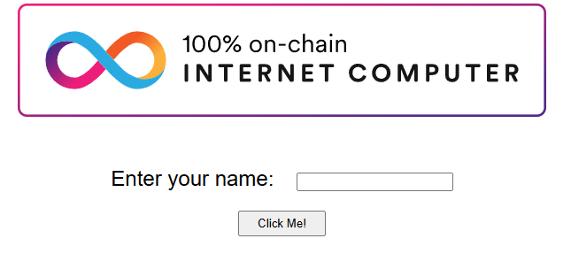
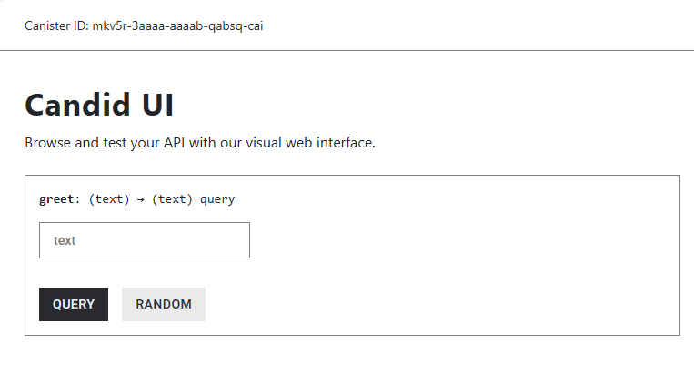

import TeamContact from '../../contact.md';

# 五分钟体验 IC 上的 Hello World


## 概览

本教程提供了一个适合初学者的入门指南，介绍了如何在不到5分钟的时间内在互联网计算机（IC）上部署一个去中心化应用（dApp）。通过完成本教程，您将了解 dApp 的结构和部署过程，并在 IC 上创建一个简单的 “Hello, world!” dApp。为简单起见，这个 dApp 只完成一个功能：接受文本输入并返回该文本输入。

在开始之前，可以先查看一个运行在链上的该 dapp 的版本：https://jqylk-byaaa-aaaal-qbymq-cai.icp0.io/


## 要求

在本教程中，部署 dApp 只需要有对终端界面的基本使用知识。另外您需要满足以下条件：

- 预先安装 [Node.js](https://nodejs.org/en)，本教程使用高于`16.*.*`版本的 Node.js。

## 第一步: 安装 IC SDK

本教程将会使用 IC SDK，目前是由 DFINITY 基金会维护。请参照[如何安装 IC SDK](../install-dfx) 安装 IC SDK。

安装完成后，IC SDK 将提供一些工具供您使用。其中之一是 `dfx` 命令，您将在本教程中多次看到。

为了验证 IC SDK 是否正确安装，请运行：

```
dfx --version
```

## 第二步: 创建一个项目

IC SDK 可以创建新的项目模板。一个项目是一组包括源代码和配置文件在内的工件，可以编译为容器智能合约。

通过运行以下命令创建一个新项目：

```bash
dfx new hello --type=motoko
cd hello
```

这些命令的作用：

- `dfx new hello --type=motoko`  
  在您的本地机器上创建了一个名为 `hello` 的新项目，并指定后端语言为 Motoko。
- `cd hello`  
  进入到您新创建的 `hello` 项目目录中。

## 第三步: 部署到 Motoko Playground

现在您通过运行以下命令部署 hello 工程到 Motoko Playground：

```bash
dfx deploy --playground
```

输出应该显示类似如下两个URL，您可以点击链接以访问您的第一个 `hello` dApp。

```bash
...
Deployed canisters.
URLs:
  Frontend canister via browser
    hello_frontend: https://mdwwn-niaaa-aaaab-qabta-cai.icp0.io/
  Backend canister via Candid interface:
    hello_backend: https://a4gq6-oaaaa-aaaab-qaa4q-cai.raw.icp0.io/?id=mkv5r-3aaaa-aaaab-qabsq-cai
```

在上面的示例输出中，`hello_frontend` 是 dApp 的前端，`hello_backend` 是 dApp 的后端。

前端容器的 URL 和后端容器的 URL 都可以通过浏览器访问。

前端示例:



后端示例：



至此，您已经在本地部署了您的第一个 ICP dApp。

### Motoko Playground

`Motoko Playground` 是一个专为 Motoko 项目设计的基于网络的开发环境。请访问 [Playground UI](https://m7sm4-2iaaa-aaaab-qabra-cai.ic0.app/) 并选择一个工程模板，或者从 GitHub 导入一个工程。

部署到 `Motoko Playground` 的[容器](../ic-glossary/index.md#canister)使用的是从容器池借用的资源，并且部署时间限制为 `20` 分钟，因此不推荐使用 Playground 进行长期开发。

请访问[这里](https://internetcomputer.org/docs/current/developer-docs/developer-tools/ide/playground)获取更多关于 `Motoko Playground` 的信息。

### 通过命令行测试部署的 dApp

现在您的容器智能合约已经部署到 `Motoko Playground`，您可以通过发送和接收消息与其交互。由于该容器具有一个名为 `greet` 的方法（接受一个字符串作为参数），我们将发送一条消息给它。

运行以下命令：

```bash
dfx canister call mkv5r-3aaaa-aaaab-qabsq-cai greet everyone --ic
```
:::note
请将 `mkv5r-3aaaa-aaaab-qabsq-cai` 容器 ID 替换为您在上一步部署时所获得的 `hello_backend` 容器 ID。
:::

你将会接收到 `greet` 的返回输出：

```bash
("Hello, everyone!")
```

这个命令的作用如下：

- `dfx canister call`  
  该命令要求您指定要调用的容器和函数名称。
- `mkv5r-3aaaa-aaaab-qabsq-cai`  
  即是您要调用的容器 ID，请替换为您自己的 `hello_backend` 容器 ID。
- `greet`  
  即是您要调用的函数名称。
- `everyone`  
  则是您传递给 `greet` 函数的参数。

## 总结

祝贺您，您已经完成在链上构建一个包括前端和后端的 dApp！

<TeamContact />