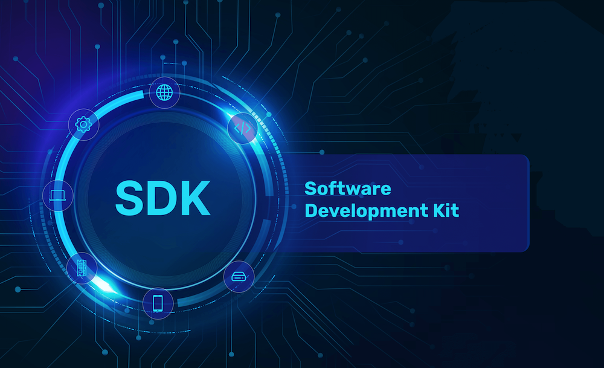

import TeamContact from '../../contact.md';
import Tabs from '@theme/Tabs';
import TabItem from '@theme/TabItem';

# 如何安装 IC SDK



## 概览 {#overview}

在 IC 上进行开发时，您将主要使用到以下两个工具：

- `dfx` 用于创建、部署和管理[容器](https://ic123.xyz/docs/getting-started/ic-glossary/#canister)的命令行工具。
- 容器开发工具包（CDK），它提供了一个用于在不同编程语言中编写容器代码并支持 IC 功能的环境。
  当前支持的 CDK 包括：
  - [Motoko](https://internetcomputer.org/docs/current/motoko/main/getting-started/motoko-introduction)：ICP 的原生编程语言。
  - [Rust CDK](https://github.com/dfinity/cdk-rs)
  - [Kybra](https://internetcomputer.org/docs/current/developer-docs/backend/python/)：Python CDK（测试版）
  - [Azle](https://internetcomputer.org/docs/current/developer-docs/backend/typescript/)：TypeScript CDK（测试版）
  - [Bitfinity EVM](https://internetcomputer.org/docs/current/developer-docs/backend/solidity/)： 用于 Solidity（测试版）
  - [C++ CDK](https://docs.icpp.world/)

## IC SDK 组件 {#what-gets-installed}

IC SDK 安装脚本会在您的本地计算机上的默认位置安装多个组件，具体信息请参考如下表格。

| 组件         | 描述                                    | 默认位置                                     |
|:------------ |:---------------------------------------|:---------------------------------------------|
| dfx          | 命令行工具                              | `~/.local/share/bin/dfx`                     |
| dfxvm        | 命令行工具                              | `~/.local/share/bin/dfxvm`                   |
| versions     | 缓存目录，包含安装的每个 SDK 版本的子目录。| `~/.cache/dfinity/versions`                  |
| moc          | Motoko 编译器                           | `~/.cache/dfinity/versions/<VERSION>/moc`    |
| replica      | IC 本地网络二进制文件                    | `~/.cache/dfinity/versions/<VERSION>/replica`|

## 安装 IC SDK {#install-sdk}

`dfx` 是 [IC SDK](https://github.com/dfinity/sdk) 的一部分。

[dfxvm](https://github.com/dfinity/dfxvm) 是 `dfx` 版本管理工具，用来安装、更新、删除和切换不同版本 `dfx` 的命令行工具。更多关于 `dfxvm` 的信息可以参考[相关文档](https://internetcomputer.org/docs/current/developer-docs/developer-tools/dev-tools-overview#dfxvm)。

你可以通过运行以下命令来下载并安装最新版本的 IC SDK。

<Tabs>

<TabItem value="mac_linux" label="在 Mac/Linux 上安装" default>

IC SDK 在 Linux 或 macOS 12.* Monterey 或更高版本上有原生支持。请运行以下命令安装 IC SDK 的最新版本：

```bash
sh -ci "$(curl -fsSL https://internetcomputer.org/install.sh)"
```

:::note
如果您使用的是搭载 Apple Silicon 芯片的机器，您需要安装 `Rosetta`。您可以在命令行中运行 `softwareupdate --install-rosetta` 来安装 Rosetta。
:::

</TabItem>

<TabItem value="windows" label="在 Windows 上安装" default>

在 Windows 上没有对 IC SDK 的原生支持。您可以通过安装 Windows 子系统 Linux (WSL) 来运行 `dfx`。

### 安装 WSL 2 {#install-wsl-2}

请按照 Microsoft 的指示在 Windows 上安装 [Linux 子系统](https://learn.microsoft.com/en-us/windows/wsl/install)。确保您运行的是 Windows 10（2004版本或更高版本）或 Windows 11。

理论上 WSL 1和 WSL 2 都可以运行 `dfx`，然而我们建议使用 WSL 2。[WSL 版本比较](https://learn.microsoft.com/en-us/windows/wsl/compare-versions)解释了 WSL 1和 WSL 2之间的区别。

### 检查您的 WSL 版本 {#check-wsl-version}

您可以运行命令 `wsl --list --verbose（wsl -l -v）` 来检查您在 Windows 安装的 Linux 的版本。以下是一个示例输出：

```bash
NAME STATE VERSION
* Ubuntu Running 2
```

要了解更多关于 `wsl` 命令的信息，请查阅 [WSL 的命令参考文档](https://learn.microsoft.com/en-us/windows/wsl/basic-commands)。

### 从 WSL 1 更新 {#update-wsl-1}

如果您已经安装了 WSL 1，请按照[升级说明](https://learn.microsoft.com/en-us/windows/wsl/install#upgrade-version-from-wsl-1-to-wsl-2)升级到 WSL 2。简言之，您需要执行以下步骤：

- 步骤1：安装 [WSL 2 Linux内核更新包](https://learn.microsoft.com/en-us/windows/wsl/install-manual#step-4---download-the-linux-kernel-update-package)
- 步骤2：运行以下命令将您的Linux发行版设置为版本2  
  wsl --set-version <发行版名称> 2

### 运行 Linux {#run-wsl}

在安装了 WSL 之后，您可以通过名称启动 Linux。例如，运行命令 `Ubuntu.exe` 即可启动 `Ubuntu`。

### 安装 IC SDK {#install-sdk-wsl}

安装了 WSL 后，您可以通过运行以下命令来安装 IC SDK：

```bash
sh -ci "$(curl -fsSL https://internetcomputer.org/install.sh)"
```

</TabItem>

</Tabs>

## IC SDK 版本目录中的核心组件 {#core-components}

`~/.cache/dfinity/versions` 目录存储了 IC SDK 的一个或多个带有版本号的子目录。每个带版本号的子目录包含特定版本的 IC SDK 所需的所有目录和文件。例如，如果您列出 `~/.cache/dfinity/versions/0.21.0` 目录的内容，您将看到以下核心组件：

```bash
total 443488
drwxr-xr-x 2 pubs staff     4096  Jul 24 15:23 base
-r-x------ 1 pubs staff 12271032  Jan  1  1970 canister_sandbox
-r-x------ 1 pubs staff 142330808 Jul 24 15:23 dfx
-r-x------ 1 pubs staff  24508624 Jan  1  1970 ic-admin
-r-x------ 1 pubs staff   9813024 Jan  1  1970 ic-btc-adapter
-r-x------ 1 pubs staff   8416048 Jan  1  1970 ic-https-outcalls-adapter
-r-x------ 1 pubs staff  18148808 Jan  1  1970 ic-nns-init
-r-x------ 1 pubs staff  20552080 Jan  1  1970 ic-starter
-r-x------ 1 pubs staff  22368208 Jan  1  1970 icx-proxy
-r-x------ 1 pubs staff  15910752 Jan  1  1970 mo-doc
-r-x------ 1 pubs staff  15422616 Jan  1  1970 mo-ide
-r-x------ 1 pubs staff  21433912 Jan  1  1970 moc
-r-x------ 1 pubs staff  52973296 Jan  1  1970 pocket-ic
-r-x------ 1 pubs staff  79457488 Jan  1  1970 replica
-r-x------ 1 pubs staff   2165192 Jan  1  1970 sandbox_launcher
-r-x------ 1 pubs staff   8326448 Jan  1  1970 sns
```

### Motoko base 目录 {#motoko-base-dir}

IC SDK 的带版本号的子目录中的 `base` 目录包含与该版本 SDK 兼容的 Motoko 基础库模块。由于 Motoko 基础库正在快速发展，您应该使用与您安装的 SDK 版本一起打包的基础模块。

## dfxvm 命令 {#dfxvm-cli}

这里我们只介绍一些 `dfxvm` 的简单用法，更多关于 `dfxvm` 的信息可以参考[相关文档](https://internetcomputer.org/docs/current/developer-docs/developer-tools/dev-tools-overview#dfxvm)。

### 安装指定版本 {#dfxvm-install-dfx}

您可以通过 `dfxvm install` 命令安装指定版本的 IC SDK。

您也可以通过执行安装脚本，并提供环境变量 `DFX_VERSION` 以安装制定版本的 IC SDK。例如，您可以运行以下命令安装：

```bash
DFX_VERSION=0.19.0 sh -ci "$(curl -sSL https://internetcomputer.org/install.sh)"
```

### 更新至最新版本 {#dfxvm-update-dfx}

您可以使用 `dfxvm update` 命令将当前安装的版本更新至最新版本。

如果有更新的 `dfx` 版本，该命令会自动下载并安装。如果您想要了解最新版本所包含的功能和修复内容，请查阅[更新说明](https://internetcomputer.org/docs/current/other/updates/release-notes/)。

如果在您安装 IC SDK 后有新版本可供下载，您应该尽快安装更新的版本、以获得最新的修复和功能。

在更新版本之前，您无需卸载软件。如果您希望进行全新安装而不是升级，您可以按照[卸载指定版本](#dfxvm-uninstall-dfx) 进行卸载，然后重新运行下载和安装命令。

### 指定默认版本 {#dfxvm-default-dfx}

如果您要设置全局默认的 `dfx` 版本，请使用 `dfxvm default` 命令。

如果在项目 `dfx.json` 的关键字 `dfx` 中指定了版本，IC SDK 将始终运行该版本。例如，如果您的 `dfx.json` 文件包含 `"dfx": "0.19.0"`，则在该项目目录下运行的任何 `dfx` 命令都将由版本为 `0.19.0` 的 `dfx` 执行。如果未安装指定的版本，`dfx` 将报错。

### 卸载指定版本 {#dfxvm-uninstall-dfx}

您可以通过 `dfxvm uninstall` 删除某个指定版本的 dfx。

## 从源码编译 {#compile-dfx}

如果您想自行编译 `dfx`，请前往 [IC SDK repo](https://github.com/dfinity/sdk)。仓库的 README 文件中包含了构建指南，请按照说明自行编译。

<TeamContact />
