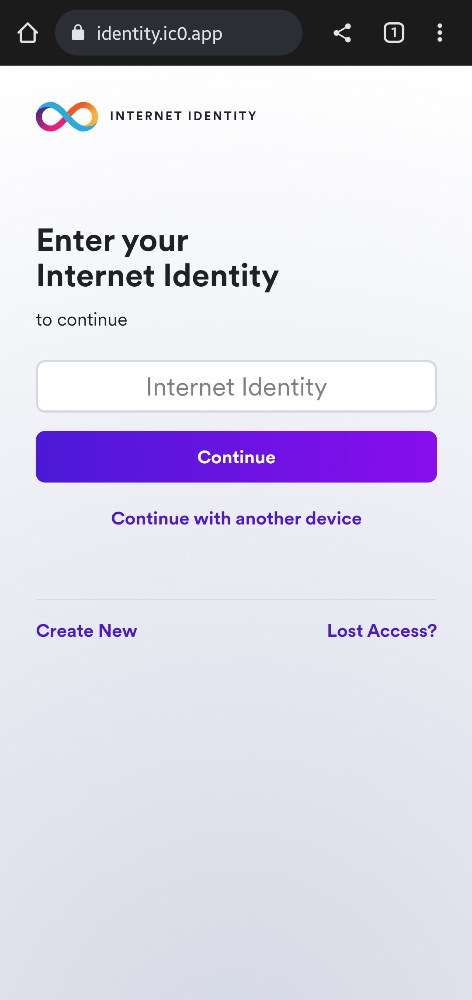
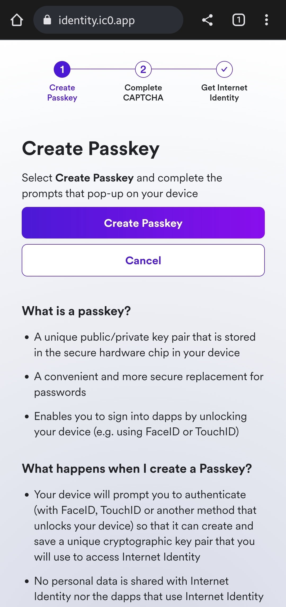
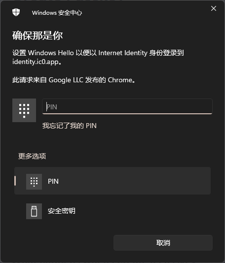
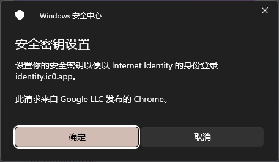
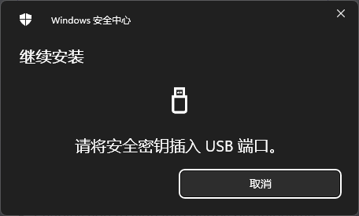
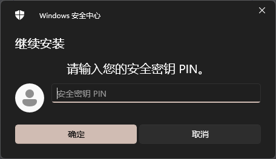
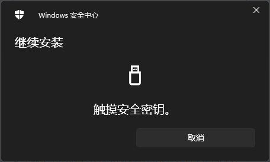
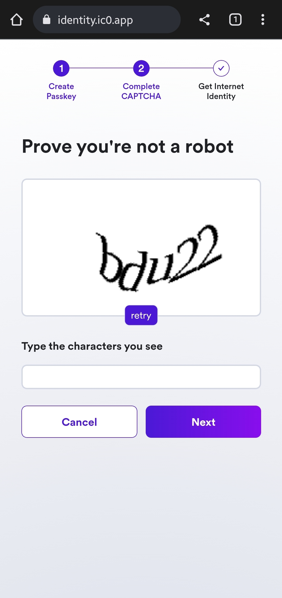
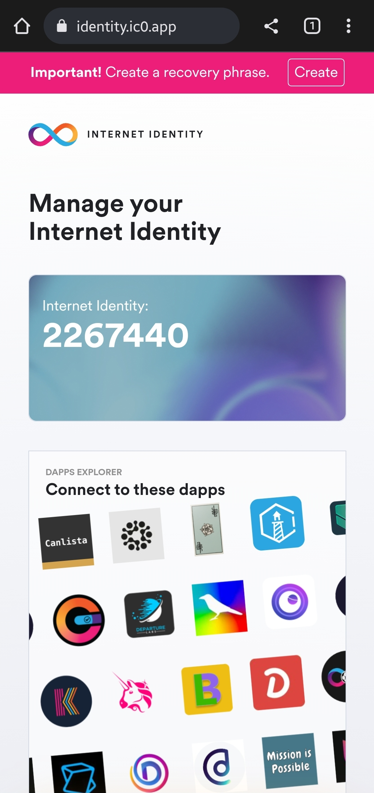

# 注册互联网身份

## 介绍
由总部在瑞士的DFINITY基金会研发开创的互联网计算机代表了最先进的第三代区块链技术，可以将分布于全世界的独立数据中心组合成一个可以无限扩容的虚拟主机，以去中心化的方式为开发者提供存储和算力。自从2021年5月10日主网上线以来，`互联网计算机`("Internet Computer”, 或者 "`IC`")的生态迅猛发展，已经涌现出了几百个去中心化应用，开始逐步颠覆各个互联网传统领域。

要想使用构建在IC这条公链上的应用，首先需要注册一个`互联网身份`("Internet Identity“, 或者"`II`")。在传统中心化互联网平台上，Apple ID, Gmail, Facebook Connect, 支付宝，微信经常被用来验证用户身份，方便新用户登录网站。在IC上，对应的DID ("Digital ID")系统则是II。有了II，就可以解锁IC生态上的所有应用。

## 注册 
II注册主要通过Chrome浏览器进行，不同的硬件设备能工提供的识别方式不同。

***第一步: 打开互联网身份Dapp***

在Chrome浏览器（务必在Chrome浏览器中打开！不要再微信中或者其他浏览器中打开，以免出现各种奇怪问题。）中输入以下地址：
https://identity.ic0.app 

第一次访问这个网页（包括任何构建在IC上的网页），会看到安装Loading the Service Worker的提示。这是正常系统操作，稍候几秒安转完成后，就会看到网页。

***第二步： 创建一个新的II身份***

点击下图页面中“Create New”按钮，开始创建新的II身份

***第三步: 创建安全密钥***

点击下图中“Create Passkey”按钮创建安全密钥。

此处需要根据不同硬件执行不同的操作，以下根据不同设备进行说明。

### Windows设备
Windows设备，通常可以使用Windows Hello功能创建万能密钥。

- **使用pin码创建**

当选择使用pin码创建时，将会弹出如下对话框，

输入PIN码（windows登录时的pin码），即可创建万能密钥

- **使用面容识别**

如果使用的是带有面容识别硬件的windows系统（通常会出现在带有面容识别登录的windows笔记本设备中），会优先提示使用面容识别，进行登录。

!此处缺图!!

- **使用yubikey**

如果您拥有yubikey，可以再弹出的Windows Hello对话框中选择使用“安全密钥”，通过yubikey创建密钥。

完成触摸后，将进行下一步。

### Android设备

### iOS设备

***第四步: 输入验证码***

这个页面主要用于判断是否为机器人操作，请输入正确的验证码。需要特别注意的是，验证码区分大小写。

***第五步: 记录互联网身份号***

这个页面提示你记下最新创建的属于你的互联网身份号，它将作为互联网身份标识，在其它设备登录时使用，请务必保存。点击copy按钮，可以自动将互联网身份号保存在设备黏贴板中。

***完成***

到达这个页面，您的互联网身份已经创建完毕。别急着关闭页面，为了更好的保管您的互联网身份，我们还需要创建种子短语。
种子短语能够让我们在多个设备上登录本次创建的互联网身份，也是在丢失或更换硬件设备后，找回互联网身份的最终途径，推荐在创建完互联网身份后的第一时间，创建种子短语。

## 添加设备

### Windows设备

### 移动设备

## 删除设备

## 找回账号

## FAQ

- 什么是安全密钥

>安全密钥是存储在所属设备的硬件安全芯片中的唯一公钥/私钥对，他可以方便且安全的替代密码，允许您通过解锁设备登录dapps（例如使用faceID或TouchID） 

- 当创建了安全密钥后会发生什么

>您的设备将提示您进行身份验证（使用FaceID、TouchID或其他解锁设备的方法），一遍它可以创建并保存一个唯一的加密密钥对，您将使用该密钥对访问互联网身份。它并不会在II或其他基于II的dapps上共享您的个人资料。也没有任何软件会下载到您的硬件设备上。