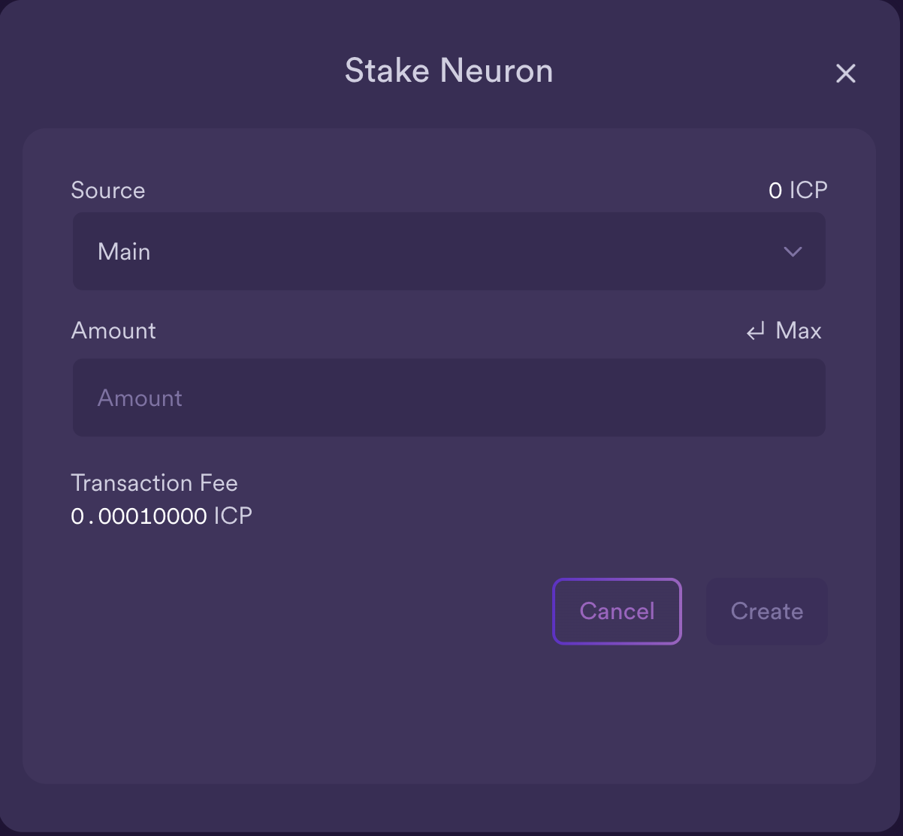
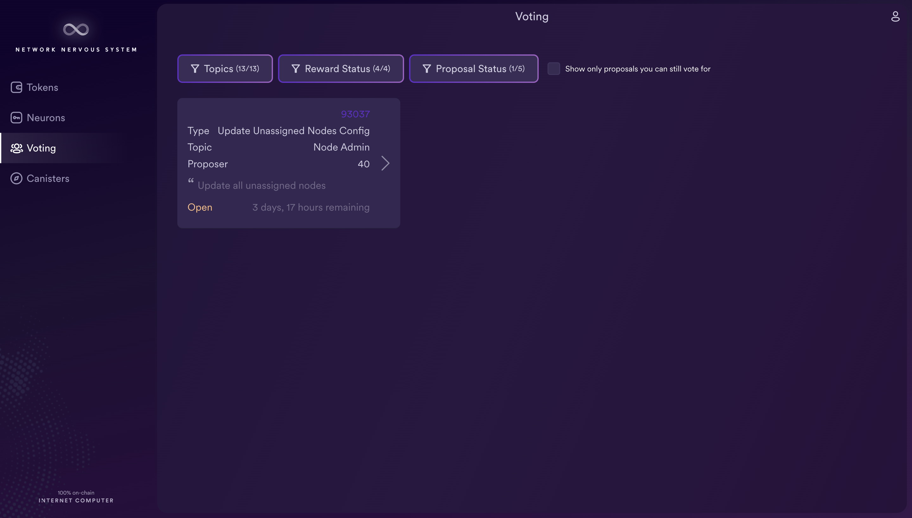

# 质押ICP

## 概览
利益相关者可获得投票权，并可通过购买 ICP 代币获得投票奖励。

互联网计算机是一个去中心化平台，其发展由利益相关者通过投票决定。这意味着影响互联网计算机未来的决策都是由对结果有兴趣的人做出的。作为参与管理的回报，互联网计算机会发放投票奖励。投票者可以积极投票，也可以使用互联网计算机上的流动民主来自动关注其他投票者。

## 核心关键词

### 神经元Neuron
为了获得投票权，ICP 代币必须首先进行抵押，然后锁定 6 个月以上至最多 8 年的时间。

正如代币存放在用户账户中一样，股权也存放在一个名为 "神经元 "的特殊账户中。每个 "神经元 "都有自己的标识符，以及与其质押相关的若干属性。这些属性包括

- 锁定时间（"解散延迟"）。
- 当前是否正在解散。
- 通过对提案进行投票，神经元积累了多少奖励（"成熟度"）。

一旦一个神经元被锁定超过六个月，它就获得了提交提案和对提案进行投票的能力。根据神经元对提案投票的积极程度，投票反过来会产生投票奖励。如果你对每一个公开提案都进行了投票，你就能获得最高奖励。

神经元还可以 "跟随 "其他神经元，这样它就会自动与它跟随的大多数神经元进行相同的投票。

### 投票权Voting power
锁定神经元的投票权由几个因素决定：

主要由其质押决定。1 ICP = 1 票的投票权。
其次，由其锁定时间或解散延迟决定。6 个月可获得 1.06 倍的投票权奖励，8 年可获得 2 倍的投票权奖励。所有其他持续时间之间呈线性关系。
最后，根据其年龄，或锁定而不解散的时间长度。4 年可获得 1.25 倍的奖励，与其他奖励成倍增加。0 秒到 4 年之间的所有其他持续时间均按线性比例递增。
这意味着，只有将神经元锁定 8 年，并保持锁定状态 4 年，才能获得最大投票权，即每个 ICP 2.5 票。届时，您将拥有所投入赌注的最大投票权。

### 成熟度Maturity
成熟度代表神经元累积的投票奖励。每天，网络都会根据每个投票神经元在提案提出时的投票权以及所投票的提案数量，向每个投票神经元分配总奖励的一部分，以此奖励参与者。

请注意，不同的税务机关可能会对投票奖励的税收状况持不同看法。获得投票奖励并将其转换为 ICP 的神经元所有者应咨询相关专业人士。

对于那些希望将其神经元中的投票权复合化的人来说，最自然的活动就是定期 "到期注资"。如果您希望将从神经元中获得的奖励变现，并将其转换为 ICP，您可以将成熟期 "催生"到奖励神经元中。

## 为什么质押如此重要
质押是一种让支持互联网计算机的人决定该平台下一步发展的方式。

互联网计算机刚推出时，所有提案都需要多数票才能通过。不过，这种情况正在逐渐改变。经过更新后，现在只需 3% 的总投票权中的多数票，提案就有可能获得通过，这意味着即使大型实体弃权，网络中的大多数人不投票，提案也有机会获得通过。

## 质押奖励
投票奖励是 "神经元 "的一个重要方面，可以通过复合方式增加您的总投票权。因此，为了更好地理解投注和奖励，从两个角度来看待质押可能会有所帮助：

### 长期：质押多年的投票奖励
投票奖励函数如图所示： https://dashboard.internetcomputer.org/circulation

第一年，NNS 会分配总供应量的 10%来产生投票奖励。请注意是 "分配 "而不是 "铸币"，因为奖励在生成和分配相应的奖励神经元之前是不会被铸币的。这一分配率以四次方 式下降，直到创世后第 8 年达到 5%。前 8 年年化奖励占总供应量百分比的计算公式为 R(t) = 5% + 5% [(G + 8y - t)/8y]² 。

与 NNS 中的所有参数一样，铸币率可通过 NNS 提议进行更改，但这是当前的比率表。

由于 ICP 的总供应量是一个动态系统，存在通货紧缩和通货膨胀，因此不可能预测未来某一天或某一年的投票奖励是多少。预测几个月后的百分比分配率相对容易，但预测总供应量则要困难得多，因为分配率可能会发生变化，而且利益相关者也会经常催生其到期日。

### 短期：每天投票奖励
每天，网络都会向每个投票神经元发放奖励。每个神经元获得奖励的百分比取决于以下因素：

下注的 ICP 和到期日。
解散延迟时间。
神经元的 "年龄"（处于非解散状态的时间）。
神经元已投票的合格提案数。
将这些值结合起来，就能计算出神经元的总投票权。计算公式如下

只有解散延迟时间超过 6 个月的神经元才有资格投票。最大解散延迟时间为 8 年。
神经元的投票权计算公式为：neuron_stake * dissolve_delay_bonus * age_bonus。
其中，解散延迟奖金和年龄奖金是累加的。
神经元赌注是赌注 ICP 和赌注成熟度的总和。
溶解延迟奖金（ddb）介于 ddbmin = 1 和 ddbmax = 2 之间，是溶解延迟的线性函数（上限为 8 年）。
年龄奖励（ab）介于 abmin=1 和 abmax=1.25 之间，是神经元年龄的线性函数（上限为 4 年）。神经元进入锁定状态时开始老化。当神经元进入解体状态时，老化会被重置为 0。
投票权是在提出建议时计算的，而不是在投票时。
例如，如果一个神经元拥有 60 个 ICP 和 40 个成熟度的赌注，那么它的总赌注就是 100。然后，假设解散延迟时间为 8 年，则解散延迟奖金为 2。这样它的年龄奖励为 1.125。综上所述，该神经元的投票权为 100 * 2 * 1.125 = 225。

某一天的总投票奖励池计算公式为：ICP 供应量（当天的 ICP 代币总供应量）* R(t) / 365.25。然后，根据当日结算的提案投票权乘以相应提案类别的奖励权重，按比例分配奖励池。

例如，如果 NNS 在某一天产生了 1000 个到期日的总奖励（有关计算方法的详细信息，请参阅下文），并且有 10 个提案提交，其中只有两个神经元有资格投票，并且：

神经元 A 的投票权为 20，对所有 10 项提案都投了票。
神经元 B 的投票权为 80，对所有 10 个提案都投了票。
那么这 1000 个成熟度将由这两个神经元按投票权比例分配：

神经元 A 的投票权为 20，可获得总数的 20% = 200 个成熟度。
神经元 B 的投票权为 80，获得总数的 80% = 800 个成熟度。
如果任一神经元只对这 10 个提案中的 X% 投了赞成票（根据相应提案类别的奖励权重加权），那么它的奖励将减少到其最高资格的 X%。

例如，如果某天有 10 项提案，但神经元只投了其中 5 项，那么该神经元只能获得其当天有资格获得的奖励的 50%。如果该神经元投票支持的 5 项提案的奖励权重为 2，那么它的提案投票权重 = 5 * 2，而所有提案的权重 = 5 * 2 + 5 * 1，因此它将获得 (5 * 2) / (5 * 1 + 5 * 2) = 66% 的奖励。

## 通货膨胀和通货紧缩机制
通货紧缩机制：

- 铸造周期以支付计算和存储费用，燃烧 ICP 以创造周期。
- 烧毁交易费用。
- 烧掉神经元提案失败的费用；请注意，这只发生在支付或合并神经元时，因此在最终导致通货紧缩之前，累积的费用可能会持续一段时间。

通货膨胀机制：

- 节点提供者通过铸造 ICP 获得报酬。
- 投票奖励，一旦产生并转换为 ICP。

## 质押流程

### 登录NNS
- 注册互联网身份后，您就可以访问网络神经系统(NNS)。 NNS是管理互联网计算机协议的质押和投票系统。
- 
- 用已注册好的互联网身份登录
- 
- 通过设备或专用安全密钥授权后，您就成功登录了网络神经系统（NNS）并创建了 NNS 账户。现在，您可以将 ICP 添加到新的 NNS 账户中！
- 在主屏幕上，您会看到一个名为 "钱包地址 "的长数字，以及您账户中的 ICP 总额。如果您的 NNS 账户上还有其他钱包/账本，它们也会显示在这里。NNS 账户页面的示例如下：
- 
- 您的钱包地址是您将 ICP 代币转入 NNS 账户时需要使用的号码。

### 在神经元中质押ICP以获得奖励
- 如果您的 NNS 帐户上至少有 1 个 ICP，您就有资格创建神经元并将 ICP 注入以获得奖励。您可以使用网络神经系统 dapp 创建和管理神经元，对提案进行投票，并在互联网计算机上创建罐子。
- 神经元必须参与管理并获得奖励。要创建神经元，您必须在一段时间内锁定一定数量的 ICP 实用代币。创建神经元所需的最低赌注为一个 ICP 代币。您可以配置锁定时间，从六个月到最长八年不等。
- 在 NNS dapp 的主页上，使用左侧导航栏前往神经元选项卡。在这里，您可以看到您的本金 ID 和您目前拥有的任何神经元。您可以看到它们的溶解延迟时间、是否锁定或溶解，以及它们持有的 ICP 数量。要质押ICP并创建新神经元，请单击屏幕底部的 "Stake Neuron"。
- 
- 然后，您需要选择要从哪个钱包中质押 ICP, 并且确定质押的数量
- 
- 将溶解延迟设置为您喜欢的质押年份，然后点击设置延迟并确认。
- 
- 之后，再次更新并确认，即可成功创建神经元并对提案进行投票.
- 

## 对提案进行投票以获得奖励
### 设置神经元跟随投票
- 为了获得投票奖励，您的神经元需要对提案进行投票。您可以通过设置跟随的神经元，如治理提案跟随8YearGangDAO，其他提案跟随ICA来进行投票，请参看如下的神经元跟随设置。即使设置为关注其他神经元，您仍然可以对任何提案进行手动投票。当您进行手动投票时，您将覆盖该提案的投票关注功能。
- 

### 手动投票
- 您可以使用 NNS 的 "投票 "选项卡手动查看各种提案并投票。单击列出的任何提案，即可查看提案信息，包括提案的简要说明、查看提案其他信息的链接、通过或否决提案的票数，以及您的神经元所投的票数。请务必使用 "主题"、"奖励状态 "和 "提案状态 "来筛选出您想查看和投票的提案。
- 
- 点击任何开放提案，查看其详细信息以及与您的身份相关联的神经元的投票权
- 
- 选择您想用来投票的具有投票权的神经元标识符，然后点击 "接受 "或 "拒绝 "进行投票。

