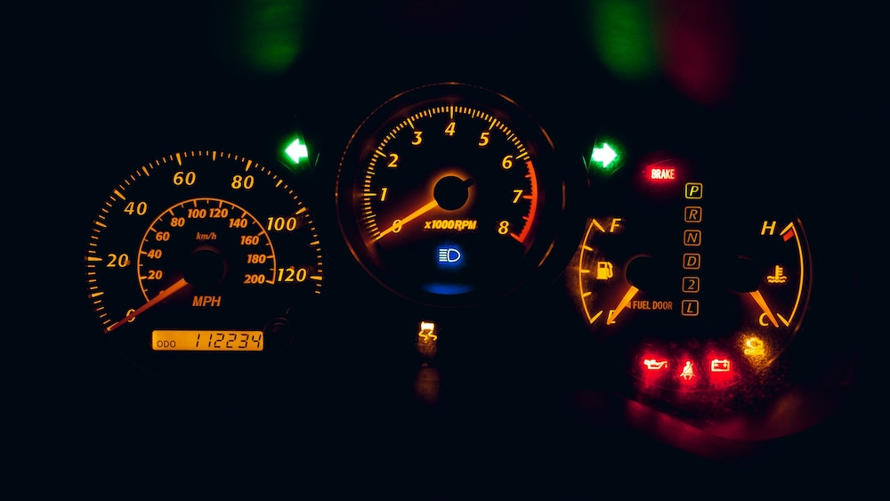

# 实时网络数据

有三个地方可以查看 ICP 网络的信息。

## ICP Dashboard

DFINITY 基金会构建的官方网站，可以查看最全面的整个 IC 网络的实时信息。

:::info
https://dashboard.internetcomputer.org/
:::

## ICScan

由经验丰富的 [Mix Labs](https://twitter.com/mixlabs_) 开发的历史悠久的第三方社区网站，是很多 IC DApp 里链接的首选。团队自己给很多神经元和 IC DApp 打标签。

:::info
https://icscan.io/
:::

## ICP Explorer

社区里的独立开发者出品。并非最全面，但是视觉效果（尤其是数据中心的分布图）很赞。

:::info
https://www.icpexplorer.org
:::

## ICP Explorer by Footprint

由最近新加入 ICP 社区的 [Footprint Analytics](https://twitter.com/Footprint_Data) 团队开发，还处于 beta 版。

:::info
https://icp.footprint.network
:::